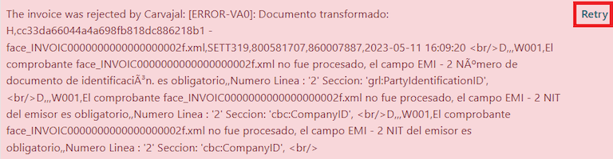

# Colombia

Odoo's Colombian localization package provides accounting, fiscal, and legal features for databases
in Colombia – such as chart of accounts, taxes, and electronic invoicing.

In addition, a series of videos on the subject is also available. These videos cover how to start
from scratch, set up configurations, complete common workflows, and provide in-depth looks at some
specific use cases as well.

#### SEE ALSO
[Smart Tutorial - Colombian Localization](https://www.odoo.com/slides/smart-tutorial-localizacion-de-colombia-132).

## Cấu hình

### Modules installation

[Install](../../general/apps_modules.md#general-install) the following modules to get all the features of the Colombian
localization:

| Tên                                             | Tên kỹ thuật      | Mô tả                                                                                                                                                                                                                                    |
|-------------------------------------------------|-------------------|------------------------------------------------------------------------------------------------------------------------------------------------------------------------------------------------------------------------------------------|
| Colombia - Kế toán                              | `l10n_co`         | Default [fiscal localization package](./#fiscal-localizations-packages). This module adds the base accounting features for the Colombian localization: chart of accounts, taxes, withholdings, and identification document type. |
| Colombian - Accounting Reports                  | `l10n_co_reports` | Includes accounting reports for sending certifications to suppliers for withholdings applied.                                                                                                                                            |
| Electronic invoicing for Colombia with Carvajal | `l10n_co_edi`     | This module includes the features required for integration with Carvajal, and generates the electronic invoices and support documents related to the vendor bills, based on  regulations.                                        |
| Colombian - Point of Sale                       | `l10n_co_pos`     | Includes Point of Sale receipts for Colombian localization.                                                                                                                                                                              |

#### NOTE
When `Colombia` is selected for a company's Fiscal Localization, Odoo automatically
installs certain modules.

### Company configuration

To configure your company information, go to the Contacts app, and search for your
company.

Alternatively, activate [developer mode](../../general/developer_mode.md#developer-mode) and navigate to
General Setting ‣ Company ‣ Update Info ‣ Contact. Then, edit the contact
form and configure the following information:

- Tên công ty.
- Address: Including City, Department and ZIP code.
- Identification Number: Select the Identification Type (`NIT`, `Cédula de
  Ciudadanía`, `Registro Civil`, etc.). When the Identification Type is `NIT`, the
  Identification Number **must** have the *verification digit* at the end of the ID
  prefixed by a hyphen (`-`).

Next, configure the Fiscal Information in the Sales & Purchase tab:

- Obligaciones y Responsabilidades: Select the fiscal responsibility for the company
  (`O-13` Gran Contribuyente, `O-15` Autorretenedor, `O-23` Agente de retención IVA, `O-47` Regimen
  de tributación simple, `R-99-PN` No Aplica).
- Gran Contribuyente: If the company is *Gran Contribuyente* this option should be
  selected.
- Fiscal Regimen: Select the Tribute Name for the company (`IVA`, `INC`, `IVA e INC`,
  or `No Aplica`)
- Commercial Name: If the company uses a specific commercial name, and it needs to be
  displayed in the invoice.

### Carjaval credentials configuration

Once the modules are installed, the user credentials **must** be configured, in order to connect
with Carvajal Web Service. To do so, navigate to Accounting ‣ Configuration ‣
Settings and scroll to the Colombian Electronic Invoicing section. Then, fill in the
required configuration information provided by Carvajal:

- Username and Password: Username and password (provided by Carvajal) to the
  company.
- Company Registry: Company's NIT number *without* the verification code.
- Account ID: Company's NIT number followed by `_01`.
- Colombia Template Code: Select one of the two available templates (`CGEN03` or
  `CGNE04`) to be used in the PDF format of the electronic invoice.

Enable the Test mode checkbox to connect with the Carvajal testing environment.

Once Odoo and Carvajal are fully configured and ready for production, deactivate the Test
mode checkbox to use the production database.

#### IMPORTANT
Test mode must **only** be used on duplicated databases, **not** the production
environment.

### Report data configuration

Report data can be defined for the fiscal section and bank information of the PDF as part of the
configurable information sent in the XML.

Navigate to Accounting ‣ Configuration ‣ Settings, and scroll to the
Colombian Electronic Invoicing section, in order to find the Report
Configuration fields. Here the header information for each report type can be configured.

- Gran Contribuyente
- Tipo de Régimen
- Retenedores de IVA
- Autorretenedores
- Resolución Aplicable
- Actividad Económica
- Bank Information

### Master data configuration

#### Đối tác

Partner contacts can be created in the *Contacts* app. To do so, navigate to
Contacts, and click the Create button.

Then, name the contact, and using the radio buttons, select the contact type, either
Individual or Company.

Complete the full Address, including the City, State, and
ZIP code. Then, complete the identification and fiscal information.

##### Identification information

Identification types, defined by the , are available on the partner form, as part of the
Colombian localization. Colombian partners **must** have their Identification Number
(VAT) and Document Type set.

##### Fiscal information

The partner's responsibility codes (section 53 in the 
document) are included as part of the electronic invoicing module, as it is required by the .

The required fields can be found under Partner ‣ Sales & Purchase Tab ‣ Fiscal
Information section:

- Obligaciones y Responsabilidades: Select the fiscal responsibility for the company
  (`O-13` Gran Contribuyente, `O-15` Autorretenedor, `O-23` Agente de retención IVA, `O-47` Regimen
  de tributación simple, or `R-99-PN` No Aplica).
- Gran Contribuyente: If the company is *Gran Contribuyente* this option should be
  selected.
- Fiscal Regimen: Select the tribute name for the company (`IVA`, `INC`, `IVA e INC`, or
  `No Aplica`)
- Commercial Name: If the company uses a specific commercial name, and it needs to be
  displayed in the invoice.

#### Sản phẩm

To manage products, navigate to Accounting ‣ Customers ‣ Products, then click
on a product.

When adding general information on the product form, it is required that either the
UNSPSC Category (Accounting tab), or Internal Reference
(General Information tab) field is configured. Be sure to Save the product
once configured.

#### Thuế

To create or modify taxes, go to Accounting ‣ Configuration ‣ Taxes, and select
the related tax.

If sales transactions include products with taxes, the Value Type field in the
Advanced Options tab needs to be configured per tax. Retention tax types
(ICA, IVA, Fuente) are also included. This configuration is used
to display taxes correctly in the invoice PDF.

#### Sổ nhật ký bán hàng

Once the  has assigned the official sequence and prefix for the electronic invoice resolution,
the sales journals related to the invoice documents **must** be updated in Odoo. To do so, navigate
to Accounting ‣ Configuration ‣ Journals, and select an existing sales journal,
or create a new one with the Create button.

On the sales journal form, input the Journal Name, Type, and set a unique
Short Code in the Journals Entries tab. Then, configure the following data
in the Advanced Settings tab:

- Electronic invoicing: Enable UBL 2.1 (Colombia).
- Invoicing Resolution: Resolution number issued by  to the company.
- Resolution Date: Initial effective date of the resolution.
- Resolution end date: End date of the resolution's validity.
- Range of Numbering (minimum): First authorized invoice number.
- Range of Numbering (maximum): Last authorized invoice number.

#### NOTE
The sequence and resolution of the journal **must** match the one configured in Carvajal and the
.

##### Invoice sequence

The invoice sequence and prefix **must** be correctly configured when the first document is created.

#### NOTE
Odoo automatically assigns a prefix and sequence to the following invoices.

##### Sổ nhật ký mua hàng

Once the  has assigned the official sequence and prefix for the *support document* related to
vendor bills, the purchase journals related to their supporting documents need to be updated in
Odoo. The process is similar to the configuration of the [sales journals](#co-journals).

##### Hệ thống tài khoản

The [chart of accounts](../accounting/get_started/chart_of_accounts.md) is
installed by default as part of the localization module, the accounts are mapped automatically in
taxes, default account payable, and default account receivable. The chart of accounts for Colombia
is based on the PUC (Plan Unico de Cuentas).

## Main workflows

### Hóa đơn điện tử

The following is a breakdown of the main workflow for electronic invoices with the Colombian
localization:

1. Sender creates an invoice.
2. Electronic invoice provider generates the legal XML file.
3. Electronic invoice provider creates the CUFE (Invoice Electronic Code) with the electronic
   signature.
4. Electronic invoice provider sends a notification to .
5.  validates the invoice.
6.  accepts or rejects the invoice.
7. Electronic invoice provider generates the PDF invoice with a QR code.
8. Electronic invoice provider sends invoice to the acquirer.
9. Acquirer sends a receipt of acknowledgement, and accepts or rejects the invoice.
10. Sender downloads a `.zip` file with the PDF and XML.

#### Tạo hoá đơn

#### NOTE
The functional workflow taking place before an invoice validation does **not** alter the main
changes introduced with the electronic invoice.

Electronic invoices are generated and sent to both the  and customer through Carvajal's web
service integration. These documents can be created from your sales order or manually generated. To
create a new invoice, go to Accounting ‣ Customers ‣ Invoices, and select
Create. On the invoice form configure the following fields:

- Customer: Customer's information.
- Journal: Journal used for electronic invoices.
- Electronic Invoice Type: Select the type of document. By default, Factura
  de Venta is selected.
- Invoice Lines: Specify the products with the correct taxes.

When done, click Confirm.

#### Invoice validation

After the invoice confirmation, an XML file is created and sent automatically to Carvajal. The
invoice is then processed asynchronously by the E-invoicing service UBL 2.1 (Colombia). The file is
also displayed in the chatter.

The Electronic Invoice Name field is now displayed in the EDI Documents tab,
with the name of the XML file. Additionally, the Electronic Invoice Status field is
displayed with the initial value To Send. To process the invoice manually, click on the
Process Now button.

#### Reception of legal XML and PDF

The electronic invoice vendor (Carvajal) receives the XML file, and proceeds to validate its
structure and information.

After validating the electronic invoice, proceed to generate a legal XML which includes a digital
signature and a unique code (CUFE), a PDF invoice that includes a QR code and the CUFE is also
generated. If everything is correct the Electronic Invoicing field value changes to
Sent.

A `.zip` containing the legal electronic invoice (in XML format) and the invoice in (PDF
format) is downloaded and displayed in the invoice chatter:

The electronic invoice status changes to Accepted.

### Giấy báo có

The process for credit notes is the same as for invoices. To create a credit note with reference to
an invoice, go to Accounting ‣ Customers ‣ Invoices. On the invoice, click
Add Credit Note, and complete the following information:

- Credit Method: Select the type of credit method.
  - Partial Refund: Use this option when it is a partial amount.
  - Full Refund: Use this option if the credit note is for the full amount.
  - Full refund and new draft invoice: Use this option if the credit note is
    auto-validated and reconciled with the invoice. The original invoice is duplicated as a new
    draft.
- Reason: Enter the reason for the credit note.
- Reversal Date: Select if you want a specific date for the credit note or if it is the
  journal entry date.
- Use Specific Journal: Select the journal for your credit note or leave it empty if
  you want to use the same journal as the original invoice.
- Refund Date: If you chose a specific date, select the date for the refund.

Once reviewed, click the Reverse button.

### Giấy báo nợ

The process for debit notes is similar to credit notes. To create a debit note with reference to an
invoice, go to Accounting ‣ Customers ‣ Invoices. On the invoice, click the
Add Debit Note button, and enter the following information:

- Reason: Type the reason for the debit note.
- Debit note date: Select the specific options.
- Copy lines: Select this option if you need to register a debit note with the same
  lines of invoice.
- Use Specific Journal: Select the printer point for your debit note, or leave it empty
  if you want to use the same journal as the original invoice.

When done, click Create Debit Note.

### Support document for vendor bills

With master data, credentials, and the purchase journal configured for support documents related to
vendor bills, you can start using *support documents*.

Support documents for vendor bills can be created from your purchase order or manually. Go to
Accounting ‣ Vendors ‣ Bills and fill in the following data:

- Vendor: Enter the vendor's information.
- Bill Date: Select the date of the bill.
- Journal: Select the journal for support documents related to the vendor bills.
- Invoiced Lines: Specify the products with the correct taxes.

Once reviewed, click the Confirm button. Upon confirmation, an XML file is created and
automatically sent to Carvajal.

### Common errors

During the XML validation, the most common errors are related to missing master data (*Contact Tax
ID*, *Address*, *Products*, *Taxes*). In such cases, error messages are shown in the chatter after
updating the electronic invoice status.

After the master data is corrected, it's possible to reprocess the XML with the new data and send
the updated version, using the Retry button.

## Báo cáo tài chính

### Certificado de Retención en ICA

This report is a certification to vendors for withholdings made for the Colombian Industry and
Commerce (ICA) tax. The report can be found under Accounting ‣ Reporting ‣
Colombian Statements ‣ Certificado de Retención en ICA.

### Certificado de Retención en IVA

This report issues a certificate on the amount withheld from vendors for VAT withholding. The report
can be found under Accounting ‣ Reporting ‣ Colombian Statements ‣ Certificado
de Retención en IVA.

### Certificado de Retención en la Fuente

This certificate is issued to partners for the withholding tax that they have made. The report can
be found under Accounting ‣ Reporting ‣ Colombian Statements ‣ Certificado de
Retención en Fuente.

