# Hồng Kông

## Cấu hình

[Install](../../general/apps_modules.md#general-install) the following modules to get the latest features of the Hong Kong
localization:

| Tên                                | Tên kỹ thuật                   | Mô tả                                                                                                                                                                                                 |
|------------------------------------|--------------------------------|-------------------------------------------------------------------------------------------------------------------------------------------------------------------------------------------------------|
| Hồng Kông - Kế toán                | `l10n_hk`                      | The base module to manage chart of accounting and localization for Hong Kong.                                                                                                                         |
| Hong Kong - Payroll                | `l10n_hk_hr_payroll`           | Enables [payroll](#hong-kong-payroll) specific localization features for Odoo *Payroll* app. This module also installs Hong Kong - Payroll with Accounting and Documents - Hong Kong Payroll. |
| Hồng Kông - Bảng lương với Kế toán | `l10n_hk_hr_payroll_account`   | Installs the link between Hong Kong payroll and accounting.                                                                                                                                           |
| Documents - Hong Kong Payroll      | `documents_l10n_hk_hr_payroll` | Integrates employee ir56 forms in the Odoo *Documents* app.                                                                                                                                           |

## FPS QR codes on invoices

 is a payment service platform that allows customers to make
instant domestic payments to individuals and merchants in Hong Kong dollars or Renminbi via online
and mobile banking.

### Kích hoạt mã QR

Go to Accounting app ‣ Configuration ‣ Settings. Under the Customer
Payments section, tick the checkbox beside the QR Codes feature. Then, click
Save.

### FPS bank account configuration

Go to Contacts app ‣ Configuration ‣ Bank Accounts section ‣ Bank Accounts.
Then select the bank account for FPS activation. Proceed to set the Proxy Type and fill
in the Proxy Value field, depending on the type chosen.

Remember to include the invoice number in the QR code, by ticking the Include Reference
checkbox.

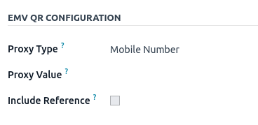

#### IMPORTANT
- The account holder's country must be set to `Hong Kong` on its contact form.
- The account holder's city is mandatory.
- You could also include the invoice number in the QR code by checking the Include
  Reference checkbox.

#### SEE ALSO
[Bank and cash accounts](../accounting/bank.md)

### Cấu hình sổ nhật ký ngân hàng

Go to Accounting app ‣ Configuration ‣ Journals and open the bank journal.
Then, fill out the Account Number and Bank fields, located in the
Journal Entries tab.

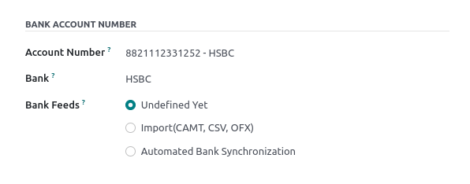

### Issue invoices with FPS QR codes

When creating a new invoice, open the Other Info tab and set the Payment
QR-code option to EMV Merchant-Presented QR-code.

Ensure that the Recipient Bank is configured, as Odoo uses this field to generate the
FPS QR code.

## Bảng lương

#### IMPORTANT
Ensure the Hong Kong - Payroll (`l10n_hk_hr_payroll`) module is installed before
proceeding.

### Create employees

Go to the Employees app and click New. Then, configure the following
fields:

- Under the Work Information tab
  - Working Hours: HK Standard 40 hours/week option **must** be selected.
- Under the Private Information tab
  - Surname, Given Name, Name in Chinese: name of the employee.
  - Private Address: address of the employee.
  - Bank Account Number: employee's bank account number.
  - Current Rental: employee's rental records (if rental allowance is applicable).
  - Autopay Type: BBAN, SVID, EMAL, etc.
  - Autopay Reference: autopay reference number.
  - Identification No: HKID of the employee.
  - Gender: gender of the employee.

  #### IMPORTANT
  For the Bank Account Number, this account should be set as Trusted
  before further processing.

  To achieve this, click on the right-arrow button next to Bank Account Number field.
  Set the Send Money to Trusted by clicking on the toggle.

  #### NOTE
  To populate the Current Rental, click on the History button.
  Then, click on New. Fill in the relevant details and save the rental record. Upon
  saving the record, the rental contract state will be visible (at the top-right
  corner) and can be set to Running.
- Under the HR Settings tab:
  - Volunteer Contribution Option: select either Only Mandatory
    Contribution, With Fixed %VC, or Cap 5% VC.
  - MPF Manulife Account: account number, if applicable.

### Manage contracts

Once the new employee has been created, click the Contracts smart button on the
employee record, or navigate to Employees app ‣ Employees ‣ Contracts.

#### NOTE
Only **one** contract can be active simultaneously per employee, but an employee can be assigned
consecutive contracts during their employment.

The following are critical for setting up a contract:

- Salary Structure Type: set as CAP57: Hong Kong Employee.
- Contract Start Date: start date of employment.
- Working Schedule: set as HK Standard 40 hours/week (from employee record).
- Work Entry Source: select either Working Schedule, Attendances
  or Planning. This field determines how the work entries are accounted for in the
  payslip.
  - Working Schedule: the work entries are generated automatically based on the
    employee's working schedule.
  - Attendances: the work entries are generated based on the check-in/out period logged
    in the *Attendances*.
  - Planning: the work entries are generated from planning shifts only.
- Under the Salary Information tab
  - Wage Type: select Fixed Wage for Full-time or Part-time employees, or
    Hourly Wage for employees who are paid hourly.
  - Schedule Pay: the frequency of payslip issuance.
  - Wage: Monthly or Hourly depending on the Wage
    Type.
  - Internet Subscription: this is an **optional** field to provide additional internet
    allowance on top of the current salary package.

#### IMPORTANT
Timesheets do **not** impact work entries in Odoo.

Once all information has been setup, set the contract status to Running by clicking the
Running button in the top-right of the page.

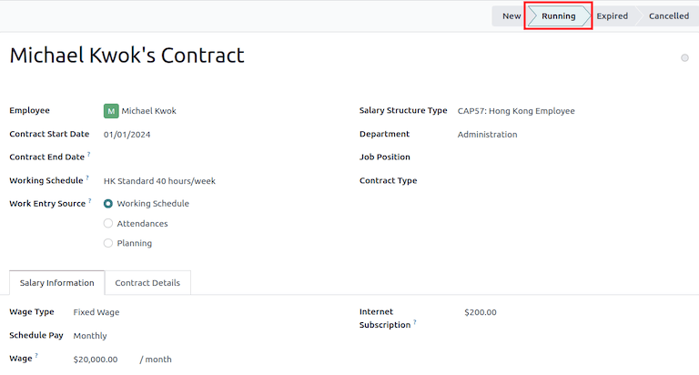

### Tạo phiếu lương

Once the employees, and their contracts, are configured, payslips can be generated in the *Payroll*
app.

Odoo provides **four** different salary structures under CAP57 regulation:

1. CAP57: Employees Monthly Pay: to process the monthly employee salary.
2. CAP57: Payment in Lieu of Notice: to process final payment upon contract termination
   using .
3. CAP57: Long Service Payment: applicable to employees with more than five years of
   service upon contract termination.
4. CAP57: Severance Payment: applicable to employees with more than two years of service
   upon contract termination.

Before running the payslips, the accounts used in the salary rule can be adjusted by navigating to
Payroll app ‣ Configuration ‣ Rules.

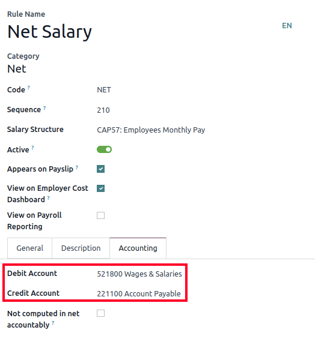

Odoo can create pay runs in two ways: via [batch](#hong-kong-batch-payslips) or
[individual](#hong-kong-individual-payslips) payslips.

#### Batch payslips

This method of payslip generation is used for recurring payments, since multiple employee payslips
can be managed at once. Go to Payroll app ‣ Payslips ‣ Batches.

1. Nhấp vào Mới.
2. Enter a Batch Name (e.g. `2024 - Jan`) and Period (e.g. `01/01/2024` -
   `01/31/2024`).
3. Click on Generate Payslips.
4. Choose which Salary Structure to use for this batch. The department filter allows the
   batch to only apply to a specific group of employees.
5. Nhấp vào Tạo.
6. A Payslips smart button is created automatically.

Next, click Create Draft Entry to generate a draft journal entry found in the
Other Info tab of each payslip. A Confirmation pop-up window appears asking
Are you sure you want to proceed?. Click Ok to create the journal entries.

#### Individual payslips

Go to Payroll app ‣ Payslips ‣ All Payslips.

This method of payslip generation is commonly used to handle non-recurring payments (e.g.
CAP57: Payment in Lieu of Notice, CAP57: Long Service Payment or
CAP57: Severance Payment).

1. Nhấp vào Mới.
2. Select an Employee. When selected, the Contract is filled out
   automatically.
3. Add a pay Period.
4. Select a salary Structure (e.g. CAP57: Employees Monthly Pay).
5. The Worked Days & Inputs tab automatically compute the worked days/hours and time off
   leaves that are applicable.
6. Additional payslip items can be added at this time (e.g. Commissions,
   Deductions) under the Other Inputs section.
7. Click on Compute Sheet button to generate the payslip lines. This button updates
   the Salary Computation tab.

#### NOTE
If the work entry for an employee was amended, click the <i class="fa fa-cog"></i> (gear) icon,
then click Recompute Whole Sheet to refresh the payslip's Worked Days &
Inputs tab.

The Salary Computation tab shows the detailed breakdown of the computation, based on
the salary rules configured for each structure type.

1. Rent Allowance: amount derived from the employee's active rental record.
2. Basic Salary: amount of base salary provided (after rent allowance deduction).
3. 713 Gross: net payable amount considering *Commission*, *Internet Allowance*,
   *Reimbursements*, *Back-pay*, *Deduction*, etc.
4. MPF Gross: net payable amount from 713 gross after consideration of additional
   allowances, deductions, and end-of-year payment.
5. Employee Mandatory Contribution: employee MPF Contribution.
6. Employer Mandatory Contribution: employer MPF Contribution.
7. Gross: net payable amount from MPF gross after consideration of MPF deductions.
8. Net Salary: final payable amount to be paid to the employee.

#### IMPORTANT
There are no MPF contributions for the first month. Both employee and employer contribution
starts on second month.

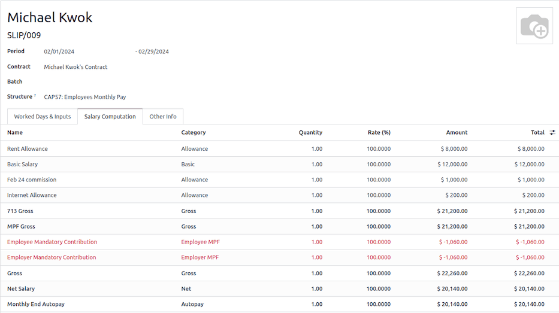

Under the Other Inputs section in Worked Days & Inputs tab, there are
additional manual input types:

- Back Pay: additional salary payout can be included under this category.
- Commission: the commission earned during the period can be manually entered here.
- Global Deduction: a lump-sum deduction from the entire payslip.
- Global Reimbursement: a lump-sum reimbursement to the entire payslip.
- Referral Fee: the additional bonus offered for any form of business-related referral.
- Moving Daily Wage: to override the  value used for
  leaves computation.
- Skip Rent Allowance: if set, the rental allowance is excluded from the current
  payslip.
- Custom Average Monthly Salary: to override the average monthly salary used for
  end-of-year payment (rule is only applicable to payslips generated in December).
- Lieu of Notice Period (Months): only applicable to CAP57: Payment in Lieu
  of Notice salary structure. By default, the final payout is set as 1-month. Use the
  Count field under the Other Inputs section to set a different notice
  period duration.

Once the payslips are ready, click on Compute Sheet, followed by Create Draft
entry to generate a draft journal entry found in the Other Info tab of the payslip.

### Pay employees

Once the draft journal entries have been posted, the company can now pay the employees. The user can
choose between **two** different *payment methods*:

- From the employee's payslip (Payroll app ‣ Payslips ‣ All Payslips), once the
  payslip's journal entry has been posted, click Register Payment. The process is the
  same as [paying vendor bills](../accounting/payments.md). Select the desired bank journal and
  payment method, then later reconcile the payment with the corresponding bank statement.
- For batch payments (Payroll app ‣ Payslips ‣ Batches), once all draft journal
  entries from the batch are confirmed, click Mark as Paid to post the payment journal
  entry. Then [create a payment](../accounting/payments.md) in the *Accounting* app, and
  reconcile accordingly.

### Attendances and hourly wage

To configure the contract for an employee paid hourly using the *Attendances* app for hours
tracking, navigate to Payroll app ‣ Contracts ‣ Contracts.
Create a new [contract](#hong-kong-manage-contracts). It is important to remember to set the
Work Entry Source as Attendances, and Wage Type as
Hourly Wage.

To record the hours logged by the employee using *Attendances* app:

1. Go to Attendances app.
2. The employee can check-in/out, via the kiosk mode and the time will be logged automatically.
3. In the Payroll app, review the attendance work entries generated from
   Payroll app ‣ Work Entries ‣ Work Entries.
4. Next, generate the [payslips](#hong-kong-running-payslips) and process the payment.

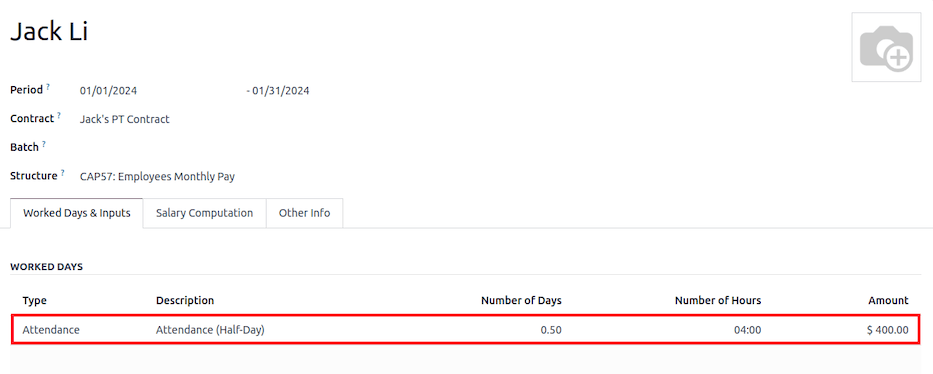

### Time Off with Payroll

The work entry types and time off types are fully integrated between the *Time Off* and
*Payroll* apps. There are several default time off types and work entry types specific to
Hong Kong which are installed automatically along with the *Hong Kong - Payroll* module.

Go to Payroll app ‣ Configuration ‣ Work Entry Types and click New.

There are two checkboxes to be considered when setting up the work entry type:

- Use 713: Include this leave type as part of 713 computation.
- Non-full pay: 80% of the .

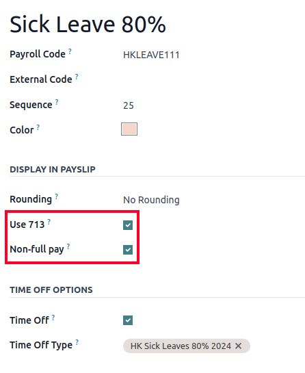

#### SEE ALSO
[Creating and configuring work entry types](../../hr/payroll.md#payroll-work-entries)

### Understanding 713 Ordinance

The *Hong Kong - Payroll* module is compliant with 713 Ordinance which relates to the
 computation to ensure fair compensation for employees.

The ADW computation is as follows:

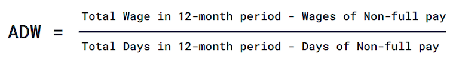

#### NOTE
For 418 compliance, there is no automated allocation of the *Statutory Holiday* entitlement to
the employees. As soon as 418 requirements are met, manually allocate the leaves, via the *Time
Off* app.

#### NOTE
Before generating payslips, ensure the statuses are Done to validate the outcome.

| Kỳ                           |   Ngày | Tiền công/tiền lương   | Commission   | Tổng      | ADW                    | Leave Value            |
|------------------------------|--------|------------------------|--------------|-----------|------------------------|------------------------|
| Tháng 1                      |     31 | $20200                 | $0           | $20200    | $651,61 ($20200/31)    | N/A                    |
| Tháng 2                      |     28 | $20200                 | $5000        | $25200    | $769,49 ($45400/59)    | N/A                    |
| Mar (One Day Annual Leave)   |     31 | $20324,33              | $0           | $20324,33 | $730,27 ($65724,33/90) | $769,49                |
| Apr (One Day 80% Sick Leave) |     30 | $20117,56              | $0           |           |                        | $584,22 ($730,27\*0.8) |

#### NOTE
The value of  is computed in the backend, and not be visible to
the user.

#### SEE ALSO
- [HK 713 Ordinance](https://www.labour.gov.hk/eng/public/wcp/ConciseGuide/Appendix1.pdf)
- [HK 418 Ordinance](https://www.workstem.com/hk/en/blog/418-regulations/)

### Generate reports

Before generating the below reports, setup the following in Settings app ‣
Payroll.

Configure the following in the Accounting section:

- Tick the Payroll HSBC Autopay checkbox.
  - Autopay Type: Set as H2H Submission.
  - Select the Bank Account to use.

Configure the following in the HK Localization section:

- Employer's Name shows on reports
- Employer's File Number
- Manulife MPF Scheme

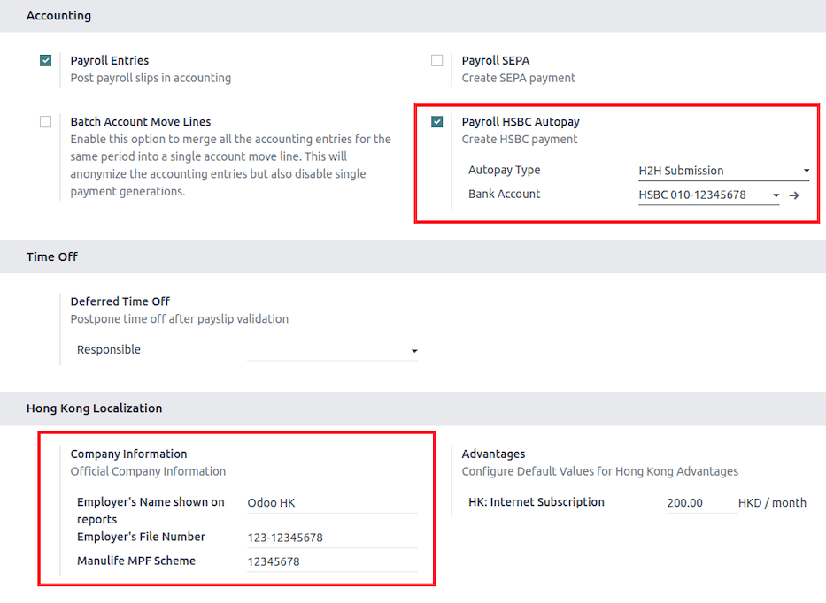

#### IRD report

There are a total of **four** IRD reports available:

- IR56B: employer's Return of Remuneration and Pensions.
- IR56E: notification of Commencement of Employment.
- IR56F: notification of Ceasation of Employment (remaining in HK).
- IR56G: notification of Ceasation of Employment (departing from HK permanently).

Go to Payroll app ‣ Reporting, and select one of the IR56B/E/F/G
Sheet options:

1. Nhấp vào Mới.
2. Fill in the relevant information for the IRD report.
3. Click on Populate, and the Eligible Employees smart button appears.
4. The Employee Declarations status is Draft and changed to
   Generated PDF status once the schedule runs.
5. Once the PDF is generated, the IRD form may be downloaded.

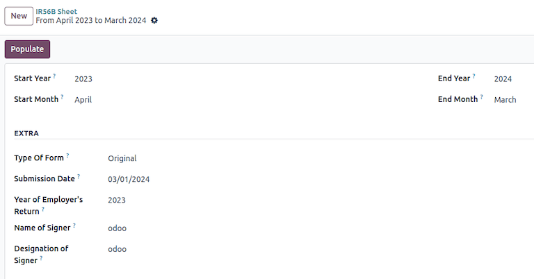

#### NOTE
The scheduled action called *Payroll: Generate pdfs* can be manually triggered. It is set by
default to run the PDF generation monthly.

#### Manulife MPF sheet

Go to Payroll app ‣ Reporting ‣ Manulife MPF Sheet.

1. Nhấp vào Mới.
2. Select the relevant Year, Month, and Sequence No..
3. Click on Create XLSX.
4. The *Manulife MPF XLSX* file is then generated, and available for download.

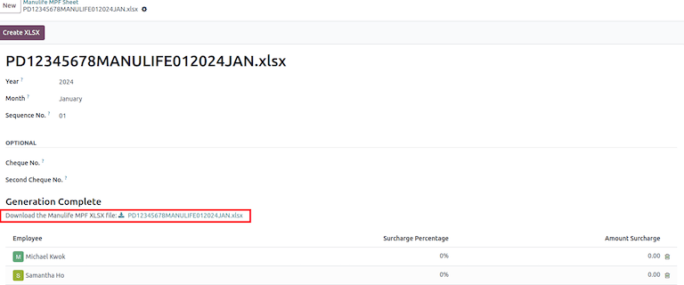

#### NOTE
Odoo will not be developing further reports for other MPF trustee as there will soon be an
eMPF platform setup by the local government.

#### SEE ALSO
[eMPF](https://www.mpfa.org.hk/en/empf/overview)

#### HSBC autopay report

If *HSBC Autopay* is selected as the batch payment method, click on Create HSBC Autopay
Report, and fill in the mandatory fields:

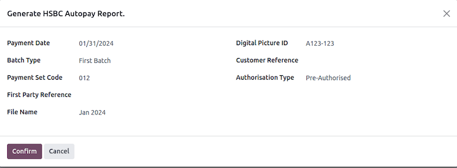

This creates an `.apc` file format which can be uploaded to the HSCB portal for processing.
