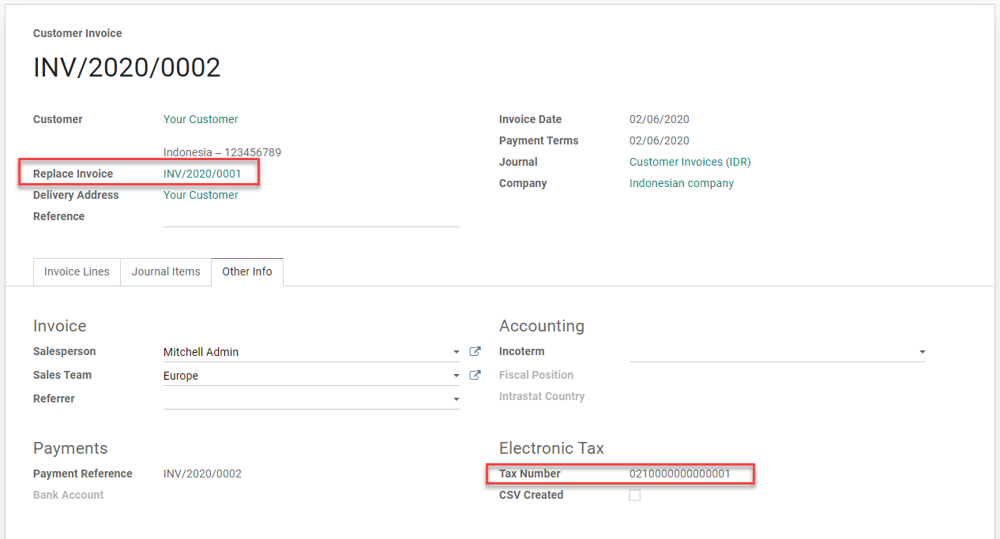

# Indonesia

## Phân hệ E-Faktur

The **E-Faktur Module** is installed by default with the Indonesian localization module. It allows
one to generate a CSV file for one tax invoice or for a batch of tax invoices to upload to the
**Tax Office e-Faktur** application.

### Cài đặt NPWP/NIK

- **Your Company**
   
  This information is used in the FAPR line in the effect file format. You need to set a VAT
  number on the related partner of your Odoo company. If you don't, it won't be possible to create
  an e-Faktur from an invoice.
   
- **Your Clients**
   
  You need to set the checkbox *ID PKP* to generate e-fakturs for a customer. You can use the VAT
  field on the customer's contact to set the NPWP needed to generate the e-Faktur file. If your
  customer does not have an NPWP, just enter the NIK in the same VAT field.
   
  

### Cách dùng

#### Generate Tax Invoice Serial Number

1. Truy cập Kế toán ‣ Khách hàng ‣ e-Faktur. Để có thể xuất hóa đơn khách hàng dưới dạng e-Faktur cho chính phủ Indonesia, bạn cần nhập vào đây các dải số được chính phủ cấp. Khi xác nhận một hóa đơn, hệ thống sẽ tự động gán số từ các dải số này. Sau đó, bạn có thể lọc các hóa đơn chưa xuất trong danh sách hóa đơn và nhấp *Tác vụ*, sau đó chọn *Tải xuống e-Faktur*.
2. Sau khi nhận được các số sê-ri hóa đơn mới từ Cục Thuế Indonesia, bạn có thể tạo một nhóm các số sê-ri hóa đơn thuế thông qua chế độ xem danh sách này. Bạn chỉ cần chỉ định số nhỏ nhất và số lớn nhất của từng nhóm số sê-ri, và Odoo sẽ tự động định dạng các số này thành chuỗi 13 chữ số, theo yêu cầu của Cục Thuế Indonesia.
3. There is a counter to inform you how many unused numbers are left in that group.
   

#### Generate e-faktur csv for a single invoice or a batch invoices

1. Create an invoice from Accounting ‣ Customers ‣ Invoices. If the invoice
   customer's country is Indonesia and the customer is set as *ID PKP*, Odoo will allow you to
   create an e-Faktur.
2. Set a Kode Transaksi for the e-Faktur. There are constraints related to the Kode transaksi and
   the type of VAT applied to invoice lines.
   
3. Odoo will automatically pick the next available serial number from the e-Faktur number table (see
   the [section above](#localization-indonesia-tax-invoice-sn)) and generate the e-faktur
   number as a concatenation of Kode Transaksi and serial number. You can see this from the invoice
   form view under the page *Extra Info* in the box *Electronic Tax*.
   
4. Once the invoice is posted, you can generate and download the e-Faktur from the *Action* menu
   item *Download e-faktur*. The checkbox *CSV created* will be set.
   
5. You can select multiple invoices in list view and generate a batch e-Faktur .csv.

#### Kode Transaksi FP (Transaction Code)

Các mã sau đây có sẵn khi tạo e-Faktur. - 01 Kepada Pihak yang Bukan Pemungut PPN (Khách hàng Biasa) - 02 Kepada Pemungut Bendaharawan (Dinas Kepemerintahan) - 03 Kepada Pemungut Selain Bendaharawan (BUMN) - 04 DPP Nilai Lain (PPN 1%) - 06 Penyerahan Lainnya (Turis Asing) - 07 Penyerahan yang PPN-nya Tidak Dipungut (Kawasan Ekonomi Khusus/ Batam) - 08 Penyerahan yang PPN-nya Dibebaskan (Impor Barang Tertentu) - 09 Penyerahan Aktiva (Pasal 16D UU PPN)

#### Correct an invoice that has been posted and downloaded: Replace Invoice feature

1. Cancel the original wrong invoice in Odoo. For instance, we will change the Kode Transakski from 01
   to 03 for the INV/2020/0001.
2. Create a new invoice and set the canceled invoice in the *Replace Invoice* field. In this field,
   we can only select invoices in *Cancel* state from the same customer.
3. As you validate, Odoo will automatically use the same e-Faktur serial number as the canceled and
   replaced invoice replacing the third digit of the original serial number with *1* (as requested
   to upload a replacement invoice in the e-Faktur app).

#### Correct an invoice that has been posted but not downloaded yet: Reset e-Faktur

1. Reset the invoice to draft and cancel it.
2. Click on the button *Reset e-Faktur* on the invoice form view.
3. The serial number will be unassigned, and we will be able to reset the invoice to draft, edit it
   and re-assign a new serial number.

