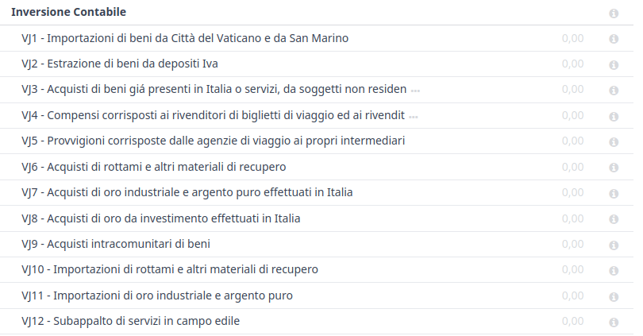
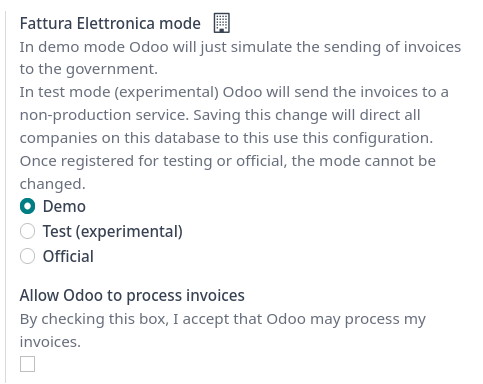
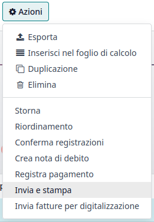
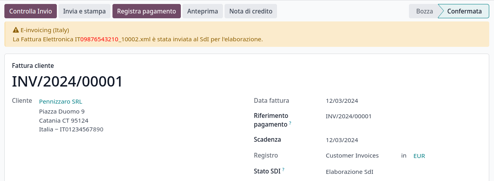
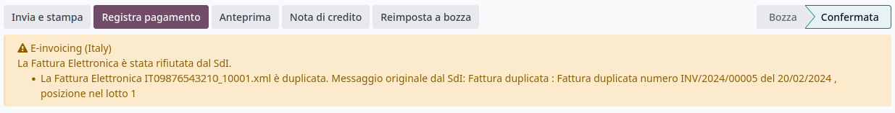
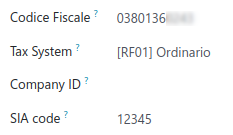

# Ý

## Cấu hình

[Install](applications/general/apps_modules.md#general-install) the following modules to get all the features of the Italian\
localization:

| Tên                            | Tên kỹ thuật              | Mô tả                                                                                                             |
| ------------------------------ | ------------------------- | ----------------------------------------------------------------------------------------------------------------- |
| Italy - Kế toán                | `l10n_it`                 | Default [fiscal localization package](applications/finance/fiscal_localizations.md#fiscal-localizations-packages) |
| Ý - Hóa đơn Điện tử            | `l10n_it_edi`             | E-invoice implementation                                                                                          |
| Ý - Hóa đơn điện tử (Khấu trừ) | `l10n_it_edi_withholding` | E-invoice withholding                                                                                             |
| Ý - Báo cáo Kế toán            | `l10n_it_reports`         | Country-specific reports                                                                                          |
| Ý - Tồn kho DDT                | `l10n_it_stock_ddt`       | Transport documents - Documento di Trasporto (DDT)                                                                |

### Thông tin công ty

Configuring the company's information ensures your Accounting database is properly set up. To add\
information, go to Settings ‣ General Settings, and in the Companies\
section, click Update info. From here, fill out the fields:

* Address: the address of the company;
* VAT: VAT of the company;
* Codice Fiscale: the fiscal code of the company;
* Tax System: the tax system under which the company falls;

### Taxes configuration

Many of the e-invoicing features are implemented using Odoo's tax system. As such, taxes must be\
properly configured to generate invoices correctly and handle other billing use cases.

The **Italian** localization contains predefined **examples** of taxes for various purposes.

#### Tax exemption

The use of sale taxes that amount to **zero percent** (0%) is required by Italian authorities to\
keep track of the exact Tax Exemption Kind (Natura) and Law Reference that\
justify the exemption operated on an invoice line.

#### SEE ALSO

There are many Tax Exemption Kind (Natura) and Law Reference codes. Make\
sure you check the latest version available to get the latest information on:

* [Italian authorities documentation](https://www.agenziaentrate.gov.it/portale/web/guest/aree-tematiche/fatturazione-elettronica)
* [Official guide on Tax exemption](https://www.agenziaentrate.gov.it/portale/documents/20143/451259/Guida_compilazione-FE-Esterometro-V_1.9_2024-03-05.pdf/67fe4c2d-1174-e8de-f1ee-cea77b7f5203)

#### NOTE

If you need to use a different kind of exoneration, go to Accounting ‣\
Configuration ‣ Taxes, select a similar tax, then click on the cog icon and select\
Duplicate. In the Advanced Options tab, add the Exoneration\
and Law Reference. To confirm click on Save.

## Reverse charge

The **reverse charge** mechanism is a VAT rule that shifts the liability to pay VAT from the\
supplier to the customer. The customers pay the VAT _themselves_ to the instead. There are different types:

* Internal Reverse Charge (for domestic sales)\
  The VAT responsibility is shifted to the buyer for certain categories of products and services.\

* External Reverse Charge (for intra-EU sales)\
  VAT is due in the country of the delivery or in the country where the service is performed. When\
  the buyer is itself an Italian business, then the EU offers a mechanism that allows the seller\
  to transfer his responsibility to the buyer.\

### Hóa đơn

**Reverse-charged** customer invoices show no VAT amount, but the requires the seller to specify the Tax Exemption reason and the Law\
Reference that enable the reverse-charge mechanism. Odoo provides a set of special 0% taxes that\
can be assigned to each reverse-charged invoice lines, representing the most commonly used\
configurations.

### Vendor bills

Italian companies subjected to Reverse Charge must send the information in the bill received to the\
.

#### NOTE

Self-reported VAT XML files must be issued and sent to the\
for reverse charged bills.

Khi tạo hóa đơn mua hàng, thuế **đảo ngược** có thể được thêm vào trong trường Thuế. Bạn có thể kiểm tra các loại thuế khả dụng bằng cách đi tới Kế toán ‣ Cấu hình ‣ Thuế, tại đây bạn sẽ thấy thuế 10% cho Hàng hóa và 22% cho Dịch vụ đã được kích hoạt, cùng với các loại thuế khác. Do cấu hình tự động của vị trí thuế theo quy định tài chính của Ý, các loại thuế này sẽ được kích hoạt tự động trong danh sách thuế.

### Tax grids

The Italian localization has a specific [tax grid](applications/finance/accounting/reporting/tax_returns.md#tax-returns-tax-grids) section for**reverse charge** taxes. These tax grids are identifiable by the [VJ](italy.md#italy-grids) tag, and\
can be found by going to Accounting ‣ Reporting ‣ Audit Reports: Tax Report.

## Hoá đơn điện tử

The is the [electronic invoicing](applications/finance/accounting/customer_invoices/electronic_invoicing.md) system used in Italy. It enables the sending\
and receiving of electronic invoices to and from customers. The documents must be in an XML\
format called **FatturaPA** and formally validated by the\
system before being delivered.

To be able to receive invoices and notifications, the service\
must be notified that the user's files need to be sent to Odoo and processed on their behalf. To do\
so, you must set up Odoo's Destination Code on the portal.

1. Go to [Italian authorities portal](https://ivaservizi.agenziaentrate.gov.it/portale) and\
   authenticate;
2. Go to section Fatture e Corrispettivi;
3. Set the user as Legal Party for the VAT number you wish to configure the electronic address;
4. In Servizi Disponibili ‣ Fatturazione Elettronica ‣ Registrazione\
   dell’indirizzo telematico dove ricevere tutte le fatture elettroniche, insert Odoo's\
   Destination Code `K95IV18`, and confirm.

### EDI Mode and authorization

Since the files are transmitted through Odoo's server before being sent to the or received by your database, you need to authorize Odoo to process your files\
from your database. To do so, go to Accounting ‣ Configuration ‣ Settings ‣\
Electronic Document Invoicing.

There are three modes available:

* Demo\
  This mode simulates an environment in which invoices are sent to the government. In this mode,\
  invoices need to be _manually_ downloaded as XML files and uploaded to the 's website.\

* Test (experimental)\
  This mode sends invoices to a non-production (i.e., test) service made available by the\
  . Saving this change directs all companies on the database to\
  use this configuration.\

* Chính thức\
  This is a production mode that sends your invoices directly to the .\

Once a mode is selected, you need to accept the **terms and conditions** by ticking Allow\
Odoo to process invoices, and then Save. You can now record your transactions in Odoo\
Accounting.

#### WARNING

Selecting either Test (experimental) or Official is **irreversible**.\
For example, once in Official mode, it is not possible to select Test\
(experimental) or Demo. We recommend creating a **separate database** for testing\
purposes only.

#### NOTE

When in Test (Experimental) mode, all invoices sent _must_ have a partner using one\
of the following fake Destination Code given by the : `0803HR0` - `N8MIMM9` - `X9XX79Z`. Any real production Codice Destinario\
of your customers will not be recognized as valid by the test service.

### Xử lý

The submission of invoices to the for Italy is an electronic\
process used for the mandatory transmission of tax documents in XML format between companies and the\
to reduce errors and verify the correctness of operations.

#### NOTE

You can check the current status of an invoice by the SdI State field. The XML file\
is attached to the invoice.

#### XML Documents creation

Odoo generates the required XML files as attachments to invoices in the `FatturaPA` format required\
by the . Once the invoices needed are selected, go to\
Action and click on Send and Print.

When the pop-up window opens there is a selection of actions that can be taken. Generate\
XML File generates the attachments.

The XML file as well as the PDF once can be found attached to the invoice.

#### Submission to SDI

The Send to Tax Agency option in the Send and Print dialog sends the\
attachment to the Proxy Server, which gathers all requests and then forwards them via a\
WebServices channel to the . Check the sending status of the\
invoice through the Check Sending button at the top of the invoice's view.

#### Processing by SDI

Hệ thống nhận tài liệu và kiểm tra các lỗi. Ở giai đoạn này, hóa đơn ở trạng thái SdI đang xử lý, như hiển thị trên hóa đơn. Hóa đơn cũng được gán một số Giao dịch FatturaPA hiển thị trong tab Hóa đơn điện tử. Quá trình kiểm tra có thể mất thời gian khác nhau, từ vài giây đến một ngày, tùy thuộc vào danh sách hóa đơn chờ được gửi trên toàn nước Ý.

#### Acceptance

If the document is valid, it is recorded and considered fiscally valid by the , which will proceed with archiving in Substitute Storage (Conservazione\
Sostitutiva) if explicitly requested on the Agency's portal.

#### WARNING

Odoo does not offer the [Conservazione Sostitutiva](https://www.agid.gov.it/index.php/it/piattaforme/conservazione) requirements. Other providers\
and supply free and certified storage to meet the\
specifications requested by law.

Mã điểm đến cố gắng chuyển tiếp hóa đơn đến khách hàng tại địa chỉ đã cung cấp, cho dù đó là địa chỉ email PEC hay Mã điểm đến dành cho kênh WebServices của hệ thống ERP của họ. Bạn có thể thử tối đa 6 lần mỗi 12 giờ, vì vậy ngay cả khi không thành công, quá trình này có thể kéo dài đến ba ngày. Trạng thái của hóa đơn là Được SDI chấp nhận, đang chuyển tiếp đến đối tác.

#### Possible Rejection

Hệ thống có thể phát hiện các điểm không chính xác trong quá trình lập hóa đơn, kể cả những lỗi mang tính hình thức. Trong trường hợp này, hóa đơn sẽ chuyển sang trạng thái :guilabel:'SDI bị từ chối\`. Các nhận xét từ :abbr:SdI (Sistema di Interscambio) sẽ được hiển thị ở đầu tab Hoá đơn. Để giải quyết vấn đề, chỉ cần xóa các tệp đính kèm của hóa đơn, chuyển hóa đơn về trạng thái Nháp và sửa các lỗi. Sau khi hóa đơn đã sẵn sàng, bạn có thể gửi lại.

#### NOTE

To regenerate the XML, both the XML attachment and the PDF report must be deleted, so that they\
are then regenerated together. This ensures that both always contain the same data.

#### Forwarding Completed

The invoice has been delivered to the customer; however, you can still send a copy to the customer\
in PDF via email or post. Its status is Accepted by SDI, Delivered to Partner.

If the cannot contact your customer, they may not be\
registered on the portal. In this case, just make sure to send\
the invoice in PDF via email or by mail. The invoice is then in the Accepted by SDI,\
Partner Delivery Failed state.

### Tax Integration

When you receive a vendor bill, either from , from paper or\
from an imported XML file, the Tax Agency might request that you send some tax information\
integration back to the . It happens when a transaction that\
was tax exempt becomes taxable for any reason.

Odoo may detect that your vendor bill can be interpreted as a document of a type that needs tax\
integration, as detailed in the [Document Types](italy.md#italy-document-types) section.

#### IMPORTANT

Be sure that you replace the 0% Sale Taxes on the vendor bill you received with the\
ones you're supposed to pay to the . A button then appears on\
the top of the single vendor bill form to send them.

When clicking on the Send Tax Integration button, an XML file of the appropriate\
Document Type is generated, attached to the bill, and sent as for invoices.

### Document Types

The requires businesses to send customer invoices and other\
documents through the .

The following Document Type codes all technically identify different business use cases.

#### TD01 - Hoá đơn

This represents the standard **domestic** scenario for all invoices exchanged through the . Any invoice that doesn't fall into one of the specific special cases\
is categorized as a regular invoice, identified by the Document Type `TD01`.

#### TD02 - Down payments

**Down payment** invoices are imported/exported with a different Document Type code`TDO2` than regular invoices. Upon import of the invoice, a regular vendor bill is created.

Odoo exports transactions as `TD02` if the following conditions are met:

1. It is an invoice;
2. All invoice lines are related to down payment sales order lines.

#### TD04 - Credit notes

It is the standard scenario for all **credit notes** issued to **domestic** clients, when we need to\
formally acknowledge that the seller is reducing or canceling a previously issued invoice, for\
example, in case of overbilling, incorrect items, or overpayment. Just like invoices, they must be\
sent to the , their Document Type `TD04`

#### TD07, TD08, TD09 - Simplified Invoicing

Simplified invoices (`TD07`), credit notes (`TD08`), and debit notes (`TD09`) can be used to certify\
domestic transactions under 400 EUR (VAT included). Its status is the same as that of a regular\
invoice, but with fewer information requirements.

For a simplified invoice to be established, it must include:

1. Customer Invoice reference: **unique** numbering sequence with **no gaps**;
2. Invoice Date: issue **date** of the invoice;
3. Company Info: the **seller**'s full credentials (VAT/TIN number, name, full address)\
   under General Settings ‣ Companies (section);
4. VAT: the **buyer**'s VAT/TIN number (on the partner form);
5. Total: the total **amount** (VAT included) of the invoice.

In the , Odoo exports invoices as simplified if:

1. It is a domestic transaction (i.e., the partner is from Italy);
2. Your company's **required fields** (VAT Number or Codice Fiscale,\
   Fiscal Regime, and full **address**) are provided;
3. The partner's address is not fully specified (i.e., it misses the City or the ZipCode);
4. The total amount of VAT included is **less** than **400 EUR**.

#### NOTE

The 400 EUR threshold was defined in [the decree of the 10th of May 2019 in the Gazzetta\
Ufficiale](https://www.gazzettaufficiale.it/eli/id/2019/05/24/19A03271/sg). We advise you to\
check the current official value.

#### TD16 - Internal Reverse Charge

Internal reverse charge transactions (see [Tax exemption](italy.md#italy-tax-exemption) and[Reverse charge](italy.md#italy-reverse-charge)) are exported as `TD16` if the following conditions are met:

* It is a vendor bill;
* It has at least **one tax** on the invoice lines that targets one of these [tax grids](italy.md#italy-grids): `VJ6`, `VJ7`, `VJ8`, `VJ12`, `VJ13`, `VJ14`, `VJ15`, `VJ16`, `VJ17`

#### TD17 - Buying services from abroad

When buying **services** from **EU** and **non-EU** countries, the foreign _seller_ invoices a\
service with a **VAT-excluded** price, as it is not taxable in Italy. The VAT is paid by the _buyer_\
in Italy.

* Within the EU: the _buyer_ integrates the invoice received with the **VAT information** due in\
  Italy (i.e., **vendor bill tax integration**);
* Non-EU: the _buyer_ sends themselves an invoice (i.e., **self-billing**).

Odoo exports a transaction as `TD17` if the following conditions are met:

* It is a vendor bill;
* It has at least **one tax** on the invoice lines that targets the tax grid [VJ3](italy.md#italy-grids);
* All invoice lines either have Services as **products**, or a tax with the\
  Services as **tax scope**.

#### TD18 - Buying goods from EU

Invoices issued within the EU follow a **standard format**, therefore only an integration of the\
existing invoice is required.

Odoo exports a transaction as `TD18` if the following conditions are met:

* It is a vendor bill;
* The **partner** is from an **EU** country;
* It has at least one tax on the invoice lines that targets the tax grid [VJ9](italy.md#italy-grids);
* All invoice lines either have Consumable as **products**, or a tax with\
  Goods as **tax scope**.

#### TD19 - Buying goods from VAT deposit

Buying **goods** from a **foreign** vendor, but the **goods** are already in **Italy** in a **VAT**\
**deposit**.

* From the EU: the _buyer_ integrates the invoice received with the **VAT information** due in\
  Italy (i.e., **vendor bill tax integration**);
* Non-EU: the _buyer_ sends an invoice to _themselves_ (i.e., **self-billing**).

Odoo exports a transaction as a `TD19` if the following conditions are met:

* It is a vendor bill;
* It has at least one tax on the invoice lines that targets the tax grid [VJ3](italy.md#italy-grids);
* All invoice lines either have Consumables as products, or a tax with\
  Goods as **tax scope**.

#### TD24 - Deferred invoices

The **deferred invoice** is an invoice that is **issued at a later time** than the sale of goods or\
the provision of services. A **deferred invoice** has to be issued at the latest within the **15th**\
**day** of the month following the delivery covered by the document.

It usually is a **summary invoice** containing a list of multiple sales of goods or services carried\
out in the month. The business is allowed to **group** the sales into **one invoice**, generally\
issued at the **end of the month** for accounting purposes. Deferred invoices are default for**wholesalers** having recurrent clients.

If the goods are transported by a **carrier**, every delivery has an associated **Documento di**\
**Transporto (DDT)**, or **Transport Document**. The deferred invoice **must** indicate the details of\
all the **DDTs** information for better tracing.

#### NOTE

E-invoicing of deferred invoices requires the `l10n_it_stock_ddt` [module](italy.md#italy-modules).\
In this case, a dedicated Document Type `TD24` is used in the e-invoice.

Odoo exports transactions as `TD24` if the following conditions are met:

1. It is an invoice;
2. It is associated with deliveries whose **DDTs** have a **different** date than the issue date of\
   the invoice.

#### TD28 - San Marino

**Hóa đơn**

San Marino and Italy have special agreements on e-invoicing operations. As such, **invoices** follow\
the regular **reverse charge** rules. You can use the proper Document Type depending on\
the invoice type: `TD01`, `TD04`, `TD05`, `TD24`, `TD25`. Additional requirements are not enforced\
by Odoo. However, the user is requested by the **State** to:

* Select a tax with the Tax Exemption Kind set to `N3.3`;
* Use the generic Destination Code `2R4GTO8`.

The invoice is then routed by a dedicated office in San Marino to the correct business.

**Hoá đơn mua hàng**

When a **paper bill** is received from San Marino, any Italian company **must** submit that invoice\
to the by indicating the e-invoice's Document Type\
field with the special value `TD28`.

Odoo exports a transaction as `TD28` if the following conditions are met:

1. It is a vendor bill;
2. It has at least one tax on the invoice lines that targets the tax grids [VJ](italy.md#italy-grids);
3. The **country** of the partner is **San Marino**.

## Public Administration Businesses (B2G)

businesses are subjected to more control than private businesses\
as they handle public money coming from taxpayers. The\
process adds some steps to the [regular one](italy.md#italy-e-invoicing-process), as businesses can **accept** or **refuse** invoices.

#### NOTE

businesses have a 6-digit long Destination Code,\
also called , that is **mandatory**, **PEC** address cannot\
be used in this case.

#### SEE ALSO

[Complete list of businesses that belong to the Public Administration along with their\
Destination Code](https://www.agenziaentrate.gov.it/portale/web/guest/aree-tematiche/fatturazione-elettronica)

### CIG, CUP, DatiOrdineAcquisto

To ensure the effective traceability of payments by public administrations, electronic invoices\
issued to public administrations must contain:

* The , except in cases of exclusion from traceability\
  obligations provided by law n. 136 of August 13, 2010;
* The , in case of invoices related to public works.

If the XML file requires it, the can _only_ proceed payments of\
electronic invoices when the XML file contains a and\
.

#### NOTE

The and the must\
be included in one of the `DatiOrdineAcquisto`, `DatiContratto`, `DatiConvenzione`,`DateRicezione`, or `DatiFattureCollegate` XML tags.

These correspond to the elements named CodiceCUP and CodiceCIG of the\
electronic invoice XML file, whose table can be found on the government [website](http://www.fatturapa.gov.it/).

### Split Payment

The Split Payment mechanism behaves much like [Reverse charge](italy.md#italy-reverse-charge).

The specific Scissione dei Pagamenti fiscal position is available to deal with partners\
belonging to the .

### Xử lý

#### Digital qualified signature

For invoices and bills intended for the , a **Digital Qualified**\
**Signature** is required for all files sent through the . The\
XML file must be certified using a certificate that is either:

* a **smart card**;
* a **USB token**;
* an .

#### WARNING

Odoo **không thể** ký số tài liệu thay bạn. Khi phát hiện Codice Destinatario gồm 6 chữ số, quy trình sẽ dừng lại và hóa đơn được chuyển sang trạng thái Yêu cầu chữ ký người dùng. Bạn có thể tải tài liệu dạng XML, ký số bằng chương trình bên ngoài của nhà cung cấp Chữ ký số đủ tiêu chuẩn bất kỳ và gửi qua cổng .

#### Acceptance or Refusal

#### WARNING

As Odoo does not handle sending signed invoices to businesses,\
these states cannot be directly triggered by Odoo. When you upload the invoice on the portal, Odoo receives notifications about it, putting the correct\
SdI State on the invoice.

Sau khi nhận được hóa đơn thông qua hệ thống , doanh nghiệp có 15 ngày để chấp nhận hóa đơn. Nếu chấp nhận, quy trình sẽ kết thúc tại đây. Nếu doanh nghiệp từ chối hóa đơn, hóa đơn vẫn được coi là hợp lệ một khi đã được hệ thống chấp nhận. Sau đó, bạn cần lập giấy báo có để bù trừ và gửi nó tới hệ thống .

#### Expired Terms

If the business doesn't reply within 15 days, you need to contact\
the business directly, sending them both the invoice and the\
received deadline notification by email. You can make an arrangement with them and manually set the\
correct SdI State on your invoice.

## Ri.Ba. (Ricevuta Bancaria)

is a payment method widely used in Italy where vendors request\
payments through their bank, which forwards the request to the customer's own bank and takes\
responsibility for the collection. This enables payment automation and reduces risks for the vendor.

The vendor generally uploads a fixed-format text file with the list of payments to the bank's web\
portal.

#### NOTE

* Ri.Ba. are exclusively for **domestic payments** in Italy. For recurring international\
  payments, please use [SEPA Direct Debt (SDD)](../accounting/payments/batch_sdd/)

### Cấu hình

1. Check that the `l10n_it_riba` module is [installed](applications/general/apps_modules.md#general-install).
2. Go to Settings ‣ Users & Companies ‣ Companies and select the company that\
   will use Ri.Ba.
3.  Fill out the required SIA Code.

    **NOTE**

    The SIA Code identifies businesses within the Italian banking network and is used\
    to receive money through specific payment methods. It consists of one letter and four digits\
    (e.g., T1234) and can usually be found on the bank's portal or obtained by contacting the bank.
4.  Ensure the Company's bank account has an Italian IBAN.

    **SEE ALSO**

    How to configure [Bank Accounts](applications/finance/accounting/bank.md)

### Accept Ri.Ba. for your invoices

Payments of type can be registered from the Invoices\
(Accounting ‣ Customers ‣ Invoices).

#### IMPORTANT

Make sure that your invoice involves a Partner that has a bank account with an Italian IBAN.

Then, all Payments must be grouped in a **Batch Payment**.

#### SEE ALSO

* [Batch Payments](applications/finance/accounting/payments.md)
* [Create a Batch Payment](applications/finance/accounting/payments/batch.md)

Once you press the Validate button for the Batch Payment, the file is generated and attached to the Batch Payment, so you can download it and upload it\
through your bank's web portal.

