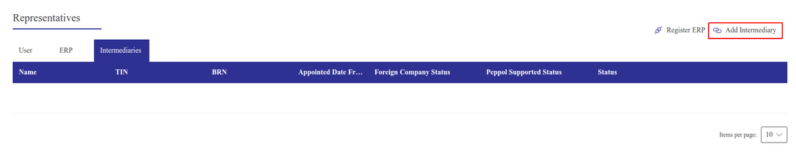
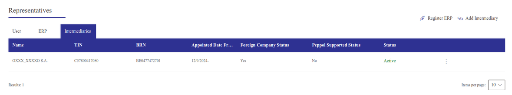

# Malaysia

## Cấu hình

### Modules installation

[Install](../../general/apps_modules.md#general-install) the following modules to get all the features of the Malaysian
localization:

| Tên                           | Tên kỹ thuật       | Mô tả                                                                                                                         |
|-------------------------------|--------------------|-------------------------------------------------------------------------------------------------------------------------------|
| Malaysia - Kế toán            | `l10n_my`          | This module includes the default [fiscal localization package](../fiscal_localizations.md#fiscal-localizations-packages). |
| Malaysia - Accounting Reports | `l10n_my_reports`  | This module includes the accounting reports for Malaysia.                                                                     |
| Malaysia - UBL PINT           | `l10n_my_ubl_pint` | This module includes the features required to export invoices in PINT format.                                                 |
| Malaysia - E-invoicing        | `l10n_my_edi`      | This module includes the features required for integration with MyInvois under IRBM.                                          |

### Thông tin công ty

To configure your company information, go to the Contacts app, search for your company,
and select it. Then configure the following fields:

- Tên
- Address, including the City, State, Zip Code,
  and Country.
  > - In the Street field, enter the street name, number, and any additional address
  >   information.
  > - In the Street 2 field, enter the neighborhood.
- Tax ID: Tax identification number
- SST: Malaysian Sales and Service Tax Number, if applicable
- TTx: Malaysian Tourism Tax Number, if applicable
- Điện thoại

## E-invoicing integration with MyInvois

The MyInvois Portal is a platform provided by the 
that facilitates the implementation of e-invoices for Malaysian taxpayers.
Odoo supports integration with MyInvois to submit the invoices generated in Odoo.

#### NOTE
The Malaysia - E-invoicing module must be installed to submit invoices to MyInvois.

### Set-up

#### MyInvois registration

To send electronic invoices to MyInvois, you first need to register and log in to the MyInvois
portal to grant Odoo the **right to invoice** as an intermediary for your company.

#### NOTE
If this is the first time you log into the MyInvois portal, click User Manual on
[MyTax](https://mytax.hasil.gov.my) to learn more about the registration process. Both the **pre-production** () and
**production** ()
environments are supported.

1. Log into [MyTax](https://mytax.hasil.gov.my). Choose the ID Type and the corresponding
   identification number used to register for the digital certificate.
2. From the dashboard, click the <i class="fa fa-angle-down"></i> (angle-down) icon in the
   top-right corner and select View Taxpayer Profile.
3. In the Representatives section, click Add Intermediary in the top-right
   corner.
   
4. Add `ODOO S.A.` as an intermediary using the following information:
   - TIN: `C57800417080`
   - BRN: `BE0477472701`
   - Tên:
     - Production: `ODOO S.A.`
     - Pre-production: `OXXX_XXXXO S.A.`
5. Grant the following permissions by clicking the <i class="fa fa-toggle-on"></i> (toggle-on)
   icon:
   - Representation From
   - Document - Submit
   - Document - Cancel
   - Document - Request Rejection

   #### NOTE
   - Access can be revoked in the future if needed.
   - Odoo, as an intermediary, does not store invoices sent on behalf of the client on the proxy
     server.
6. Click Save. The status for `ODOO S.A.` is then Active.
   

#### Cấu hình trong Odoo

##### Hóa đơn điện tử

Go to Accounting ‣ Configuration ‣ Settings. In the
Malaysian Electronic Invoicing section, choose the relevant MyInvois mode
based on the environment you used to register on MyInvois.

Make sure to allow Odoo to process e-invoices by checking the box, then click Register.

#### NOTE
To change the TIN reference, click Unregister, change the company's information and
make sure the number registered on MyInvois matches, then Register again.

##### Công ty

Open the Settings app, and in the Companies section, click Update Info. Then,
in the E-invoicing section, fill in the following fields:

> - Identification: The ID Type and associated Identification
>   number used to register for the digital certificate.
> - Ind. Classification: The 5-digit numeric code that represents the nature and
>   activity of the business.

##### Liên hệ

Access the contact's form and fill in the following fields:

> - Quốc gia
> - Tỉnh/TP
> - Điện thoại
> - ID thuế
> - Identification: the ID Type and the corresponding
>   Identification number of the contact registered on MyTax.

##### Sản phẩm

All products to be included in e-invoices require a Malaysian classification code. To add it,
access the Product form and in the General Information tab, fill in the
Malaysian classification code field.

### Quy trình

#### Send invoices to MyInvois

Invoices can be sent to MyInvois once they have been confirmed. To do so, follow the
[invoice sending](../accounting/customer_invoices.md#accounting-invoice-sending) steps, and in the Send window,
enable the Send to MyInvois option and click Send & Print.

##### Trạng thái MyInvois

In the MyInvois tab of the invoice, the MyInvois State is updated to
Valid when the submission to MyInvois is successful. The Submission UID,
MyInvois and Validation Time are also updated.
The same information is available on MyInvois.

#### NOTE
If no information is received from the MyInvois portal, the MyInvois State is
In Progress. In this case, Odoo automatically checks and updates the status.

#### Huỷ hoá đơn

Sent invoices can be canceled within 72 hours from Validation time. In this case, open
the invoice and click Request Cancel. In the Cancel document window, include
the cancellation Reason, then click Update Invoice. The
MyInvois State is updated to cancelled.
