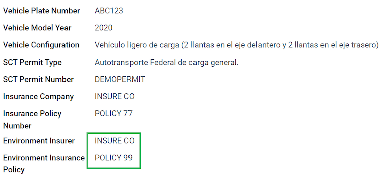
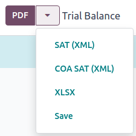
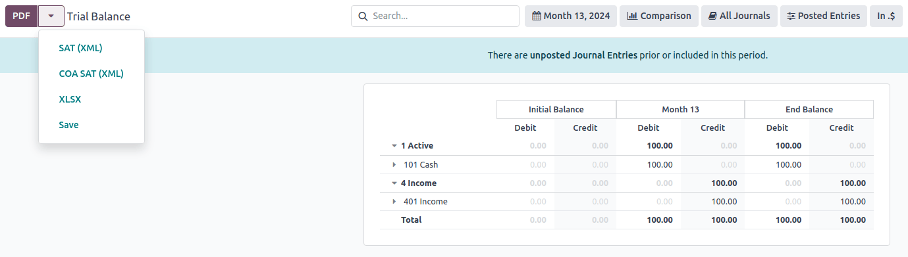
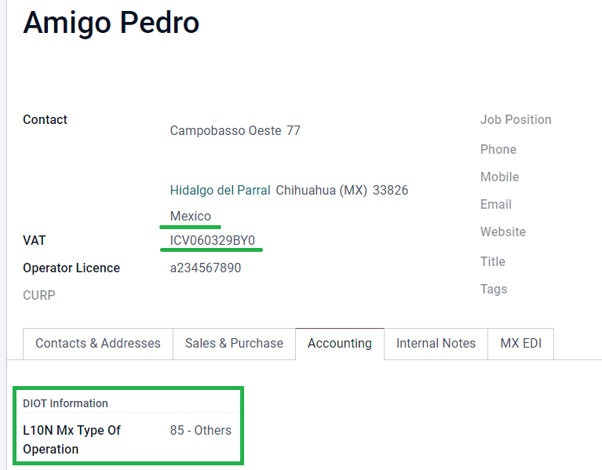

# Mexico

## Webinar

A video on the Mexican localization is also available. This video covers how to implement this
localization from scratch, including how to set up the configurations, how to complete common
workflows, and provides an in-depth look at several specific use cases, as well.

- [Video webinar of a complete demo](https://www.youtube.com/watch?v=5cdogjm0GCI).

## Đầu trang

The Odoo Mexican localization modules allow for the signing of electronic invoices, according to the
specifications of the  for [version 4.0 of the CFDI](http://omawww.sat.gob.mx/tramitesyservicios/Paginas/documentos/Anexo_20_Guia_de_llenado_CFDI.pdf), a legal requirement, as
of January 1, 2022. These modules also add relevant accounting reports (such as: the ,
enables foreign trade, and the creation of delivery guides).

#### NOTE
In order to electronically sign any documents in Odoo, ensure the *Sign* application is
installed.

## Cấu hình

### Yêu cầu

It is necessary to meet the following requirements before configuring the Mexican localization
modules in Odoo:

1. Be registered in the , with a valid .
2. Have a [Certificate of Digital Seal](https://www.gob.mx/sat/acciones-y-programas/certificado-de-sello-digital) (CSD).
3. Choose a PAC (Proveedor Autorizado de Certificación / Authorized Certification Provider).
   Currently, Odoo works with the following s: [Solución Factible](https://solucionfactible.com/), [Quadrum (formerly Finkok)](https://cfdiquadrum.com.mx/) and
   [SW Sapien - Smarter Web](https://sw.com.mx/).
4. Have knowledge and experience with billing, sales, and accounting in Odoo. This documentation
   **only** contains the necessary information needed to use Odoo.

### Installing modules

[Install](applications/general/apps_modules.md#general-install) the following modules to get all the features of the Mexican
localization. The [Accounting](applications/finance/accounting.md) and *Contacts* modules are required to be
installed for this configuration:

| Tên                                        | Tên kỹ thuật              | Mô tả                                                                                                                                                                                                                                                                                                                                                           |
|--------------------------------------------|---------------------------|-----------------------------------------------------------------------------------------------------------------------------------------------------------------------------------------------------------------------------------------------------------------------------------------------------------------------------------------------------------------|
| Mexico - Kế toán                           | `l10n_mx`                 | The default [fiscal localization package](applications/finance/fiscal_localizations.md), adds accounting characteristics for the Mexican localization, such as: the most common taxes and the chart of accounts – based on [the SAT account grouping code](https://www.gob.mx/cms/uploads/attachment/file/151586/codigo_agrupador.pdf).                 |
| EDI dành cho Mexico                        | `l10n_mx_edi`             | Includes all the technical and functional requirements to generate and validate [Electronics Documents](applications/finance/accounting/customer_invoices/electronic_invoicing.md) — based on the technical documentation published by the . This allows you to send invoices (with or without addedums) and payment complements to the government. |
| EDI v4.0 for Mexico                        | `l10n_mx_edi_40`          | Necessary to create XML documents with the correct specifications of the CFDI 4.0.                                                                                                                                                                                                                                                                              |
| Odoo Mexican Localization Reports          | `l10n_mx_reports`         | Adapts reports for Mexico's Electronic Accounting: Chart of Accounts, Trial Balance, and .                                                                                                                                                                                                                                                                  |
| Mexico - Localization Reports for Closing  | `l10n_mx_reports_closing` | Necessary to create the Closing Entry (Also known as the *month 13th move*).                                                                                                                                                                                                                                                                                    |
| Odoo Mexican XML Polizas Export            | `l10n_mx_xml_polizas`     | Allows the export of XML files of Journal Entries for a compulsory audit.                                                                                                                                                                                                                                                                                       |
| Odoo Mexican XML Polizas Export Edi bridge | `l10n_mx_xml_polizas_edi` | Complements the module `l10n_mx_xml_polizas`.                                                                                                                                                                                                                                                                                                                   |

#### NOTE
When installing a database from scratch and selecting Mexico as the country, Odoo
automatically installs the following modules: Mexico - Accounting, EDI for
Mexico, and EDI v4.0 for Mexico.

The following modules are optional. It's recommended to install them *only* if meeting a specific
requirement. Make sure that they are needed for the business.

| Tên                                           | Tên kỹ thuật              | Mô tả                                                                                                                                                      |
|-----------------------------------------------|---------------------------|------------------------------------------------------------------------------------------------------------------------------------------------------------|
| EDI for Mexico (Advanced Features)            | `l10n_mx_edi_extended`    | Adds the external trade complement to invoices: A legal requirement for selling products to foreign countries.                                         |
| EDI v4.0 cho Mexico (COMEX)                   | `l10n_mx_edi_extended_40` | Adapts the module `l10n_mx_edi_extended` for CFDI 4.0.                                                                                                     |
| Mexico - Electronic Delivery Guide            | `l10n_mx_edi_stock`       | Lets you create a *Carta Porte*: A bill of lading that proves to the government you are sending goods between A & B with a signed electronic document. |
| Electronic Delivery Guide for Mexico CFDI 4.0 | `l10n_mx_edi_stock_40`    | Adapts the module `l10n_mx_edi_stock` for CFDI 4.0                                                                                                         |
| Odoo Mexico Localization for Stock/Landing    | `l10n_mx_edi_landing`     | Allows managing customs numbers related to landed costs in electronic documents.                                                                           |

### Cấu hình công ty của bạn

After installing the correct modules, the next step is to verify that your company is configured
with the correct data. To do so, go to Settings ‣ General Settings ‣ Companies,
and select Update Info under your company name.

Enter the full Address in the resulting form, including: ZIP code,
State, Country, and  (VAT number).

According to the requirements of the CFDI 4.0, the name of the main company contact **must**
coincide with your business name registered in the , without the legal entity abbreviation.

#### IMPORTANT
From a legal point of view, a Mexican company **must** use the local currency (MXN). Therefore,
Odoo does not provide features to manage an alternative configuration. If you want to manage
another currency, let MXN be the default currency and use a [pricelist](applications/sales/sales/products_prices/prices/pricing.md), instead.

Next, go to Settings ‣ Accounting ‣ Electronic Invoicing (MX) ‣ Fiscal
Regime, then select the regime that applies to your company from the drop-down list, and click
Save.

### Liên hệ

To create a contact that can be invoiced, go to Contacts ‣ Create. Then, enter
the contact name, full Address including: ZIP code, State,
Country, and  (VAT number).

#### IMPORTANT
As with your own company, all of your contacts needs to have their correct business name
registered in the . This also applies to the Fiscal Regime, which needs to be
added in the MX EDI tab.

### Thuế

Some additional configurations for factor type and tax objects need to be added to the sales taxes
in order to properly sign invoices.

#### Factor type

The *Factor Type* field is pre-loaded in the default taxes. If new taxes are created, you need to
make sure to configure this field. To do so, go to Accounting ‣ Configuration ‣
Taxes, then enable the Factor Type field in the Advanced Options tab for
all records, with the Tax Type set as Sales.

#### Tax object

One requirement of the CFDI 4.0 is that the resulting XML file needs (or does not need) to break
down the taxes of the operation. There are three different possible values that are added in the XML
file:

- `01`: Not subject to tax - this value is added automatically if your invoice line doesn't contain
  any taxes.
- `02`: Subject to tax - this is the default configuration of any invoice line that contains taxes.
- `03`: Subject to tax and not forced to break down - this value can be triggered on-demand for
  certain customers to replace the value 02.

To use the `03` value, navigate to Contacts ‣ your customer's invoice ‣ MX EDI
tab, and activate the No Tax Breakdown checkbox.

#### IMPORTANT
The No Tax Breakdown value applies **only** to specific fiscal regimes and/or taxes.
Consult your accountant first to see if it is needed for your business before making any
modification.

#### Cấu hình thuế khác

Khi ghi nhận thanh toán, Odoo sẽ thực hiện di chuyển thuế từ *Tài khoản chuyển thuế cơ sở dòng tiền* sang tài khoản được thiết lập trong tab Định nghĩa. Để thực hiện di chuyển này, một tài khoản cơ sở tính thuế sẽ được sử dụng: (`Base Imponible de Impuestos en Base a Flujo de Efectivo`) trong bút toán khi phân loại lại thuế. **Không xóa tài khoản này**.

If you create a new tax in Accounting ‣ Configuration ‣ Taxes, you need to add
the correct Tax Grids for it (`IVA`, `ISR` or `IEPS`). Odoo **only** supports these
three groups of taxes.

### Sản phẩm

To configure products, go to Accounting ‣ Customers ‣ Products, then select a
product to configure, or Create a new one. In the Accounting tab, and in the
UNSPSC Product Category field, select the category that represents the product. The
process can be done manually, or through [a bulk import](applications/essentials/export_import_data.md).

#### NOTE
All products need to have an  code associated with them in order to prevent validation
errors.

### Hóa đơn điện tử

#### PAC credentials

After you have processed your [Private Key (CSD)](https://www.sat.gob.mx/aplicacion/16660/genera-y-descarga-tus-archivos-a-traves-de-la-aplicacion-certifica) with the , you **must** register directly with the [PAC](#mx-requirements) of
your choice before you start creating invoices from Odoo.

Once you've created your account with any of these providers, go to Settings ‣
Accounting ‣ Electronic Invoicing (MX). Under the MX PAC section, enter the name of
your  with your credentials (PAC username and PAC password).

#### .cer and .key certificates

Các [chứng chỉ số của công ty](https://www.gob.mx/tramites/ficha/certificado-de-sello-digital/SAT139) phải được tải lên trong phần Chứng chỉ MX. Để thực hiện, đi đến Cài đặt ‣ Kế toán ‣ Hóa đơn điện tử (MX). Trong phần Chứng chỉ MX, chọn Thêm một dòng, và một cửa sổ sẽ mở ra. Nhấp Tạo, sau đó tải lên Chứng chỉ số của bạn (tệp `.cer`), Khóa chứng chỉ (tệp `.key`) và Mật khẩu chứng chỉ. Để hoàn tất, nhấp vào Lưu & đóng.

## Quy trình

### Hóa đơn điện tử

The invoicing process in Odoo is based on [Annex 20](http://omawww.sat.gob.mx/tramitesyservicios/Paginas/anexo_20.htm) version 4.0 of electronic
invoicing of the .

#### Hóa đơn bán hàng

To start invoicing from Odoo, a customer invoice must be created using the [standard invoicing
flow](applications/finance/accounting/customer_invoices.md).

While the document is in draft mode, changes can be made to it (the correct Payment Way
or Usage that the customer might require can be added, for example.)

After you Confirm the customer invoice, a blue message appears stating: The
invoice will be processed asynchronously by the following E-invoicing service: CFDI (4.0).

Pressing the Process Now button sends the document to the government so it can be
signed. After receiving the signed document back from the government, the Fiscal Folio
field appears on the document, and the XML file is attached in the chatter.

To send the signed invoice to your client by mail, you can send both the XML and PDF files together,
directly from Odoo, by clicking the Send & Print button. You can also download the PDF
file to your computer, by clicking the Print button, and selecting the desired print
option.

#### Giấy báo có

While an invoice is a document type "I" (Ingreso), a credit note is a document type "E" (Egreso).

The only addition to the [standard flow for credit notes](applications/finance/accounting/customer_invoices/credit_notes.md) is that, as a requirement of the , there has
to be a relation between a credit note and an invoice through the fiscal folio.

Because of this requirement, the field CFDI Origin adds this relation with a `01|`,
followed by the fiscal folio of the original invoice.

#### Payment complements

##### Payment policy

One addition of the Mexican localization is the Payment Policy field. According to
the SAT documentation, there are two types of payments:

- `PUE` (Pago en una Sola Exhibición/Payment in a Single Exhibition)
- `PPD` (Pago en Parcialidades o Diferido/Payment in Installements or Deferred)
  > #### SEE ALSO
  > [Landed costs](applications/inventory_and_mrp/inventory/product_management/inventory_valuation/landed_costs.md)

The difference lies in the *Due Date* or *Payment Terms* of the invoice.

To configure  invoices, navigate to Accounting ‣ Customers ‣ Invoices,
and either select an invoice Due Date within the same month, or choose a payment term
that does not imply changing the due month (immediate payment, 15 days, 21 days, all falling within
the current month).

To configure  invoices, navigate to Accounting ‣ Customers ‣ Invoices, and
select an invoice with a Due Date after the first day of the following month. This also
applies if your Payment Term is due in the following month.

#### IMPORTANT
Because the  policy implies that an invoice is not going to get paid at the moment, the
correct Payment Way for the  invoices is 99 - Por Definir (To
define).

##### Payment flow

In both cases, the payment process in Odoo [is the same](applications/finance/accounting/customer_invoices.md), the
main difference being payments related to  invoices trigger the creation of a document type "P"
(Pago).

Nếu một khoản thanh toán liên quan đến hóa đơn , nó có thể được ghi nhận bằng công cụ và liên kết với hóa đơn tương ứng. Để thực hiện, hãy đi đến Kế toán ‣ Khách hàng ‣ Hóa đơn, và chọn một hóa đơn. Sau đó, nhấp vào nút Ghi nhận thanh toán. Trạng thái hóa đơn sẽ thay đổi thành Đang thanh toán, vì khoản thanh toán sẽ được xác thực khi đối chiếu ngân hàng.

#### SEE ALSO
[Đối chiếu ngân hàng](applications/finance/accounting/bank/reconciliation.md)

While this process is the same for PPD invoices, the addition of the creating an [electronic
document](applications/finance/accounting/customer_invoices/electronic_invoicing.md) means some additional requirements
are needed to correctly send the document to the .

From an invoice, you need to confirm the specific Payment Way where you received the
payment. Because of this, the Payment Way field **cannot** be set as `99 - Por Definir
(To Define)`.

If you are going to add a bank account number in the Accounting tab of a customer's
contact card, it must have a valid account number.

#### NOTE
The exact configurations are in the [Anexo 20 of the SAT](http://omawww.sat.gob.mx/tramitesyservicios/Paginas/anexo_20.htm). Usually, the
Bank Account needs to be 10 or 18 digits for transfers, 16 for credit or debit cards.

If a payment is related to a signed invoice with the Payment Policy `PPD`, Odoo
generates the corresponding payment complement automatically, once you click Process
Now.

#### WARNING
A payment in MXN **cannot** be used to pay multiple invoices in USD. Instead, the payment should
be separated into multiple payments, using the Register Payment button on the
corresponding invoices.

#### Invoice cancellations

It is possible to cancel the EDI documents sent to the . According to the [Reforma Fiscal 2022](https://www.sat.gob.mx/consultas/91447/nuevo-esquema-de-cancelacion), since January 1st, 2022,
there are two requirements for this:

- With all cancellation requests, you **must** specify a *cancellation reason*.
- After 24 hours from the invoice creation, the client must be asked to approve the cancellation. If
  there is no response within 72 hours, the cancellation is processed automatically.

Invoice cancellations can be made for one of the following reasons:

- 01 - Invoice issued with errors (with related document)
- 02 - Invoice issued with errors (no replacement)
- 03 - The operation was not carried out
- 04 - Nominative operation related to the global invoice

To initiate a cancellation, go to Accounting ‣ Customers ‣ Invoices, select the
posted invoice to cancel, and click Request Cancel. Then, refer to the
[Cancellation reason 01 - Invoice issued with errors (with related document)](#localizations-mexico-01-invoice-cancellation) or
[Cancellation reasons 02, 03, and 04](#localizations-mexico-02-03-04-invoice-cancellation) sections, depending on the cancellation
reason.

##### Cancellation reason 01 - Invoice issued with errors (with related document)

1. In the Request CFDI Cancellation pop-up window, select 01 - Invoice issued
   with errors (with related document) from the Reason field and click
   Create Replacement Invoice to create a new draft invoice. This new draft invoice
   replaces the previous invoice, along with the related .
2. Confirm the draft and Send & Print the invoice.
3. Return to the initial invoice (i.e., the invoice from which you first requested the
   cancellation). Notice the Substituted By field appears with a reference to the
   new replacement invoice.
4. Click Request Cancel. In the Request CFDI Cancellation pop-up window, the
   01 - Invoice issued with errors (with related document) option is automatically
   selected in the Reason field.
5. Nhấp Xác nhận.

The invoice cancellation is then generated with a reason line item in the CFDI tab.

#### NOTE
- If the client rejects the cancellation, the invoice cancellation line item is removed from the
  CFDI tab.
- When using the *01 - Invoice issued with errors (with related document)* cancellation reason,
  the `04|` prefix may appear in the Fiscal Folio field. This is an internal prefix
  used by Odoo to complete the cancellation and **does not** mean that the cancellation reason
  was *04 - Nominative operation related to the global invoice*.

##### Cancellation reasons 02, 03, and 04

In the Request CFDI Cancellation pop-up window, select the desired cancellation
Reason and Confirm the cancellation.

Upon doing so, the invoice cancellation is generated with a reason line item in the CFDI
tab.

#### NOTE
If the client rejects the cancellation, the invoice cancellation line item is removed from the
CFDI tab.

##### Payment cancellations

Bạn cũng có thể hủy *Bổ sung thanh toán*. Để thực hiện, hãy truy cập khoản thanh toán thông qua Kế toán ‣ Khách hàng ‣ Thanh toán và chọn Yêu cầu hủy EDI. Tương tự như với hóa đơn, một nút màu xanh sẽ xuất hiện. Nhấp Xử lý ngay và tài liệu sẽ được gửi tới . Sau vài giây, bạn có thể nhấp Thử lại để xác nhận trạng thái hiện tại từ .

Finally, the payment status is moved to Cancelled.

#### NOTE
Just like invoices, when you create a new *Payment Complement*, you can add the relation of the
original document, by adding a `04|` plus the fiscal folio in the CFDI Origin field.

#### Invoicing special use cases

##### CFDI to public

If the customer you are selling goods or services to does not require an invoice, a *CFDI to Public*
has to be created.

Nếu sử dụng tên Khách hàng là `PUBLICO EN GENERAL`, hệ thống sẽ báo lỗi. Đây là thay đổi chính trong CFDI 4.0 yêu cầu hóa đơn với tên cụ thể đó phải có thêm các trường bổ sung mà Odoo hiện chưa hỗ trợ. Để tạo *CFDI cho công chúng*, bạn cần nhập bất kỳ tên khách hàng nào **không phải** `PUBLICO EN GENERAL`. Ví dụ: `CLIENTE FINAL`.

In addition to this, it is required that the ZIP code of your company is added, the
generic  is set as `XAXX010101000`, and the Fiscal Regime of your customer must be
set as: `Sin obligaciones fiscales`.

##### Nhiều loại tiền tệ

Đồng tiền chính ở Mexico là MXN. Mặc dù đây là đơn vị tiền tệ bắt buộc đối với tất cả công ty Mexico, nhưng vẫn có thể gửi và nhận hóa đơn (cũng như thanh toán) bằng các loại tiền tệ khác nhau. Để kích hoạt tính năng sử dụng [đa tiền tệ](applications/finance/accounting/get_started/multi_currency.md), hãy đi đến Kế toán ‣ Cài đặt ‣ Tiền tệ, và đặt Ngân hàng Mexico làm Dịch vụ trong phần Tỷ giá tự động. Sau đó, đặt trường Khoảng thời gian theo tần suất bạn muốn cập nhật tỷ giá hối đoái.

This way, the XML file of the document will have the correct exchange rate, and the total amount,
in both the foreign currency and in MXN.

It is highly recommended to use [a bank account for each currency](applications/finance/accounting/bank/foreign_currency.md).

#### NOTE
The only currencies that automatically update their exchange rate daily are: USD, EUR, GBP, and
JPY.

##### Khoản trả trước

Trong một số trường hợp, bạn có thể nhận thanh toán trước từ khách hàng cần được áp dụng vào hóa đơn sau. Để thực hiện điều này trong Odoo, cần liên kết chính xác các hóa đơn với nhau bằng trường Nguồn CFDI. Để làm được điều này, cần phải cài đặt ứng dụng [Bán hàng](applications/sales.md).

#### SEE ALSO
[The official documentation for registration of down payments in Mexico](http://omawww.sat.gob.mx/tramitesyservicios/Paginas/documentos/Caso_uso_Anticipo.pdf).

First, navigate to the Sales app to create a product `Anticipo` and configure it.
The Product Type must be Service, and use the UNSPSC Category
must be: `84111506 Servicios de facturación`.

Then, go to Sales ‣ Settings ‣ Invoicing ‣ Down Payments, and add the
*Anticipo* product as the default.

Create a sales order with the total amount, and create a down payment (either using a percentage or
fixed amount). Then, sign the document, and Register the Payment.

When the time comes for the customer to get the final invoice, create it again from the same sales
order. In the Create Invoices wizard, select Regular Invoice, and uncheck
Deduct down payments.

Then, copy the Fiscal Folio from the first invoice, and paste it into the
CDFI Origin of the second invoice, adding the prefix `07|` before the value. Then, sign
the document.

After this, create a credit note for the first invoice. Copy the Fiscal Folio from the
second invoice, and paste it in the CFDI Origin of the credit note, adding the prefix
`07|`. Then, sign the document.

With this, all electronic documents are linked to each other. The final step is to fully pay the new
invoice. At the bottom of the new invoice, you can find the credit note in the
Outstanding credits - add it as payment. Finally, register the remaining amount with the
Register Payment wizard.

### External trade

The external trade is a complement to a regular invoice that adds certain values in both the XML and
PDF, to invoices with a foreign customer according to [SAT regulations](http://omawww.sat.gob.mx/tramitesyservicios/Paginas/complemento_comercio_exterior.htm), such as:

- The specific address of the receiver and the sender
- The addition of a Tariff Fraction that identifies the type of product
- The correct Incoterm (International Commercial Terms), among others (*certificate of
  origin* and *special units of measure*).

This allows the correct identification of exporters and importers, in addition to expanding the
description of the merchandise sold.

Since January 1, 2018, external trade is a requirement for taxpayers, who carry export operations of
type A1. While the current CFDI is 4.0, the external trade is currently on version 1.1

In order to use this feature, the modules l10n_mx_edi_extended and
l10n_mx_edi_extended_40 have to be installed.

#### IMPORTANT
Before installing, make sure your business needs to use this feature. Consult your accountant
first, if needed, before installing any modules.

#### Cấu hình

##### Liên hệ

Để cấu hình thông tin liên hệ công ty cho giao dịch ngoại thương, hãy đi đến Kế toán ‣ Khách hàng ‣ Khách hàng và chọn Công ty của bạn. Trong khi yêu cầu CFDI 4.0 yêu cầu bạn phải thêm Mã bưu điện hợp lệ vào thông tin liên hệ, thì phần bổ sung ngoại thương yêu cầu thêm rằng Thành phố và Bang của bạn cũng phải hợp lệ. Cả ba trường này phải trùng khớp với [Danh mục chính thức SAT](http://omawww.sat.gob.mx/tramitesyservicios/Paginas/catalogos_emision_cfdi_complemento_ce.htm), nếu không bạn sẽ nhận được thông báo lỗi.

#### WARNING
Add the City and State in the company's *contact*, not in the company
itself. You can find your company's contact in Accounting ‣ Customers ‣
Customers.

The fields Locality and Colony Code are optional and can be added in the
company directly in Settings ‣ General Settings ‣ Companies. These two fields
have to coincide with the data in the .

To configure the contact data for a foreign receiving client, navigate to Accounting
‣ Customers ‣ Customers, and select the foreign client's contact. The contact must have the
following fields completed to avoid errors:

1. The entire company Address, including a valid ZIP code and the foreign
   Country.
2. The format of the foreign VAT (tax identification number, for example: Colombia
   `123456789-1`)
3. In the MX EDI tab, you need to address if the customer receives goods for a period of
   time temporarily (Temporary) or permanently (Definitive).

#### IMPORTANT
If the new contact was created by duplicating another existing contact from Mexico, make sure to
delete any carried over information from the Fiscal Regime field. In addition, do not
enable the No Tax Breakdown option. Selecting this option hides mandatory fields that
are required for external trade contact configuration.

#### NOTE
In the resulting XML and PDF files, the VAT is automatically replaced by the generic
VAT for abroad transactions: `XEXX010101000`.

##### Sản phẩm

All products involved with external trade have four fields that are required, two of them exclusive
to external trade.

1. The Internal Reference of the product is in the General Information tab.
2. The Weight of the product must be more than `0`.
3. The [correct](https://www.ventanillaunica.gob.mx/vucem/Clasificador.html) Tariff
   Fraction of the product in the Accounting tab.
4. The UMT Aduana corresponds to the Tariff Fraction.

#### Invoicing flow

Before creating an invoice, it is important to take into account that external trade invoices
require to convert the amounts of your product into USD. Therefore, [multicurrency](applications/finance/accounting/get_started/multi_currency.md) **must** be enabled and *USD* **must** be activated in
the Currencies section. The correct Service to run is Mexican
Bank.

Then, with the correct exchange rate set up in Accounting ‣ Settings ‣
Currency, the only fields left are Incoterm and the optional Certificate
Source in the Other Info tab.

Finally, sign the invoice with the same process as a regular invoice, and click the
Process Now button.

### Delivery guide

A [Carta Porte](https://www.sat.gob.mx/consultas/68823/complemento-carta-porte-) is a bill of
lading: a document that states the type, quantity, and destination of goods being carried.

On December 1st, 2021, version 2.0 of this CFDI was implemented for all transportation providers,
intermediaries, and owners of goods. Odoo is able to generate a document type "T" (Traslado), which,
unlike other documents, is created in a delivery order instead of an invoice or payment.

Odoo can create XML and PDF files with (or without) ground transport, and can process materials that
are treated as *Dangerous Hazards*.

In order to use this feature, the modules l10n_mx_edi_extended,
l10n_mx_edi_extended_40, l10n_mx_edi_stock and
l10n_mx_edi_stock_40 have to be installed.

In addition to this, it is necessary to have the [Inventory](applications/inventory_and_mrp/inventory.md) and [Sales](applications/sales/sales.md) apps installed, as well.

#### IMPORTANT
Odoo does not support Carta Porte type document type "I" (Ingreso), air, or marine transport.
Consult your accountant first if this feature is needed before doing any modifications.

#### Cấu hình

Odoo manages two different types of CFDI:

- **No Federal Highways**: Is used when the *Distance to Destination* is [less than 30 KM](http://omawww.sat.gob.mx/cartaporte/Paginas/documentos/PreguntasFrecuentes_Autotransporte.pdf).
- **Federal Transport**: Is used when the *Distance to Destination* exceeds 30 KM.

Other than the standard requirements of regular invoicing (The  of the customer, the UNSPSC
code, etc.), if you are using *No Federal Highways*, no external configuration is needed.

For *Federal Transport*, several configurations have to be added to contacts, vehicle setups, and
products. Those configurations are added to the XML and PDF files.

##### Contacts and vehicles

Like the external trade feature, the Address in both the company and the final customer
must be complete. The ZIP code, City, and State must coincide
with the `Official SAT Catalog for Carta Porte <sat-catalog_>_`.

#### IMPORTANT
The origin address used for the delivery guide is set in Inventory ‣
Configuration ‣ Warehouses Management ‣ Warehouses. While this is set as the company address
by default, you can change it according to your correct warehouse address.

Another addition to this feature is the Vehicle Setups menu found in
Inventory ‣ Settings ‣ Mexico. This menu lets you add all the information
related to the vehicle used for the delivery order.

All fields are mandatory to create a correct delivery guide.

In the Intermediaries section, you must add the operator of the vehicle. The only
mandatory fields for this contact are the VAT and Operator Licence.

##### Sản phẩm

Similar to regular invoicing, all products must have a UNSPSC category. In addition to
this, there are two extra configurations for products involved in delivery guides:

- The Product Type must be set as Storable Product for stock movements to be
  created.
- In the Inventory tab, the field Weight should have more than `0`.

#### WARNING
Creating a delivery guide of a product with the value `0` will trigger an error. As the
Weight has been already stored in the delivery order, it is needed to return the
products, and create the delivery order (and delivery guide) again with the correct amounts.

#### Sales and inventory flow

To create a delivery guide, first, you need to create and confirm a sales order from
Sales ‣ Sales Order. This generates a Delivery smart button. Click
it, and Validate the transfer.

After the status is set to Done, you can edit the transfer, and select the
Transport Type (either No Federal Highways or Federal
Transport).

If your delivery guide has the type No Federal Highways, you can save the transfer, and
then click Generate Delivery Guide. The resulting XML can be found in the chatter.

#### NOTE
Other than the UNSPSC in all products, delivery guides that use No Federal
Highways do not require any special configuration to be sent to the government.

If your delivery guide has the type, Federal Transport, the tab MX EDI
appears. There, enter a value in Distance to Destination (KM) bigger than `0`, and
select the Vehicle Setup used for this delivery.

##### Dangerous hazards

Certain values in the UNSPSC Category are considered in the [official SAT catalog](http://omawww.sat.gob.mx/tramitesyservicios/Paginas/complemento_carta_porte.htm) as *dangerous
hazards*. These categories need additional considerations when creating a delivery guide with
Federal Transport.

First, select your product from Inventory ‣ Products ‣ Products. Then, in the
Accounting tab, the fields Hazardous Material Designation Code (MX) and
Hazardous Packaging (MX) must be filled with the correct code from the  catalog.

In Inventory ‣ Settings ‣ Mexico ‣ Vehicle Setup, the data from the
Environment Insurer and Environment Insurance Policy has to be filed, as
well. After this, continue with the regular process to create a delivery guide.

### Customs numbers

A *customs declaration* (Pedimento Aduanero) is a fiscal document that certifies that all
contributions to the fiscal entity (the ) has been paid for, including the import/export of
goods.

According to the [Annex 20](http://omawww.sat.gob.mx/tramitesyservicios/Paginas/anexo_20.htm) of
CFDI 4.0, in documents where the invoiced goods come from a first-hand import operation, the field,
Customs Number, needs to be added to all lines of products involved with the operation.

To do so, the module l10n_mx_edi_landing must be installed, in addition to the
[Inventory](applications/inventory_and_mrp/inventory.md), [Purchase](applications/inventory_and_mrp/purchase.md) and [Sales](applications/sales/sales.md) apps.

#### IMPORTANT
Do not confuse this feature with external trade. The customs numbers are directly related to
importing goods, while the external trade complement is related to exporting. Consult your
accountant first if this feature is needed before doing any modifications.

#### Cấu hình

In order to track the correct customs number for a specific invoice, Odoo uses [landed costs](applications/inventory_and_mrp/inventory/product_management/inventory_valuation/landed_costs.md). Go to
Inventory ‣ Configuration ‣ Settings ‣ Valuation. Make sure that
Landed Costs is activated.

Begin by creating a *service*-type product called, `Pedimento`. In the Purchase tab,
activate Is a Landed Cost, and select a Default Split Method.

Then, configure the *storable products* that hold the customs numbers. To do so, create the storable
products, and make sure the Product Category has the following configuration.

- Costing Method: Either FIFO or AVCO
- Inventory Valuation: Automated
- Stock Valuation Account: 115.01.01 Inventario
- Stock Journal: Inventory Valuation
- Stock Input Account: 115.05.01 Mercancías en tránsito
- Stock Output Account: 115.05.01 Mercancías en tránsito

#### Purchase and sales flow

After you configure your product, follow the standard [purchase flow](applications/inventory_and_mrp/purchase.md).

Create a purchase order from Purchase ‣ Orders ‣ Purchase Order. Then, confirm
the order to display a Receipt smart button. Click on the Receipt smart
button to Validate the receipt.

Go to Inventory ‣ Operations ‣ Landed Costs, and create a new record. Add the
transfer that you just created, and both: the product `Pedimento` and Customs number.

Optionally, you can add a cost amount. After this, validate the landed cost. Once
Posted, all products related to that receipt have the customs number assigned.

#### WARNING
You can only add the *Pedimentos* number **once**, so be careful when associating the correct
number with the transfer(s).

Now, create a sales order, and confirm it. This should trigger a Delivery smart button.
Validate it.

Finally, create an invoice from the sales order, and confirm it. The invoice line related to your
product has a customs number in it. This number should match the customs number added in the
*Landed Costs* record you created earlier.

### Electronic accounting

For Mexico, [Electronic Accounting](https://www.sat.gob.mx/aplicacion/42150/envia-tu-contabilidad-electronica) refers to the
obligation to keep accounting records and entries through electronic means, and to enter accounting
information on a monthly basis, through the  website.

It consists of three main XML files:

1. The updated list of the chart of accounts that you are currently using.
2. A monthly trial balance, plus a closing entry report, also known as: *Trial Balance Month 13*.
3. Either optional, or for a compulsory audit, an export of the journal entries in your general
   ledger.

The resulting XML files follow the requirements of the [Anexo Técnico de Contabilidad Electrónica
1.3](https://www.gob.mx/cms/uploads/attachment/file/151135/Anexo24_05012015.pdf).

In addition to this, you can generate the [DIOT](https://www.sat.gob.mx/declaracion/74295/presenta-tu-declaracion-informativa-de-operaciones-con-terceros-(diot)-): A report of vendor's journal entries that involve IVA taxes that can be
exported in a `.txt` file.

In order to use these reports, the modules l10n_mx_reports,
l10n_mx_reports_closing, l10n_mx_xml_polizas and
l10n_mx_xml_polizas_edi have to be installed, as well as the [Accounting](applications/finance/accounting/get_started.md).

#### IMPORTANT
The specific characteristics and obligations of the reports that you send might change according
to your fiscal regime. Always contact your accountant before sending any documents to the
government.

#### Hệ thống tài khoản

The [chart of accounts](applications/finance/accounting/get_started/chart_of_accounts.md) in México follows a
specific pattern based on 's' [Código agrupador de cuentas](http://omawww.sat.gob.mx/fichas_tematicas/buzon_tributario/Documents/codigo_agrupador.pdf).

You can create any account, as long as it respects 's encoding group: the pattern is
`NNN.YY.ZZ` or `NNN.YY.ZZZ`.

When a new account is created in Accounting ‣ Configuration ‣ Chart of
Accounts, with the  encoding group pattern, the correct grouping code appears in
Tags, and your account appears in the *COA* report.

Once you create all your accounts, make sure the correct Tags are added.

#### NOTE
You cannot use any pattern that ends a section with a 0 (such as `100.01.01`, `301.00.003` or
`604.77.00`). This triggers errors in the report.

Once everything is set up, go to Accounting ‣ Reporting ‣ Trial Balance,
click the <i class="fa fa-caret-down"></i> (down arrow) next to the PDF button, and
select COA SAT (XML). This generates an XML file with your accounts, which you can
upload directly to the  website.

#### Cân đối thử

The trial balance reports the initial balance, credit, and total balance of your accounts, provided
that you added their correct [encoding group](#l10n-mx-chart-of-accounts).

To generate this report in an XML format, go to Accounting ‣ Reporting ‣
Trial Balance. Select the month you want to download in the calendar, then click the
<i class="fa fa-caret-down"></i> (down arrow) next to the PDF button, and select
SAT (XML).

#### NOTE
Odoo does not generate the *Balanza de Comprobación Complementaria*.

##### Month 13 trial balance

The *Month 13* report is a closing balance sheet that shows any adjustments or movements made in the
accounting to close the year.

To generate it, proceed as follows:

1. Go to Accounting ‣ Accounting ‣ Journal Entries and create a new entry for
   all the amounts to be changed, balancing the debit and/or credit of each one.
2. In the Other Info tab, enable the Month 13 Closing option.
3. Go to Accounting ‣ Reporting ‣ Trial Balance, click the calendar, and select
   Month 13.
4. Click the <i class="fa fa-caret-down"></i> (down arrow) next to the PDF button, and
   select SAT (XML).

#### Sổ cái chung

By law, all transactions in Mexico must be recorded digitally. Since Odoo automatically creates all
the underlying journal entries of your invoicing and payments, you can export your journal entries
to comply with 's audits and/or tax refunds.

To create the XML, go to Accounting ‣ Reporting ‣ General Ledger, click the
<i class="fa fa-caret-down"></i> (down arrow) next to the PDF button, and select
XML (Polizas). In the XML Polizas Export Options window, choose between four
different Export types:

- Tax audit
- Audit certification
- Return of goods
- Compensation

For Tax audit or Audit certification, you need to write the
Order Number provided by the . For Return of goods, or
Compensation, you need to write your Process Number, also provided by the
.

#### NOTE
If you want to see this report without sending it, use `ABC6987654/99` for Order
Number and `AB123451234512` for Process Number.

#### DIOT report

The DIOT (Declaración Informativa de Operaciones con Terceros / *Informative Declaration of
Operations with Third Parties*) is an additional obligation with the , where the current status
of creditable and non-creditable payments, withholdings, and refunds of VAT from your vendor bills,
are provided to the .

Unlike other reports, the  is uploaded to a software provided by the  that contains the
A-29 form. In Odoo, you can download the records of your transactions as a `.txt` file that
can be uploaded to the form, avoiding direct capture of this data.

The transactions file contains the total amount of your payments registered in vendor bills, broken
down into the corresponding types of IVA. The VAT and Country is mandatory
for all vendors.

To generate the  report, go to Accounting ‣ Reporting ‣ Tax Reports.
Select the month you want to download in the calendar, then click the <i class="fa fa-caret-down"></i>
(down arrow) next to the PDF button to select Report: DIOT (MX)
and download the `.txt` file.

#### IMPORTANT
You need to fill the L10N Mx Type of Operation field in the Accounting
tab of each one of your vendors to prevent validation errors. Make sure that your foreign
customers have their country set up for L10N Mx Nationality to appear automatically.

