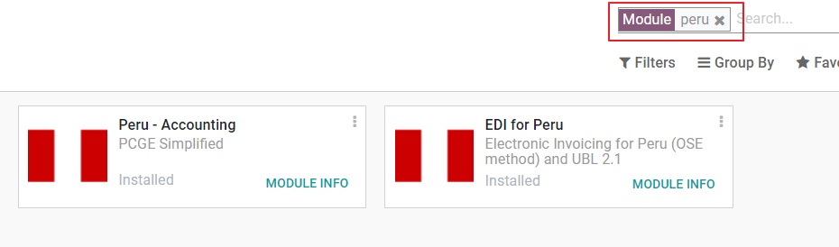
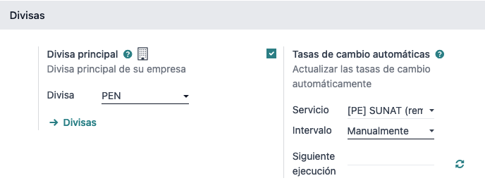
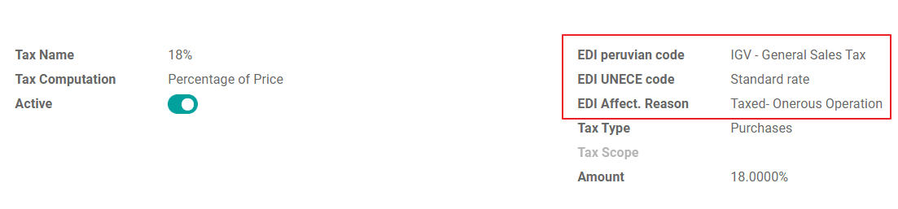
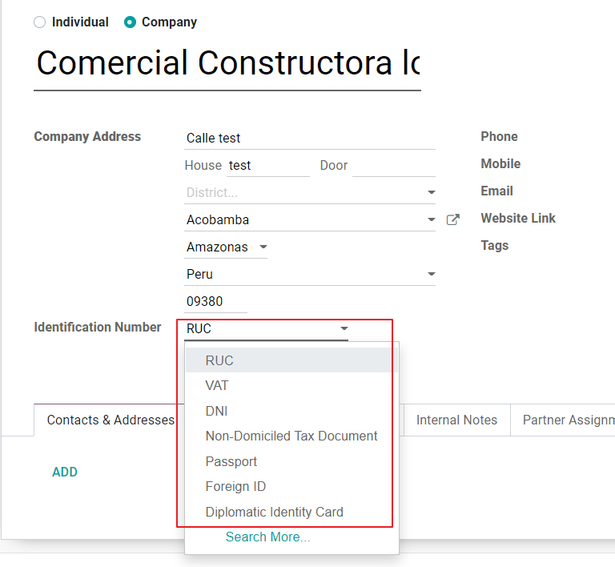
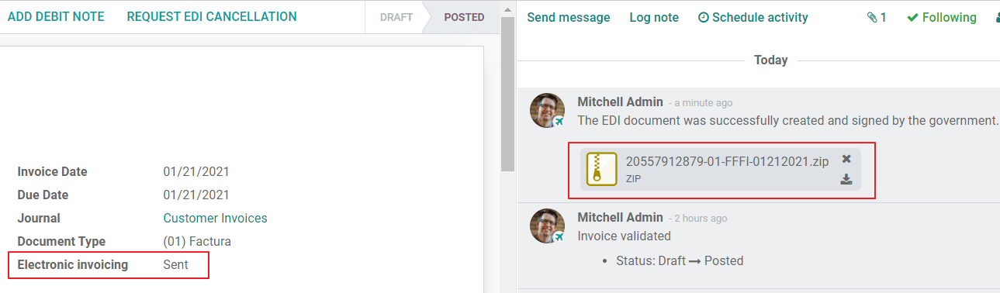
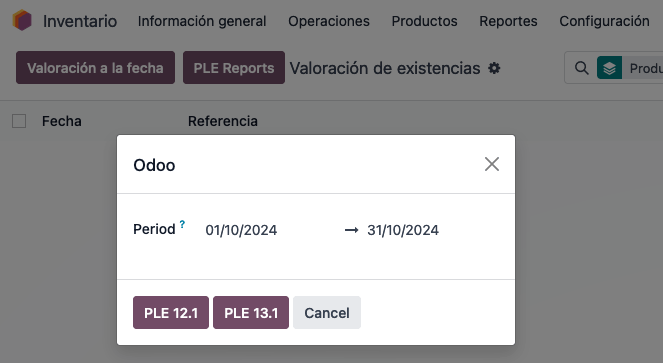

# Pê-ru

## Mô đun

[Install](../../general/apps_modules.md#general-install) the following modules to utilize all the current features of the
Peruvian localization.

| Tên                                  | Tên kỹ thuật            | Mô tả                                                                                                                                                                                                                                                                                                                                                                                                                                                                                                                             |
| ------------------------------------ | ----------------------- | --------------------------------------------------------------------------------------------------------------------------------------------------------------------------------------------------------------------------------------------------------------------------------------------------------------------------------------------------------------------------------------------------------------------------------------------------------------------------------------------------------------------------------- |
| Peru - Kế toán                       | `l10n_pe`               | 
Adds accounting features for the Peruvian localization, which represent the minimal configuration required for a company to operate in Peru and under the SUNAT regulations and guidelines. The main elements included in this module are the chart of accounts, taxes, document types.
                                                                                                                                                                                                                           |
| Peru - E-invoicing                   | `l10n_pe_edi`           | 
Includes all technical and functional requirements to generate and receive electronic invoices online based on the SUNAT regulations.
                                                                                                                                                                                                                                                                                                                                                                                   |
| Peru - Accounting Reports            | `l10n_pe_reports`       | 
Includes the following financial reports:  - 1st set of main financial reports: - Registro de Ventas e Ingresos (RVIE) - 14.4 - Registro de Compras Electrónico (RCE) - 8.4 - Registro de Compras Electrónico - Información de Operaciones con Sujetos no Domiciliados (RCE) - 8.5 - 2nd set of financial reports: - PLE 5.1 General Journal - PLE 5.3 Chart of Accounts - PLE 6.1 General Ledger - 3rd set of financial reports: - PLE 1.1 Libro de Caja - PLE 1.2 Libro de Bancos
 |
| Peruvian - Electronic Delivery Note  | `l10n_pe_edi_stock`     | 
Adds the delivery guide (Guía de Remisión), which is needed as proof that you are sending goods between A and B. It is only when a delivery order is validated that the delivery guide can be created.
                                                                                                                                                                                                                                                                                                               |
| Peru - Stock Reports                 | `l10n_pe_reports_stock` | 
Enables the <a href="peru.md#peru-reports-ple">PLE reports</a> for permanent inventory record in physical units and permanent valued inventory records.
                                                                                                                                                                                                                                                                                                                                                                 |
| Thương mại điện tử của Peru          | `l10n_pe_website_sale`  | 
Enables the identification type in eCommerce checkout forms and the ability to generate electronic invoices.
                                                                                                                                                                                                                                                                                                                                                                                                            |
| Peruvian - Point of Sale with PE Doc | `l10n_pe_pos`           | 
Enables contact fiscal information to be editable from a PoS Session to generate electronic invoices and refunds.
                                                                                                                                                                                                                                                                                                                                                                                                       |

#### NOTE

* Odoo automatically installs the appropriate package for the company according to the country\
  selected at the creation of the database.
* The _Peruvian - Electronic Delivery Guide_ module depends on the _Inventory_ application to be\
  installed.

#### SEE ALSO

* [App Tour - Localización de Peru](https://youtu.be/Ic3mGovkf8Y)
* [Smart Tutorial - Localización de Peru (videos for workflows and configurations)](https://www.odoo.com/slides/smart-tutorial-localizacion-de-peru-133)

## Cấu hình

### Install the Peruvian localization modules

Go to _Apps_ and search for Peru, then click Install in the module Peru EDI. This module has a\
dependency with _Peru - Accounting_. In case this last one is not installed, Odoo installs it\
automatically within EDI.

#### NOTE

When you install a database from scratch selecting Peru as country, Odoo automatically\
installs the base module: Peru - Accounting.

#### Cấu hình công ty của bạn

In addition to the basic information in the Company, we need to set Peru as the Country, this is\
essential for the Electronic Invoice to work properly. The field **Address Type Code** represents\
the establishment code assigned by the SUNAT when companies register their RUC (Unique Contributor\
Registration):

#### NOTE

The NIF should be set following the RUC format.

#### Hệ thống tài khoản

The chart of accounts is installed by default as part of the set of data included in the\
localization module, the accounts are mapped automatically in:

* Thuế
* Default Account Payable.
* Default Account Receivable

The chart of accounts for Peru is based on the most updated version of the , which is grouped in several categories and is compatible with NIIF\
accounting.

### Cài đặt kế toán

Once the modules are installed and the basic information of your company is set, you need to\
configure the elements required for Electronic Invoice. For this, go to Accounting\
‣ Settings ‣ Peruvian Localization.

#### Basic Concepts

Here are some terms that are essential on the Peruvian localization:

* **EDI**: Electronic Data Interchange, which in this refers to the Electronic Invoice.
* **SUNAT**: is the organization that enforces customs and taxation in Peru.
* **OSE**: Electronic Service Operator, [OSE SUNAT's definition](https://cpe.sunat.gob.pe/aliados/ose).
* **CDR**: Receipt certificate (Constancia de Recepción).
* **SOL Credentials**: Sunat Operaciones en Línea. User and password are provided by the SUNAT and\
  grant access to Online Operations systems.

#### Signature Provider

As part of the requirements for Electronic Invoice in Peru, your company needs to select a\
Signature Provider that will take care of the document signing process and manage the SUNAT\
validation response. Odoo offers three options:

1. IAP (Odoo In-App Purchase)
2. Digiflow
3. SUNAT

Please refer to the sections below to check the details and considerations for each option.

**IAP (Odoo In-App Purchase)**

This is the default and the suggested option, considering the digital ceritificate is included as\
part of the service.

**What is the IAP?**

This is a signature service offered directly by Odoo, the service takes care of the next process:

1. Provides the Electronic invoice Certificate, so you do not need to acquire one by yourself.
2. Send the document to the OSE, in this case, Digiflow.
3. Receive the OSE validation and CDR.

**How does it work?**

The service requires Credits in order to process your electronic documents. Odoo provides 1000\
credits for free in new databases. After these credits are consumed, you need to buy a Credit\
Package.

| Tín dụng | EUR |
| -------- | --- |
| 1000     | 22  |
| 5000     | 110 |
| 10       | 220 |
| 20       | 440 |

The credits are consumed per each document that is sent to the OSE.

#### IMPORTANT

If you have a validation error and the document needs to be sent one more time, one additional\
credit will be charged. Therefore, it is paramount that you verify all information is correct\
before sending your document to the OSE.

**What do you need to do?**

* In Odoo, once your enterprise contract is activated and you start working in Production, you\
  need to buy credits once the first 1000 are consumed.
* As Digiflow is the OSE used in the IAP, you need to affiliate it as the official OSE for your\
  company on the SUNAT website. This is a simple process. For more information, please check[OSE Affiliation guide](https://drive.google.com/file/d/1BkrMTZIiJyi5XI0lGMi3rbMzHddOL1pa/view?usp=sharing).
* Register Digiflow as the authorized PSE, please check[PSE Affiliation guide](https://drive.google.com/file/d/1QZoqWvtQERpS0pqp6LcKmw7EBlm9EroU/view?usp=sharing).

**Digiflow**

This option can be used as an alternative, instead of using the IAP services you can send your\
document validation directly to Digiflow. In this case you need to consider:

* Buy your own digital Certificate: For more detail regarding the official vendor list, and the\
  process to acquire it, please refer to [SUNAT Digital Ceritifcates](https://cpe.sunat.gob.pe/informacion_general/certificados_digitales/).
* Sign a service agreement directly with [Digiflow](https://www.digiflow.pe/).
* Provide your SOL credentials.

**SUNAT**

In case your company wants to sign directly with the SUNAT, it is possible to select this option\
in your configuration. In this case you need to consider:

* Get the SUNAT Certification process accepted.
* Buy your own digital Certificate: For more detail regarding the official vendor list, and the\
  process to acquire it, please refer to [SUNAT Digital Ceritifcates](https://cpe.sunat.gob.pe/informacion_general/certificados_digitales/).
* Provide you SOL credentials.

#### IMPORTANT

When using direct connection with the SUNAT, the SOL User must be set with the Company RUT + User\
Id. Example: `20121888549JOHNSMITH`

#### Testing environment

Odoo provides a testing environment that can be activated before your company goes into production.

When using the testing environment and the IAP signature, you don’t need to buy testing credits\
for your transactions as all of them are validated by default.

#### Chứng chỉ

In case you don’t use Odoo IAP, in order to generate the electronic invoice signature, a digital\
certificate with the extension `.pfx` is required. Proceed to this section and load your file and\
password.

#### Nhiều loại tiền tệ

The official currency exchange rate in Peru is provided by the SUNAT. Odoo can connect directly to\
its services and get the currency rate either automatically or manually.

Please refer to the next section in our documentation for more information about
[multicurrencies](../accounting/get_started/multi_currency.md).

### Configure Master data

#### Thuế

As part of the localization module the taxes are created automatically with their related\
financial account and electronic invoice configuration.

**EDI Configuration**

As part of the taxes configuration, there are three new fields required for electronic invoice,\
the taxes created by default have this data included, but in case you create new taxes make\
sure you fill in the fields:

#### Vị trí tài chính

There are two main fiscal positions included by default when you install the Peruvian localization.

**Extranjero - Exportación**: Set this fiscal position on customers for Exportation transactions.

**Local Peru**: Set this fiscal position on local customers.

#### Document Types

In some Latin American countries, including Peru, some accounting transactions like invoices and\
vendor bills are classified by document types, defined by the government fiscal authorities, in\
this case by the SUNAT.

Each document type can have a unique sequence per journal where it is assigned. As part of the\
localization, the Document Type includes the country on which the document is applicable;the data\
is created automatically when the localization module is installed.

The information required for the document types is included by default so the user does not need\
to fill anything on this view:

#### WARNING

Currently the documents supported on customer invoices are: Invoice, Boleta, Debit Note and\
Credit Note.

#### Sổ nhật ký

When creating Sales Journals, the following information must be filled, in addition to the standard\
fields on the Journals:

**Sử dụng Tài liệu**

This field is used to define if the journal uses Document Types. It is only applicable to\
Purchase and Sales journals, which are the ones that can be related to the different set of\
document types available in Peru. By default, all the sales journals created use documents.

**Trao đổi dữ liệu điện tử**

This section indicates which EDI workflow is used in the invoice, for Peru we must select\
“Peru UBL 2.1”.

#### WARNING

By default, the value Factur-X (FR) is always displayed, make sure you can uncheck it manually.

#### Đối tác

**Identification Type and VAT**

As part of the Peruvian localization, the identification types defined by the SUNAT are now\
available on the Partner form, this information is essential for most transactions either on\
the sender company and in the customer, make sure you fill in this information in your records.

#### Sản phẩm

Additional to the basic information in your products, for the Peruvian localization, the UNSPC\
Code on the product is a required value to be configured.

## Usage and testing

### Hóa đơn bán hàng

#### EDI Elements

Once you have configured your master data, the invoices can be created from your sales order or
manually. Additional to the basic invoice information described on [our page about the
invoicing process](../accounting/customer_invoices/overview.md), there are a couple of
fields required as part of the Peru EDI:

* **Document type**: The default value is “Factura Electronica” but you can manually change the\
  document type if needed and select Boleta for example.
* **Operation type**: This value is required for Electronic Invoice and indicates the transaction\
  type, the default value is “Internal Sale” but another value can be selected manually when needed,\
  for example Export of Goods.
* **Lý do ảnh hưởng EDI**: Trong các dòng hóa đơn, bên cạnh trường Thuế còn có trường “Lý do ảnh hưởng EDI” dùng để xác định phạm vi thuế dựa trên danh sách của SUNAT hiển thị. Tất cả các loại thuế được tải mặc định đều được gán với một lý do ảnh hưởng EDI mặc định, nếu cần bạn có thể chọn thủ công một lý do khác khi tạo hóa đơn.

#### Invoice validation

Once you check all the information in your invoice is correct, you can proceed to validate it. This\
action registers the account move and triggers the Electronic invoice workflow to send it to the\
OSE and the SUNAT. The following message is displayed at the top of the invoice:

Asynchronous means that the document is not sent automatically after the invoice has been posted.

**Electronic Invoice Status**

**To be Sent**: Indicates the document is ready to be sent to the OSE, this can be\
done either automatically by Odoo with a _cron_ that runs every hour, or the user can send it\
immediately by clicking on the button “Sent now”.

**Sent**: Indicates the document was sent to the OSE and was successfully validated. As part of\
the validation a ZIP file is downloaded and a message is logged in the chatter indicating the\
correct Government validation.

In case there is a validation error the Electronic Invoice status remains in “To be sent” so the\
corrections can be made and the invoice can be sent again.

#### WARNING

One credit is consumed each time that you send a document for validation, in this sense if an\
error is detected on an invoice and you send it one more time, two credits are consumed in\
total.

#### Common Errors

There are multiple reasons behind a rejection from the OSE or the SUNAT, when this happens Odoo\
sends a message at the top of the invoice indicating the error details and in the most common\
cases a hint to fix the issue.

If a validation error is received, you have two options:

* In case the error is related to master data on the partner, customer or taxes, you can simply\
  apply the change on the record (example customer identification type) and once it is done click\
  on the Retry button.
* If the error is related to some data recorded on the invoice directly (Operation type, missing\
  data on the invoice lines), the correct solution is to reset the invoice to Draft, apply the\
  changes, and then send the invoice again to the SUNAT for another validation.

For more detail please refert to [Common errors in SUNAT](https://www.nubefact.com/codigos-error-sunat/).

#### Báo cáo hoá đơn PDF

After the invoice is accepted and validated by the SUNAT, the invoice PDF report can be printed.\
The report includes a QR code, indicating the invoice is a valid fiscal document.

#### Tín dụng IAP

Odoo’s Electronic IAP offers 1000 credits for free, after these credits are consumed in your\
production database, your company must buy new credits in order to process your transactions.

Once you run out of credits a red label is displayed at the top of the invoice indicating that\
additional credits are required, you can easily buy them by accessing the link provided in\
the message.

In the IAP service includes packages with different pricing based on the number of credits.\
The price list in the IAP is always displayed in EUR.

#### Trường hợp vận dụng đặc biệt

**Cancellation process**

Some scenarios require an invoice cancellation, for example, when an invoice was created by mistake.\
If the invoice was already sent and validated by the SUNAT, the correct way to proceed is by\
clicking on the button Request Cancellation:

In order to cancel an invoice, please provide a cancellation Reason.

**Electronic Invoice Status**

**Cần hủy**: Cho biết yêu cầu hủy đã sẵn sàng để gửi đến OSE. Việc này có thể được thực hiện tự động bởi Odoo thông qua một _cron_ chạy mỗi giờ hoặc người dùng có thể gửi ngay lập tức bằng cách nhấp vào nút “Gửi ngay”. Sau khi gửi, một yêu cầu hủy sẽ được tạo, và kết quả là tin nhắn tiếp theo cùng tệp CDR sẽ được ghi lại trong cửa sổ trò chuyện.

**Cancelled**: Indicates the cancellation request was sent to the OSE and was successfully\
validated. As part of the validation a ZIP file is downloaded and a message is logged in the\
chatter indicating the correct Government validation.

#### WARNING

One credit is consumed on each cancellation request.

**Xuất hóa đơn**

When creating exportation invoices, take into account the next considerations:

* The Identification type on your customer must be Foreign ID.
* Operation type in your invoice must be an Exportation one.
* The taxes included in the invoice lines should be EXP taxes.

**Advance Payments**

1. Create the advance payment Invoice and apply its related payment.
2. Create the final invoice without considering the advance payment.
3. Create a credit note for the Final invoice with the advance payment amount.
4. Reconcile the Credit note with the final invoice.
5. The remaining balance on the final invoice should be paid with a regular payment transaction.

**Detraction Invoices**

When creating invoices that is subject to Detractions, take into account the next considerations:

1. All the products included in the invoice must have these fields configured:
2. Operation type in your invoice must be `1001`

### Giấy báo có

When a correction or refund is needed over a validated invoice, a credit note must be generated,\
for this just click on the button “Add Credit Note”, a part of the Peruvian localization you need\
to prove a Credit Reason selecting one of the options in the list.

By default the Credit Note is set in the document type:

To finish the workflow please follow the instructions on [our page about Credit Notes](../accounting/customer_invoices/credit_notes.md).

#### NOTE

The EDI workflow for the Credit notes works in the same way as the invoices.

### Giấy báo Nợ

As part of the Peruvian localization, besides creating credit notes from an existing document\
you can also create debit Notes. For this just use the button “Add Debit Note”.

By default the Debit Note is set in the document type.

### Electronic delivery guide 2.0

The _Guía de Remisión Electrónica_ (GRE) is an electronic document generated by the shipper to\
support the transportation or transfer of goods from one place to another, such as a warehouse or\
establishment. In Odoo, there are several configuration steps needed before you can successfully use\
this feature.

The use of the _guía de remisión electrónica_ electronic document is mandatory and required by\
for taxpayers who need to transfer their products, except those under the _Single Simplified_\
_Regime_ (régimen único simplificado or RUS).

#### Delivery guide types

**Người gửi**

The _Sender_ delivery guide type is issued when a sale is made, a service is rendered (including\
processing), goods are assigned for use, or goods are transferred between premises of the same\
company and others.

This delivery guide is issued by the owner of the goods (i.e., the sender) at the beginning of the\
shipment. The sender delivery guide is supported in Odoo.

#### SEE ALSO

[SUNAT guía de remisión](https://www.gob.pe/7899-guia-de-remision)

**Đơn vị vận chuyển**

The _Carrier_ delivery guide type justifies the transportation service the driver (or carrier)\
performs.

This delivery guide is issued by the carrier and must be issued to each shipper when the shipment\
goes through public transport.

#### IMPORTANT

The carrier delivery guide is **not** supported in Odoo.

#### SEE ALSO

[SUNAT guía de remisión transportista](https://tefacturo.pe/blog/sunat/guia-de-remision-electronica/guia-de-remision-transportista/)

#### Transportation types

**Riêng tư**

The _Private_ transportation type option is used when the owner transfers goods using their own\
vehicles. In this case, a sender's delivery guide must be issued.

**Public**

The _Public_ transportation type option is used when an external carrier moves the goods. In\
this case, two delivery guides must be issued: the sender's delivery guide and the carrier's\
delivery guide.

#### Direct submission to SUNAT

The creation of the delivery guide in Odoo **must** be sent directly to the ,\
regardless of the electronic document provider: IAP, Digiflow, or .

#### Required information

Version 2.0 of the electronic delivery guide requires additional information on the general\
configuration, vehicles, contacts, and products. In the general configuration, it is necessary to\
add new credentials that you can retrieve from the portal.

#### Huỷ

**Both** the sender and the carrier can cancel the electronic waybill as long as the following\
conditions are met:

* The shipment has not been initiated.
* If the shipment has been initiated, the receiver **must** be changed before reaching the final\
  destination.

#### IMPORTANT

The no longer uses the term "Anula", but now uses the term "Dar de baja" for\
cancellations.

#### Kiểm tra

The does not support a test environment. This means that any delivery guides that were\
generated by mistake **will** be sent to the .

If, by mistake, the waybill was created in this environment, it is necessary to delete it from the\
portal.

#### Cấu hình

#### IMPORTANT

After following the steps to configure the [electronic invoicing](#peru-accounting-settings)
and the [master data](#peru-master-data), [install](../../general/apps_modules.md#general-install) the
Peruvian - Electronic Delivery Note 2.0 module (`l10n_pe_edi_stock_20`).

Next, you need to retrieve the _client ID_ and _client secret_ from . To do so, follow the[manual de servicios web plataforma nueva GRE](https://cpe.sunat.gob.pe/sites/default/files/inline-files/Manual_Servicios_GRE%20\(1\).pdf).

#### NOTE

In the portal, it is important to have the correct access rights enabled, as they may\
differ from the user set for electronic invoicing.

These credentials should be used to configure the delivery guide general settings from\
Inventory ‣ Configuration ‣ Settings, and scroll down to the Peru\
Delivery Guide section.

Configure the following Sunat Delivery Guide API fields:

* Guide Client ID: the unique API _client ID_ generated in the portal
* Guide Client Secret: the unique API _client secret_ generated in the portal
* Guide SOL User: the RUC Number + SOL username
* Guide SOL Password: the SOL user password

#### NOTE

It is required to follow the format `RUC + UsuarioSol` (e.g., `20557912879SOLUSER`) for the\
Guide SOL User field, depending on the user selected when generating the API\
credentials in the portal.

**Người vận hành**

The _operator_ is the vehicle's driver in cases where the delivery guide is through _private_\
transport.

To create a new operator, navigate to Contacts ‣ Create and fill out the contact\
information.

First, select Individual as the Company Type. Then, add the\
Operator License in the Accounting tab of the contact form.

For the customer address, make sure the following fields are complete:

* Quận/huyện
* ID thuế (DNI/RUC)
* Mã số thuế

**Đơn vị vận chuyển**

The _carrier_ is used when the delivery guide is through _public_ transport.

To create a new carrier, navigate to Contacts ‣ Create and fill out the contact\
information.

First, select Company as the Company Type. Then, add the MTC\
Registration Number, Authorization Issuing Entity, and the Authorization\
Number.

For the company address, make sure the following fields are complete:

* Quận/huyện
* ID thuế (DNI/RUC)
* Mã số thuế

**Phương tiện**

To configure the available vehicles, navigate to Inventory ‣ Configuration ‣\
Vehicles and fill in the vehicle form with the information needed for the vehicle:

* Vehicle Name
* License Plate
* Is M1 or L?
* Special Authorization Issuing Entity
* Authorization Number
* Default Operator
* Công ty

#### IMPORTANT

It is important to check the Is M1 or L? checkbox if the vehicle has fewer than four\
wheels or fewer than eight seats.

**Sản phẩm**

To configure the available products, navigate to Inventory ‣ Products and open\
the product to be configured.

Make sure that the applicable information in the product form is fully configured. The\
Partida Arancelaria (Tariff Item) field needs to be completed.

#### Tạo GRE

Once the delivery from inventory is created during the sales workflow, make sure you complete the\
fields on the top-right section of the transfer form for the fields:

* Transport Type
* Reason for Transfer
* Departure start date

It is also required to complete the Vehicle and Operator fields under the\
Guia de Remision PE tab.

The delivery transfer has to be marked as _Done_ for the Generar Guia de Remision button\
to appear on the left menu of the transfer form.

Once the transfer form is correctly validated by , the generated XML file becomes available\
in the chatter. You can now print the delivery slip that shows the transfer details and the QR\
code validated by .

#### Common errors

*   `Diferente prefijo para productos (T001 en algunos, T002 en otros)`

    At the moment, Odoo does not support the automation of prefixes for products. This can be done\
    manually for each product output. This can also be done for non-storable products. However, keep\
    in mind that there will be no traceability.
*   `2325 - GrossWeightMeasure - El dato no cumple con el formato establecido "Hace falta el campo" "Peso"" en el producto`

    This error occurs when the weight on the product is set as `0.00`. To fix this, you need to cancel\
    the waybill and recreate it. Make sure that you fix the weight on the product before creating the\
    new waybill, or it will result in the same error.
*   `JSONDecodeError: Expecting value: line 1 column 1 (char 0) when creating a Delivery Guide`

    This error is typically generated due to SOL user issues. Verify the user's connection with the\
    ; the SOL user must be established with the company RUT + user ID. For example`2012188549JOHNSMITH`.
*   `El número de documento relacionado al traslado de mercancía no cumple con el formato establecido: error: documento relacionado`

    The _Related Document Type_ and _Related Document Number_ fields only apply to invoices and\
    receipts.
*   `400 Client error: Bad Request for URL`

    This error is not solvable from Odoo; it is advised you reach out to the and verify the\
    user. It may be necessary to create a new user.
*   `Invalid content was found starting with element 'cac:BuyerCustomerParty'`

    This error occurs when the transfer reason is set as _other_. Please select another option.\
    Following to the official documentation of the 's waybill guide, the transfer reasons _03_\
    _(sale with shipment to third party)_ or _12 (others)_ does not work in Odoo, since you should not\
    have an empty or blank customer.
*   `Duda cliente: consumo de créditos IAP al usar GRE 2.0`

    For live clients using IAP, no credit is consumed (in theory) because it does not go through the\
    OSE, i.e., these documents are directly sent to the .
*   `Errores con formato credenciales GRE 2.0 (traceback error)`

    Odoo currently throws an error with a traceback instead of a message that the credentials are not\
    correctly configured in the database. If this occurs on your database, please verify your\
    credentials.

### eCommerce electronic invoicing

First, [install](../../general/apps_modules.md#general-install) the **Peruvian eCommerce** (`l10n_pe_website_sale`) module.

The **Peruvian eCommerce** module enables the features and configurations to:

* allow clients to create online accounts for **eCommerce** purposes;
* support required fiscal fields in the **eCommerce** application;
* receive payments for sales orders online;
* generate electronic documents from the **eCommerce** application.

#### NOTE

The **Peruvian eCommerce** module is dependent on the previous installation of the**Invoicing** or **Accounting** app, as well as the **Website** app.

#### Cấu hình

After configuring the Peruvian [electronic invoicing](peru.md#peru-accounting-settings) flow, complete\
the following configurations for the **eCommerce** flow:

- [Client account registration](../../websites/ecommerce/checkout.md#checkout-sign);
- [Hoá đơn tự động](../../websites/ecommerce/order_handling.md#handling-legal);
- [Sản phẩm](../../websites/ecommerce/products.md): Set the Invoicing Policy to
  Ordered quantities and define the desired Customer taxes.
- [Thanh toán online](../payment_providers.md);
- [Vận chuyển](../../websites/ecommerce/shipping.md): For each shipping method, set
  the Provider field to Fixed Price. Then, set a Fixed Price
  amount greater than `0.00` (not zero), as the shipping method price is added to the invoice line.

#### NOTE

* [Mercado Pago](https://www.mercadopago.com/) is an online payment provider supported in Odoo\
  that covers several countries, currencies, and payment methods in Latin America.
* Make sure to define a Sales Price on the Delivery Product of the\
  shipping method to prevent errors when validating the invoice with .
* To offer free delivery, manually remove the Delivery Product, or at least use`$0.01` (one cent) for the invoice to be validated with SUNAT.

#### SEE ALSO
[Set up the Mercado Pago payment provider.](../payment_providers/mercado_pago.md)

#### Invoicing flow for eCommerce

Once the [configurations](peru.md#peru-ecommerce-configuration) are all set, fiscal input fields will\
be available during the checkout process for signed-in customers.

Khi khách hàng nhập dữ liệu thuế tại bước thanh toán và hoàn tất mua hàng thành công, hóa đơn sẽ được tạo với các yếu tố tương ứng. Loại tài liệu (Boleta/Factura) được chọn dựa trên mã số thuế của họ (RUC/DNI). Hóa đơn sau đó phải [được gửi đến OSE và SUNAT](peru.md#peru-electronic-invoice-status). Theo mặc định, tất cả hóa đơn đã đăng sẽ được gửi mỗi ngày một lần thông qua tác vụ đã lên lịch, nhưng bạn cũng có thể gửi thủ công từng hóa đơn nếu cần.

Once the invoice is validated with , customers can download the .zip file with the CDR, XML,\
and PDF files directly from the customer portal by clicking the Download button.

## Báo cáo

### Permanent inventory reports: 12.1 and 13.1

Odoo can produce two permanent inventory reports as `.txt` files for Peruvian accounting: 12.1\
and 13.1. All inventory transactions made need to be reported.

* 12.1 **only tracks inventory in physical units**, focusing on the inflow and outflow of\
  goods for effective management and planning.
* 13.1 tracks **both physical quantities and monetary values of inventory**, providing a\
  comprehensive view for tax and management purposes.

Both reports must be maintained semi-annually (January-June and July-December), with monthly\
transaction details reported within these periods. The submission deadlines are October 1st for the\
first semester and April 1st for the second semester, in accordance with the _Resolución de_\
_Superintendencia N° 169-2015_.

#### Cấu hình

Before generating the 12.1 or 13.1 reports, make sure the Peru - Stock\
Reports (`l10n_pe_reports_stock`) module is installed, then update the fields for:

* [Sản phẩm](peru.md#peru-reports-ple-products)
* [Kho hàng](peru.md#peru-reports-ple-warehouses)
* [Inventory transfers](peru.md#peru-reports-ple-transfers)

**Sản phẩm**

Several configurations related to the product or product category are necessary for reporting:

* **Type of existence**: For all products needing reporting, go to the product record's\
  Accounting tab and select the Type of Existence according to 's\
  table 5 for inventory reporting.
- **Automatic inventory valuation**: For storable goods (),
  use [automatic inventory valuation](../../inventory_and_mrp/inventory/product_management/inventory_valuation/inventory_valuation_config.md).
  Once automatic inventory valuation is enabled, this valuation method can be enabled for
  a product's [product category](../../inventory_and_mrp/inventory/product_management/inventory_valuation/inventory_valuation_config.md#inventory-warehouses-storage-valuation-on-product-category).
- **Costing method:** Storable goods must use a [costing method](../../inventory_and_mrp/inventory/product_management/inventory_valuation/inventory_valuation_config.md)
  **other** than Standard Price, as the journal entries generated from stock moves are
  used to populate the  reports.

**Kho hàng**

##### Kho hàng

When [setting up a warehouse](../../inventory_and_mrp/inventory/warehouses_storage/inventory_management/warehouses.md), the
Annex Establishment Code field must be filled. This code acts as a unique ID for each
warehouse and should only be a numeric combination, containing between 4 to 7 digits.

**Inventory transfers**

##### Inventory transfers

Transferring inventory is a key process captured in the  12.1 and  13.1 reports.
[Inventory transfers](../../inventory_and_mrp/inventory/shipping_receiving/daily_operations.md)
include both incoming and outgoing shipments.

When validating an inventory transfer (either on a warehouse receipt or delivery order), select the\
Type of Operation (PE) performed according to 's table 12 for permanent inventory\
reporting.

#### Generate a .txt file for permanent inventory Kardex reports

12.1 and 13.1 come as two separate books. The books need to be downloaded in `.txt` file\
format from Odoo, and then they should be submitted to the software.

On the [Inventory Valuation Report](../../inventory_and_mrp/inventory/product_management/inventory_valuation/using_inventory_valuation.md#inventory-management-reporting-valuation-report), click
the PLE Reports button. Then, select the Period and choose a report to
export: either the PLE 12.1 or PLE 13.1. Odoo generates a `.txt` file
for the chosen report.

#### NOTE

Only a download of the report in `.txt` format is available. There is no preview or visualization\
available within Odoo.
