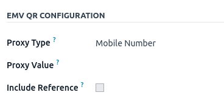
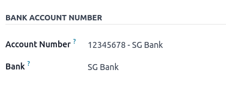
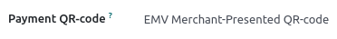

# Singapore

## Add PayNow QR codes to invoices

PayNow is a payment service platform that allows customers to make instant domestic payments to
individuals and merchants in Singapore dollars via online and mobile banking.

### Kích hoạt mã QR

Go to Accounting ‣ Configuration ‣ Settings. Under the Customer
Payments section, activate the QR Codes feature.

### PayNow bank account configuration

Go to Contacts ‣ Configuration ‣ Bank Accounts and select the bank account for
which you want to activate PayNow. Set the Proxy Type and fill in the Proxy
Value field depending on the type you chose.

#### IMPORTANT
- The account holder's country must be set to `Singapore` on its contact form.
- The account holder's city is mandatory.
- You could also include the invoice number in the QR code by checking the Include
  Reference checkbox.

#### SEE ALSO
[Bank and cash accounts](../accounting/bank.md)

### Cấu hình sổ nhật ký ngân hàng

Go to Accounting ‣ Configuration ‣ Journals, open the bank journal, then fill
out the Account Number and Bank under the Journal Entries tab.

### Issue invoices with PayNow QR codes

When creating a new invoice, open the Other Info tab and set the Payment
QR-code option to *EMV Merchant-Presented QR-code*.

Ensure that the Recipient Bank is the one you configured, as Odoo uses this field to
generate the PayNow QR code.
