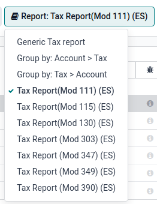
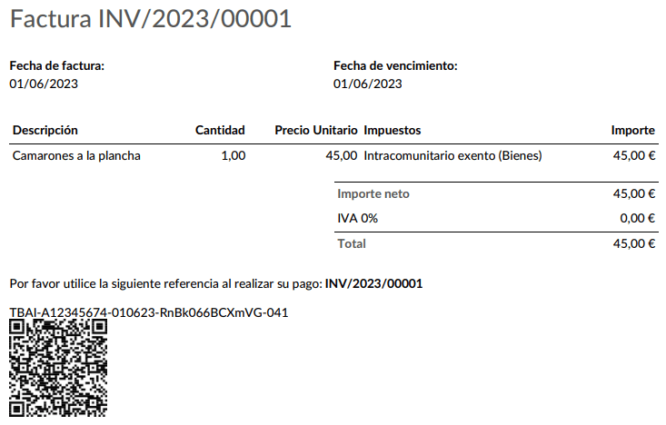
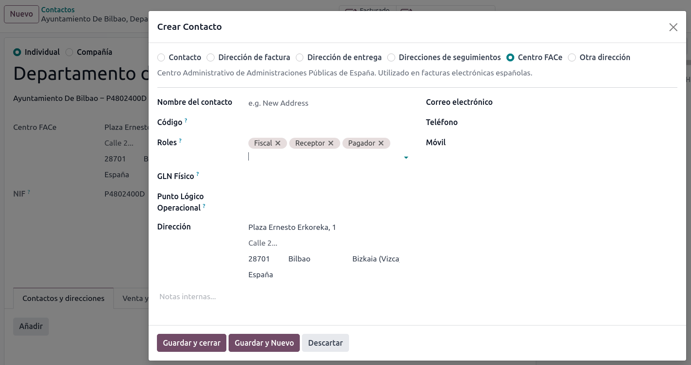

# Tây Ban Nha

## Cấu hình

Install the 🇪🇸 **Spanish** [fiscal localization package](../fiscal_localizations.md) to get all
the default accounting features of the Spanish localization.

Three **Spanish** localizations exist, each with its own pre-configured **PGCE** charts of accounts:

- Spain - SMEs (2008);
- Spain - Complete (2008);
- Spain - Non-profit entities (2008).

To select the one to use, go to Accounting ‣ Configuration ‣ Settings and
select a package in the Fiscal Localization section.

#### WARNING
You can only change the accounting package as long as you have not created any accounting entry.

## Hệ thống tài khoản

You can reach the **Chart of Accounts** by going to Accounting ‣ Configuration ‣
Accounting: Chart of Accounts.

## Thuế

Default Spain-specific taxes are created automatically when the
Spanish - Accounting (PGCE 2008) (l10n_es) module is installed, and tax reports are
available when installing the module Spain - Accounting (PGCE 2008) (l10n_es_reports).
Each tax impacts the Spain-specific **tax reports (Modelo)**, available by going to
Accounting ‣ Reporting ‣ Statements Reports: Tax Report.

## Báo cáo

Here is the list of Spanish-specific statement reports available:

- Balance Sheet;
- Lãi & lỗ;
- EC Sales List;
- Tax Report (Modelo 111);
- Tax Report (Modelo 115);
- Tax Report (Modelo 130);
- Tax Report (Modelo 303);
- Tax Report (Modelo 347);
- Tax Report (Modelo 349);
- Tax Report (Modelo 390).

You can access Spain-specific tax reports by clicking on the **book** icon when on a report and
selecting its Spain-specific version: (ES).

### Modelo 130

#### Change the percentage

If you wish to change the percentage computation of the box [04] under the I
section and/or of the box [09] under the II section:

1. Activate the [developer mode](../../general/developer_mode.md#developer-mode), go to Accounting ‣
   Reporting ‣ Tax Report, and select the report Tax report (Modelo 130).
2. Click the <i class="fa fa-cogs"></i> (cogs) icon to the right of Report: Tax Report
   (Mod 130) (ES).
3. Click the box you wish to change, and in the pop-up window, click on the percentage
   line. In the new pop-up window, change the value in the Formula field to the
   percentage you wish to apply.
   Repeat this action if you wish to modify the other box as well.

#### Report agriculture activity

If you wish to have any amount input in the II section (from boxes [08] to
[11]), you must change the **industry** of the corresponding contact to
Agriculture:

1. Go to the contact form (Accounting ‣ Customers ‣ Customers
   or Accounting ‣ Vendors ‣ Vendors, for example), and select a contact.
2. In the Sales & Purchase tab, set the Industry field to
   Agriculture.

Repeat this operation for all contacts related to the **agriculture** industry.

## TicketBAI

[Ticket BAI](https://www.gipuzkoa.eus/es/web/ogasuna/ticketbai) or **TBAI** is an e-Invoicing
system used by the Basque government and its three provincial councils (Álava, Biscay, and
Gipuzkoa).

Odoo supports the **TicketBAI (TBAI)** electronic invoicing format for all three regions of the
**Basque Country**. To enable **TicketBAI**, set your company's Country and
Tax ID under Settings ‣ General Settings in the Companies
section.

Then, [install](../../general/apps_modules.md#general-install) the module Spain -TicketBAI (l10n_es_edi_TBAI),
go to Accounting ‣ Configuration ‣ Settings, and select a **region** in the
Spain Localization section's Tax Agency for TBAI field.

Once a region is selected, click Manage certificates (SII/TicketBAI), then click
New, upload the certificate, and enter the password provided by the tax agency.

#### WARNING
If you are testing certificates, enable Test Mode in the
Spain Localization section, which can be found under Accounting in
the **Settings** app.

### Trường hợp vận dụng

Once an invoice has been [created](../accounting/customer_invoices.md) and confirmed,
a TicketBAI **banner** appears at the top.

Odoo sends invoices through TicketBAI automatically every **24 hours**. However, you can click
Process now to send the invoice immediately.

Khi hóa đơn được **gửi**, trạng thái trường Hóa đơn điện tử chuyển thành Đã gửi, và tệp XML có thể được tìm thấy trong **cửa sổ trò chuyện**. Dưới tab Tài liệu EDI, bạn có thể xem khả năng truy xuất nguồn gốc của các tài liệu khác được tạo liên quan đến hóa đơn (VD: nếu hóa đơn cũng cần gửi qua **SII**, nó sẽ xuất hiện ở đây).

#### NOTE
The TBAI **QR code** is displayed on the invoice PDF.

## FACe

[FACe](https://face.gob.es/en) is the e-Invoicing platform used by the public administrations in
Spain to send electronic invoices.

Before configuring the  system,
[install](../../general/apps_modules.md#general-install) the Spain - Facturae EDI (l10n_es_edi_facturae) module
and other **Facturae EDI**-related modules.

To enable FACe, go to Settings ‣ General Settings, click
Update Info in the Companies section, then click Update Info and
set the Country and Tax ID of your company. Next, add the
Facturae signature certificate by clicking Add a line, uploading the
certificate provided by the tax agency, and entering the provided password.

### Trường hợp vận dụng

Once you have [created](../accounting/customer_invoices.md) an invoice and confirmed
it, click Send & Print. Make sure Generate Facturae edi file is enabled, and
click Send & Print again. Once the invoice is sent, the generated XML file is available
in the **chatter**.

#### WARNING
The file is **NOT** automatically sent. You have to send it yourself manually.

### Administrative centers

In order for **FACe** to work with **administrative centers**, the invoice *must* include specific
data about the centers.

#### NOTE
Make sure to have the Spain - Facturae EDI - Administrative Centers Patch
(l10n_es_edi_facturae_adm_centers) module [installed](../../general/apps_modules.md#general-install).

To add **administrative centers**, create a new **contact** to add to the **partner** company.
Select FACe Center as the **type**, assign one or more **role(s)** to that contact, and
Save. The **three** roles usually required are:

- Órgano gestor: Receptor (Receiver);
- Unidad tramitadora: Pagador (Payer);
- Oficina contable: Fiscal (Fiscal).

