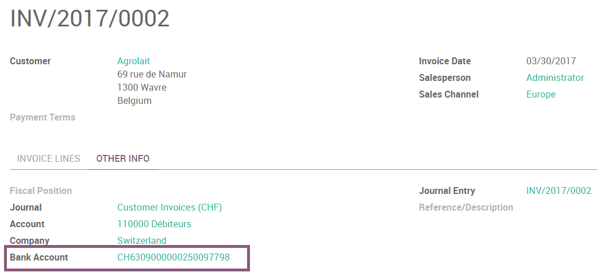

# Thụy Sĩ

## ISR (In-payment Slip with Reference number)

The ISRs are payment slips used in Switzerland. You can print them
directly from Odoo. On the customer invoices, there is a new button
called *Print ISR*.

Then you open a pdf with the ISR.

There exists two layouts for ISR: one with, and one without the bank
coordinates. To choose which one to use, there is an option to print the
bank information on the ISR. To activate it, go in
Accounting ‣ Configuration ‣ Settings ‣ Customer Invoices
and enable **Print bank on ISR**:

### ISR reference on invoices

To ease the reconciliation process, you can add your ISR reference as **Payment Reference** on your
invoices.

Để thực hiện việc này, bạn cần cấu hình Sổ nhật ký thường dùng để xuất hóa đơn. Truy cập Kế toán ‣ Cấu hình ‣ Sổ nhật ký, mở Sổ nhật ký bạn muốn chỉnh sửa (Theo mặc định, Sổ nhật ký có tên *Hóa đơn bán hàng*), nhấp vào *Chỉnh sửa* và mở tab *Cài đặt nâng cao*. Trong trường **Tiêu chuẩn nội dung**, chọn *Thụy Sĩ* và nhấp *Lưu*.

## Currency Rate Live Update

You can update automatically your currencies rates based on the Federal
Tax Administration from Switzerland. For this, go in
Accounting ‣ Settings, activate the multi-currencies setting and choose the service
you want.

## Updated VAT for January 2018

Starting from the 1st January 2018, new reduced VAT rates will be
applied in Switzerland. The normal 8.0% rate will switch to 7.7% and the
specific rate for the hotel sector will switch from 3.8% to 3.7%.

### How to update your taxes in Odoo Enterprise (Odoo Online or On-premise)?

If you have the V11.1 version, all the work is already been done, you
don't have to do anything.

If you have started on an earlier version, you first have to update the
module "Switzerland - Accounting Reports". For this, you go in
Apps ‣ remove the filter "Apps" ‣ search for "Switzerland - Accounting Reports" ‣ open the module ‣ click on "upgrade".

Once it has been done, you can work on creating new taxes for the
updated rates.

The creation of such taxes should be done in the following manner:

- **Purchase taxes**: copy the origin tax, change its name, label on
  invoice, rate and tax group (effective from v10 only)
- **Sale taxes**: copy the origin tax, change its name, label on
  invoice, rate and tax group (effective from v10 only). Since the
  vat report now shows the details for old and new rates, you
  should also set the tags accordingly to
  - For 7.7% taxes: Switzerland VAT Form: grid 302 base, Switzerland
    VAT Form: grid 302 tax
  - For 3.7% taxes: Switzerland VAT Form: grid 342 base, Switzerland
    VAT Form: grid 342 tax

You'll find below, as examples, the correct configuration for all taxes
included in Odoo by default

| **Tax Name**                                  | **Rate**   | **Label on Invoice**   | **Tax Group (effective from V10)**   | **Tax Scope**   | **Thẻ**                                                                 |
|-----------------------------------------------|------------|------------------------|--------------------------------------|-----------------|-------------------------------------------------------------------------|
| TVA 7.7% sur achat B&S (TN)                   | 7,7%       | 7.7% achat             | TVA 7.7%                             | Mua hàng        | Switzerland VAT Form: grid 400                                          |
| TVA 7.7% sur achat B&S (Incl. TN)             | 7,7%       | 7.7% achat Incl.       | TVA 7.7%                             | Mua hàng        | Switzerland VAT Form: grid 400                                          |
| TVA 7.7% sur invest. et autres ch. (TN)       | 7,7%       | 7.7% invest.           | TVA 7.7%                             | Mua hàng        | Switzerland VAT Form: grid 405                                          |
| TVA 7.7% sur invest. et autres ch. (Incl. TN) | 7,7%       | 7.7% invest. Incl.     | TVA 7.7%                             | Mua hàng        | Switzerland VAT Form: grid 405                                          |
| TVA 3.7% sur achat B&S (TS)                   | 3,7%       | 3,7% achat             | TVA 3,7%                             | Mua hàng        | Switzerland VAT Form: grid 400                                          |
| TVA 3.7% sur achat B&S (Incl. TS)             | 3,7%       | 3.7% achat Incl.       | TVA 3,7%                             | Mua hàng        | Switzerland VAT Form: grid 400                                          |
| TVA 3.7% sur invest. et autres ch. (TS)       | 3,7%       | 3.7% invest            | TVA 3,7%                             | Mua hàng        | Switzerland VAT Form: grid 405                                          |
| TVA 3.7% sur invest. et autres ch. (Incl. TS) | 3,7%       | 3.7% invest Incl.      | TVA 3,7%                             | Mua hàng        | Switzerland VAT Form: grid 405                                          |
| TVA due a 7.7% (TN)                           | 7,7%       | 7,7%                   | TVA 7.7%                             | Bán hàng        | Switzerland VAT Form: grid 302 base, Switzerland VAT Form: grid 302 tax |
| TVA due à 7.7% (Incl. TN)                     | 7,7%       | 7.7% Incl.             | TVA 7.7%                             | Bán hàng        | Switzerland VAT Form: grid 302 base, Switzerland VAT Form: grid 302 tax |
| TVA due à 3.7% (TS)                           | 3,7%       | 3,7%                   | TVA 3,7%                             | Bán hàng        | Switzerland VAT Form: grid 342 base, Switzerland VAT Form: grid 342 tax |
| TVA due a 3.7% (Incl. TS)                     | 3,7%       | 3.7% Incl.             | TVA 3,7%                             | Bán hàng        | Switzerland VAT Form: grid 342 base, Switzerland VAT Form: grid 342 tax |

If you have questions or remarks, please contact our support using
odoo.com/help.
