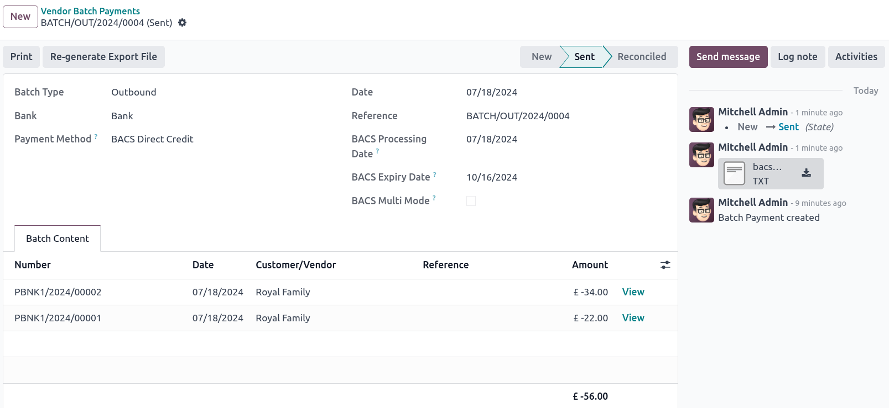

# Vương Quốc Anh

## Cấu hình

[Install](../../general/apps_modules.md#general-install) the UK - Accounting and the UK - Accounting
Reports modules to get all the features of the UK localization.

| Tên                     | Tên kỹ thuật      | Mô tả                                                                                                |
|-------------------------|-------------------|------------------------------------------------------------------------------------------------------|
| UK - Kế toán            | `l10n_uk`         | - CT600-ready chart of accounts - VAT100-ready tax structure - Infologic UK counties listing |
| UK - Accounting Reports | `l10n_uk_reports` | - Accounting reports for the UK - Allows sending the tax report via the MTD-VAT API to HMRC.     |
| UK BACS Payment Files   | `account_bacs`    | Allows generating [Bacs files](#united-kingdom-bacs-files) for bill and invoice payments             |

#### NOTE
- Only UK-based companies can submit reports to HMRC.
- Installing the module UK - Accounting Reports installs all two modules at once.

#### SEE ALSO
- [HM Revenue & Customs](https://www.gov.uk/government/organisations/hm-revenue-customs/)
- [Overview of Making Tax Digital](https://www.gov.uk/government/publications/making-tax-digital/overview-of-making-tax-digital/)

## Hệ thống tài khoản

The UK chart of accounts is included in the UK - Accounting module. Go to
Accounting ‣ Configuration ‣ Accounting: Chart of Accounts to access it.

Setup your  by going to Accounting ‣ Configuration
‣ Settings ‣ Accounting Import section and choose to Review Manually or
Import (recommended) your initial balances.

## Thuế

As part of the localization module, UK taxes are created automatically with their related financial
accounts and configuration.

Go to Accounting ‣ Configuration ‣ Settings ‣ Taxes to update the
Default Taxes, the Tax Return Periodicity or to Configure your
tax accounts.

To edit existing taxes or to Create a new tax, go to Accounting ‣
Configuration ‣ Accounting: Taxes.

#### SEE ALSO
- [thuế](../accounting/taxes/)
- Tutorial: [Tax report and return](https://www.odoo.com/slides/slide/tax-report-and-return-1719?fullscreen=1).

### Making Tax Digital (MTD)

In the UK, all VAT-registered businesses have to follow the MTD rules by using software to submit
their VAT returns.

The **UK - Accounting Reports** module enables you to comply with the [HM Revenue & Customs](https://www.gov.uk/government/organisations/hm-revenue-customs/) requirements regarding
[Making Tax Digital](https://www.gov.uk/government/publications/making-tax-digital/overview-of-making-tax-digital/).

#### IMPORTANT
If your periodic submission is more than three months late, it is no longer possible to submit
it through Odoo, as Odoo only retrieves open bonds from the last three months. Your submission
has to be done manually by contacting HMRC.

#### Register your company to HMRC before the first submission

Go to Accounting ‣ Reporting ‣ Tax report and click on
Connect to HMRC. Enter your company information on the HMRC platform. You only need to
do it once.

#### Periodic submission to HMRC

Import your obligations HMRC, filter on the period you want to submit, and send your tax report by
clicking Send to HMRC.

#### Periodic submission to HMRC for multi-company

Only one company and one user can connect to HMRC simultaneously. If several UK-based companies are
on the same database, the user who submits the HMRC report must follow these instructions before
each submission:

1. Log into the company for which the submission has to be done.
2. Go to General Settings, and in the Users section, click
   Manage Users. Select the user who is connected to HMRC.
3. Go to the UK HMRC Integration tab and click Reset Authentication
   Credentials or Remove Authentication Credentials button.
4. You can now [register your company to HMRC](#uk-localization-hmrc-registration) and submit
   the tax report for this company.
5. Repeat the steps for other companies' HMRC submissions.

#### NOTE
During this process, the Connect to HMRC button no longer appears for other UK-based
companies.

## Bacs files

 files are electronic files used in the UK to
process payments and transfers between bank accounts.

To enable the use of Bacs files, make sure the [UK BACS Payment Files](#united-kingdom-modules)
module is installed, then:

1. Configure your Bacs Service User Number:
   1. Go to Accounting ‣ Configuration ‣ Settings and scroll down to the
      Customer Payments section.
   2. Enter your Service User Number under BACS and manually save.
2. Configure your **bank** journal:
   1. Go to Accounting ‣ Configuration ‣ Journals and select your **bank**
      journal.
   2. In the Journal Entries tab, configure the Account Number and
      Bank fields.
   3. In the Incoming Payments and Outgoing Payments tabs, make sure the
      BACS Direct Debit payment method is enabled.
3. Configure the contacts for whom you wish to use Bacs files: Access the contact form and, in
   the Accounting tab, click Add a line and fill in the
   Account Number and Bank fields.

### Bill payments

To generate Bacs files for bill payments, set the Payment Method to
BACS Direct Debit when [registering vendor payments](../accounting/payments/batch.md#batch-payments-register-payments).

Then, create a vendor batch payment:

1. Go to Accounting ‣ Vendors ‣ Batch Payments, and click New.
2. Select the bank journal in the Bank field, set the Payment Method to
   BACS Direct Credit, and select a BACS Processing Date.
3. Optionally, you can also:
   - select a BACS Expiry Date;
   - enable BACS Multi Mode to process the payments on their individual date.
4. Click Add a line, select the payments you want to include, click Select,
   then Validate.

Once validated, the Bacs file is available in the chatter. You can also Re-generate
Export File if you need a new Bacs file for that batch payment.

### Invoice payments

Before generating Bacs files for invoice payments, you must first create a **BACS Direct Debit
Instruction**: Go to Accounting ‣ Customers ‣ BACS Direct Debit Instructions
and click New. Select a Customer, their IBAN, and the
Journal you wish to use.

To generate Bacs files for invoice payments, set the Payment Method to
BACS Direct Debit when [registering invoice payments](../accounting/payments/batch.md#batch-payments-register-payments).

Then, create a customer batch payment:

1. Go to Accounting ‣ Customers ‣ Batch Payments, and click New.
2. Select the bank journal in the Bank field, set the Payment Method to
   BACS Direct Credit, and select a BACS Processing Date.
3. Optionally, you can also:
   - select a BACS Expiry Date;
   - enable BACS Multi Mode to process the payments on their individual date.
4. Click Add a line, select the payments you want to include, click Select,
   then Validate.

Once validated, the Bacs file is available in the chatter. You can also Re-generate
Export File if you need a new Bacs file for that batch payment.
