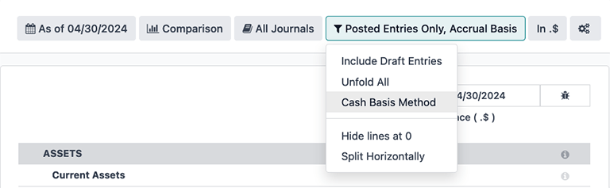

# Hợp chủng quốc Hoa Kỳ

The Odoo fiscal localization package for the United States follows the Generally Acceptable
Accounting Principles (GAAP) accounting standards and rules used to prepare financial statements,
as outlined by the Financial Accounting Standards Board (FASB) and adopted by the Securities and
Exchange Commission (SEC).

#### SEE ALSO
- [Financial Accounting Standards Board (FASB)](https://asc.fasb.org/Home)
- [Securities and Exchange Commission (SEC)](https://www.sec.gov/)

In addition, a series of videos on the subject of Accounting are available through Odoo's eLearning
platform. These videos cover how to start from scratch, set up configurations, complete common
workflows, and provide in-depth looks at some specific use cases, as well.

#### SEE ALSO
- [Odoo Tutorials: Accounting & Invoicing](https://www.odoo.com/slides/accounting-and-invoicing-19)
- [Odoo SmartClass: Accounting](https://www.odoo.com/slides/smartclass-accounting-121)

## Cấu hình

Below are the available modules in Odoo for accounting use in the United States.

#### NOTE
The modules listed below are either for reference only or are optional, as the core requirements
to operate under the US fiscal localization in Odoo are already included under the default
package that came installed during database initialization.

Verify the default package is in use by navigating to Accounting App ‣
Settings and under the Fiscal Localization section at the top, look for the `Generic
Chart Template` selection to be listed next to the Package field label. This chart
template includes the necessary settings for the US localization for the Odoo *Accounting* app.

### Modules installation

[Install](../../general/apps_modules.md#general-install) the following modules to get all the features of the United States
localization:

| Tên                                                         | Tên kỹ thuật                 | Mô tả                                                                                                                                                                                                                                                                                                                                                                                                                                                                                                                                                                                                       |
|-------------------------------------------------------------|------------------------------|-------------------------------------------------------------------------------------------------------------------------------------------------------------------------------------------------------------------------------------------------------------------------------------------------------------------------------------------------------------------------------------------------------------------------------------------------------------------------------------------------------------------------------------------------------------------------------------------------------------|
| US - Kế toán                                                | `l10n_us`                    | Base accounting module for United States localization.                                                                                                                                                                                                                                                                                                                                                                                                                                                                                                                                                      |
| [US - Accounting Reports](#l10n-us-reports)                 | `l10n_us_reports`            | Adds United States accounting reports.                                                                                                                                                                                                                                                                                                                                                                                                                                                                                                                                                                      |
| Bố cục séc của Hoa Kỳ                                       | `l10n_us_check_printing`     | Enables the printing of payments on pre-printed check paper. Supports the three most common check formats and will work out of the box with the linked checks from [checkdepot.net](https://checkdepot.net/collections/computer-checks/Odoo).  - [Check on top: Quicken / QuickBooks standard](https://checkdepot.net/collections/computer-checks/odoo+top-check) - [Check on middle: Peachtree standard](https://checkdepot.net/collections/computer-checks/odoo+middle-check) - [Check on bottom: ADP standard](https://checkdepot.net/collections/computer-checks/odoo+Bottom-Check) |
| [Thanh toán NACHA](#l10n-us-nacha)                          | `l10n_us_payment_nacha`      | Export payments as NACHA files for use in the United States.                                                                                                                                                                                                                                                                                                                                                                                                                                                                                                                                                |
| [Báo cáo 1099](#l10n-us-1099-report)                        | `l10n_us_1099`               | Export 1099 data for e-filing with a 3rd party.                                                                                                                                                                                                                                                                                                                                                                                                                                                                                                                                                             |
| [Avatax](#l10n-us-taxes-avatax)                             | `account_avatax`             | Module for the [AvaTax integration](../accounting/taxes/avatax/) with Odoo.                                                                                                                                                                                                                                                                                                                                                                                                                                                                                                                                 |
| [United States - Payroll](#l10n-us-payroll)                 | `l10n_us_hr_payroll`         | Includes the necessary rules for United States payroll, including:  - Employee Details - Hợp đồng Lao động - Passport-based Contracts - Allowances/Deductions - Allow Configurations for Basic/Gross/Net Salary - Employee Payslip - Integration with Leaves Management                                                                                                                                                                                                                                                                                                     |
| [United States - Payroll with Accounting](#l10n-us-payroll) | `l10n_us_hr_payroll_account` | Contains the necessary accounting data for the United States payroll rules.                                                                                                                                                                                                                                                                                                                                                                                                                                                                                                                                 |
| [United States - Payroll - Export to ADP](#l10n-us-adp)     | `l10n_us_hr_payroll_adp`     | Export Work Entries to the ADP payroll software.                                                                                                                                                                                                                                                                                                                                                                                                                                                                                                                                                            |

## Hệ thống tài khoản

The [chart of accounts (COA)](../accounting/get_started/chart_of_accounts.md) for the United
States localization, in Odoo, follows the standard  structure, with accounts grouped into
seven main categories, with corresponding numeric values that prefix individual journal entries:

- **Receivable**: the balance of money (or credit) due to the business for goods or services
  delivered or used, but not yet paid for by customers.  is indicated by the journal code
  labeled (or beginning) with 1.
- **Payable**: the business's short-term obligations owed to its creditors or suppliers, which have
  not yet been paid.  is indicated by the journal code labeled (or beginning) with
  2.
- **Equity**: the amount of money that would be returned to a company's shareholders if all of the
  assets were liquidated and all of the company's debt was paid off in the case of liquidation.
  Equity is indicated by the journal code labeled (or beginning) with 3 or
  9.
- **Assets**: items listed on the balance sheet that contains economic value or have the ability to
  generate cash flows in the future, such as a piece of machinery, a financial security, or a
  patent. Assets are indicated by the journal code labeled (or beginning) with 1.
- **Liability**: refers to a company's financial debts or obligations that arise during the course
  of business operations. Liabilities are indicated by the journal code labeled (or beginning) with
  2.
- **Income**: synonymous with *net income*, this is the profit a company retains after paying off
  all relevant expenses from sales revenue earned. Income is indicated by the journal code labeled
  (or beginning) with 4 or 6.
- **Expenses**: the cost of operations that a company incurs to generate revenue. Expenses are
  indicated by the journal code labeled (or beginning) with a 6.

#### SEE ALSO
- [Hệ thống tài khoản](../accounting/get_started/chart_of_accounts.md)
- [Accounting cheat sheet](../accounting/get_started/cheat_sheet.md)

### View, edit, and sort accounts

Access the *Chart of Accounts* dashboard in Odoo by navigating to Accounting app
‣ Configuration ‣ Accounting: Chart of Accounts.

From the Chart of Accounts dashboard, create new accounts by clicking the
New button in the top-left corner of the dashboard and [filling in the
corresponding form](../accounting/get_started/chart_of_accounts.md#chart-of-account-create). Search and sort through existing accounts by using
specific Filters and Group By criteria, which are available in the search
drop-down menu.

To filter accounts by category, click the <i class="fa fa-caret-down"></i> (caret down) icon to
access the drop-down menu and look under the Filters column for individual selections.
Clicking on a specific category will only show accounts that match that particular filter.

To view all the available account types, remove all of the filters in the search bar, and then click
the <i class="fa fa-caret-down"></i> (caret down) icon to access the drop-down menu. From there,
select Account Type under the Group By column heading to list all of the
account types in the table.

Besides structure, there are other key differences in the chart of accounts in the United States,
compared to other countries:

- **Specificity**: US  often requires more detailed accounts compared to some other countries.
  This can include separate accounts for various types of revenue, expenses, and assets, providing
  more granular information in financial reports.
- **Regulatory Requirements**: In the United States, there are specific regulatory requirements set
  by bodies such as the  for publicly traded companies. These requirements may influence the
  structure and content of the  to ensure compliance with reporting standards.
- **Industry Practices**: Certain industries in the United States may have unique accounting
  requirements or specialized  structures. For example, financial institutions often have
  specific accounts related to loans, investments, and interest income.
- **Tax Considerations**: The  may also reflect tax considerations, such as accounts for
  deductible expenses, deferred tax assets, and liabilities, to ensure compliance with tax laws and
  facilitate tax reporting.

These differences, ultimately, should be reflected in the  structure itself, with the addition
of new accounts, as needed, in order to meet the demands of US accounting reporting requirements.

#### SEE ALSO
- [Create a new account](../accounting/get_started/chart_of_accounts.md#chart-of-account-create)
- [Tìm kiếm, lọc, và nhóm bản ghi](../../essentials/search.md)

## Thuế

In the United States, tax rates and what is considered taxable vary by jurisdiction. Default *Sales*
and *Purchase* taxes are created automatically when the Odoo *Accounting* application is installed.
To manage existing or configure additional taxes, navigate to Accounting ‣
Configuration ‣ Taxes.

### AvaTax

**Avalara AvaTax** is a cloud-based tax calculation and compliance software that integrates with
Odoo for several localizations. Integrating AvaTax with Odoo provides real-time and region-specific
tax calculations when items are sold, purchased, and invoiced in the database.

#### IMPORTANT
AvaTax is available for integration with databases/companies that have locations in the United
States and Canada. Reference the [Fiscal country](../accounting/taxes/avatax/#avatax-fiscal-country) documentation for more information.

#### SEE ALSO
Refer to the documentation articles below to integrate and configure an AvaTax account with an
Odoo database:

- [Tích hợp AvaTax](../accounting/taxes/avatax/)
- [Avalara management portal](../accounting/taxes/avatax/avalara_portal.md)
- [Calculate taxes with AvaTax](../accounting/taxes/avatax/avatax_use.md)
- [US Tax Compliance: AvaTax elearning video](https://www.odoo.com/slides/slide/us-tax-compliance-avatax-2858?fullscreen=1)
- Avalara's support documents: [About AvaTax](https://community.avalara.com/support/s/document-item?language=en_US&bundleId=dqa1657870670369_dqa1657870670369&topicId=About_AvaTax.html&_LANG=enus)

## Báo cáo

A number of [report selections](../accounting/reporting/) are readily available for the US
localization, under the Accounting app ‣ Reporting drop-down menu:

- [Balance Sheet](../accounting/reporting/#accounting-reporting-balance-sheet): a "snapshot" of a company's financial
  position at a specific point in time, which contains an overview of a company's assets,
  liabilities, and equity.
- [Profit & Loss](../accounting/reporting/#accounting-reporting-balance-sheet): otherwise known as a *P&L statement* or
  *income statement*, provides a summary of a company's revenues, expenses, and profits/losses over
  a given period of time.
- [Cash Flow Statement](#l10n-us-cash-flow-statement): shows how much cash and cash equivalents
  a company has received and spent in a given period.
- [Executive Summary](../accounting/reporting/#accounting-reporting-executive-summary): an overview report that covers
  the key performance indicators of a company's financial position, such as revenue, profit, and
  debt.
- [Báo cáo thuế](../accounting/reporting/#accounting-reporting-tax-report): một biểu mẫu chính thức được nộp cho cơ quan thuế, báo cáo thu nhập, chi phí và các thông tin thuế liên quan khác. Báo cáo thuế cho phép người nộp thuế tính toán nghĩa vụ thuế của mình, lên lịch thanh toán thuế hoặc yêu cầu hoàn thuế nếu đã nộp thừa. Trong Odoo, báo cáo thuế có thể được lập theo tháng, hai tháng một lần, hàng quý, 4 tháng một lần, nửa năm một lần hoặc hàng năm.
- Check Register: a report that displays cash transactions (regardless of the journal)
  with their running balance after the transaction. Only visible with the *US - Accounting Reports*
  (`l10n_us_reports`) module installed.
- [1099 Report](#l10n-us-1099-report): a CSV download of payments made to non-employees in a
  period to file electronically in a third-party service. Only visible with the *1099 Reporting*
  (`l10n_us_1099`) module installed.

Depending on the type of report, certain filters are available at the top of the dashboard:

- a *date* filter, indicated by a <i class="fa fa-calendar"></i> (calendar) icon that precedes a
  date in *MM/DD/YYYY* format. Use this to select a specific date or date range for the report.
- a <i class="fa fa-bar-chart"></i> Comparison filter, to compare reporting periods against each
  other
- a *journal* filter, as indicated by a <i class="fa fa-book"></i> (book) icon and the default
  setting of All Journals. Use this filter to specify which journals should be included
  in the report.
- an *entries type* filter, as indicated by a <i class="fa fa-filter"></i> (filter) icon, with the
  default setting of Posted Entries Only, Accrual Basis. Use this filter to determine
  which type of journal entries should be included in the report (e.g. posted or draft), along with
  the type of accounting method (e.g. accrual or cash basis).
  - There are view options in this filter, as well, one that will Hide lines at 0 for
    more relevant viewing, along with a Split Horizontally option to keep the report
    above the screen's fold, removing the need to scroll.
    
- a *decimal* filter, that by default, includes figures with cents, as indicated by the
  In .$ setting. Use the other options in the drop-down menu to change figures in the
  report to whole numbers (In $), thousands (In K$), or millions
  (In M$) formats.
- a report *customization* filter, indicated by the <i class="fa fa-cogs"></i> (gears) icon. Use
  this filter to customize the current report's sections and line items, or build new reports, as
  desired.

#### SEE ALSO
- [Báo cáo kế toán](../accounting/reporting/)
- [Tìm kiếm, lọc, và nhóm bản ghi](../../essentials/search.md)

### Báo cáo 1099

The 1099 report, available by [installing](../../general/apps_modules.md#general-install) the *1099 Reporting*
(`l10n_us_1099`) module, includes payments that are made to non-employees across a given reporting
period. Use the available CSV download from the report in Odoo to file 1099 payments electronically
via a third-party service.

To generate a 1099 report, navigate to Accounting app ‣ Reporting ‣ Management:
1099 Report to open a 1099 Report wizard.

First, enter the date range of the transactions to report in the Start Date and
End Date fields.

Then, edit the journal items that appear on the wizard. Click Add a line to add any
items that are missing. Be sure to remove any items that should not be included in the report by
clicking <i class="fa fa-times"></i> (delete) on the row.

Finally, once all necessary items are included in the 1099 report, click on the Generate
button. Doing so downloads a CSV file that groups transactions by the partner that received the
payments.

### Cash flow statement

Navigate to the *Cash Flow Statement* (CFS) dashboard by going to Accounting app ‣
Reporting ‣ Statement Reports: Cash Flow Statement. From here,  reports can be generated
using the various [filters](#l10n-us-report-filters) that are available at the top of the
dashboard.

Odoo uses the *direct* cash flow method to compile cash flow statements, which measures actual cash
inflows and outflows from the company's operations, such as when cash is received from customers or
when cash payments are made to suppliers.

By default, an account labeled with any of the three default Tags on the
Chart of Accounts dashboard will be included in the report, which includes:
Operating Activities, Financing Activities, and Investing &
Extraordinary Activities.

Additionally, the cash flow statement in Odoo:

- is limited to the *Bank* and *Cash* journals to reflect money coming in or out; and
- also contains *Expenses* accounts, to show the counterpart transactions versus *Bank* or *Cash*
  journal entries, while excluding  and  activity.

## Cash discount

Cash discounts can be configured from Accounting app ‣ Payment Terms. Each
payment term can be set up with a cash discount and reduced tax.

#### SEE ALSO
[Cash discounts and tax reduction](../accounting/customer_invoices/cash_discounts.md)

## Writing checks

Using checks is still a common payment practice in the US. Be sure the *US Checks Layout*
(`l10n_us_check_printing`) module for the US localization is [installed](../../general/apps_modules.md#general-install).

To enable check printing from Odoo, navigate to Accounting ‣ Configuration ‣
Settings and find the Vendor Payments section. From here, tick the Checks
checkbox to reveal several fields for check configuration.

Select a Check Layout from the drop-down menu:

- Print Check (Top) - US
- Print Check (Middle) - US
- Print Check (Bottom) - US

Next, choose whether or not to enable the Multi-Pages Check Stub checkbox.

Optionally set a Check Top Margin and Check Left Margin, if required.

Once all check configurations are complete, Save the settings.

#### SEE ALSO
[Pay by checks](../accounting/payments/pay_checks.md)

## Bảng lương

The *Payroll* application is responsible for calculating an employee's pay, taking into account all
work, vacation, and sick time, benefits, and deductions. The *Payroll* app pulls information from
the *Attendances*, *Timesheets*, *Time Off*, *Employees* and *Expenses* applications, to calculate
the worked hours and compensation for each employee.

Khi sử dụng nhà cung cấp dịch vụ bảng lương bên ngoài, chẳng hạn như ADP, cần phải xuất các dữ liệu liên quan đến bảng lương như công, hoàn trả chi phí, thuế, hoa hồng và bất kỳ dữ liệu liên quan nào khác, để có thể tải dữ liệu đó lên hệ thống của nhà cung cấp dịch vụ bảng lương. Sau đó, họ sẽ xuất phiếu lương thực tế hoặc chuyển khoản trực tiếp vào tài khoản ngân hàng của nhân viên.

In order to export the payroll data, the work entries must first be validated and correct. Refer to
the [work entries](../../hr/payroll/work_entries.md) documentation for more information
regarding validating work entries.

Once work entries are validated, the information can be [exported to ADP](#l10n-us-adp).

After payments have been issued to employees, payslips can be processed into batches, validated, and
posted to the corresponding accounting journals to keep all financial records in Odoo current.

### Required information

It is important to have the *Employees* application installed, and all employee information
populated. Several fields in both the [employee records](#l10n-us-payroll-employee-records), as
well as in an [employee contracts](#l10n-us-payroll-employee-contracts), are necessary to
properly process the employee's pay. Ensure the following fields are filled out in their respective
places.

#### Employee records

In each employee record, there is various information the *Payroll* application requires to properly
process payslips, including various banking, tax, and work information.

Navigate to the Employees app and select an employee record to view the sections of
the employee form that directly affect *Payroll*:

- Tab Thông tin công việc:
  - Work Address: indicates where the employee is located, including the state, which
    affects the tax calculations.
  - Working Hours: determines how pay is calculated, and determines if an employee earns
    overtime.
- Tab Thông tin cá nhân:
  - SSN No: the last four digits of the employee's Social Security Number (SSN) appears
    on payslips.
  - Bank Account Number: the bank account associated with the NACHA payment file.
- Tab Cài đặt HR:
  - Federal Tax Filing Status: the tax status an employee uses for Payroll tax
    calculations, which can be different from their state status.
  - State Tax Filing Status: the tax status an employee uses for their state portion of
    the Payroll tax calculation.
  - W-2 Form: a US tax form indicating the summary of wages, taxes, and benefits paid to
    an employee during a tax period (typically one year).
  - W-4 Form: an IRS form that helps outline the amount of federal taxes to withhold for
    an employee, which is paid to the IRS by the company.

#### Employee contracts

Additionally, there is information that is found in an employee contract that also affects the
*Payroll* application.

Navigate to the Employees app ‣ Employees ‣ Contracts and select a contract
record to view the sections of a contract that directly affect *Payroll*:

- Thông tin chung:
  - Salary Structure Type: United States: Employee: defines when the employee is paid,
    their working schedule, and the work entry type.
  - Work Entry source: determines how work entries are calculated.
- Tab Thông tin lương:
  - SSN No: the last four digits of the employee's Social Security Number (SSN) appears
    on payslips.
  - Wage type: determines how the employee is paid, wether a Fixed wage (salary) or
    Hourly wage.
  - Schedule Pay: defines how often the employee is paid, either Annually,
    Semi-annually, Quarterly, Bi-monthly, Monthly,
    Semi-monthly, Bi-weekly, Weekly, or Daily. In
    the US, Semi-monthly (24 payments a year) or bi-weekly (26 payments a year) are the most common.
  - Wage, Yearly, and Monthly cost: used to show the total cost of an employee. It is
    recommended to populate the Yearly wage first, as it auto-populates the other
    fields.
  - Pre-tax benefits: populate this section according to the employee's selections.
    Pre-tax benefits decrease the gross wage, which lowers the base amount that is taxed. These are
    displayed at the beginning of the payslip.
  - Post-tax benefits: these benefits are deductions made *after* taxes are calculated.
    These appear towards the end of the payslip before the net amount is displayed.

#### SEE ALSO
[Tài liệu Nhân viên](../../hr/employees/new_employee.md)

### Export work entries to ADP

#### Yêu cầu

In order to create a report that can be uploaded to ADP, there are some initial configuration steps
that must be completed first.

First, ensure the *United States - Payroll - Export to ADP* (`l10n_us_hr_payroll_adp`) module is
[installed](../../general/apps_modules.md#general-install).

Then, the company **must** have an *ADP Code* entered in the company settings. To do so, navigate
to Payroll app ‣ Configuration ‣ Settings. Enter the ADP Code in
the US Localization section.

Next, work entry types **must** have the correct ADP code listed in the *External Code* field for
each work entry type that is being referenced.

Lastly, every employee **must** have an *ADP Code* entered on their employee form. To do so,
navigate to Employees app, select an employee record, and open the HR
Settings tab. Enter the ADP Code in the ADP Information section.

The ADP Code code is how ADP identifies that particular employee, and is typically a
six-digit number.

#### SEE ALSO
- [Add a new work entry](../../hr/payroll/work_entries.md#payroll-new-work-entry)
- [Nhân viên mới](../../hr/employees/new_employee.md)

#### Xuất dữ liệu

Once [work entries](../../hr/payroll/work_entries.md) have been verified, the information can be
exported to a CSV file, which can then be uploaded into ADP.

To export the data, navigate to Payroll app ‣ Reporting ‣ United States: ADP
Export, then click New. Next, enter the Start Date and End Date
for the work entries using the calendar pop-over.

Then, enter a Batch ID in the corresponding field. The recommendation for this field is
to enter the date in a `YY-MM-DD` format, followed by any other characters to distinguish that
specific batch, such as a department name, or any other defining characteristics for the batch.

Enter a Batch Description in the corresponding field. This should be short and
descriptive, but distinct from the Batch Name.

Ensure the correct company populates the Company field. Change the selected company with
the drop-down menu, if needed.

Lastly, add the employee's work entry information to the list. Click Add a line and an
Add: Employee pop-up window loads. The list can be [filtered](../../essentials/search.md) to more easily find the employees to add to the list.

Select the employees to add to the list by ticking the box to the left of their name. Once all
desired employees have been selected, click the Select button in the lower-left corner,
and the employees appear in the list.

To create the CSV file, click the Generate button in the top-left corner.

## ACH - electronic transfers

Automated Clearing House (ACH) payments are a modern way to transfer funds electronically between
bank accounts, replacing traditional paper-based methods.  payments are commonly used for
direct deposits, bill payments, and business transactions.

### Receive ACH payments: payment provider integration

 payments are supported by *Authorize.net* and *Stripe* payment integrations in Odoo.

#### SEE ALSO
- [Setting up Authorize.net for ACH payments (Odoo)](../payment_providers/authorize.md#authorize-ach-payments)
- [Authorize.net's ACH payment processing for small businesses documentation](https://www.authorize.net/resources/blog/2021/ach-payments-for-small-businesses.html)
- [Setting up Stripe for ACH payments (Odoo)](../payment_providers/stripe.md)
- [Stripe's ACH Direct Debit documentation](https://docs.stripe.com/payments/ach-debit)

### Send payments: NACHA files

Odoo can generate a National Automated Clearing House Association (NACHA) compatible  file to
send to a company's bank. For each individual *Bank* journal that the company wishes to pay vendors
with, a  configuration section needs to be filled out on the Odoo database.

#### Cấu hình

First, navigate to the Accounting app ‣ Configuration ‣ Journals. Open the
bank journal and click into the Outgoing Payments tab.

#### NOTE
The following  configuration information is normally provided by the company's financial
institution once they have been approved to send payments via their account.

Trong phần có nhãn Cấu hình NACHA là các trường cần thiết để tạo tệp  tương thích  để gửi đến ngân hàng của công ty. Đầu tiên, nhập số định tuyến của tổ chức tài chính vào trường có nhãn Đích trực tiếp. Thông tin này phổ biến trên mạng internet và thường khác nhau tùy theo địa điểm ngân hàng. Số này thường được cung cấp khi thiết lập tài khoản ban đầu.

Next, enter the registered name of the financial institution in the field called,
Destination. This information will be provided by the bank or credit union.

Following the Destination field is the Immediate Origin field. Enter the
9-digit company ID or Employer Identification Number (EIN) into this field. This information is
provided by the financial institution.

Tiếp theo, nhập số Định danh công ty, đây là một số gồm 10 chữ số được tạo bằng cách kết hợp ID công ty 9 chữ số hoặc Mã số nhận diện chủ lao động (EIN) với một số bổ sung ở đầu dãy. Số này thường là `1`. Nếu số đầu tiên là một số khác, hãy kiểm tra với tổ chức tài chính để xác minh tính chính xác, vì số này được cung cấp cho các tài khoản đã được  phê duyệt.

Enter the Originating DFI Identification number next, which should contain an assigned
8-digit number from the financial institution.

#### IMPORTANT
Enter the numerical values in this section *exactly* as the company's financial institution
(e.g. bank or credit union) has provided them, otherwise risk failing a successful 
configuration in Odoo.

There are two options for the next field: Standard Entry Class Code. Select the
drop-down menu to the right of the field and pick either Corporate Credit or Debit (CCD)
or Prearranged Payment and Deposit (PPD). Again, this information will be provided by
the financial institution. By default Corporate Credit or Debit (CCD) is selected.

Finally, the last option is for Generated Balanced Files. Tick the checkbox to the right
of the field to enable Generated Balanced Files. Consult the company's accountant or
financial advisor to make an informed decision for this field.

Manually save the configuration by clicking the <i class="fa fa-cloud-upload"></i> (cloud upload)
icon, or navigate away from this screen to auto-save. The configuration is now complete.

#### Tạo thanh toán theo lô

Now, record each payment in Odoo using the  payment method.

#### SEE ALSO
[Register Payments in Odoo](../accounting/payments/#accounting-payments-from-invoice-bill)

#### IMPORTANT
Hãy lưu ý thời gian chốt đối với các khoản thanh toán trong ngày. Tệp cần có ngày thanh toán ở tương lai cho từng khoản hoặc phải được gửi trước thời gian chốt nếu ngày trong tệp trùng với ngày hôm nay. Hãy tham khảo tổ chức tài chính để biết chính xác thời gian chốt cho việc xử lý các khoản thanh toán trong ngày.

Once all the payments to be included in the   file have been made, a batch payment needs
to be made from the <i class="fa fa-cog"></i> Action menu.

To create the batch payments, access the payments page, by navigating to Accounting
‣ Vendors ‣ Payments. Select all the payments that should be included in the  
file, by ticking the checkboxes to the far-left of the rows.

#### IMPORTANT
All payments in the batch **must** share the same  payment method.

Next, navigate to the batched payment (Accounting ‣ Vendors ‣ Batch Payments).
Click into the payment just created and then click into the Exported File tab. The
generated file is listed with the Generation Date. Click the <i class="fa fa-download"></i>
(download) button to download the file.

If any adjustments need to be made, click the Re-generate Export File button to recreate
a new   file.

#### SEE ALSO
- [Batch payments by bank deposit](../accounting/payments/batch.md)
- [Europe's direct debiting](../accounting/payments/batch_sdd.md)
