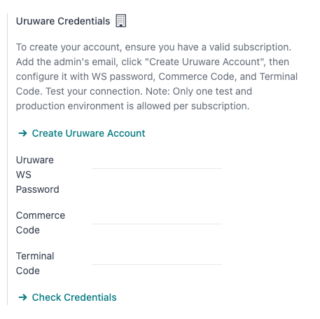
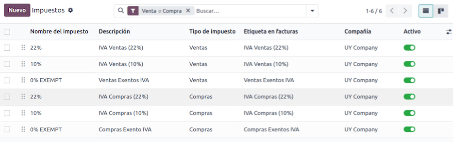
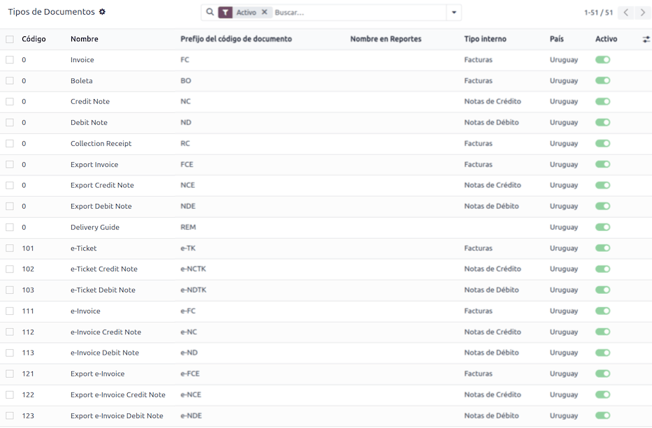

# Uruguay

## Đầu trang

With the Uruguayan localization, you can generate electronic documents with its XML, fiscal folio,
electronic signature and connection to tax authority Dirección General Impositiva (DGI) through
Uruware.

The supported documents are:

- e-Invoice, e-Invoice Credit Note, e-Invoice Debit Note;
- e-Ticket, e-Ticket Credit Note, e-Ticket Debit Note;
- Export e-Invoice, Export e-Invoice Credit Note, Export
  e-Invoice Debit Note.

The localization requires an Uruware account, which enables users to generate electronic documents
within Odoo.

### Bảng thuật ngữ

The following terms are used throughout the Uruguayan localization:

- **DGI**: *Dirección General Impositiva* is the government entity responsible for enforcing tax
  payments in Uruguay.
- **EDI**: *Electronic Data Interchange* refers to the sending of electronic documents.
- **Uruware**: is the third-party organization that facilitates the interchange of electronic
  documents between companies and the Uruguayan government.
- **CAE**: *Constancia de Autorización de Emisión* is a document requested from the tax authority's
  website to enable electronic invoice issuance.

## Cấu hình

### Modules installation

[Install](../../general/apps_modules.md#general-install) the following modules to get all the features of the Uruguayan
localization:

| Tên                 | Tên kỹ thuật   | Mô tả                                                                                                                                                                                                                                                                                                                                                                                |
|---------------------|----------------|--------------------------------------------------------------------------------------------------------------------------------------------------------------------------------------------------------------------------------------------------------------------------------------------------------------------------------------------------------------------------------------|
| Uruguay - Kế toán   | `l10n_uy`      | The default [fiscal localization package](./). It adds accounting characteristics for the Uruguayan localization, which represent the minimum configuration required for a company to operate in Uruguay according to the guidelines set by the . The module's installation automatically loads: chart of accounts, taxes, documents types, and tax supported types. |
| Uruguay EDI Kế toán | `l10n_uy_edi`  | Includes all the technical and functional requirements to generate and validate [Electronics Documents](../accounting/customer_invoices/electronic_invoicing.md), based on the technical documentation published by the . The authorized documents are [listed above](#uruguay-intro).                                                                                   |

#### NOTE
Odoo automatically installs the base module **Uruguay - Accounting** when a database is installed
with `Uruguay` selected as the country. However, to enable electronic invoicing, the **Uruguay
Accounting EDI** (`l10n_uy_edi`) module needs to be manually [installed](../../general/apps_modules.md#general-install).

### Công ty

To configure your company information, open the **Settings** app, scroll down to the
Companies section, click Update Info, and configure the following:

- Tên công ty
- Address, including the Street, City, State,
  ZIP, and Country
- Tax ID: enter the identification number for the selected taxpayer type.
- DGI Main Branch Code: this is part of the XML when creating an electronic document. If
  this field is not set, all electronic documents will be rejected.

  To find the DGI Main Branch Code, follow these steps:
  1. From your [DGI account](https://servicios.dgi.gub.uy/serviciosenlinea), go to
     Servicios en línea DGI ‣ Registro único tributario ‣ Consulta de datos.
  2. Select Consulta de Datos Registrales ‣ Consulta de Datos de Entidades.
  3. Open the generated PDF to get the *DGI Main Branch Code* from the Domicilio Fiscal
     Número de Local section.

After configuring the company in the database settings, navigate to Contacts and
search for your company to verify the following:

- the company type is set to Company.
- the Identification Number Type is RUT / RUC.

### Set up a Uruware account

To set up a Uruware account, follow these steps:

1. Verify that you have a valid Odoo subscription.
2. Locate the Uruware credentials settings by navigating to the Accounting ‣
   Configuration ‣ Settings.
3. Scroll down to the Uruguayan Localization section and select the environment
   (Production or Testing).
4. Click on Create Uruware Account.

Upon doing so, an email is sent to the address associated with your Odoo subscription with the
password to enter Uruware's portal and set up your account.

#### NOTE
This action will create an account with Uruware with the following information:

- Legal name (razón social)
- RUT from the company
- Username (the Odoo subscription email or `RUT`.odoo. For example: `213344556677.odoo`)
- Liên kết cơ sở dữ liệu Odoo

To ensure your account is created correctly, please add any missing information from above.

Once the account is created and you have received the email containing the credentials, configure
your accounts directly in the Uruware [testing portal](https://odootest.ucfe.com.uy/Gestion/) or
[production portal](https://prod6109.ucfe.com.uy/Gestion/):

Use the account credentials in the email to log in to the to the corresponding ([test](https://odootest.ucfe.com.uy/Gestion/) or [production](https://prod6109.ucfe.com.uy/Gestion/))
portal.

In Uruware's portal, the following steps are needed to be able to issue invoices from Odoo:

1. Complete and correct the company's information.
2. Add your digital certificate.
3. Add your  for each document-type you plan
   to issue.
4. Configure the format of the PDF to be printed and sent to your customers.

#### IMPORTANT
Be sure to configure two accounts, one for testing and one for production. The certificate is
needed in both environments, but  are only
needed in production.

#### SEE ALSO
- [Odoo Tutorials: Uruguay Localization](https://www.odoo.com/slides/smart-tutorial-localizacion-de-uruguay-432)
- [Odoo Help Forum: Uruguay](https://www.odoo.com/forum/help-1?search=l10n_uy)

### Electronic invoice data

To configure the electronic invoice data, an environment and credentials need to be configured. To
do so, navigate to Accounting ‣ Configuration ‣ Settings and scroll down to the
Uruguayan Localization section.

First, select the UCFE Web Services environment:

- Production: for production databases. In this mode, electronic documents are sent to
   through Uruware for their validation.
- Testing: for test databases. In this mode, the direct connection flows can be tested,
  with the files sent to the  testing environment through Uruware.
- Demo: files are created and accepted automatically in demo mode but are **not** sent
  to the . For this reason, rejection errors will not appear in this mode. Every internal
  validation can be tested in demo mode. Avoid selecting this option in a production database.

#### NOTE
Using Demo mode does not require a Uruware account.

Then, enter the Uruware Data:

- Uruware WS Password
- Commerce Code
- Terminal Code

#### NOTE
This data can be obtained from the Uruware portal after configuring the [Uruware account](#l10n-uy-uruware-account).

To get the Uruware WS Password, go to Configuration ‣ Company ‣
Edit and look for the Validators and Additional Information tab to find
WS Password.

To get the Commerce Code, go to Configuration ‣ Branches.

To get the Terminal Code, go to Configuration ‣ Issuing Points.

### Master data

#### Hệ thống tài khoản

The [chart of accounts](../accounting/get_started/chart_of_accounts.md) is installed by default
as part of the set of data included in the localization module, the accounts are mapped
automatically in taxes, default accounts payable, and default accounts receivable.

Accounts can be added or deleted according to the company's needs.

#### SEE ALSO
[Hệ thống tài khoản](../accounting/get_started/chart_of_accounts.md)

#### Liên hệ

To create a contact, navigate to Contacts app and select New. Then
enter the following information:

- Tên công ty
- Địa chỉ:
  - Street: required to confirm an electronic invoice.
  - Thành phố
  - Tỉnh/TP
  - ZIP
  - Country: required to confirm an electronic invoice.
- Identification Number:
  - Type: select a identification type.
  - Number: required to confirm an electronic invoice.

#### Thuế

As part of the Uruguay localization module, taxes are automatically created with its configuration
and related financial accounts.

#### Document types

Some accounting transactions, like *customer invoices* and *vendor bills* are classified by document
types. These are defined by the government fiscal authorities, in this case by the .

Each document type can have a unique sequence per journal where it is assigned. The data is created
automatically when the localization module is installed, and the information required for the
document types is included by default.

To review the document types included in the localization, navigate to Accounting
‣ Configuration ‣ Document Types.

#### NOTE
In Uruguay,  **must** be uploaded in Uruware. Sequences (and PDFs) are received in Odoo
from Uruware, based on their .  are **only** used in production. When testing, only a
range of sequences used in Uruware need to be set.

#### Sổ nhật ký bán hàng

To generate and confirm an electronic document that will be validated by , the sales journal
needs to be configured with the following:

- Invoicing Type: by default Electronic option is set. This is necessary to
  send electronic documents via web service to the Uruguayan government through Uruware. The other
  option, Manual, is for open invoices previously stamped in another system, for
  example, in the .
- Use Documents?: Activate this option if this journal will use documents from the list
  of document types in Odoo.

## Quy trình

Once you have configured your database, you can create your documents.

### Sales documents

#### Hóa đơn bán hàng

[Customer invoices](../accounting/customer_invoices/) are electronic documents that, when
validated, are sent to  via Uruware. These documents can be created from your sales order or
manually. They must contain the following data:

- Customer: type the customer's information.
- Due date: to compute if the invoice is due now or later (*contado* or *crédito*,
  respectively).
- Journal: select the electronic sales journal.
- Document Type: document type in this format, for example, `(111) e-Invoice`.
- Products: specify the product(s) with the correct taxes.

#### NOTE
Every document type has a specific credit note and debit note (e.g., the document type
(111) e-Invoice has an (112) e-Invoice Credit Note).

#### Giấy báo có khách hàng

The [Customer credit note](../accounting/customer_invoices/credit_notes.md) is an electronic
document that, when validated, is sent to  via Uruware. It is necessary to have a validated
(posted) invoice to register a credit note. On the invoice, click the Credit note button
to access the Create credit note form, then complete the following information:

- Reason: type the reason for the credit note.
- Journal: select the journal that has to be electronic and has the Use
  Documents? option active.
- Document Type: select the credit note document type.
- Reversal Date: type the date.

#### Giấy báo nợ khách hàng

[Giấy báo nợ khách hàng](../accounting/customer_invoices/credit_notes.md) là một tài liệu điện tử được gửi đến  thông qua Uruware sau khi xác nhận. Bạn cần có hóa đơn đã xác thực (đã ghi sổ) để ghi nhận giấy báo nợ. Trên hóa đơn, nhấp vào biểu tượng <i class="fa fa-cog"></i> (menu tác vụ), chọn tùy chọn Giấy báo nợ để truy cập biểu mẫu Tạo giấy báo có, sau đó hoàn thành các thông tin sau:

- Reason: Type the reason for the debit note.
- Journal: Select the journal that has to be electronic and has the Use
  Documents? option active.
- Copy lines: Tick the checkbox to copy the invoice lines to the debit note.
- Debit note date: Type the date.

#### NOTE
Confirm the invoice to create it with an internal reference. To send the document to  via
Uruware, click on Send and Print and select the checkbox Create CFE. The
legal document sequence (number) is brought from Uruware once the document has been processed.
Make sure you have  available in Uruware.

#### NOTE
The PDF of the validated document is pulled from Uruware following the specification by the
Uruguayan government (DGI).

## Addendas and disclosures

*Addendas* and *disclosures* are additional notes and comments added to an electronic document that
can be mandatory or optional. To create a new addenda, go to Accounting ‣
Configuration ‣ Addendas and disclosures and click New.

Enter the following information:

- Name: name of the addenda or mandatory disclosure.
- Type: Select the type of remark, this will add it to the specific section in the XML.
- Is legend: Select this box if the text is a mandatory disclosure, leave it blank if it
  is additional information.
- Content: Add the complete text of the addenda or disclosure.

### Leyenda and additional information in product

To add a *leyenda* or additional information to the product and XML, it is necessary to add the
preconfigured addenda and disclosure to the product in the invoice line. Add the *leyenda* in the
Disclosure field of the product specified in the line.

### Leyenda and additional information

To add a *leyenda* or additional information to the electronic invoice and XML, access the invoice,
go to the Other Info tab, and select the desired addenda in the Addenda and
Disclosure field. The addenda and disclosures added here will appear in the XML and visibly in the
PDF document.

This applies to the following types of *addendas*:

- Tài liệu
- Nhà phát hành
- Receiver
- Addendas

#### NOTE
To add a temporary note to the electronic document, use the Terms and Conditions
field. This information will be sent in the addenda of the invoice, but it won't be saved for
future documents.
