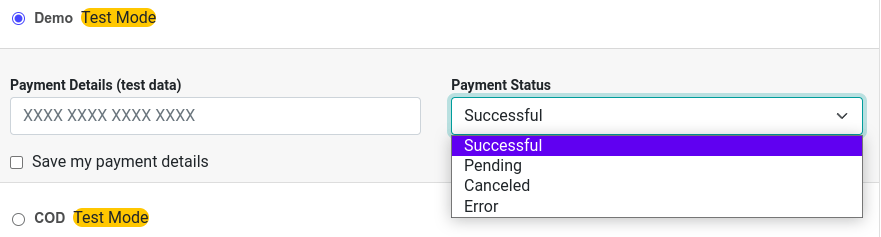
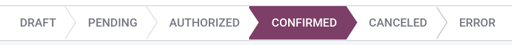

# Demo

Odoo's **Demo Payment Provider** allows you to test business flows involving online transactions
without requiring real banking credentials.

## Cấu hình

#### SEE ALSO
[Enabling a payment provider](applications/finance/payment_providers.md#payment-providers-add-new)

#### IMPORTANT
Switch the state to Test Mode.

## Payment outcome

Upon checkout or when paying a bill online, you can choose the payment outcome when using the demo
payment provider. To do so, click on the Payment Status drop-down menu and select the
desired outcome.

## Transaction state

If you selected Pending as **payment outcome**, you can change the state of the
transaction straight from its form view. To access a transaction's form view, activate the
[developer mode](applications/general/developer_mode.md#developer-mode), and go to Accounting / Website ‣
Configuration ‣ Payment Transactions. Then, change the status of a transaction by clicking on the
state bar (Draft, Pending, Authorized, Confirmed, Canceled, Error).

