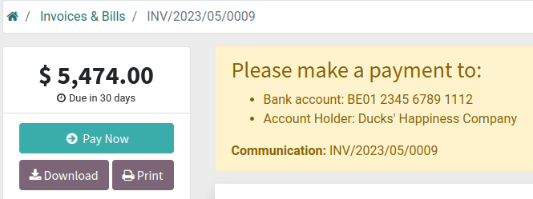
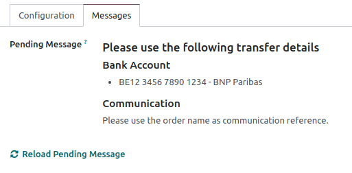

# Chuyển khoản ngân hàng

The **Wire transfer** payment method allows you to provide payment instructions to your customers,
such as the bank details and communication. They are displayed:

- at the end of the checkout process, once the customer has selected Wire transfer as a
  payment method and clicked the Pay now button:
  
- on the customer portal:
  

#### NOTE
- While this method is very accessible and requires minimal setup, it is very inefficient
  process-wise. We recommend setting up a [payment provider](applications/finance/payment_providers.md) instead.
- Online orders remain in the Quotation sent (i.e., unpaid order) stage until you
  receive the payment and Confirm the order.

## Cấu hình

To configure **Wire Transfer**, go to Accounting / Website ‣ Configuration ‣
Payment Providers, and open the Wire Transfer card. Then, in the
Configuration tab:

- Select the Communication to be used;
  - Based on Document Reference: sales order or invoice number
  - Based on Customer ID: customer identifier
- Tick the Enable QR codes check box to activate [QR code payments](applications/finance/accounting/customer_invoices/epc_qr_code.md).

Define the payment instructions in the Messages tab:

If you have already defined [a bank account](applications/finance/accounting/bank.md), the account number will be
automatically added to the default message generated by Odoo. You can also add it afterwards and
update the message by clicking Reload pending message.

#### SEE ALSO
[Payment journal](applications/finance/payment_providers.md#payment-providers-journal)
