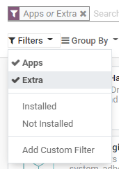

# Ứng dụng và phân hệ

You can [install](#general-install), [upgrade](#general-upgrade) and [uninstall](#general-uninstall) all apps and modules from the Apps dashboard.

By default, an *Apps* filter is applied. If you want to search for modules, click on
*Filters* and select *Extra*.

#### WARNING
Odoo is *not a smartphone*, and its apps shouldn't be installed or uninstalled carelessly. Apply
caution when adding or removing apps and modules on your database since this may impact your
subscription costs.

- **Installing or uninstalling apps and managing users is up to you.**
   
  As the administrator of your database, you are responsible for its usage, as you know best
  how your organization works.
   
- **Odoo apps have dependencies.**
   
  Installing some apps and features with dependencies may also install additional apps and
  modules that are technically required, even if you won't actively use them.
   
- **Test app installation/removal on a duplicate of your database.**
   
  This way, you can know what app dependencies may be required or what data may be erased.
   

## Install apps and modules

Go to Apps, and click on the *Install* button of the app you want to install.

#### NOTE
If the module you are looking for is not listed, you can **update the app list**.

To do so, activate the [developer mode](developer_mode.md#developer-mode), then go to Apps
‣ Update Apps List and click on *Update*.

## Upgrade apps and modules

On some occasions, new improvements or app features are added to [supported versions of Odoo](../../administration/supported_versions.md). To be able to use them, you must **upgrade** your app.

Go to Apps, click on the *dropdown menu* of the app you want to upgrade, then on
*Upgrade*.

## Uninstall apps and modules

Go to Apps, click on the *dropdown menu* of the app you want to uninstall, then on
*Uninstall*.

Some apps have dependencies, meaning that one app requires another. Therefore, uninstalling one app
may uninstall multiple apps and modules. Odoo warns you which dependent apps and modules are
affected by it.

To complete the uninstallation, click on *Confirm*.
