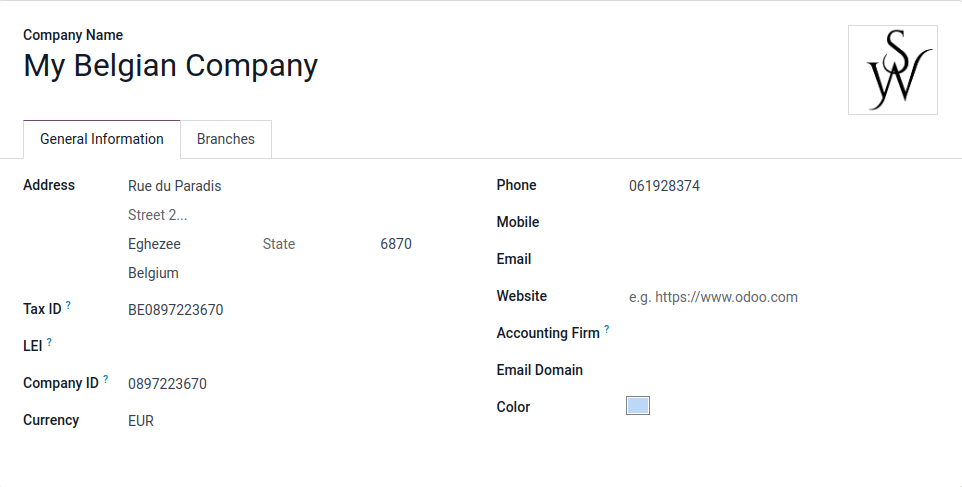
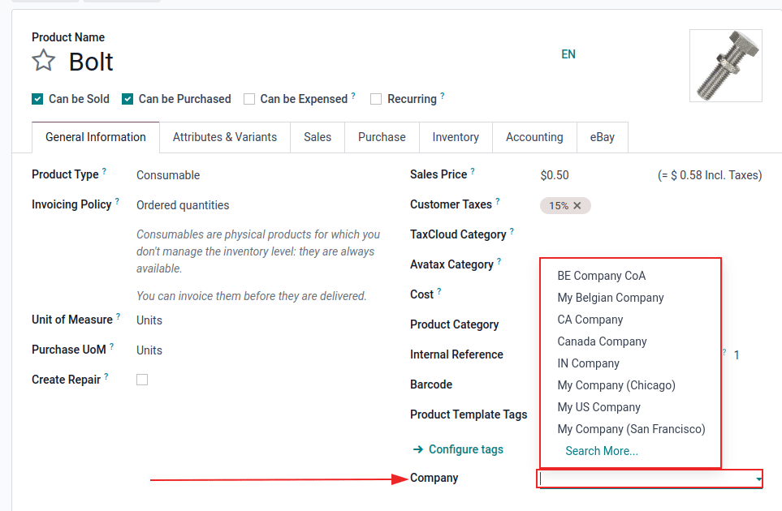
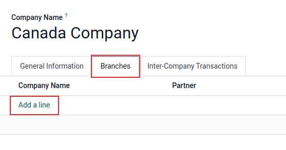
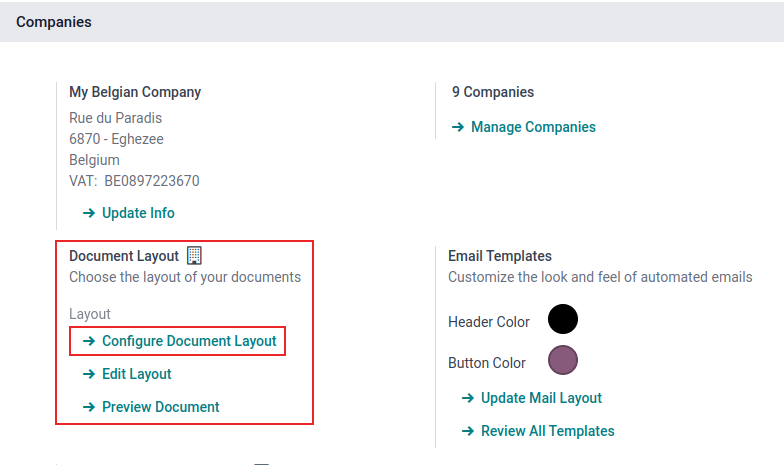
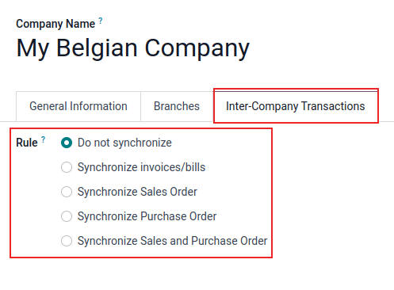

# Công ty

A centralized management environment allows an administrator to select multiple companies
simultaneously, and set their specific warehouses, customers, equipment, and contacts. It provides
the ability to generate reports of aggregated figures without switching interfaces, which
facilitates daily tasks, and enhances the overall management process.

#### WARNING
Enabling multi-company functionality in an Odoo database on a *Standard* plan automatically
triggers an upsell to the *Custom* plan. This does not apply to databases on the *One-App Free*
plan.

- **For yearly or multi-year contracts**: An upsell order is created with a 30-day limit.
- **For monthly contracts**: The subscription automatically switches to the *Custom* plan and
  the new rate is applied when the next bill is generated.

For more information, refer to [Odoo's pricing page](https://www.odoo.com/pricing-plan) or
contact your account manager.

To create a new company, navigate to Settings app ‣ Companies section, and click
Manage Companies. Then, click New to create a new company.

Proceed to fill out the new company form that appears.

## Manage companies and records

Go to Settings app ‣ Companies section ‣ Manage Companies. Then, either click
New, and fill in the form with the company's information, or select a pre-existing
company to edit it.

### Chuyển đổi giữa các công ty

Chuyển đổi giữa (hoặc chọn) nhiều công ty, bằng cách nhấp vào tên công ty nằm ở góc ngoài cùng bên phải của thanh menu header, tại bất kỳ đâu trong cơ sở dữ liệu. Đánh dấu vào các ô chọn bên cạnh (các) tên công ty mong muốn để kích hoạt chúng. Công ty được tô sáng là môi trường hiện tại đang được sử dụng. Để chuyển đổi môi trường, hãy nhấp vào tên công ty mong muốn.

### Share records

Data (such as, products, contacts, and equipment) can be shared, or set to be shown for a specific
company only. To do so, on their forms, choose between:

- *A blank field*: the record is shared within all companies.
- *Adding a company*: the record is visible to users logged in to that specific company.

When an environment is selected from the top menu, along with an additional company, records are
shared between the two companies.

## Chi nhánh

Các chi nhánh có thể được thêm vào công ty bằng cách đi đến Ứng dụng Cài đặt ‣ Phần Công ty ‣ Quản lý công ty. Sau đó, chọn công ty mong muốn từ danh sách. Từ biểu mẫu chi tiết công ty, mở tab Chi nhánh. Để thêm chi nhánh, nhấp Thêm một dòng và điền vào biểu mẫu bật lên Tạo chi nhánh xuất hiện.

## Quyền truy cập của nhân viên

Once companies are created, manage the employees' [Access Rights](users/access_rights.md) for
*Multi Companies*.

To access the *Access Rights*, navigate to Settings app ‣ Users section ‣ Manage
Users.

From the Users page, select a user from the list to modify. Then, either change the
fields for Allowed Companies or Default Company.

Multiple companies can be set for Allowed Companies, and *only one* can be set as the
Default Company.

If an administrator has multiple companies activated on the database, and is editing a record, the
editing occurs on the record's related company.

When creating a record, the company taken into account is:

- The current company selected in the company selector, in the upper-right hand of the screen (the
  one that is highlighted/active)

**HOẶC**

- No company is set (because none is set on the product and contact forms, for example)

**HOẶC**

- The company set is the company linked to the document (the same as if a record is being edited)

## Định dạng tài liệu

To set document formats according to each company, *activate* and *select* the respective company,
and, under the Settings app ‣ Companies section, click on Configure
Document Layout and edit the information as needed.

Company Details can be edited on the document layout. By default, this field is
populated from the company information listed, when navigating here: Settings app
‣ Companies section ‣ Manage Companies, and select a company from the list.

## Giao dịch liên công ty

First, activate the [developer mode](developer_mode.md#developer-mode). Then, make sure each one of the
companies is properly set in relation to:

- [Chart of Accounts](../finance/accounting/get_started/chart_of_accounts.md)
- [Thuế](../finance/accounting/taxes.md)
- [Vị trí tài chính](../finance/accounting/taxes/fiscal_positions.md)
- [Sổ nhật ký](../finance/accounting/bank.md)
- [Bản địa hoá tài chính](../finance/fiscal_localizations.md)
- [Bảng giá](../sales/sales/products_prices/prices/pricing.md)

Next, navigate to Settings app ‣ Companies section ‣ Manage Companies. Then,
select the desired company from the list. On the company form, select the Inter-Company
Transactions tab, on the individual company's detail form.

With the respective company activated and selected, choose one of the following Rule
options:

- Do not synchronize: do not synchronize any inter-company transactions.
- Synchronized invoice/bills: generates a bill/invoice when a company confirms a
  bill/invoice for the selected company.
- Synchronize Sales Order: generates a drafted sales order using the selected company
  warehouse, when a sales order is confirmed for the selected company. If, instead of a drafted
  sales order, it should be validated, enable Automatic Validation.\*
- Synchronize Purchase Order: generates a drafted purchase order using the selected
  company warehouse, when a purchase order is confirmed for the selected company. If, instead of a
  drafted purchase order, it should be validated, enable Automatic Validation.\*
- Synchronize Sales and Purchase Order: generates a drafted purchase/sales order using
  the selected company warehouse, when a sales/purchase order is confirmed for the selected company.
  If, instead of a drafted purchase/sales order, it should be validated, enable Automatic
  Validation.\*

  \* The given option needs to be selected, so Automatic Validation appears in the
  configuration.

#### NOTE
Products **must** be configured as Can be sold and shared between the companies. See
[Loại sản phẩm](../inventory_and_mrp/inventory/product_management/configure/type.md).

#### SEE ALSO
- [Hướng dẫn về đa công ty](../../developer/howtos/company.md)
- [Hệ thống đa tiền tệ](../finance/accounting/get_started/multi_currency.md)

* [Digest emails](companies/digest_emails.md)
* [Mẫu Email](companies/email_template.md)
