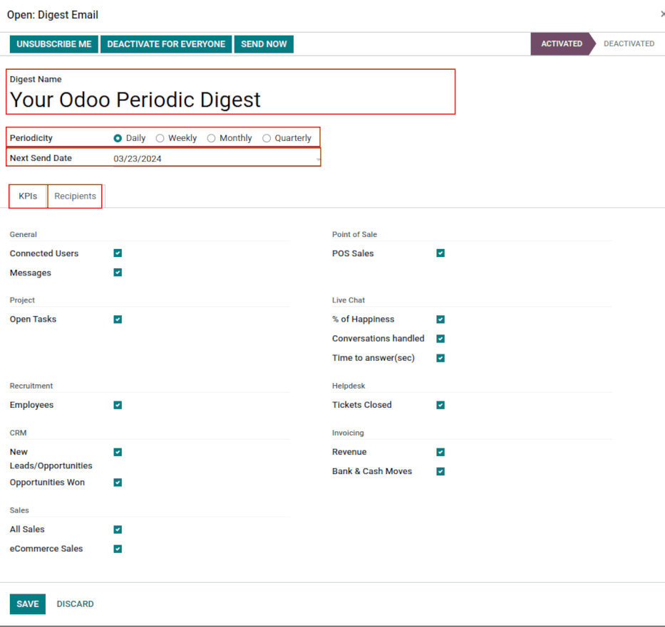

# Digest emails

*Digest Emails* are periodic snapshots sent via email to users in an organization that include
high-level information about how the business is performing.

To start sending digest emails, begin by navigating to Settings app ‣ Statistics
section, activate the Digest Emails feature, and click Save.

A variety of settings can be configured for digest emails, such as:

- Deciding which  are shared in the digest emails
- Determining how often digest emails are sent
- Choosing who in the organization receives digest emails
- Creating custom digest email templates
- Adding additional  (*Studio* app required)

#### NOTE
By default, the Digest Email feature is enabled. Your Odoo Periodic
Digest serves as the primary template, which includes all  measurements across the Odoo database, and is sent daily to administrators.

#### WARNING
When creating duplicates of databases that have sending capabilities (not testing-mode), the
digest emails continue to send from the duplicate database, unless deactivated.

To deactivate the digest email, navigate to Settings ‣ Statistics section.
Then, deactivate the Digest Emails feature, by un-ticking the checkbox, and clicking
Save. See the section on [Deactivate digest email](#digest-emails-deactivate).

## Customize default digest email

To customize the default digest email (*Your Odoo Periodic Digest*), go to Settings
app ‣ Statistics section ‣ Digest Email field. Then, select Your Odoo Periodic
Digest, and click on the ↗️ (External link) icon, next to the drop-down menu selection.

A pop-up window appears, and presents a variety of editable settings, which include:

- Digest Name: the name of the digest email.
- Periodicity: control how often digest emails are sent (Daily,
  Weekly, Monthly, or Quarterly).
- Next Send Date: the date on which the digest email will be sent again.
- KPIs tab: check/uncheck each calculated  that
  appears in digest emails. A ticked box indicates an active 
  in the digest email. See the section on [KPI](#digest-emails-kpis).
- Recipients tab: add/remove users who receive the digest emails. See the section on
  [Người nhận](#digest-emails-recipients).

#### NOTE
The  can be customized using Odoo *Studio*. Additional
costs to the database subscription are incurred should *Studio* need to be installed. See this
section on [Custom KPIs with Odoo Studio](#digest-emails-custom-kpi).

## Deactivate digest email

To manually deactivate an individual digest email, first navigate to Settings app
‣ Statistics section, and click Configure Digest Emails. Then, select the desired
digest email from the list that should be deactivated.

Next, click DEACTIVATE FOR EVERYONE to deactivate the digest email for everyone, or
UNSUBSCRIBE ME to remove the logged in user from the mailing list. These buttons are
located in the top menu, just above the Digest Name.

## Manually send digest email

To manually send a digest email, first navigate to Settings app ‣ Statistics
section, and click Configure Digest Emails. Then, select the desired digest email, and
click SEND NOW. This button is located in the top menu, just above the Digest
Name.

## KPI

Pre-configured  can be added to the digest email from the
KPIs tab of the digest email template form.

First, navigate to Settings app ‣ Statistics section, and click
Configure Digest Emails.

Then, select the desired digest email, and open the KPIs tab.

To add a  to the digest email, tick the checkbox next to the
desired . After all 
are added (or deselected), click Save.

The following  are available in the KPIs tab on
a digest email template form out-of-box in Odoo:

General
: - Người dùng đã kết nối
  - Messages

Dự án
: - Open Tasks

Tuyển dụng
: - Nhân viên

CRM
: - Cơ hội/lead mới
  - Opportunities Won

Bán hàng
: - All Sales
  - Bán hàng thương mại điện tử

Điểm bán hàng
: - Bán hàng POS

Trò chuyện trực tiếp
: - % hài lòng
  - Conversations handled
  - Time to answer (sec)

Hỗ trợ
: - Tickets Closed

Hoá đơn
: - Doanh thu
  - Banks and Cash Moves

## Người nhận

Digest email recipients are added from the Recipients tab of the digest email template
form.

To add a recipient, navigate to Settings app ‣ Statistics section, and click
Configure Digest Emails. Then, select the desired digest email, and open the
Recipients tab.

To add a recipient, click Add a line, and an Add Recipients pop-up window
appears, with all available users to add as recipients.

From the pop-up window, tick the checkbox next to the Name of the user(s), and click the
Select button.

To remove a user as a recipient, click the ❌ (remove) icon to the far-right of the user
listed in the Recipients tab.

Click Save to implement the changes.

## Create digest emails

To create a new digest email, navigate to Settings app ‣ Statistics section, and
click Configure Digest Emails. Then, click Create to create a new digest
email.

A separate page, with a blank digest email template appears, and presents a variety of editable
settings, including:

- Digest Name: the name of the digest email.
- Periodicity: control how often digest emails are sent (Daily,
  Weekly, Monthly, or Quarterly).
- Next Send Date: the date on which the digest email will be sent again.
- KPIs tab: check/uncheck each calculated  that
  appears in digest emails. A ticked box indicates an active 
  in the digest email. See the section on [KPI](#digest-emails-kpis).
- Recipients tab: add/remove users who receive the digest emails. See the section on
  [Người nhận](#digest-emails-recipients).

From there, give the digest email a Digest Name, specify Periodicity,
choose the desired , and add Recipients, as
needed.

After clicking Save, the new custom digest email is available as a selection in the
Digest Email field, located in the Settings app ‣ Statistics section.

## Custom KPIs with Odoo Studio

The  on a digest email template form, in the
KPIs tab, can be customized using Odoo *Studio*.

#### WARNING
Additional costs to the database subscription are incurred, should Odoo *Studio* need to be
installed.

To begin, click the 🛠️ (tools) icon in the top-right of the screen. This is the link to
the Odoo *Studio* application.

In order to create additional fields, create two fields on the digest object:

1. Create a boolean field called `kpi_myfield`, and display it in the KPIs tab.
2. Create a computed field called `kpi_myfield_value` that computes the customized .
3. Select the  in the KPIs tab.

#### SEE ALSO
Users can also click the Recipients tab, and then the vertical three-dot
(kebab) menu to edit this view. Either click EDIT LIST VIEW or
EDIT FORM VIEW to modify this tab.

### Computed values reference table

| LABEL                         | GIÁ TRỊ                                   |
|-------------------------------|-------------------------------------------|
| Người dùng đã kết nối         | `kpi_res_users_connected_value`           |
| Đã gửi tin nhắn               | `kpi_mail_message_total_value`            |
| Lead mới                      | `kpi_crm_lead_created_value`              |
| Các cơ hội đạt được           | `kpi_crm_opportunities_won_value`         |
| Mở nhiệm vụ                   | `kpi_project_task_opened_value`           |
| Phiếu hỗ trợ đã đóng          | `kpi_helpdesk_tickets_closed_value`       |
| % of Happiness                | `kpi_livechat_rating_value`               |
| Conversations handled         | `kpi_livechat_conversations_value`        |
| Time to answer (sec)          | `kpi_livechat_response_value`             |
| Tất cả đơn bán hàng           | `kpi_all_sale_total_value`                |
| Bán hàng thương mại điện tử   | `kpi_website_sale_total_value`            |
| Doanh thu                     | `kpi_account_total_revenue_value`         |
| Bút toán ngân hàng & tiền mặt | `kpi_account_bank_cash_value`             |
| Bán hàng POS                  | `kpi_pos_total_value`                     |
| Nhân viên mới                 | `kpi_hr_recruitment_new_colleagues_value` |
