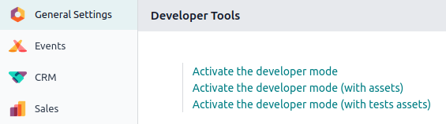
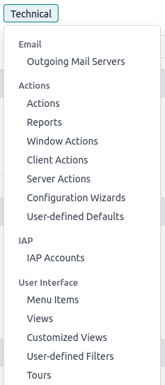

# Chế độ lập trình viên (chế độ gỡ lỗi)

The developer mode, also known as debug mode, unlocks access to advanced [tools and settings](#developer-mode-tools) in Odoo.

#### WARNING
Proceed with caution, as some developer tools and technical settings are considered advanced and
may have associated risks. Only use them if you understand the implications and are confident in
your actions.

#### NOTE
The developer mode is also available with [assets](developer/reference/frontend/framework_overview.md#frontend-framework-assets-debug-mode),
which are used to debug JavaScript code, and with [tests assets](developer/reference/frontend/framework_overview.md#frontend-framework-tests-debug-mode), which are used to run test tours.

## Kích hoạt

To activate it, open the Settings app, scroll down to the Developer Tools
section, and click Activate the developer mode.

Once activated, the Deactivate the developer mode option becomes available.

To activate the developer mode **from anywhere in the database**, add `?debug=1` to the URL after
`/web` (e.g., `https://example.odoo.com/web?debug=1#action=menu&cids=1`). To deactivate it, use
`?debug=0` instead.

Use `?debug=assets` to activate the developer mode with assets and `?debug=tests` to activate it
with tests assets.

## Developer tools and technical menu

Once the developer mode is activated, the developer tools can be accessed by clicking the
<i class="fa fa-bug"></i> (bug) icon. The menu contains tools useful for understanding or editing
technical data, such as a view's field, filters, or actions. The options available depend on where
the menu is accessed from.

Database administrators can access the technical menu from the Settings app. It contains
advanced database settings, such as ones related to the database structure, security, actions, etc.

