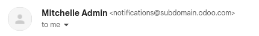

# Connect Microsoft Outlook 365 to Odoo using Azure OAuth

Odoo tương thích với Azure OAuth của Microsoft dành cho Microsoft 365. Để có thể gửi và nhận email bảo mật từ một tên miền tùy chỉnh, bạn chỉ cần cấu hình một vài thiết lập trên nền tảng Azure và trong back end của cơ sở dữ liệu Odoo. Cấu hình này hoạt động với cả địa chỉ email cá nhân hoặc địa chỉ được tạo từ miền tùy chỉnh.

#### SEE ALSO
[Microsoft Learn: Register an application with the Microsoft identity platform](https://learn.microsoft.com/azure/active-directory/develop/quickstart-register-app)

#### SEE ALSO
- [Microsoft Azure sign-in authentication](../users/azure.md)
- [Outlook Calendar synchronization](../../productivity/calendar/outlook.md)

## Setup in Microsoft Azure Portal

### Tạo một ứng dụng mới

Để bắt đầu, truy cập [Cổng thông tin Azure của Microsoft](https://portal.azure.com/). Đăng nhập bằng tài khoản Microsoft Outlook Office 365 nếu có, nếu không thì đăng nhập bằng tài khoản Microsoft cá nhân. Người dùng có quyền truy cập quản trị vào Cài đặt Azure sẽ cần kết nối và thực hiện cấu hình sau. Tiếp theo, đi đến phần có nhãn Quản lý Microsoft Entra ID (trước đây là *Azure Active Directory*).

Now, click on Add (+), located in the top menu, and then select App
registration. On the Register an application screen, rename the Name to
`Odoo` or something recognizable. Under the Supported account types section select
Accounts in any organizational directory (Any Microsoft Entra ID directory - Multitenant)
and personal Microsoft accounts (e.g. Skype, Xbox).

Under the Redirect URL section, select Web as the platform, and then input
`https://<web base url>/microsoft_outlook/confirm` in the URL field. The `web.base.url`
is subject to change depending on the URL used to log in to the database.

#### NOTE
The documentation about the [web.base.url](../../websites/website/configuration/domain_names.md#domain-name-web-base-url) explains how to freeze
a unique URL. It is also possible to add different redirect URLs on the Microsoft app.

After the URL has been added to the field, Register the application, so it is created.

### Quyền API

Tiếp theo cần thiết lập Quyền API. Odoo sẽ cần các quyền API cụ thể để có thể đọc (IMAP) và gửi (SMTP) email trong thiết lập Microsoft 365. Đầu tiên, nhấp vào liên kết Quyền API trong thanh menu bên trái. Sau đó, nhấp nút (+) Thêm quyền và chọn Microsoft Graph trong mục API Microsoft thường dùng. Tiếp theo, chọn tùy chọn Quyền ủy quyền.

In the search bar, search for the following Delegated permissions and click
Add permissions for each one:

- SMTP.Send
- IMAP.AccessAsUser.All

#### NOTE
The User.Read permission will be added by default.

## Assign users and groups

After adding the API permissions, navigate back to the Overview of the
Application in the top of the left sidebar menu.

Now, add users to this application. Under the Essentials overview table, click on the
link labeled Managed Application in Local Directory, or the last option on the bottom
right-hand side of the table.

In the left sidebar menu, select Users and Groups. Next, click on (+) Add
User/Group. Depending on the account, either a Group and a User can be
added, or only Users. Personal accounts will only allow for Users to be
added.

Under Users or Groups, click on None Selected and add the users
or group of users that will be sending emails from the Microsoft account in Odoo.
Add the users/groups, click Select, and then Assign them to the
application.

### Create credentials

Sau khi đã thiết lập ứng dụng Microsoft Azure, cần tạo thông tin xác thực để cài đặt Odoo. Các thông tin này bao gồm ID máy khách và Mã bí mật của máy khách. Để bắt đầu, bạn có thể sao chép ID máy khách từ trang Tổng quan của ứng dụng. ID máy khách hoặc ID ứng dụng nằm dưới mục Tên hiển thị trong phần Cơ bản của trang tổng quan ứng dụng.

Next, the Client Secret Value needs to be retrieved. To get this value, click on
Certificates & Secrets in the left sidebar menu. Then, a Client Secret
needs to be produced. In order to do this, click on the (+) New Client Secret button.

A window on the right will populate with a button labeled Add a client secret. Under
Description, type in `Odoo Fetchmail` or something recognizable, and then set the
expiration date.

#### IMPORTANT
A new Client Secret will need to be produced and configured if the first one
expires. In this event, there could be an interruption of service, so the expiration date should
be noted and set to the furthest possible date.

Next, click on Add when these two values are entered. A Client Secret Value
and Secret ID will be created. It is important to copy the Value or
Client Secret Value into a notepad as it will become encrypted after leaving this page.
The Secret ID is not needed.

After these steps, the following items should be ready to be set up in Odoo:

- A client ID (Client ID or Application ID)
- A client secret (Value or Client Secret Value)

This completes the setup on the Microsoft Azure Portal side.

## Thiết lập trong Odoo

### Enter Microsoft Outlook credentials

First, open the Odoo database and navigate to the Apps module. Then, remove the
Apps filter from the search bar and type in `Outlook`. After that, install the module
called Microsoft Outlook.

Next, navigate to Settings ‣ General Settings, and under the Discuss
section, ensure that the checkbox for Custom Email Servers is checked. This populates
a new option for Outlook Credentials.

Save the progress.

Then, copy and paste the Client ID (Application ID) and Client Secret
(Client Secret Value) into the respective fields and Save the settings.

### Configure outgoing email server

On the General Settings page, under the Custom Email Servers setting,
click the Outgoing Email Servers link to configure the Microsoft account.

Then, create a new email server and check the box for Outlook. Next, fill in the
Name (it can be anything) and the Microsoft Outlook email Username.

If the From Filter field is empty, enter either a [domain or email address](email_servers_outbound.md#email-outbound-unique-address).

Then, click on Connect your Outlook account.

A new window from Microsoft opens to complete the authorization process. Select the
appropriate email address that is being configured in Odoo.

Then, allow Odoo to access the Microsoft account by clicking on Yes. After this, the
page will navigate back to the newly configured Outgoing Mail Server in Odoo. The
configuration automatically loads the token in Odoo, and a tag stating
Outlook Token Valid appears in green.

Finally, click Test Connection. A confirmation message should appear. The Odoo database
can now send safe, secure emails through Microsoft Outlook using OAuth authentication.

#### Configuration with a single outgoing mail server

Configuring a single outgoing server is the simplest configuration available for Microsoft Azure
and it doesn't require extensive access rights for the users in the database.

A generic email address would be used to send emails for all users within the database. For example
it could be structured with a `notifications` alias (`notifications@example.com`) or `contact` alias
(`contact@example.com`). This address must be set as the FROM Filtering on the server.
This address must also match the `{mail.default.from}@{mail.catchall.domain}` key combination in the
system parameters.

#### SEE ALSO
Visit the [From Filtering documentation](email_servers_outbound.md#email-outbound-different-servers-personalized-from-filtering) for more
information.

#### NOTE
The System Parameters can be accessed by activating [Chế độ lập trình viên (chế độ gỡ lỗi)](../developer_mode.md#developer-mode) in the
Settings ‣ Technical ‣ Parameters ‣ System Parameters menu.

When using this configuration, every email that is sent from the database will use the address of
the configured `notification` mailbox. However it should be noted that the name of the sender will
appear but their email address will change:

#### User-specific (multiple user) configuration

In addition to a generic email server, individual email servers can be set up for users in a
database. These email addresses must be set as the FROM Filtering on each individual
server for this configuration to work.

This configuration is the more difficult of the two Microsoft Azure configurations, in that it
requires all users configured with email servers to have access rights to settings in order to
establish a connection to the email server.

##### Thiết lập

Each user should have a separate email server set up. The FROM Filtering should be set
so that only the user's email is sent from that server. In other words, only a user with an email
address that matches the set FROM Filtering is able to use this server.

#### SEE ALSO
Visit the [From Filtering documentation](email_servers_outbound.md#email-outbound-different-servers-personalized-from-filtering) for more
information.

A [fallback server](#azure-oauth-notifications) must be setup to allow for the sending of
notifications. The FROM Filtering for this server should have the value of
the `{mail.default.from}@{mail.catchall.domain}`.

#### NOTE
The System Parameters can be accessed by activating [Chế độ lập trình viên (chế độ gỡ lỗi)](../developer_mode.md#developer-mode) in the
Settings ‣ Technical ‣ Parameters ‣ System Parameters menu.

#### IMPORTANT
The configuration for this transactional email server can work alongside an outgoing mass-mailing
email server. The FROM Filtering for the mass-mailing email server can remain empty,
but it's require to be added in the settings of the *Email Marketing* application.

#### SEE ALSO
For more information on setting the mass-mailing email server visit
[Sending emails with an external SMTP server](email_servers_outbound.md#email-outbound-custom-domain-smtp-server).

### Configure incoming email server

Tài khoản email đến phải được cấu hình theo cách tương tự như tài khoản email đi. Đi đến Máy chủ thư đến trong Menu kỹ thuật và Tạo cấu hình mới. Đánh dấu hoặc Chọn nút bên cạnh Xác minh Oauth Outlook và nhập Tên người dùng Microsoft Outlook. Nhấp vào Kết nối tài khoản Outlook của bạn. Odoo sẽ thông báo: Token Outlook hợp lệ. Bây giờ, hãy Kiểm tra và xác nhận tài khoản. Tài khoản sẽ sẵn sàng nhận email đến cơ sở dữ liệu Odoo.
