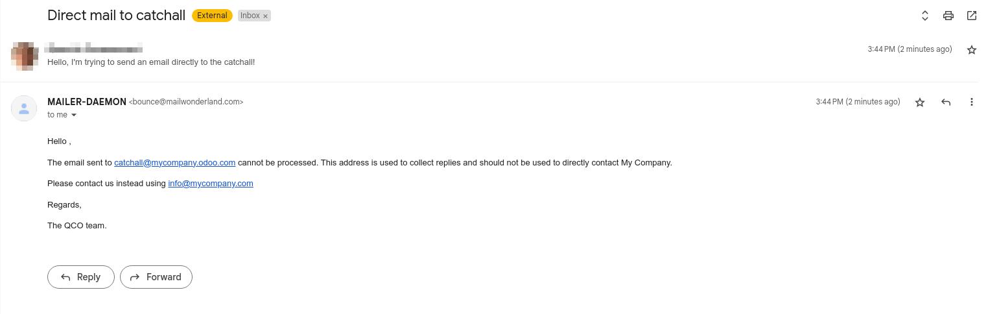
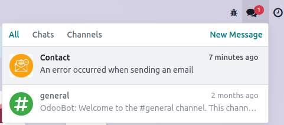
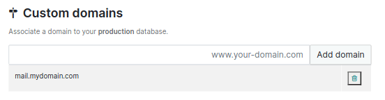
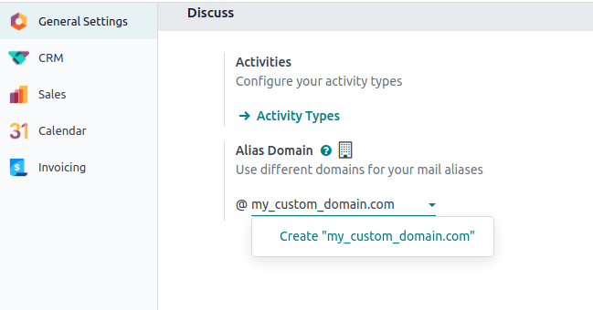
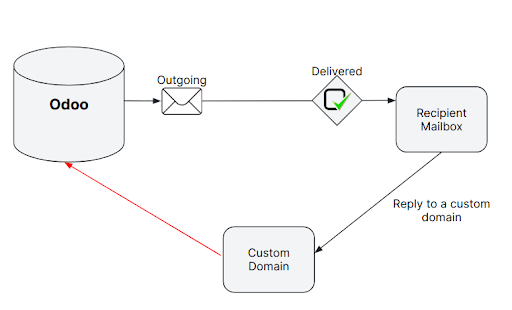
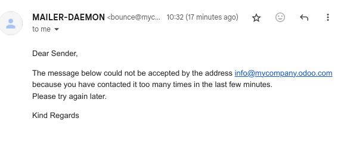
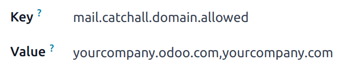

# Manage inbound messages

An inbound message is an email delivered to an Odoo database. Anyone can send an email to an email
alias created in the database or reply to an email that was previously sent from the database based
on the *reply-to* header.

## Bí danh email

### Model specific aliases

Some applications have their specific aliases (sales teams, helpdesk teams, projects, etc.). These
aliases are used to:

- Create a record when an email is sent directly to the alias,
- Receive replies to an email initially sent from a record.

### Nhận tất cả

If an application does not have an alias, a generic fallback alias is used: the catchall. An email
sent from a chatter has a reply address set to this catchall alias. A reply sent to the catchall is
posted to the right chatter thanks to the *message-id* header.

By default, the local-part *catchall* will be used. Enable [Chế độ lập trình viên (chế độ gỡ lỗi)](../developer_mode.md#developer-mode) and go to
Settings ‣ Technical ‣ Emails: Alias Domains to access the configuration.

An email to the catchall always needs to be a reply to a previous email sent from the database. If
an email is sent directly to the catchall, the sender will receive the following message:

#### NOTE
Địa chỉ email `info@company-name.com` hiển thị trong ảnh chụp màn hình trên là địa chỉ email được thiết lập cho công ty. Khi bật chế độ nhà phát triển trên hồ sơ công ty, các tùy chọn cấu hình bổ sung (chẳng hạn như nhận tất cả và trả về) sẽ hiển thị. Có thể chỉnh sửa bằng cách nhấp vào liên kết nội bộ của Miền email. Thông thường, không nên thay đổi các tùy chọn này trừ khi có nhu cầu cụ thể, vì điều đó sẽ ảnh hưởng đến tất cả các phản hồi đối với email đã gửi trước đó.

#### NOTE
It is advised to keep the local-part of the catchall and the bounce unchanged. If this value is
modified, previous emails sent from the database will still have the previous local-part values.
This could lead to replies not being correctly received in the database.

### Trả về

In the same way the catchall alias is used to build the reply address, the bounce alias is used to
build the *return-path* of the email. The *return-path* is used when emails cannot be delivered to
the recipient and an error is returned to the sender.

By default the name *bounce* will be used. Enable [Chế độ lập trình viên (chế độ gỡ lỗi)](../developer_mode.md#developer-mode) and go to
Settings ‣ Technical ‣ Emails: Alias Domains to access the configuration.

#### NOTE
On Odoo Online, when using the default outgoing email server, the return-path address is forced
to the value `bounce@company-name.odoo.com` independently of the value set as bounce alias.

When an error occurs, a notification is received and displayed in a red envelope in the chatter. In
some cases, the red envelope can just contain a `no error` message, meaning there is an error that
could not be handled by Odoo.

A notification will also be displayed in the Discuss icon on the navigation bar.

## Receive emails with Odoo's default configuration

On **Odoo Online** and **Odoo.sh**, the email alias, reply, and bounce addresses are pre-configured.
These addresses use the alias domain automatically added to a standard database.

The database domain is ready to be used to receive emails without any additional configuration.

## Use multiple Odoo subdomains

On **Odoo Online**, the only Odoo subdomain is the one defined at the database creation.

On **Odoo.sh**, it is possible to use several Odoo subdomains. In the settings of the branch,
additional Odoo subdomains can be added as long as they are not used yet in another branch. These
domains must then be added to the alias domains to be used by a company.

## Use a custom domain for inbound messages

The [alias domain](email_servers_outbound.md#email-outbound-alias-domain) must be selected in the general
settings. If you have multiple companies, each one must be configured.

All the aliases will use this custom domain. Replies on models for which an alias is configured
are done to `[alias]@my-custom-domain.com`. Replies to other models are sent to the catchall through
`catchall@my-custom-domain.com`.

#### IMPORTANT
If emails are sent using Odoo's email servers while using a custom domain, follow the
["Using a custom domain with Odoo’s email server" instructions](email_servers_outbound.md#email-outbound-custom-domain-odoo-server).

Vì đang sử dụng miền tùy chỉnh này, nên tất cả email sử dụng bí danh( bao gồm email phản hồi, trả lại, và gửi trực tiếp) đều được gửi đến một địa chỉ thuộc miền đó. Do đó, các email này sẽ được chuyển đến máy chủ email được liên kết với miền (bản ghi MX). Để các email này hiển thị trong cửa sổ trò chuyện hoặc được dùng để tạo bản ghi mới, cần phải truy xuất các email đến trong cơ sở dữ liệu Odoo.

| Phương thức                                                           | Quyền lợi                                                                                                         | Drawbacks                                                                                                                             |
|-----------------------------------------------------------------------|-------------------------------------------------------------------------------------------------------------------|---------------------------------------------------------------------------------------------------------------------------------------|
| [Redirections](#email-inbound-custom-domain-redirections)             | Easy to set up, emails are directly sent to the database.                                                         | Each alias of a database needs to be configured.                                                                                      |
| [Incoming mail servers](#email-inbound-custom-domain-incoming-server) | Allows to keep a copy of the email in your mailbox (with IMAP). Allows to create records in the chosen model. | Depends on a CRON, meaning emails are not retrieved immediately in the database. Each alias of a database needs to be configured. |
| [MX record](#email-inbound-custom-domain-mx)                          | Only one record needs to be created to make all aliases work properly.                                            | Using a subdomain is required. Requires advanced technical knowledge.                                                             |

#### IMPORTANT
For **on-premise databases**, the redirection and the MX record methods also require configuring
the [mail gateway script](../../../administration/on_premise/email_gateway.md). Going
through this script requires **advanced technical and infrastructure knowledge**.

#### IMPORTANT
Refer to your provider’s documentation for more detailed information on how to handle the methods
detailed below.

### Redirections

If the database is hosted on **Odoo Online** or **Odoo.sh**, using redirections is recommended. They
allow messages to be received without delay in the database.

It is mandatory to redirect the catchall and bounce address to the Odoo subdomain of the database.
Every other alias used must be redirected as well.

#### IMPORTANT
Some providers ask to validate the redirection by sending a link to the target email address.
This procedure is an issue for catchall and bounce since they are not used to create records.

1. Modify the catchall value on the mail alias domain. [Chế độ lập trình viên (chế độ gỡ lỗi)](../developer_mode.md#developer-mode) must be enabled to
   access this menu. For example, it can be changed from `catchall` to `temp-catchall`. This will
   allow to use `catchall` as the local-part of another alias.
2. Open an app that uses an alias. For example, CRM contains aliases for each sales team. Set
   `catchall` as the local-part of the alias of a sales team.
3. The validation email will create a record in the CRM app. The email sent will be visible in
   the chatter, allowing you to validate the redirection.
4. Do not forget to change back the alias of the sales team and the catchall value on the mail
   alias domain, just as they were before this procedure.

#### NOTE
An alternative to redirections is **forwarding**. With forwarding, **the address forwarding the
email will be identified as the sender**, while with redirections, the original sender will
always remain.

### Incoming mail servers

Như đã đề cập trước đó, sử dụng chuyển hướng là phương pháp được khuyến nghị để nhận email trong Odoo. Tuy nhiên, bạn cũng có thể thiết lập máy chủ thư đến. Sử dụng phương pháp này có nghĩa là tạo một máy chủ thư đến cho mỗi hộp thư trên máy chủ của bạn, bao gồm nhận tất cả, trả về và mọi bí danh của cơ sở dữ liệu, để thu thập tất cả các email đến. Máy chủ thư đến được tạo bằng cách vào Cài đặt ‣ Kỹ thuật ‣ Email: Máy chủ thư đến.

#### IMPORTANT
We recommend using the IMAP protocol over the POP protocol, as IMAP fetches all unread emails,
while POP fetches all the emails' history and then tags them as deleted in your mailbox.

Regardless of the protocol chosen, emails are fetched using the *Mail: Fetchmail Service* scheduled
action.

Additionally, using an incoming mail server in Odoo gives the opportunity to create new records in a
specified model. Each incoming mail server can create records in a different model.

### Bản ghi MX

A third option is to create a MX record in your DNS zone which specifies the mail server managing
emails sent to your domain. **Advanced technical knowledge is required.**

#### IMPORTANT
This configuration only works with a subdomain on the Odoo Online or Odoo.sh infrastructure
(e.g., `@mail.mydomain.com`)

Below are presented some specifications depending on the hosting type:

Odoo Online

The custom subdomain must be added to your [Odoo Portal](../../websites/website/configuration/domain_names.md).

Odoo.sh

The custom subdomain must be added to the [settings of the project](../../../administration/odoo_sh/getting_started/settings.md):

## Infinite email loops

In some cases, infinite mailing loops can be created. Odoo provides some protection against such
loops, ensuring the same sender cannot send too many emails **that would create records** to an alias in
a specific time span.

By default, an email address can send up to 20 emails in 120 minutes. If more emails are sent, they
are blocked and the sender receives the following message:

To change the default behavior, enable [Chế độ lập trình viên (chế độ gỡ lỗi)](../developer_mode.md#developer-mode), then go to Settings
‣ Technical ‣ Parameters: System Parameters to add two parameters.

- For the first parameter, enter `mail.gateway.loop.minutes` as the Key and choose a
  number of minutes as the Value (`120` is the default behavior).
- For the second parameter, enter `mail.gateway.loop.threshold` as the Key and choose a
  number of emails as the Value (`20` is the default behavior).

#### IMPORTANT
These parameters are only used to prevent the creation of new records. They **do not prevent
replies** from being added to the chatter.

## Allow alias domain system parameter

Incoming aliases are set in the Odoo database to create records by receiving incoming emails. To
view aliases set in the Odoo database, first activate the [developer mode](../developer_mode.md#developer-mode).
Then, go to Settings app ‣ Technical ‣ Aliases.

The following system parameter, `mail.catchall.domain.allowed`, set with allowed alias domain
values, separated by commas, filters out correctly addressed emails to aliases. Setting the domains
for which the alias can create a ticket, lead, opportunity, etc., eliminates false positives where
email addresses with only the prefix alias, not the domain, are present.

In some instances, matches have been made in the Odoo database when an email is received with the
same alias prefix and a different domain on the incoming email address. This is true in the sender,
recipient, and  email addresses of an incoming email.

To add the `mail.catchall.domain.allowed` system parameter, first, activate the [developer mode](../developer_mode.md#developer-mode). Then, go to Settings app ‣ Technical ‣ System Parameters.
Click New. Then, type in `mail.catchall.domain.allowed` for the Key field.

Next, for the Value field, add the domains separated by commas. Manually
<i class="fa fa-cloud-upload"></i> (Save), and the system parameter takes immediate effect.

## Phát hiện gửi đến dựa trên phần cục bộ

When creating a new alias, there is an option to enable Local-part based incoming
detection. If enabled, Odoo only requires the local-part to match for routing an incoming email. If
this feature is turned off, Odoo requires the whole email address to match for routing an incoming
email.
