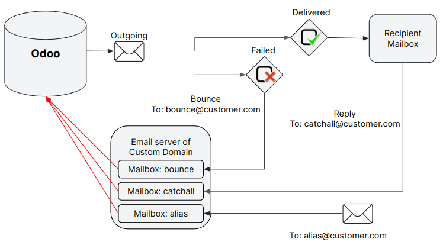

# Manage outbound messages

## Sending emails with Odoo's default configuration

On **Odoo Online** and **Odoo.sh**, sending and receiving emails works out of the box. No\
configuration is required.

When a database is created, the subdomain `company-name.odoo.com` is used to send and receive\
emails. The deliverability is optimized for this subdomain as it uses Odoo’s DNS configuration.

Emails are sent with `catchall@company-name.odoo.com` as the _reply-to_ address. In addition,\
delivery errors are sent to `bounce@company-name.odoo.com`.

#### NOTE

The catchall, bounce, and notification addresses do not work like other aliases. They do not have\
the vocation to create records in a database. Emails sent to an alias are automatically routed\
and will reply to an existing and linked record or will create a new one in the database.

## Using a custom domain to send emails

Cơ sở dữ liệu có thể được cấu hình để sử dụng tên miền tùy chỉnh, trong trường hợp này tất cả địa chỉ email mặc định sẽ được xây dựng bằng miền tùy chỉnh. Nếu miền tùy chỉnh là `company-name.com`, địa chỉ người gửi sẽ là `notifications@company-name.com`, địa chỉ _reply-to_ `catchall@company-name.com` và địa chỉ _bounce_ `bounce@company-name.com`. Tên miền tùy chỉnh có thể được sử dụng khi gửi email bằng máy chủ email của Odoo hoặc máy chủ bên ngoài.

This section assumes ownership of a custom domain. If not, a custom domain must be purchased from a\
domain registrar such as GoDaddy, Namecheap, or any alternative provider.

### Using a custom domain with Odoo’s email server

On **Odoo Online** or **Odoo.sh**, some configurations are mandatory in the custom domain's DNS to\
ensure good deliverability.

#### WARNING

Most of the configuration will be done on the domain provider’s side, and it might require some\
configuration on the mail server itself. **Some technical knowledge is required.**

The first step is to configure the [SPF](applications/general/email_communication/email_domain.md#email-domain-spf) and [DKIM](applications/general/email_communication/email_domain.md#email-domain-dkim)\
to be compliant with Odoo’s mail server.

Next, the custom domain must be set as the alias domain of a company. Select the company, open the\
Settings, and add the custom domain under the Alias Domain field.

After adding the alias domain, click the (internal link) icon to\
assign more companies to the custom domain if needed. Enable the [Chế độ lập trình viên (chế độ gỡ lỗi)](applications/general/developer_mode.md#developer-mode) mode to\
modify the default aliases if desired:

* Bounce Alias: the mailbox used to catch delivery errors and populate the [red\
  envelope](applications/general/email_communication/faq.md#email-issues-outgoing-delivery-failure) on the corresponding message.
* Catchall Alias: the default mailbox used to centralize all replies.
* Default From Alias: the default sender address.

#### NOTE

At the creation of the first alias domain, all companies will use it. If you create a new\
company, the alias domain automatically set is the one with the lowest priority (ad displayed on\
the alias domain list in [Chế độ lập trình viên (chế độ gỡ lỗi)](applications/general/developer_mode.md#developer-mode)).

All email aliases (e.g., related to CRM or Helpdesk teams) must have their corresponding mailbox in\
the custom domain mail server.

To receive emails in the Odoo database within the corresponding chatter (CRM, invoices, sales\
orders, etc.), one of these three methods must be used:

* [Redirections/forwarding](applications/general/email_communication/email_servers_inbound.md#email-inbound-custom-domain-redirections),
* [Incoming mail servers](applications/general/email_communication/email_servers_inbound.md#email-inbound-custom-domain-incoming-server),
* [MX record](applications/general/email_communication/email_servers_inbound.md#email-inbound-custom-domain-mx) (requires advanced technical knowledge)

Using a custom domain implies that specific [local-parts](email_servers_outbound.md#email-outbound-custom-domain-smtp-server-local-part) might be used by Odoo to send emails.

### Sending emails with an external SMTP server

#### NOTE

If utilizing your own outgoing mail server, it must be paired with your own domain, as updating\
the DNS of an Odoo subdomain is not feasible.

To add an external SMTP server in Odoo, open Settings, and enable the Use\
Custom Email Servers option found under the Discuss section.

Still under the Discuss section, click Outgoing Email Servers, then `New` to\
create an outgoing mail server record. Most fields are the common parameters used to set up a\
connection to an SMTP server; use the values provided by your email provider.

Once completed, click Test Connection. Note that a successful test connection does not\
confirm that the email will go out as some restriction might remain on the provider side, thus, it\
is recommended to consult your provider’s documentation.

#### Local-part values

Below are presented the different local-part values that can be used by Odoo to send emails. It\
might be required to whitelist them in your mail server:

* The Alias Domain Bounce Alias (default value = `bounce`),
* The Alias Domain Default From (default value = `notifications`),
* The default admin address `admin@company-name.odoo.com` or, if changed, the new value),
* The default Odoobot address `odoobot@company-name.odoo.com` or, if changed, the new value),
* The specific FROM defined on an email marketing campaign,
* The specific FROM that can be defined in an email template.

#### SEE ALSO

* [Connect Gmail to Odoo using Google OAuth](applications/general/email_communication/google_oauth.md)
* [Connect Microsoft Outlook 365 to Odoo using Azure OAuth](applications/general/email_communication/azure_oauth.md)

## Setting up different servers for transactional and mass emails

### Personalized mail servers

Transactional emails and mass mailings can be sent using separate email servers in Odoo. Doing so\
means day-to-day emails, quotations, or invoices sent to clients will be handled as _transactional_\
_emails_. _Mass mailing emails_, including the sending of batches of invoices or quotations, will be\
managed by the Marketing Automation or Email Marketing application.

Đầu tiên, kích hoạt chế độ lập trình viên và đi đến Cài đặt ‣ Kỹ thuật ‣ Email: Máy chủ thư đi. Tại đó, thêm hai bản ghi máy chủ thư đi, một cho máy chủ email giao dịch và một cho máy chủ email hàng loạt. Nhập giá trị Ưu tiên thấp hơn cho máy chủ giao dịch (VD: `1`) so với máy chủ gửi thư hàng loạt (VD: `2`) để các email giao dịch được ưu tiên.

Now, go to Email Marketing ‣ Configuration ‣ Settings, enable\
Dedicated Server, and select the appropriate email server. Odoo uses the server\
with the lowest priority value for transactional emails, and the server selected here for mass\
mailings.

#### FROM filtering

#### IMPORTANT

It’s **highly recommended** to configure the FROM Filtering on the outgoing mail servers as per\
the instructions of your provider.

The FROM Filtering field allows for the use of a specific outgoing email server\
depending on the _From_ email address or domain that Odoo is sending on behalf of. The **value must**\
**be a domain or a complete address** that matches the sender’s email address and is trusted on the\
outgoing mail server provider's side.

If FROM filtering is not used, emails will go out using the notification address.

#### WARNING

Some outgoing mail servers require a specific configuration of the FROM filter.

When an email is sent from Odoo, the following sequence is used to choose the outgoing email server:

* First, Odoo searches for a server that has the same FROM filtering value as the From value (i.e.,\
  email address) defined in the outgoing email. This configuration is ideal if all users of a\
  company share the same domain but have different local-parts.
* If no server is found based on the first criteria, Odoo looks for the first server\
  without a FROM filtering value set. The email will be overridden with the notification address.
* If no server is found based on the second criteria, Odoo uses the first server, and the email will\
  be overridden with the notification address.

#### NOTE

To determine which server is first, Odoo uses the priority value (the lower the value is, the\
higher the priority is). Failing to do so, the first server is determined by the servers' names,\
using alphabetical order.

It is also possible to use Odoo's mail server for transactional emails in addition to mass mailings.

### Using an external email server and Odoo’s default server

On Odoo Online and Odoo.sh, databases are started with Odoo's SMTP server. If no outgoing mail\
server is set, the default Odoo's SMTP server will be used.

 

#### NOTE

On Odoo Online, the command line interface is equivalent to the default Odoo mail\
server, using the same limit as if there was no outgoing mail server in place.

#### NOTE

On Odoo.sh, to use the command-line interface, an outgoing mail server can be configured on the\
configuration file.

#### WARNING

Odoo’s mail server is meant for transactional emails and small-scale marketing campaigns. The[daily limit](applications/general/email_communication/faq.md#email-issues-outgoing-delivery-failure-messages-limit) depends on the\
database type and the applications used.

## Using a custom domain with an external email server

Similar to the [previous chapter](email_servers_outbound.md#email-outbound-different-servers-external-odoo), proper\
configuration might be needed to ensure that the external email server is allowed to send emails\
using your custom domain. Refer to your provider’s documentation to properly set up the relevant\
records (SPF, DKIM, and DMARC). A list of the [most common providers is available](applications/general/email_communication/email_domain.md#email-domain-providers-documentation).

#### NOTE

Cấu hình DNS là bắt buộc khi bạn sử dụng miền riêng. Nếu sử dụng máy chủ thư đi bên ngoài, việc cấu hình các bản ghi như mô tả trong [tài liệu cấu hình DNS của Odoo cho máy chủ thư](applications/general/email_communication/email_domain.md) **sẽ không có hiệu lực như mong muốn**, vì nó hoạt động độc lập với Odoo khi sử dụng máy chủ email tùy chỉnh. Odoo không cho phép cấu hình miền phụ của Odoo.

## Hạn chế cổng

Port 25 is blocked for security reasons on Odoo Online and Odoo.sh. Try using port 465, 587, or 2525\
instead.

## Miền bí danh

The catchall domain is company-specific. By default, all companies share Odoo’s subdomain (e.g.,`company-name.odoo.com`), but each company may have its own custom email domain.

When the [Chế độ lập trình viên (chế độ gỡ lỗi)](applications/general/developer_mode.md#developer-mode) is activated, the alias domain options are available by going to\
Settings ‣ Technical ‣ Email: Alias Domains.

#### WARNING

Any modification of the alias domain must be done very carefully. If one of the aliases (bounce,\
catchall, default from) is changed, all previous emails that are not properly redirected to the\
new aliases will be lost.

The Default From Alias field can be filled with a local-part of the email address (by\
default `notifications`) or a full email address. Configure it to determine the `FROM` header of\
your emails. If a full email address is used, all outgoing emails will be overwritten with this\
address.

## Notification system

When an email is sent from the chatter, customers can reply directly to it. If a customer replies\
directly to an email, the answer is logged in the same chatter, thus functioning as a message thread\
related to the record.

Upon receiving the reply, Odoo then uses the subscribed followers (based on the subscribed subtypes)\
to send them a notification by email, or in the Odoo inbox, depending on the user’s preferences.

## Using a unique email address for all outgoing emails

To force the email address from which emails are sent, activate the [Chế độ lập trình viên (chế độ gỡ lỗi)](applications/general/developer_mode.md#developer-mode), and go to\
Settings ‣ Technical ‣ Email: Alias Domains. On the Default From\
Alias, use the the local-part or a complete email address as the value.

#### WARNING

If a **complete address** is used as the Default From Alias value, **all** outgoing\
emails will be overwritten by this address.
