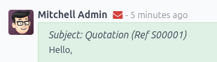
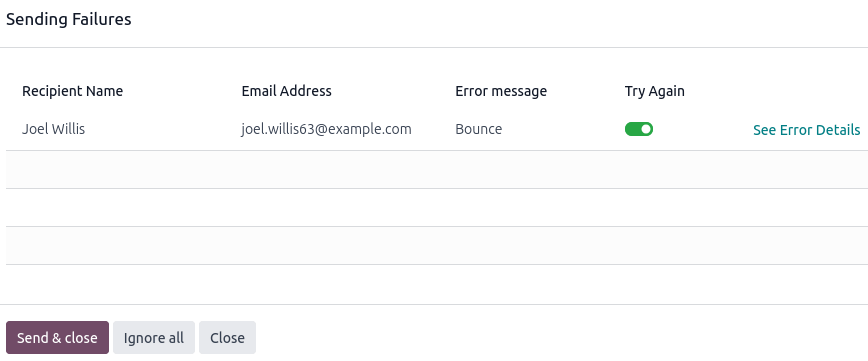
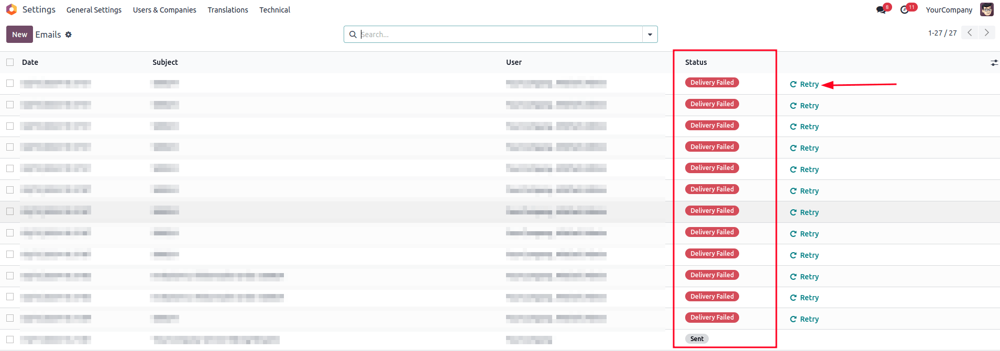

# Common emailing issues and solutions

This page lists the most common emailing issues and their solutions.

## Odoo is not an email provider

Odoo does not function like a classic email inbox, such as Gmail, Outlook, Yahoo, etc.

While Odoo uses emails as a way to notify and communicate with users/customers, it is, by design,
not a replacement for a dedicated email server. Therefore, it might not behave in the expected way
when compared to a traditional email inbox.

The main differences are the following:

- Theo mặc định, sau khi một thông báo hoặc email giao dịch (báo giá, hóa đơn, tin nhắn trực tiếp đến một liên hệ) được gửi thành công, đối tượng email sẽ bị xóa. Nội dung email sẽ được lưu trữ trong phần thảo luận của bản ghi liên quan. Điều này giúp tránh làm lộn xộn cơ sở dữ liệu với nhiều bản sao của cùng một nội dung email (khi gửi đến nhiều người nhận) nếu nội dung đó đã có sẵn trong cửa sổ trò chuyện.
- There is no concept of (blind) carbon copy ([B]CC). Odoo uses the concept of *followers* added to
  a chatter to automatically decide when and how [a contact is notified](email_servers_outbound.md#email-outbound-notifications) or receives a copy of an email.
- Các email đến sẽ được xử lý bằng cách kiểm tra xem địa chỉ email  *ĐẾN* có phải là địa chỉ hợp lệ trong cơ sở dữ liệu Odoo hay không, hoặc trong trường hợp là email trả lời, kiểm tra xem có tham chiếu trong tiêu đề email khớp với tin nhắn được gửi từ cơ sở dữ liệu Odoo hay không. Tất cả các email khác sẽ bị từ chối và **không** được tạm thời lưu trong thư mục spam hoặc kiểm dịch. Nói cách khác, mọi email không liên quan đến cơ sở dữ liệu Odoo sẽ bị mất.

## Email đi

### Changing the email address of the admin user account

When an Odoo database is created, the main admin account is assigned a placeholder email address. It
is recommended to **replace the admin email address** with a valid email address to prevent outgoing
email issues.

To do so, on the admin account, click the user icon, click My Profile (or
Preferences), and update the Email field found under the
Preferences tab. Either use any other email address or use your Odoo subdomain (e.g.,
`company-name.odoo.com`) and `admin` for the local-part (e.g., `admin@company-name.odoo.com`).

### Lỗi gửi

When a message is sent, an <i class="fa fa-envelope-o"></i> (envelope) icon is displayed in the
chatter. The icon turns red when delivery has failed for at least one recipient.

Left-click the envelope to display information about the delivery, and, if possible, the relevant
[error messages](#email-issues-outgoing-delivery-failure-messages).

Click See Error Details to get extra information for the fail reason, **if** Odoo was
able to process the original error or bounce email.

Click Send & close to retry sending the email to all **toggled-on**
(<i class="fa fa-toggle-on"></i>) recipients under the Try Again column. All **toggled-off**
(<i class="fa fa-toggle-off"></i>) recipients will be ignored.

Click Ignore all to ignore all currently failing emails and turn the envelope icon from
red to white.

Unsent emails also appear in the Odoo email queue. To access it, activate the [developer mode](../developer_mode.md#developer-mode) and go to Settings ‣ Technical ‣ Email: Emails.

Failed emails display the Delivery Failed status. Click Retry to put a
failed email in the email queue again. It will then appear with the Outgoing status. The
email will be sent again the next time the scheduled action for the email queue runs.

Optionally, queued emails can be sent immediately by clicking Send Now. Click
Cancel Email to remove it from the email queue.

#### NOTE
Sent emails are periodically cleaned from the queue. This is controlled by the *Auto-Vacuum*
scheduled action that cleans redundant data on your Odoo database.

#### Common error messages

##### Daily limit reached

Odoo giới hạn số lượng email có thể được gửi từ một cơ sở dữ liệu Odoo Online. Hầu hết các nhà cung cấp dịch vụ email (VD: Google, Yahoo,...) sẽ đưa địa chỉ IP máy chủ của Odoo vào danh sách hạn chế nếu máy chủ email của Odoo gửi quá nhiều email đến các địa chỉ không tồn tại hoặc không còn hợp lệ. Điều này cũng áp dụng cho các email rác không được yêu cầu mà được gửi qua cơ sở dữ liệu Odoo.

The default daily email limit varies between **5 and 200 emails**. The exact limit is depends on
several factors (subject to change):

- Type of database subscription (one app free, trial, paying subscription)
- Apps installed (i.e., Email Marketing, Marketing Automation)
- If a database migration is ongoing

If the daily limit is reached, you can:

- Contact [Odoo Support](#email-issues-support) to increase your email quota. The following factors
  will be taken into account:
  1. Numbers of users on the database
  2. Apps installed
  3. Bounce rate (the percentage of email addresses that did not receive emails because they were
     returned by an email server on their way to the final recipient).
  4. Whether your [email aliases are correctly set up and use the appropriate custom domains](email_servers_outbound.md#email-outbound-alias-domain).
- [Use an external outgoing email server](../email_communication.md) to be independent of Odoo's
  email limit.
- Wait until the next day, and retry sending the email. To do so, activate the [developer mode](../developer_mode.md#developer-mode), go to Settings ‣ Technical ‣ Email: Emails, and click
  Retry next to the unsent email.

#### IMPORTANT
The daily email limit counts every email leaving your Odoo database, triggered either manually
or automatically. By default, any internal message, notification, logged note, etc., counts as an
email if it notifies someone via email. This can be mitigated by receiving [notifications in
Odoo](../../productivity/discuss.md#discuss-app-notification-preferences) instead of by email.

##### Lỗi SMTP

[Simple Mail Transport Protocol (SMTP)](https://en.wikipedia.org/wiki/Simple_Mail_Transfer_Protocol) is a standard used to transmit
emails between email servers and/or email clients.

If you use [an external STMP server to send emails](email_servers_outbound.md#email-outbound-custom-domain-smtp-server),
a standard set of [SMTP error codes exists](https://en.wikipedia.org/wiki/List_of_SMTP_server_return_codes#Common_status_codes). While the
code numbers are not specific to Odoo, the exact content of the error message might vary from email
server to email server.

Usually, inputting the error message content in a Google search can yield information on what the
root cause might be and how to correct the issue.

If the issue cannot be resolved and keeps occurring, contact [Odoo Support](#email-issues-support).

##### No error populated

Odoo is not always capable of providing information on the reason a delivery failed. The different
email providers implement their own policy on bounced emails, and it is not always possible for Odoo
to interpret it correctly.

If there is a recurring problem with the same customer or the same domain, contact [Odoo
Support](#email-issues-support).

#### NOTE
One of the most common reasons for an email failing to be sent with no error message is related
to the [SPF](email_domain.md#email-domain-spf) or [DKIM](email_domain.md#email-domain-dkim) configuration. Also,
verify that the implemented email notification setup is adapted to your business needs. See the
[Communication in Odoo by email documentation](../email_communication.md) for more
information.

### Execution time

Thời gian chính xác khi một email được gửi sẽ được xử lý bởi một công cụ hệ thống *cron* (tác vụ đã lên lịch), công cụ này có thể được sử dụng để lên lịch những nhiệm vụ chạy tự động tại các khoảng thời gian đã định sẵn. Odoo sử dụng phương pháp này để gửi các email được coi là "không gấp" (VD: định dạng bản tin email như thư hàng loạt, tự động hóa marketing, và sự kiện). Điều này giúp tránh làm tắc nghẽn các máy chủ thư và thay vào đó ưu tiên các trao đổi thông tin cá nhân.

Theo mặc định, đối với hàng đợi email bình thường, cron Thư: Trình quản lý hàng đợi email chạy mỗi 60 phút. Khoảng thời gian chạy ngắn nhất cho một cron là 5 phút. Odoo khuyến nghị khoảng thời gian là 15 phút để đảm bảo hoạt động đúng cách. Nếu khoảng thời gian quá ngắn, không phải tất cả email có thể được xử lý, điều này có thể khiến cron hết thời gian.

Emails that are considered urgent (from one person to another, such as sales orders, invoices,
purchase orders, etc.) are sent immediately. They do not show up under Settings ‣
Technical ‣ Email: Emails, unless their delivery fails.

Email campaigns are sent as soon as possible (after clicking the Send button) or at a
scheduled time (after clicking the Schedule button).

Đối với danh sách chờ email marketing, cron Email marketing: Xử lý danh sách chờ chạy mỗi ngày một lần, nhưng sẽ **tự động kích hoạt sớm** nếu một chiến dịch được lên lịch ngoài tần suất mặc định này. Nếu danh sách gửi thư chứa số lượng lớn người nhận, việc kích hoạt thủ công cron nhiều lần **không được khuyến nghị**, vì sẽ không tăng tốc thời gian xử lý và có thể gây lỗi.

#### SEE ALSO
For more information about crons when using Odoo.sh, check out [Odoo.sh frequent technical
questions](../../../administration/odoo_sh/advanced/frequent_technical_questions.md).

#### Email Marketing campaigns stuck in the queue

If multiple Email Marketing campaigns are put in the queue, they are processed in chronological
order based on their creation date.

## Email đến

When there is an issue with incoming emails, there might not be an indication, per se, in Odoo. It
is the sending email client, who tries to contact a database, that will get a bounce message (most
of the time a 550: mailbox unavailable error message).

### Email is not received

Odoo Online

Contact [Odoo Support](#email-issues-support) if there is a recurring issue with the same
client or domain.

Odoo.sh

Bạn có thể sử dụng nhật ký cơ sở dữ liệu để hiểu và khắc phục sự cố. Nhật ký là tập hợp được lưu trữ của tất cả các tác vụ đã hoàn thành trong cơ sở dữ liệu. Chúng là một biểu diễn chỉ có văn bản, hoàn chỉnh với dấu thời gian của mọi hành động được thực hiện trên cơ sở dữ liệu Odoo. Điều này có thể hữu ích để theo dõi các email rời khỏi cơ sở dữ liệu. Các lỗi gửi cũng có thể được nhật ký nhìn thấy khi chúng chỉ ra rằng tin nhắn đã cố gắng gửi nhiều lần. Nhật ký hiển thị mọi hành động đến máy chủ email từ cơ sở dữ liệu.

Live logs are located in the `~/logs/` folder (accessed by the command line or on the
Odoo.sh dashboard). Log files are created everyday at 5:00 AM (UTC).

#### SEE ALSO
For more information on logs and how to access them via the Odoo.sh dashboard, refer to the
[Odoo.sh logs documentation](../../../administration/odoo_sh/getting_started/branches.md#odoosh-logs).

For more information on accessing logs via the command line, refer to the [developer
logging documentation](../../../developer/reference/cli.md#reference-cmdline-server-logging).

## Information for Odoo Support

Here is a list of helpful information to include when reaching out to [Odoo Support](https://www.odoo.com/help):

1. An export of the full email from the inbox. These are usually in `.eml` or `.msg` file formats
   containing technical information required for an investigation. The exact process to download the
   file depends on your third-party email provider.

   #### SEE ALSO
   - [Gmail Help Center: Trace an email with its full header](https://support.google.com/mail/answer/29436)
   - [Microsoft Support: View internet message headers in Outlook](https://support.microsoft.com/en-us/office/view-internet-message-headers-in-outlook-cd039382-dc6e-4264-ac74-c048563d212c#tab=Web)

   When using a local email software (e.g., Thunderbird, Apple Mail, Outlook, etc.) to synchronize
   emails, it is usually possible to export the local copies of emails as EML/MSG files. Refer to
   the documentation of the software used for more information.
2. An explanation of the exact flow that is being followed to normally receive those emails in Odoo.
   Try to answer the following questions:
   - Is this a notification message from a reply being received in Odoo?
   - Is this a message being sent from the Odoo database?
   - Is there an incoming email server being used, or is the email being redirected/forwarded
     through a custom email server or provider?
   - Is there an example of an email that has been correctly forwarded?
   - Have you changed any email-related settings recently? Did it stop working after those changes?
3. An answer to the following questions:
   - Is it a generic issue or is it specific to a use case? If specific to a use case, which one?
   - Is it working as expected? In case the email is sent using Odoo, the bounce email should reach
     the Odoo database and display the [red envelope](#email-issues-outgoing-delivery-failure).
