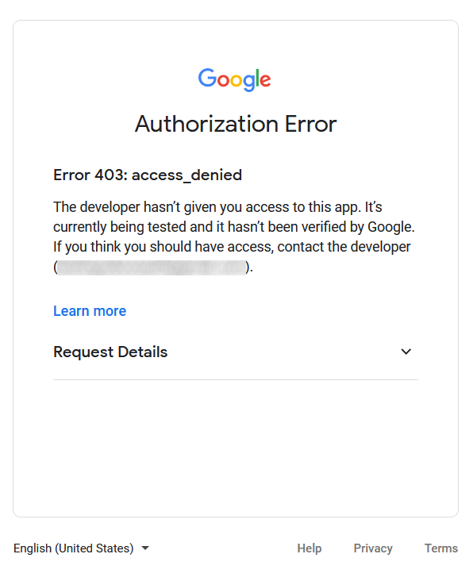

# Connect Gmail to Odoo using Google OAuth

Odoo tương thích với OAuth của Google dành cho Gmail. Để có thể gửi email một cách bảo mật từ miền tùy chỉnh, bạn chỉ cần cấu hình một vài thiết lập trên nền tảng _Google Workspace_ cũng như trong back end của cơ sở dữ liệu Odoo. Cấu hình này có thể hoạt động với cả địa chỉ email cá nhân hoặc địa chỉ email được tạo từ một miền riêng.

#### SEE ALSO
- [Google Sign-In Authentication](../users/google.md)
- [Google Calendar synchronization](../../productivity/calendar/google.md)

## Setup in Google

### Create a new project

To get started, go to the [Google API Console](https://console.developers.google.com). Log in\
with your _Google Workspace_ account if you have one, otherwise log in with your personal Gmail\
account (this should match the email address you want to configure in Odoo).

After that, click on Create Project, located on the far right of the OAuth\
consent screen. If a project has already been created in this account, then the New\
Project option will be located on the top right under the Select a project drop-down\
menu.

On the New Project screen, rename the Project name to `Odoo` and\
browse for the Location. Set the Location as the _Google Workspace_\
_organization_. If you are using a personal Gmail account, then leave the Location as\
No Organization.

Click on Create to finish this step.

### OAuth consent screen

If the page doesn't redirect to the User Type options, click on OAuth\
consent screen in the left menu.

Under User Type options, select the appropriate User Type, and then click on\
Create again, which will finally navigate to the Edit app registration\
page.

#### WARNING

_Personal_ Gmail Accounts are only allowed to be **External** User Type, which means Google may\
require an approval, or for _Scopes_ to be added on. However, using a _Google WorkSpace_ account\
allows for **Internal** User Type to be used.

Note, as well, that while the API connection is in the _External_ testing mode, then no approval is\
necessary from Google. User limits in this testing mode is set to 100 users.

### Edit app registration

Next we will configure the app registration of the project.

On the OAuth consent screen step, under the App information section, enter`Odoo` in the App name field. Select the organization's email address under the\
User support email field.

Next, under App Domain ‣ Authorized domains, click on Add Domain and\
enter `odoo.com`.

After that, under the Developer contact information section, enter the organization's\
email address. Google uses this email address to notify the organization about any changes to your\
project.

Next, click on the Save and Continue button. Then, skip the Scopes page\
by scrolling to the bottom and clicking on Save and Continue.

If continuing in testing mode (External), add the email addresses being configured under the\
Test users step, by clicking on Add Users, and then the Save and\
Continue button. A summary of the app registration appears.

Finally, scroll to the bottom and click on Back to Dashboard to finish setting up the\
project.

### Create Credentials

Now that the project is set up, credentials should be created, which includes the _Client ID_ an&#x64;_&#x43;lient Secret_. First, click on Credentials in the left sidebar menu.

Then, click on Create Credentials in the top menu and select OAuth client ID\
from the dropdown menu.

* Under Application Type, select Web Application from the dropdown menu.
* In the Name field, enter `Odoo`.
* Under the Authorized redirect URIs label, click the button ADD URI, and\
  then input `https://yourdbname.odoo.com/google_gmail/confirm` in the URIs 1 field.\
  Be sure to replace the _yourdbname_ part of the URL with the actual Odoo database name.
* Next, click on Create to generate an OAuth Client ID and Client\
  Secret. Finally, copy each generated value for later use when configuring in Odoo, and then\
  navigate to the Odoo database.

## Thiết lập trong Odoo

### Enter Google Credentials

First, open Odoo and navigate to the Apps module. Then, remove the Apps\
filter from the search bar and type in `Google`. Install the module called Google\
Gmail.

Tiếp theo, đi đến Cài đặt ‣ Cài đặt chung, và trong phần Thảo luận, đảm bảo rằng hộp kiểm cho Máy chủ email tùy chỉnh hoặc Máy chủ email bên ngoài được chọn. Thao tác này sẽ hiển thị tùy chọn mới cho Thông tin xác thực Gmail hoặc Sử dụng máy chủ Gmail. Sau đó, sao chép và dán giá trị tương ứng vào các trường ID máy khách và Mã bí mật máy khách rồi Lưu cài đặt.

### Configure outgoing email server

To configure the external Gmail account, return to the top of the Custom Email Servers\
setting and then click the Outgoing Email Servers link.

Then, click on New or Create to create a new email server, and fill in the\
Name, Description, and the email Username (if required).

Next, click on Gmail OAuth Authentication or Gmail (under the\
Authenticate with or Connection section). Finally, click on\
Connect your Gmail Account.

A new window labeled Google opens to complete the authorization process. Select the\
appropriate email address that is being configured in Odoo.

If the email address is a personal account, then an extra step pops up, so click\
Continue to allow the verification and connect the Gmail account to Odoo.

Then, allow Odoo to access the Google account by clicking on Continue or\
Allow. After that, the page navigates back to the newly configured outgoing email\
server in Odoo. The configuration automatically loads the token in Odoo, and a tag stating\
Gmail Token Valid appears in green.

Finally, Test the Connection. A confirmation message should appear. The Odoo database\
can now send safe, secure emails through Google using OAuth authentication.

## Google OAuth FAQ

### Production VS Testing Publishing Status

Choosing Production as the Publishing Status (instead of\
Testing) will display the following warning message:

To correct this warning, navigate to the [Google API Platform](https://console.cloud.google.com/apis/credentials/consent). If the Publishing status\
is In Production, click Back to Testing to correct the issue.

### No Test Users Added

If no test users are added to the OAuth consent screen, then a 403 access denied error will\
populate.

To correct this error, return to the OAuth consent screen under APIs &\
Services and add test user(s) to the app. Add the email that you are configuring in Odoo.

### Gmail Module not updated

If the _Google Gmail_ module in Odoo has not been updated to the latest version, then a\
Forbidden error message populates.

To correct this error, go to the Apps module and clear out the search terms. Then,\
search for `Gmail` or `Google` and upgrade the Google Gmail module. Finally, click\
on the three dots on the upper right of the module and select Upgrade.

### Application Type

When creating the credentials (OAuth _Client ID_ and _Client Secret_), if Desktop App is\
selected for the Application Type, an Authorization Error appears.

To correct this error, delete the credentials already created and create new credentials, selecting\
Web Application for the Application Type. Then, under Authorized\
redirect URIs, click ADD URI and type:`https://yourdbname.odoo.com/google_gmail/confirm` in the field, being sure to replace _yourdbname_\
in the URL with the Odoo database name.
