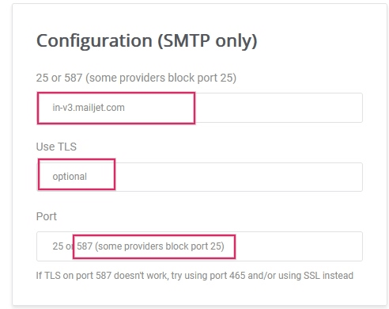

# API Mailjet

Odoo is compatible with Mailjet's  for mass mailing.
Set up a dedicated mass mailing server through Mailjet by configuring settings in the Mailjet
account and the Odoo database. In some circumstances, settings need to be configured on the custom
domain's  settings as well.

## Set up in Mailjet

### Create API credentials

To get started, sign in to the [Mailjet Account Information](https://app.mailjet.com/account)
page. Next, navigate to the Senders & Domains section and click on SMTP and
SEND API Settings.

Sau đó, sao chép cài đặt cấu hình  vào một tệp ghi chú. Các cài đặt này có thể được tìm thấy trong phần Cấu hình (chỉ SMTP). Cài đặt cấu hình  bao gồm địa chỉ máy chủ, tùy chọn bảo mật cần thiết (Sử dụng /), và số cổng. Những cài đặt này cần thiết để cấu hình Mailjet trong Odoo, sẽ được đề cập ở [phần cuối](#maintain-mailjet-api-odoo-setup).

#### SEE ALSO
[Mailjet: How can I configure my SMTP parameters?](https://documentation.mailjet.com/hc/articles/360043229473)

#### IMPORTANT
Odoo [blocks port 25](email_servers_outbound.md#email-outbound-port-restriction) on Odoo Online and Odoo.sh
databases.

Next, click on the button labeled Retrieve your API credentials to retrieve the Mailjet
API credentials.

Then, click on the eye icon to reveal the API key. Copy this key to a notepad, as this
serves as the Username in the Odoo configuration. Next, click on the
Generate Secret Key button to generate the Secret Key. Copy this key to a
notepad, as this serves as the Password in the Odoo configuration.

### Add verified sender address(es)

Bước tiếp theo là thêm địa chỉ người gửi hoặc tên miền vào phần cài đặt tài khoản Mailjet để địa chỉ email hoặc tên miền đó được phê duyệt gửi email thông qua máy chủ của Mailjet. Đầu tiên, truy cập trang `Thông tin tài khoản Mailjet <https://app.mailjet.com/account>`. Sau đó, nhấp vào liên kết Thêm miền hoặc địa chỉ người gửi trong phần Người gửi & miền.

Determine if a sender's email address or the entire domain needs to be added to the Mailjet
settings. It may be easier to configure the domain as a whole if 
access is available. Jump to the [Add a domain](#maintain-mailjet-api-add-domain) section for
steps on adding the domain.

#### NOTE
Either all email addresses of the Odoo database users who are sending emails using Mailjet's
servers need to be configured or the domain(s) of the users' email addresses can be configured.

By default, the email address originally set up in the Mailjet account is added as a trusted
sender. To add another email address, click on the button labeled Add a sender address.
Then, add the email address that is configured to send from the custom domain.

At minimum the following email addresses should be set up in the provider and verified in Mailjet:

- notifications@yourdomain.com
- bounce@yourdomain.com
- catchall@yourdomain.com

#### NOTE
Replace `yourdomain` with the custom domain for the Odoo database. If there isn't one, then use
the mail.catchall.domain system parameter.

After that, fill out the Email Information form, making sure to select the appropriate
email type: transactional email or mass emails. After completing the form, an activation email is
sent to the email address and the trusted sender can be activated.

It is recommended to set up the // settings on the domain of the sender.

#### SEE ALSO
[Tài liệu SPF/DKIM/DMARC của Mailjet](https://documentation.mailjet.com/hc/articles/360042412734-Authenticating-Domains-with-SPF-DKIM)

#### IMPORTANT
If the database is not using a custom domain, then in order to verify the sender's address, a
temporary alias (of the three email addresses mentioned above) should be set up in Odoo CRM to
create a lead. Then, the database is able to receive the verification email and verify the
accounts.

### Add a domain

Bằng cách thêm toàn bộ miền vào tài khoản Mailjet, tất cả địa chỉ người gửi liên quan đến miền đó sẽ tự động được xác thực để gửi email bằng máy chủ Mailjet. Đầu tiên, đi đến trang [Thông tin tài khoản Mailjet](https://app.mailjet.com/account). Tiếp theo, nhấp vào liên kết Thêm miền hoặc địa chỉ người gửi trong phần Người gửi & miền. Sau đó, nhấp vào Thêm miền để thêm miền tùy chỉnh.

#### NOTE
The domain needs to be added to the Mailjet account and then validated through the .

After that, fill out the Add a new Domain page on Mailjet and click
Continue.

After adding the domain, a validation page will populate. Unless the Odoo database is on-premise
(in which case, choose Option 1), choose Option 2: Create a DNS Record.
Copy the TXT record information to a notepad and then navigate to the domain's  provider to complete validation.

#### Setup in the domain's DNS

Sau khi nhận được thông tin bản ghi TXT từ tài khoản Mailjet, hãy thêm bản ghi TXT vào  của miền. Quy trình này khác nhau tùy vào nhà cung cấp . Vui lòng tham khảo nhà cung cấp để biết quy trình cấu hình cụ thể. Thông tin bản ghi TXT bao gồm Lưu trữ và Giá trị. Dán các thông tin này vào các trường tương ứng trong bản ghi TXT.

#### Return to Mailjet account information

After adding the TXT record to the domain's , navigate back to the
Mailjet account. Then, navigate to Account Information ‣ Add a Sender Domain or
Address, click the gear icon next to Domain, and select Validate.

This action can also be done by going to the [Sender domains & addresses](https://app.mailjet.com/account/sender) page on the Mailjet account information and clicking on Manage.

Next, click Check Now to validate the TXT record that was added on the domain. A
success screen will appear if the domain is configured correctly.

After successfully setting up the domain, there is an option to Authenticate this domain
(SPF/DKIM). This button populates  &  provider.

#### SEE ALSO
[Tài liệu SPF/DKIM/DMARC của Mailjet](https://documentation.mailjet.com/hc/articles/360042412734-Authenticating-Domains-with-SPF-DKIM)

## Set up in Odoo

To complete the setup, navigate to the Odoo database and go to the Settings. With
[Chế độ lập trình viên (chế độ gỡ lỗi)](../developer_mode.md#developer-mode) turned on, go to the Technical Menu ‣ Email ‣ Outgoing
Mail Servers. Then, create a new outgoing server configuration by clicking on the
Create button.

Next, input the `SMTP server` (in-v3.mailjet.com), `port number` (587 or 465), and `Security
(SSL/TLS)` that was copied earlier from the Mailjet account. They can also be found [here](https://app.mailjet.com/account/setup). It is recommended to use / even though Mailjet may not require it.

For the Username, input the API KEY. For the Password, input
the SECRET KEY that was copied from the Mailjet account to the notepad earlier. These
settings can be found on Mailjet ‣  Account Settings ‣ SMTP and SEND API
Settings.

Then, if the Mailjet server is used for mass emailing, set the Priority value higher
than that of any transactional email server(s). Finally, save the settings and Test the
Connection.

