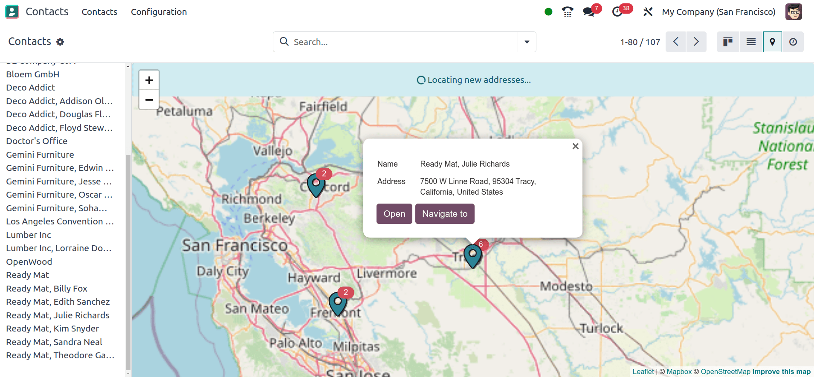
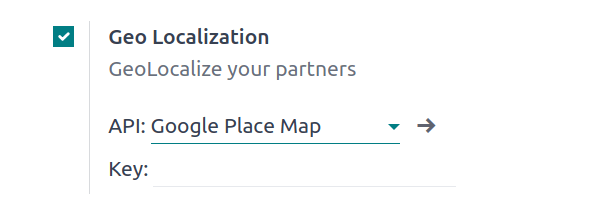

# Vị trí Địa lý

You can locate contacts or places and generate routes on a map in Odoo.

To use the feature, open the Settings app, and, under the Integrations,
section, activate Geo Localization. Then, choose between using the OpenStreetMap or
Google Places API.

**OpenStreetMap**

OpenStreetMap is a free, open geographic database updated and maintained by volunteers. To use it,
select Open Street Map.

> #### IMPORTANT
> OpenStreetMap might not always be accurate. You can [join the OpenStreetMap community](https://www.openstreetmap.org/fixthemap) to fix any issues encountered.

**Google Places API map**

The Google Places API map provides detailed info on places, businesses, and points of interest. It
supports location-based features like search, navigation, and recommendations.

#### IMPORTANT
Using the Google Places API could require [payment to Google](https://mapsplatform.google.com/pricing/).

To use it, select Google Place Map and enter your [API Key](../../websites/website/configuration/address_autocomplete.md#address-autocomplete-generate-api-key).

#### SEE ALSO
[Address autocomplete](../../websites/website/configuration/address_autocomplete.md)
