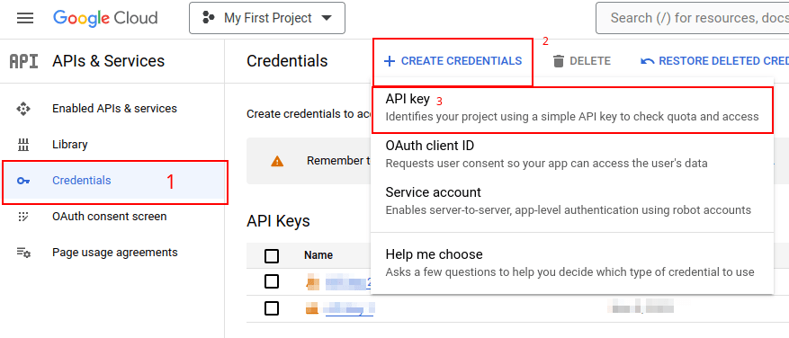
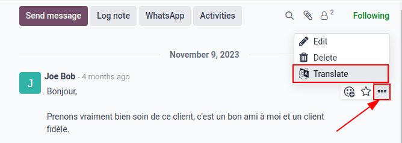

# Google Dịch

_Google Translate_ can be used to translate user generated text in the Odoo chatter.

## Google API console

A majority of the setup for integrating _Google Translate_ into Odoo is done with the _Google API_\
_console_. Once the following processes are complete, an _API key_ is created to input in Odoo.

#### SEE ALSO

[Google Translate setup on Google](https://cloud.google.com/translate/docs/setup)

### Create a new project

To get started, go to the [Google API Console](https://console.developers.google.com). Then, log\
in with a _Google Workspace_ account, if there is one. If not, log in with a personal Gmail account\
(this should match the email address that has billing attached to it).

Next, click Create Project on the far-right of the OAuth consent screen.

On the New Project screen, rename the Project name to `Odoo Translate`, and\
browse for the Location. Set the Location as the _Google Workspace_\
_organization_. If a personal Gmail account is being used, leave the Location as\
No Organization.

Click on Create to finish this step.

### API library

Next, the _Cloud Translation API_ needs to be installed on this newly-created project. To do that,\
click Library in the left menu. Then, search the term `Cloud Translation API`, and\
click into the result. This should be a _Google Enterprise API_ labeled Cloud Translation\
API.

Click Enable to install the library on this project.

#### IMPORTANT

Using the _Google Translate_ API **requires** a current billing account with [Google](https://myaccount.google.com/).

Once a billing account is setup with _Google_ and the library is enabled, click Manage\
to finish configuration on the API.

### Create credentials

Now that the project is set up, and the _Cloud Translation API_ is enabled, credentials **must** be\
created. This includes the _API key_.

To begin this process, click Credentials in the left sidebar menu.

Then, click Create Credentials in the top menu, and select API key from the\
drop-down menu.

Copy the API key for use in the next section.

#### IMPORTANT

For security purposes, the usage of the _API key_ can be restricted.

Để thực hiện việc này, hãy truy cập phần _Hạn chế API_ bằng cách nhấp vào Chỉnh sửa khóa API trong cửa sổ bật lên, hoặc bằng cách nhấp vào khóa API được liệt kê trong trang Thông tin xác thực. Từ đây, có thể thiết lập các giới hạn cho khóa. Việc này bao gồm thiết lập một ứng dụng để giới hạn việc sử dụng khóa API, và xác định liệu khóa API này có thể gọi bất kỳ API nào hay không.

It is recommended that the Odoo _Translate API_ be restricted to **only** allow requests from the\
configured Odoo database and to the _Cloud Translation API_.

To add the website restriction, click Websites, under the Set an\
application restriction. Then, enter the address of the database _Google Translate_ is being\
used in, by clicking on Add. Lastly, add the ,\
and click Done.

To restrict use of the key to a selected API, first, select Restrict key, under the\
API restrictions section. Then use the drop-down menu to choose the API being\
configured (_Cloud Translation API_).

## Cấu hình Odoo

To access the integration in Odoo, navigate to the Settings app ‣ Discuss\
section. Enter the API key into the field labeled Message Translation. Then,\
Save the settings, and _Google Translate_ can be used in any chatter throughout the\
database.

## Translate chatter

To translate a user's text from another language, click the ... (three dot) icon menu to\
the right of the chatter. Then, select Translate. The content translates to th&#x65;_&#x6C;anguage_ set on the user's preferences.

#### SEE ALSO
[Thay đổi ngôn ngữ](../users/language.md#language-install)
