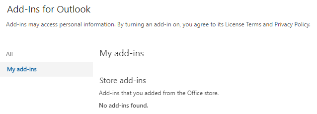
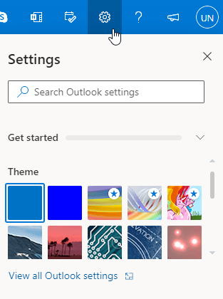
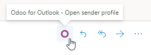

# Plugin Outlook

Outlook allows for third-party applications to connect in order to execute database actions from
emails. Odoo has a plugin for Outlook that allows for the creation of an opportunity from the email
panel.

## Cấu hình

The Outlook [Mail Plugin](../mail_plugins.md) needs to be configured both on Odoo and Outlook.

### Enable Mail Plugin

First, enable the *Mail Plugin* feature in the database. Go to Settings ‣ General
Settings ‣ Integrations, enable Mail Plugin, and Save the configuration.

### Install the Outlook Plugin

Download (Save Page As ‣ Web Page XML only) the following XML file to upload
later: [https://download.odoocdn.com/plugins/outlook/manifest.xml](https://download.odoocdn.com/plugins/outlook/manifest.xml).

Next, open the Outlook mailbox, and select any email. After completing this, click on the
More actions button in the upper right-side and select Get Add-ins.

Following this step, select the My add-ins tab on the left-side.

Under Custom add-ins towards the bottom, click on + Add a custom add-in, and
then on Add from file...

For the next step, attach the `manifest.xml` file downloaded above, and press OK. Next,
read the warning and click on Install.

### Connect the database

Now, Outlook will be connected to the Odoo database. First, open any email in the Outlook mailbox,
click on the More actions button in the upper right-side, and select Odoo for
Outlook.

The right-side panel can now display **Company Insights**. At the bottom, click on
Login.

#### NOTE
Only a limited amount of **Company Insights** (*Lead Enrichment*) requests are available as a
trial database. This feature requires [prepaid credits](../mail_plugins.md#mail-plugins-pricing).

Now, enter the Odoo database URL and click on Login.

Next, click on Allow to open the pop-up window.

If the user isn't logged into the database, enter the credentials. Click on Allow to let
the Outlook Plugin connect to the database.

### Add a shortcut to the plugin

By default, the Outlook Plugin can be opened from the *More actions* menu. However, to save time,
it's possible to add it next to the other default actions.

In the Outlook mailbox, click on Settings, then on View all Outlook
settings.

Now, select Customize actions under Mail, click on Odoo for
Outlook, and then Save.

Following this step, open any email; the shortcut should be displayed.

### Using the plugin

Sau khi cài đặt và vận hành plug-in, để tạo lead chỉ cần nhấp vào biểu tượng `O` [biểu tượng Odoo] hoặc đi đến Thêm tác vụ và chọn Odoo dành cho Outlook. Bảng điều khiển bên sẽ xuất hiện ở phía phải, dưới mục Cơ hội, nhấp vào Mới. Một cửa sổ mới với cơ hội vừa tạo trong cơ sở dữ liệu Odoo sẽ hiển thị.
