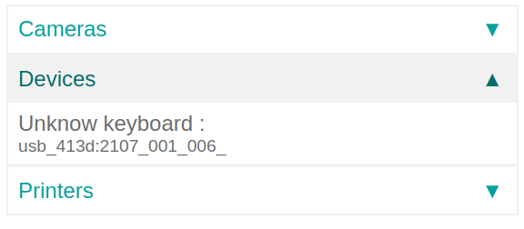

# Connect a footswitch

When working in a manufacturing environment, it's always better for an operator to have both hands
available at all times. Odoo's  box makes this possible when using a
footswitch.

In fact, with a footswitch, the operator is able to go from one screen to another, and perform
actions using their foot. This can be configured in just a few steps on the work center in the
*Manufacturing* app.

## Kết nối

To connect a footswitch to the  box, connect the two devices via
cable. More often than not, this is done with a  cable.

If the footswitch is a [supported device](https://www.odoo.com/page/iot-hardware), there is no
need to take further action, since it'll be automatically detected when connected.

## Link a footswitch to a work center in the Odoo Manufacturing app

Để liên kết footswitch với một tác vụ, trước tiên cần phải cấu hình nó trên một khu vực sản xuất. Đi đến Ứng dụng Sản xuất ‣ Cấu hình ‣ Khu vực sản xuất. Từ đây, hãy đến Khu vực sản xuất mong muốn mà footswitch sẽ được sử dụng và thêm thiết bị vào tab Bộ kích hoạt IoT, trong cột Thiết bị, bằng cách chọn Thêm một dòng. Điều này có nghĩa là footswitch có thể được liên kết với một tùy chọn trong danh sách thả xuống cột Tác vụ và bạn có thể chọn thêm một khóa để kích hoạt nó. Một ví dụ về Tác vụ trong  *ứng dụng Sản xuất* có thể là các nút Xác thực hoặc Đánh dấu là hoàn tất trên một công đoạn sản xuất.

#### IMPORTANT
It should be noted that the first listed trigger is chosen first. So, the order matters, and
these triggers can be dragged into any order. In the picture above, using the footswitch
automatically skips the part of the process that's currently being worked on.

#### NOTE
On the Work Order screen, a status graphic indicates whether the database is
correctly connected to the footswitch.

#### SEE ALSO
[Tích hợp với thiết bị IoT](../../../inventory_and_mrp/manufacturing/advanced_configuration/using_work_centers.md#workcenter-iot)
