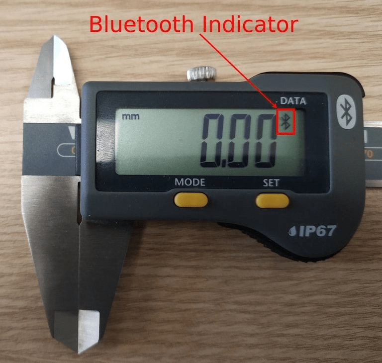

# Connect a measurement tool

With Odoo's  box, it is possible to connect measurement tools to the
Odoo database for use in the *Quality app* on a quality control point/quality check, or for use in a
work center during the manufacturing process.

Find the list of supported devices here: [Supported devices](https://www.odoo.com/page/iot-hardware).

## Connect with universal serial bus (USB)

To add a device connected by , plug the  cable into the  box, and the device appears in the Odoo
database.

## Connect with bluetooth

Activate the Bluetooth functionality on the device (see the device manual for further explanation),
and the  box automatically connects to the device.

## Link a measurement tool to a quality control point in the manufacturing process

In the *Quality app*, a device can be set up on a quality control point. To do that, navigate to
Quality app ‣ Quality Control ‣ Control Points, and open the desired control
point to which the measurement tool should be linked.

From here, edit the control point, by selecting the Type field, and clicking
Measure from the drop-down menu. Doing so reveals a field called Device,
where the attached device can be selected.

Additionally, Norm and Tolerance can be configured. Save the
changes, if required.

At this point, the measurement tool is linked to the chosen quality control point. The value, which
usually needs to be changed manually, is automatically updated while the tool is being used.

#### NOTE
On a quality check detail form, the Type of check can also be specified to
Measure. Access a new quality check detail page, by navigating to
Quality app ‣ Quality Control ‣ Quality Checks ‣ New.

#### SEE ALSO
- [Quality control points](../../../inventory_and_mrp/quality/quality_management/quality_control_points.md)
- [Quality alerts](../../../inventory_and_mrp/quality/quality_management/quality_alerts.md)

## Link a measurement tool to a work center in the Manufacturing app

To link a measurement tool to an action, it first needs to be configured on a work center. To do
that, navigate to Manufacturing app ‣ Configuration ‣ Work Centers. Then,
select the desired work center in which the measurement tool will be used.

On the work center page, add the device in the IoT Triggers tab, under the
Device column, by selecting Add a Line. Then, the measurement tool can be
linked to the Action drop-down menu option labeled Take Measure. A key can
be added to trigger the action.

#### IMPORTANT
It should be noted that the first listed trigger is chosen first. The order matters, and these
triggers can be dragged into any order.

#### NOTE
On the Work Order screen, a status graphic indicates whether the database is
correctly connected to the measurement tool.

#### SEE ALSO
[Tích hợp với thiết bị IoT](../../../inventory_and_mrp/manufacturing/advanced_configuration/using_work_centers.md#workcenter-iot)
