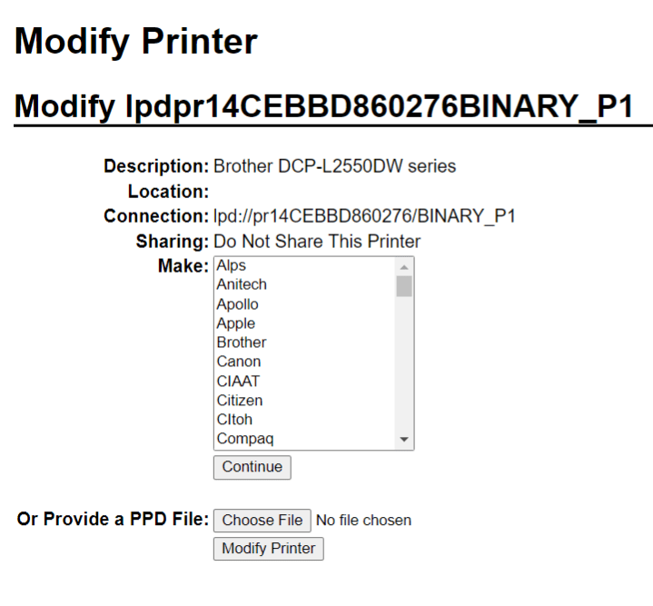

# Connect a printer

Printer installation can be done in a few easy steps. The printer can be used to print receipts,
labels, orders, or even reports from the different Odoo apps. In addition, printer actions can be
assigned as an *action on a trigger* during the manufacturing process, or added onto a quality
control point or a quality check.

#### WARNING
The **only** way to connect a printer directly to an Odoo database is through the use of an IoT
system. Without an IoT system, printing can still occur, but it is managed through the printer
itself, which is not the recommended process.

## Kết nối

IoT systems support printers connected through USB, network connection, or Bluetooth.
[Supported printers](https://www.odoo.com/page/iot-hardware) are detected automatically, and
appear in the Devices list of the IoT app.

#### NOTE
Printers can take up to two minutes to appear in the IoT app Devices list.

## Link a printer

### Link work orders to a printer

Work orders can be linked to printers, via a quality control point, to print labels for
manufactured products.

In the [Quality app](../../../inventory_and_mrp/quality.md), a device can be set up on a
quality control point. To do so, go to the Quality ‣ Quality Control ‣ Control
Points, and open the desired control point.

#### IMPORTANT
A manufacturing operation and work order operation need to be attached to a quality control
point before the Type field allows for the Print Label option to be
selected.

From here, edit the control point by selecting the Type field, and selecting
Print Label from the dropdown menu of options. Doing so reveals the Device
field, where the attached device can be selected.

The printer can now be used with the selected quality control point. When the quality control point
is reached during the manufacturing process, the database presents the option to print labels for a
specific product.

#### NOTE
On a [quality check form](../../../inventory_and_mrp/quality/quality_management/quality_checks.md), the
Type of check can also be set to Print Label.

#### SEE ALSO
- [Quality control points](../../../inventory_and_mrp/quality/quality_management/quality_control_points.md)
- [Quality alerts](../../../inventory_and_mrp/quality/quality_management/quality_alerts.md)

### Link reports to a printer

It is possible to link report types to a specific printer. To do so:

1. Go to IoT ‣ Devices and select the desired printer.
2. Go to the Printer Reports tab and click Add a line.
3. In the pop-up that opens, select the types of reports to be linked to the printer and click
   Select.

The first time a linked report is selected to print, a Select Printers pop-up window
appears. Tick the checkbox next to the correct printer for the report, and click Print.
At that point, the report is linked to the printer.

#### Clear device printer cache

Sau khi một máy in được liên kết để in một báo cáo, cài đặt này sẽ được lưu trong bộ nhớ cache của trình duyệt. Điều này có nghĩa là người dùng có thể có các thiết bị khác nhau được lưu trong bộ nhớ cache của họ cho các báo cáo khác nhau, dựa trên thiết bị mà họ sử dụng để truy cập Odoo. Nó cũng có nghĩa là những người dùng khác nhau có thể in tự động một báo cáo từ các máy in khác nhau, dựa trên sở thích của họ.

To unlink a report from a printer, navigate to IoT ‣ Configuration ‣ Reset
Linked Printers. This generates a list of reports that are linked to a printer on the current
device. Click the Unlink button next to each report to remove the link.

#### IMPORTANT
This step **only** prevents the report from automatically printing to the listed printer from
the current browser. The report is still [linked](#iot-link-printer) on the device, under
the Printer Reports tab.

#### SEE ALSO
[POS Order Printing](../../../sales/point_of_sale/restaurant/kitchen_printing.md)

## Potential issues

### The printer is not detected

If a printer does not appear in the devices list, go to the [IoT box's](../iot_box.md#iot-iot-box-homepage)
or [Windows virtual IoT's](../windows_iot.md#iot-windows-iot-homepage) homepage, click Show in
the Devices section, and make sure the printer is listed.

If the printer does not appear on the IoT system's homepage, click Printer Server, then
Administration, and Add Printer. If the printer is not in the list, it is
likely not connected properly.

### The printer outputs random text

For most printers, the correct driver should be automatically detected and selected. However, in
some cases, the automatic detection mechanism might not be enough, and if no driver is found, the
printer might print random characters.

The solution is to manually select the corresponding driver. On the IoT system's homepage, click
Printer Server, then Printers, and select the printer in the list.
In the Administration dropdown menu, click Modify Printer. Follow the steps
and select the printer's *make* and *model*.

#### NOTE
Epson receipt printers and Zebra label printers do not need a driver to work. Make sure that no
driver is selected for those printers.

### The printer is detected but is not recognized correctly

If Odoo and the IoT system do not recognize the printer correctly, go to IoT
‣ Devices, click the device's card to access its form, and set the Subtype field to
the appropriate option: Receipt Printer, Label Printer, or Office
Printer.

#### Epson configuration special case

Most Epson printers support printing receipts in Odoo Point of Sale using the `GS v 0` command.
However, the following Epson printer models do not support this command:

- TM-U220
- TM-U230
- TM-P60
- TMP-P60II

To bypass this issue, you can configure the printer to use the `ESC *` command.

First, review Epson's website for compatibility for both the [GS v 0](https://download4.epson.biz/sec_pubs/pos/reference_en/escpos/gs_lv_0.html) and [ESC \*](https://download4.epson.biz/sec_pubs/pos/reference_en/escpos/esc_asterisk.html) commands.

If the printer is incompatible with `GS v 0` but supports `ESC *`, configure the IoT system to use
the `ESC *` command as follows:

1. Access the [IoT box's](../iot_box.md#iot-iot-box-homepage) or [Windows virtual IoT's](../windows_iot.md#iot-windows-iot-homepage) homepage.
2. Click the Printer server button, then click Administration on the CUPS
   page.
3. Click Add Printer in the Printers section, select the printer, and click
   Continue.
4. On the Add Printer page, specify the printer's Name using the following
   convention: `<printer_name>__IMC_<param_1>_<param_2>_..._<param_n>__`, where:
   - `printer_name` is the printer's name. It can contain any character except `_`, `/`, `#`, or \` \`
     (space character).
   - `IMC`: This stands for *Image Mode Column* (the simplified name for `ESC *`).
   - `param_1`: This stands for the specific parameter:
     - `SCALE<X>`: Scale of the picture (with the same aspect ratio). `X` should be an integer
       describing the scale percentage that should be used. For example, `100` is the original size,
       `50` is half the size, and `200` is twice the size.
     - `LDV`: *Low Density Vertical* (will be set to *High Density Vertical* if not specified).
     - `LDH`: *Low Density Horizontal* (will be set to *High Density Horizontal* if not specified).

     #### NOTE
     - *Density* parameters might need to be configured in a particular way, depending on the
       printer model.
     - Refer to [Epson's ESC \* documentation](https://download4.epson.biz/sec_pubs/pos/reference_en/escpos/esc_asterisk.html)
       to determine if the printer requires these parameters to be set.
5. Once the printer's name has been defined using the appropriate naming convention, click
   Continue.
6. Set the Make value to Raw and the Model value to
   Raw Queue (en).
7. Click Add Printer. If everything was done correctly, the page should redirect to the
   Banners page.
8. Wait a few minutes for the IoT system to detect the printer and sync to Odoo's server.
9. [Access the POS settings](../../../sales/point_of_sale/configuration.md#configuration-settings) and select your POS, or click the
   vertical ellipsis button (⋮) on a POS card and click Edit. Scroll down
   to the Connected Devices section, enable IoT Box, and select the printer
   in the Receipt Printer field. Click Save.

#### NOTE
If the printer was set up incorrectly (e.g., it continues to print random text, or the printed
receipt is too large or too small), it cannot be modified via the printer's name in CUPS.
Instead, configure a new printer from scratch with modified parameters, following the steps
above.

### DYMO LabelWriter print issue

The DYMO LabelWriter has a known issue in printing with IoT systems. The OpenPrinting CUPS server
installs the printer using Local RAW Printer drivers. In order to print anything, the
correct Make and Model needs to be set to reference the correct driver when using the
device.

Additionally, a new printer needs to be added to reduce the print delay that occurs after updating
the driver.

#### IMPORTANT
Máy in DYMO LabelWriter 450 DUO là máy in DYMO được khuyến nghị sử dụng với Odoo và các hệ thống IoT. Thiết bị này kết hợp hai loại máy in: một máy in nhãn và một máy in băng. Khi cấu hình các quy trình sau, cần đảm bảo chọn đúng mẫu máy (DYMO LabelWriter 450 DUO Label (en) hoặc DYMO LabelWriter 450 DUO Tape (en)). Để đảm bảo tính nhất quán, các quy trình sau đây hướng dẫn các bước cấu hình cho mẫu DYMO LabelWriter 450 DUO Label (en). Điều chỉnh lựa chọn mẫu máy theo nhu cầu.

#### DYMO LabelWriter not printing

If the DYMO LabelWriter fails to print, install a new driver:

1. Access the IoT system's homepage and click Printer server to open the
   OpenPrinting CUPS console.
2. Click Printers in the top menu, then click the printer in the list.
3. Select Maintenance in the first dropdown menu.
4. Select Modify Printer in the second dropdown menu.
   
5. Select the specific network connection/printer on which the modification should be made and
   click Continue.
6. On the next page, click Continue, then select DYMO from the
   Make dropdown list.
7. Click on Continue and set the Model to DYMO LabelWriter 450
   DUO Label (en) (or whichever DYMO printer model is being used).
8. Click Modify Printer to set the new driver; a confirmation page appears.
9. Click Printers in the top menu; all printers installed on the OpenPrinting CUPS
   server appear, including the newly updated DYMO LabelWriter 450 DUO Label (or
   whichever DYMO printer model is being used).
10. Click the newly updated printer, then click the Maintenance dropdown menu and
    select Print Test Page to print a test label. The test label is printed after a few
    seconds if the driver update was successful.

To reduce this delay, add a new printer using the steps below.

#### DYMO LabelWriter print delay

To resolve the delay issue after modifying the driver, reinstall the printer:

1. Access the IoT system's homepage and click Printer server to open the
   OpenPrinting CUPS console.
2. Click Administration in the top menu, then click Add a Printer.
3. On the next page, in the Local Printers section, select DYMO
   LabelWriter 450 DUO Label (DYMO LabelWriter 450 DUO Label) (or whichever DYMO printer model is
   being used) pre-installed printer. Click Continue.
   
4. On the following screen, update the Name to something easily identifiable, as the
   original printer will remain in the list. Then, click Continue.
   
5. Set the Model field to DYMO LabelWriter 450 DUO Label (en) (or
   whichever DYMO printer model is being used), then click Add Printer to complete
   the installation.
   
6. Click Printers in the top menu and click the newly installed printer
   DYMO LabelWriter 450 DUO Label (or whichever DYMO printer model is being used) from
   in the list.
   
7. Click the Maintenance dropdown list and select Print Test Page to print
   a test label. The test label should print out immediately, or after one or two seconds.

### The Zebra printer does not print anything

Máy in Zebra khá nhạy cảm với định dạng mã Ngôn ngữ lập trình Zebra (ZPL). Nếu không in được gì hoặc in ra nhãn trống, hãy thử thay đổi định dạng báo cáo gửi đến máy in. Để thực hiện, kích hoạt [chế độ lập trình viên](../../developer_mode.md#developer-mode), truy cập Cài đặt ‣ Kỹ thuật ‣ Giao diện người dùng ‣ Chế độ xem, và tìm kiếm mẫu tương ứng.

#### SEE ALSO
[Zebra's instructions on printing ZPL files](https://supportcommunity.zebra.com/s/article/Print-a-zpl-file-using-the-Generic-Text-Printer)

## Barcode scanner issues

### The characters read by the barcode scanner do not match the barcode

By default, most barcode scanners are configured in the US QWERTY format. If the barcode scanner
uses a different layout, go to IoT ‣ Devices and click the barcode device's card.
Then, select the correct language in the Keyboard Layout field.

#### NOTE
The Keyboard Layout is language-specific, with available options varying based on
the device and the language of the database (e.g., English (UK), English
(US), etc.).

### Nothing happens when a barcode is scanned

Make sure the correct device is selected in the [Point of Sale settings](../../../sales/point_of_sale/configuration/pos_iot.md) (when applicable) and the barcode is
configured to send an `ENTER` character (keycode 28) at the end of every barcode.

### The barcode scanner is detected as a keyboard

#### IMPORTANT
Some barcode scanners are identified as USB keyboards rather than barcode scanners and are not
recognized by IoT systems.

To change the device type manually, go to IoT ‣ Devices and click the barcode
device's card. Then, enable Is scanner.

### The barcode scanner processes barcode characters individually

Khi truy cập phiên bản di động của Odoo từ thiết bị di động hoặc máy tính bảng được ghép nối với máy quét mã vạch thông qua hệ thống IoT, máy quét có thể hiểu mỗi ký tự trong mã vạch là một lần quét riêng biệt. Để khắc phục, hãy truy cập IoT ‣ Thiết bị và nhấp vào thẻ thiết bị mã vạch. Sau đó, chọn ngôn ngữ chính xác trong trường Bố cục bàn phím.

#### NOTE
The Keyboard Layout is language-specific, with available options varying based on
the device and the language of the database (e.g., English (UK), English
(US), etc.).
