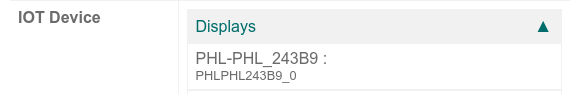

# Connect a screen

In Odoo, an  box can be connected to a screen display. After being
configured, the screen can be used to display a Point of Sale (PoS) order to a client.

Access the customer display by going to the  box homepage and
clicking on the PoS Display button. To get to the  box
homepage, navigate to IoT app ‣ IoT Boxes and click on the  box homepage link.

## Kết nối

The way to connect the screen display to the  box differs depending
on the model.

IoT Box model 4

Connect up to two screens with micro-HDMI cables on the side of the  box. If two screens are connected, they can display distinct content (see
[Screen Usage](#iot-usage-screen)).

IoT Box model 3

Connect the screen with an HDMI cable on the side of the  box.

#### SEE ALSO
[See the Raspberry Pi Schema](applications/sales/point_of_sale/configuration/pos_iot.md#pos-pos-iot-connect-schema).

#### IMPORTANT
Screen(s) should be connected before the  box is switched on. If
it is already on, connect the screen(s), and then restart the 
box by unplugging it for ten seconds and plugging it back into its power source.

#### WARNING
The usage of HDMI/micro-HDMI adapters may cause issues which will result in a blank, black screen
on the screen display. Using the specific cable for the display connection is recommended.

If the connection was successful, the screen should display the POS Client display
screen.

The screen should also appear in the list of Displays on the  box homepage. Alternatively, the display can be seen by accessing IoT app
‣ Devices.

#### NOTE
If no screen is detected, a default display named Distant Display will be displayed
instead. This indicates that there is no hardware screen connected.

> 

## Cách dùng

### Show Point of Sale orders to customers

To use the screen in the *Point of Sale app*, go to Point of Sale ‣
Configuration ‣ Point of Sale, select a , click Edit if
necessary, and enable the IoT Box feature.

Next, select the screen from the Customer Display drop-down menu. Then click
Save, if required.

The screen is now available for  sessions. A screen icon will appear in
the menu at the top of the screen to indicate the screen's connection status.

The screen will automatically show the  orders and update when changes
are made to the order.

### Display a website on the screen

Open the screen form view by accessing IoT app ‣ Devices ‣ Customer Display.
This allows the user to choose a particular website URL to display on the screen using the
Display URL field.
