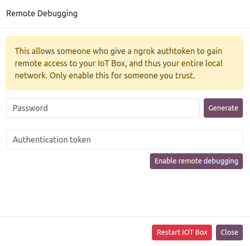

# IoT box SSH connection

#### NOTE
SSH connections are only available for [IoT boxes](../iot_box.md), not the [Windows
virtual IoT](../windows_iot.md).

#### WARNING
- This feature should **only** be used with trusted parties, as it provides administrative
  access to the IoT box, which can create security issues.
- Managing an SSH connection is **not** covered under the standard Odoo support scope. Visit
  the [Odoo Support](https://www.odoo.com/help) page for additional information about what is
  covered.

To provide an  connection to an IoT box, you must generate a
password:

1. Access the IoT box's homepage by opening the IoT app and clicking the IP address displayed
   on the IoT box's card.
2. Click the <i class="fa fa-cogs"></i> (cogs) button at the top-right, then Remote
   Debug.
3. In the Remote Debugging popup that opens, click Generate and save the
   password securely. Once you close the popup, the password will no longer be available.
   
4. Enter the Authentication Token provided by the user attempting to connect to the IoT
   box.
5. Click Enable Remote Debugging.

#### SEE ALSO
- [Hộp IoT](../iot_box.md)
- [IoT system connection to Odoo](../connect.md)
