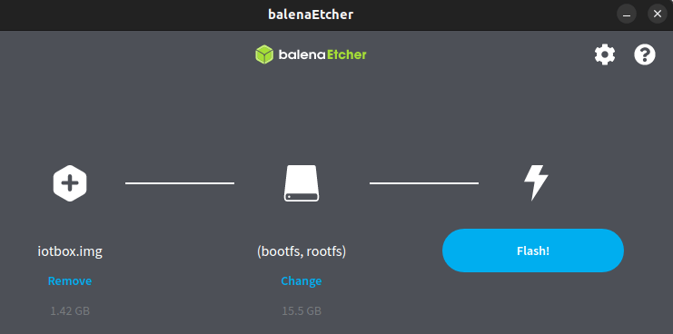

# IoT system updates

Due to the complexity of IoT systems, the term *updating* can refer to several processes, including:

- [Updating the IoT system's image and/or core code](#iot-updating-iot-image-code);
- [Updating the handlers](#iot-updating-iot-handlers), which include the interfaces and drivers.

## Image and core code update

Hộp IoT

> To check if the IoT box is up-to-date (and update it if needed), [access the IoT box's
> homepage](../iot_box.md#iot-iot-box-homepage), click the <i class="fa fa-cogs"></i> (cogs) button at the
> top-right, then Update in the Version section.

**Image update**

> To update the IoT box's image, flash its SD card. Flashing can be performed using
> [balenaEtcher](https://etcher.balena.io), a free and open-source tool for writing disk
> images to SD cards.

> #### NOTE
> - Updating the IoT system's image is often required after upgrading the Odoo database to a
>   newer version.
> - A computer with a micro SD card reader/adapter is required to flash the micro SD card.
> - An alternative software for flashing the micro SD card is [Raspberry Pi Imager](https://www.raspberrypi.com/software/).

> 1. [Download balenaEtcher.](https://etcher.balena.io/#download-etcher)
> 2. Insert the IoT box's micro SD card into the computer or adapter.
> 3. Open balenaEtcher, click Flash from URL, and enter the following URL:
>    `http://nightly.odoo.com/master/iotbox/iotbox-latest.zip`.
> 4. Click Select target and select the SD card.
> 5. Click Flash and wait for the process to finish.

> 

**Core code update**

> To update the IoT box's core code, click Update under IoT Box Update
> in the Update popup.

Windows virtual IoT

To update the Windows virtual IoT's image and code, [uninstall the program](../windows_iot.md#iot-windows-iot-uninstall) and [reinstall](../windows_iot.md#iot-windows-iot-installation) the latest
package.

## Handler (driver) update

To update the IoT system's handlers (i.e., drivers and interfaces) and synchronize them with the
configured server handler's code, for example, to resolve issues where [devices](../devices.md)
are not functioning properly with the IoT system, proceed as follows:

1. Access the [IoT box's](../iot_box.md#iot-iot-box-homepage) or [Windows virtual IoT's](../windows_iot.md#iot-windows-iot-homepage) homepage and click the <i class="fa fa-cogs"></i> (cogs) button at
   the top-right.
2. Click Update in the Version section.
3. In the Update popup that opens, click Force Drivers Update.

#### IMPORTANT
If you have an [on-premise](../../../../administration/on_premise.md) or [Odoo.sh](../../../../administration/odoo_sh/overview/introduction.md) database, the configured server must be
up-to-date to ensure the handlers' code includes the latest fixes and patches.

#### NOTE
A handler update is also performed automatically every time the IoT system is restarted unless
the Automatic drivers update option is disabled in the Technical
information tab in the [IoT system's form](../connect.md#iot-connect-iot-form) in Odoo.
