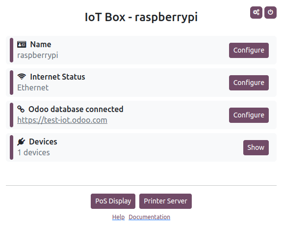
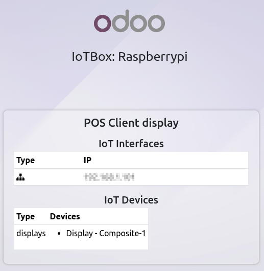

# Hộp IoT

To start using an IoT box:

1. Make sure you have a [valid IoT box subscription](../iot.md#iot-iot-iot-subscription) in addition to
   your Odoo subscription.
2. Connect your [devices](devices.md) to the IoT box.
3. [Connect the IoT box to the network](#iot-iot-box-network).
4. [Connect the IoT box to your Odoo database](connect.md).

#### NOTE
Devices can also be connected after the IoT box is added to the network and/or connected to the
database; however, a reboot of the IoT box might be required.

## Network connection

The IoT box can be connected to the network via [Ethernet](#iot-iot-box-network-ethernet) or
[Wi-Fi](#iot-iot-box-network-wifi).

#### IMPORTANT
**All** devices must be connected to the **same network**: the IoT box, the device(s) connected
to the IoT box, and the computer connected to Odoo.

### Ethernet

Plug the Ethernet cable into the IoT box's Ethernet port and an available port on your router, then
connect the IoT box to a power source.

### Wi-Fi

Make sure no Ethernet cable is connected to the IoT box and follow these steps:

> 1. Connect the IoT box to a power source and wait a few minutes for it to power on.
> 2. Access your computer's Wi-Fi settings and select the IoT box's network. The network name is in
>    the format `IoTBox-xxxxxxxxxxxx` (where `xxxxxxxxxxxx` is a unique identifier).
> 3. Connect to the IoT box's Wi-Fi network and sign into it; your browser should automatically
>    open and redirect to the [IoT box's homepage](#iot-iot-box-homepage).

>    #### NOTE
>    Depending on your operating system, the browser might not open and redirect to the IoT box's
>    homepage. In this case, open your browser manually and navigate to `http://10.11.12.1`.
> 4. On the IoT box's homepage, click Configure next to the Internet Status
>    section.
> 5. Wait a few minutes for the available networks to be scanned, select the network, enter the
>    Wi-Fi's password, and click Connect.

#### NOTE
Once connected to the Wi-Fi network, the IoT box stops emitting its Wi-Fi signal, and the
computer should automatically reconnect to its original network. If it does not, reconnect to it
manually.

## IoT box homepage

To access the IoT box's homepage, open a web browser **on the same network as the IoT box** and
navigate to the IoT box's IP address.

The IoT box's IP address can be retrieved by:

- connecting the IoT box to an external monitor: the IP address is displayed on the screen.
  
- connecting the IoT box to a printer: the IP address is automatically printed.
- accessing the administrator interface of the router to which the IoT box is connected or using
  third-party software to scan the network.

Once the IoT box is [connected to the Odoo database](connect.md), its homepage can be accessed
from Odoo by opening the IoT app and clicking the URL displayed on the IoT box's card.
