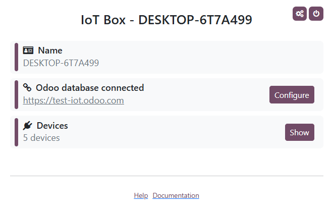

# Windows virtual IoT

To start using the Windows virtual IoT:

1. Make sure all [prerequisites](#iot-windows-iot-prerequisites) are met.
2. [Install the Windows virtual IoT](#iot-windows-iot-installation) on a Windows computer.
3. [Configure the Windows Firewall](#iot-windows-iot-firewall).
4. Connect your [devices](devices/) to the Windows virtual IoT.
5. [Connect the Windows virtual IoT to your Odoo database](connect.md).

## Khoá học tiên quyết

The following prerequisites must be met before setting up and using the Windows virtual IoT:

- A valid [IoT box subscription](./#iot-iot-iot-subscription).
- An updated and recent version of Windows (i.e., Windows 10 or Windows 11) installed on a Windows
  computer (laptop, desktop, or server).

#### NOTE
-  devices, including cameras and measurement tools,
  are not compatible with Windows virtual IoT.
- It is also possible to create a Windows Virtual Machine on a MacOS/Linux computer. However,
  this option is not supported by Odoo, and no troubleshooting assistance will be provided.

## Lắp đặt

To install the Windows virtual IoT on a Windows computer:

1. Access [Odoo's download page](https://odoo.com/download) and download the Odoo installation
   package for Windows **matching your database's version**.
2. Open the downloaded `.exe` file, allow the app to make changes to your device, select
   a language, and click OK.
3. Click Next, then I Agree to accept the terms and conditions and continue.
4. Select Odoo IoT from the Select the type of install dropdown list. The
   following components should be selected: Odoo Server, Odoo IoT, Nginx WebServer, and Ghostscript
   interpreter.
5. Verify you have the required space on your computer and click Next.
6. In the Destination folder, enter C:\\odoo and click Install.

   #### WARNING
   Do not install Odoo's Windows virtual IoT in any Windows user directory, as this can cause
   issues with [HTTPS certificate generation](iot_advanced/https_certificate_iot.md#iot-https-certificate-iot-generation).
7. Once the installation is complete, click Next.
8. Set up GPL Ghostscript: Click Next, agree to the terms and conditions, click
   Install, then Finish.
9. Click Next, Next, and Finish to complete the setup. The
   [IoT system's homepage](#iot-windows-iot-homepage) automatically opens in a web browser with
   the URL `http://localhost:8069`.
10. Check that you can access the [IoT system's homepage](#iot-windows-iot-homepage) in a web
    browser:
    - on the Windows virtual IoT computer, and
    - on another device **on the same network as the IoT system** by navigating to the URL
      `http://xxx:8069` (where `xxx` is the IoT system's IP address).
    - on another device **on the same network as the IoT system** by navigating to the URL
      `https://xxx` (where `xxx` is the IoT system's IP address) to test for [HTTPS](iot_advanced/https_certificate_iot.md) connection.

## Windows Firewall configuration

Firewalls help keep devices secure but can sometimes block legitimate connections. If the Windows
virtual IoT isn't accessible on the , for example from another
device, it could be due to a firewall blocking the connection. To prevent this issue, configure
exceptions for network discovery in the  or firewall settings.

#### NOTE
If third-party firewall software is installed on the Windows computer, refer to the software's
documentation to configure firewall exceptions.

To create a rule on Windows Defender and allow communication through port `8069`, follow these
steps:

1. Search the Windows start menu for `firewall` and select the Windows Defender Firewall
   with Advanced Security app.
2. In the left part of the window, select Inbound Rules.
3. In the right part of the window, under Actions, click New Rule.
4. In the New Inbound Rule Wizard that opens, select the Port type of rule
   and click Next.
5. On the Protocols and Ports page, make sure TCP and Specified
   local ports are selected, enter the following in the field: `8069, 80, 443`, and click
   Next.

   #### NOTE
   Other ports may be necessary depending on your IoT devices. For example, for the
   [Worldline](../../sales/point_of_sale/payment_methods/terminals/worldline.md) payment terminal,
   add the `9050` port.
6. On the Action page, select Allow the connection and click
   Next.
7. On the Profile page, disable any connection type(s) that don't apply to your
   Windows computer and click Next.
8. On the Name page, provide a Name (e.g., `Odoo`) and, optionally, a brief
   Description, then click Finish.

#### SEE ALSO
[Windows Firewall rules documentation](https://learn.microsoft.com/en-us/windows/security/operating-system-security/network-security/windows-firewall/rules)

## Windows virtual IoT homepage

To access the Windows virtual IoT's homepage, navigate to the URL `http://localhost:8069` on the
Windows virtual IoT computer or open a web browser from another computer **on the same network as
the IoT system** and navigate to the URL `http://xxx:8069` (where `xxx` is the IoT system's IP
address).

Once the Windows virtual IoT is [connected to the Odoo database](connect.md), its homepage can
be accessed from Odoo by opening the IoT app and clicking the URL displayed on the IoT system's
card.

#### NOTE
Make sure the [Windows Firewall is configured](#iot-windows-iot-firewall) to allow access.

## Device connection

Most [devices](devices/) automatically connect to the Windows computer used for the Windows
Virtual IoT through [Windows Plug and Play (PnP)](https://learn.microsoft.com/en-us/windows-hardware/drivers/kernel/introduction-to-plug-and-play).
However, if Windows does not recognize the device automatically upon connection, the administrator
may need to manually install the appropriate drivers.

## Windows virtual IoT restart

To manually restart the Windows IoT server, search the Windows start menu for `services` and
select the Services app. Scroll down to the odoo-server-xxx service (where
`xxx` is the odoo version), right-click it, and select Start or Restart.

## Windows virtual IoT uninstall

To uninstall the Windows virtual IoT, [uninstall](https://support.microsoft.com/en-us/windows/uninstall-or-remove-apps-and-programs-in-windows-4b55f974-2cc6-2d2b-d092-5905080eaf98#ID0EBD=Windows_11)
the Odoo program on your Windows computer. Confirm the uninstallation and complete the steps in the
Odoo Uninstall dialog.
