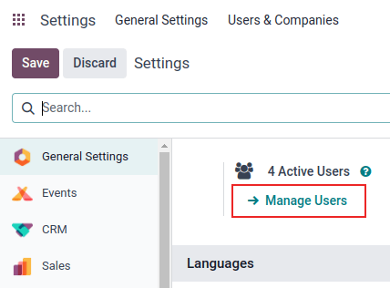
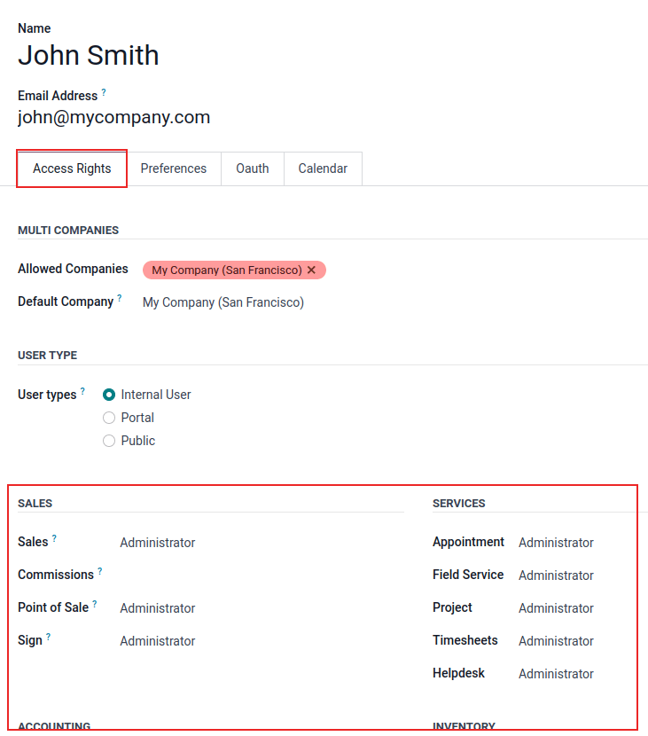
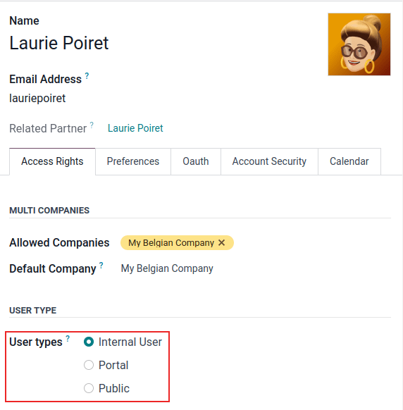
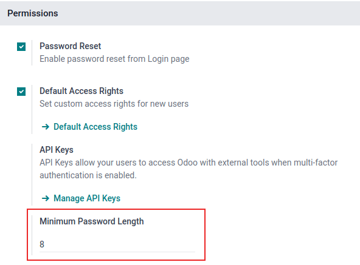
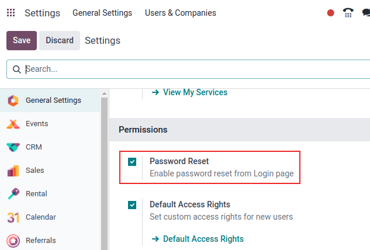
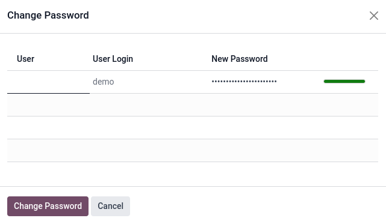
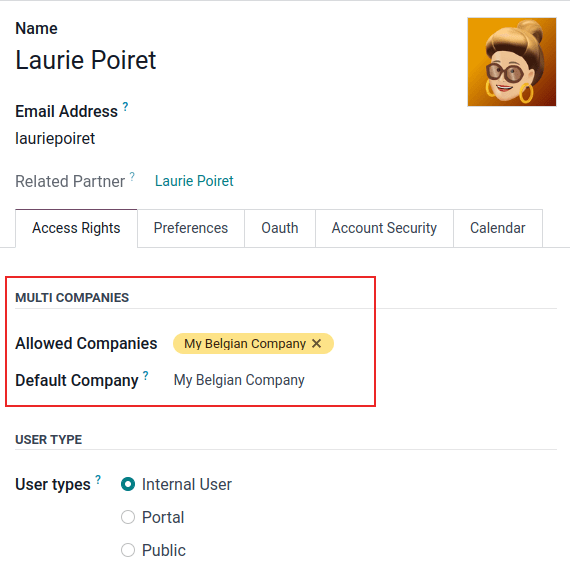

# Người dùng

Odoo defines a *user* as someone who has access to a database. An administrator can add as many
users as the company needs and, in order to restrict the type of information each user can access,
rules can be applied to each user. Users and access rights can be added and changed at any point.

#### SEE ALSO
- [Thay đổi ngôn ngữ](users/language.md)
- [Quyền truy cập](users/access_rights.md)
- [Superuser mode](users/access_rights.md#access-rights-superuser)
- [Create and modify groups](users/access_rights.md#access-rights-groups)

## Add individual users

To add new users, navigate to Settings app ‣ Users section ‣ Manage Users, and
click on New.

Fill in the form with all the required information. Under the [Access Rights](users/access_rights.md) tab, choose the group within each application the user can have access to.

The list of applications shown is based on the applications installed on the database.

After filling out all the necessary fields on the page, manually Save. An invitation
email is automatically sent to the user, using the email in the Email Address field. The
user must click on the link included in the email to accept the invitation, and to create a database
login.

#### WARNING
Nếu công ty đang sử dụng gói đăng ký theo tháng, cơ sở dữ liệu sẽ tự động được cập nhật để phản ánh số người dùng được thêm mới. Trong trường hợp công ty đang sử dụng gói theo năm hoặc nhiều năm, một biểu ngữ thông báo hết hạn sẽ xuất hiện trong cơ sở dữ liệu. Người dùng có thể nhấp vào biểu ngữ đó để tạo một báo giá upsell nhằm cập nhật gói đăng ký. Ngoài ra, người dùng cũng có thể gửi phiếu hỗ trợ <[https://www.odoo.com/help](https://www.odoo.com/help)>_ để được trợ giúp xử lý vấn đề.

### Loại người dùng

User Type can be selected from the Access Rights tab of the user form,
accessible via Settings app ‣ Users section ‣ Manage Users.

There are three types of users: Internal User, Portal, and
Public.

The Portal and Public user options do **not** allow the administrator to
choose access rights. These users have specific access rights pre-set (such as, record rules and
restricted menus), and usually do not belong to the usual Odoo groups.

## Hủy kích hoạt người dùng

To deactivate (i.e. archive) a user, navigate to Settings app ‣ Users section ‣
Manage Users. Then, tick the checkbox to the left of the user(s) to be deactivated.

After selecting the appropriate user to be archived, click the ⚙️ Actions icon, and
select Archive from the resulting drop-down menu. Then, click OK from the
Confirmation pop-up window that appears.

### Error: too many users

If there are more users in an Odoo database than provisioned in the Odoo Enterprise subscription,
the following message is displayed.

When the message appears, the database administrator has 30 days to act before the database expires.
The countdown is updated every day.

Để xử lý vấn đề:

- Add more users to the subscription by clicking the Upgrade your subscription link
  displayed in the message to validate the upsell quotation, and pay for the extra users.
- [Deactivate users](#users-deactivate), and reject the upsell quotation.

#### WARNING
Nếu công ty đang sử dụng gói đăng ký theo tháng, cơ sở dữ liệu sẽ tự động được cập nhật để phản ánh số người dùng được thêm mới. Trong trường hợp công ty đang sử dụng gói theo năm hoặc nhiều năm, một biểu ngữ thông báo hết hạn sẽ xuất hiện trong cơ sở dữ liệu. Người dùng có thể nhấp vào biểu ngữ đó để tạo một báo giá upsell nhằm cập nhật gói đăng ký. Ngoài ra, người dùng cũng có thể gửi phiếu hỗ trợ <[https://www.odoo.com/help](https://www.odoo.com/help)>_ để được trợ giúp xử lý vấn đề.

Once the database has the correct number of users, the expiration message disappears automatically
after a few days, when the next verification occurs.

## Quản lý mật khẩu

Password management is an important part of granting users autonomous access to the database at all
times. Odoo offers a few different methods to reset a user's password.

### Đặt lại mật khẩu

Sometimes, users might wish to reset their personal password for added security, so they are the
only ones with access to the password. Odoo offers two different reset options: one initiated by the
user to reset the password, and another where the administrator triggers a reset.

#### Enable password reset from login page

It is possible to enable/disable password resets directly from the login page. This action is
completed by the individual user, and this setting is enabled by default.

To change this setting, go to Settings app ‣ Permissions section, activate
Password Reset, and then click Save.

On the login page, click Reset Password to initiate the password reset process, and have
a reset-token sent to the email on file.

#### Send reset instructions

Go to Settings app ‣ Users & Companies ‣ Users, select the user from the list,
and click on Send Password Reset Instructions on the user form. An email is
automatically sent to them with password reset instructions.

#### NOTE
The Send Password Reset Instructions button **only** appears if the Odoo invitation
email has already been confirmed by the user. Otherwise, a Re-send Invitation Email
button appears.

This email contains all the instructions needed to reset the password, along with a link redirecting
the user to an Odoo login page.

### Change user password

Truy cập Ứng dụng Cài đặt ‣ Người dùng & công ty ‣ Người dùng, và chọn một người dùng để mở biểu mẫu của họ. Nhấp vào biểu tượng ⚙️ Tác vụ, sau đó chọn Thay đổi mật khẩu từ menu thả xuống. Nhập mật khẩu mới vào cột Mật khẩu mới trong cửa sổ bật lên Thay đổi mật khẩu, và xác nhận thay đổi bằng cách nhấp Thay đổi mật khẩu.

#### NOTE
This operation only modifies the password of the users locally, and does **not** affect their
odoo.com account.

If the odoo.com password needs to be changed, use the [send the password reset instructions](#users-reset-password-email). Odoo.com passwords grant access to the *My Databases* page, and
other portal features.

After clicking Change Password, the page is redirected to an Odoo login page where the
database can be re-accessed using the new password.

## Đa công ty

Trường Đa công ty trên mẫu người dùng cho phép quản trị viên cấp quyền truy cập vào nhiều công ty cho người dùng. Để cấu hình môi trường đa công ty cho một người dùng, hãy đi đến người dùng mong muốn bằng cách vào: Ứng dụng Cài đặt ‣ phần Người dùng ‣ Quản lý người dùng. Sau đó, chọn người dùng để mở biểu mẫu người dùng của họ và cấu hình quyền truy cập đa công ty.

Under Multi Companies in the Access Rights tab, set the fields labeled
Allowed Companies and Default Company.

The Allowed Companies field can contain multiple companies. These are the companies the
user can access and edit, according to the set access rights. The Default Company is the
company the user defaults to, upon logging in each time. This field can contain only **one**
company.

#### WARNING
If multi-company access is not configured correctly, it could lead to inconsistent multi-company
behaviors. Because of this, only experienced Odoo users should make access rights changes to
users for databases with a multi-company configuration. For technical explanations, refer to the
developer documentation on [Multi-company Guidelines](../../developer/howtos/company.md).

#### SEE ALSO
công ty

* [Thay đổi ngôn ngữ](users/language.md)
* [Xác thực hai yếu tố](users/2fa.md)
* [Quyền truy cập](users/access_rights.md)
* [Quyền truy cập cổng thông tin](users/portal.md)
* [Facebook sign-in authentication](users/facebook.md)
* [Google Sign-In Authentication](users/google.md)
* [Microsoft Azure sign-in authentication](users/azure.md)
* [LDAP authentication](users/ldap.md)
