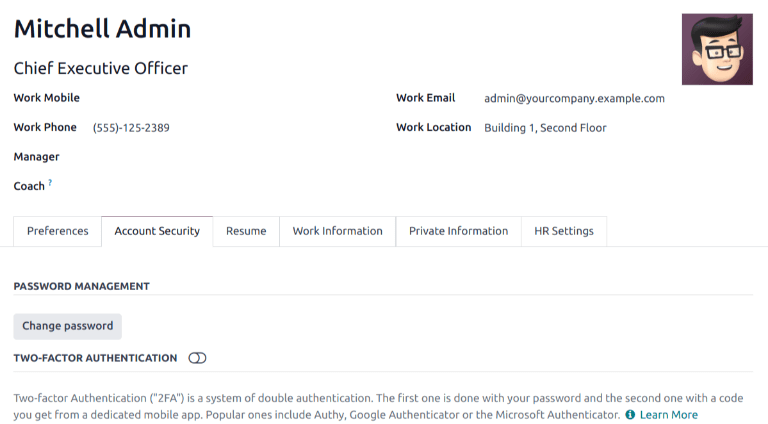
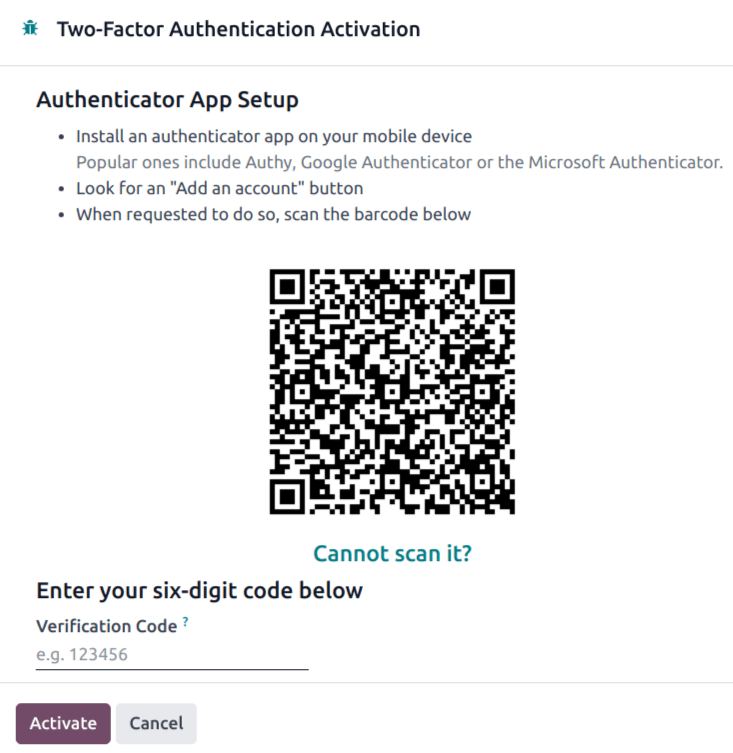
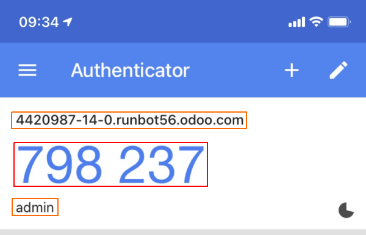
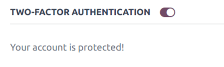
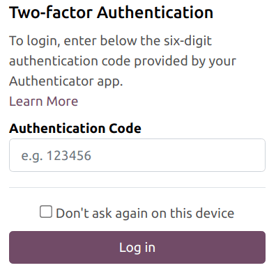
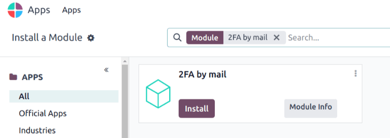
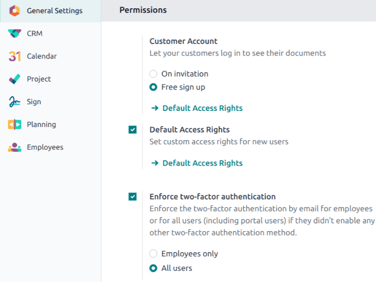

# Xác thực hai yếu tố

*Two-factor authentication (2FA)* is a way to improve security, and prevent unauthorized persons
from accessing user accounts.

Practically,  means storing a secret inside an *authenticator*, usually on a mobile phone, and
exchanging a code from the authenticator when trying to log in.

This means an unauthorized user would need to guess the account password *and* have access to the
authenticator, which is a more difficult proposition.

## Yêu cầu

#### IMPORTANT
These lists are just examples. They are **not** endorsements of any specific software.

Phone-based authenticators are the easiest and most commonly used. Examples include:

- [Authy](https://authy.com/)
- [FreeOTP](https://freeotp.github.io/)
- [Google Authenticator](https://support.google.com/accounts/answer/1066447?hl=en)
- [LastPass Authenticator](https://lastpass.com/auth/)
- [Microsoft Authenticator](https://www.microsoft.com/en-gb/account/authenticator?cmp=h66ftb_42hbak)

Password managers are another option. Common examples include:

- [1Password](https://support.1password.com/one-time-passwords/)
- [Bitwarden](https://bitwarden.com/help/article/authenticator-keys/),

#### NOTE
The remainder of this document uses Google Authenticator as an example, as it is one of the most
commonly used. This is **not** an endorsement of the product.

## Thiết lập xác thực hai yếu tố

After selecting an authenticator, log in to Odoo, then click the profile avatar in the upper-right
corner, and select My Profile from the resulting drop-down menu.

Click the Account Security tab, then slide the Two-Factor Authentication
toggle to *active*.

This generates a Security Control pop-up window that requires password confirmation to
continue. Enter the appropriate password, then click Confirm Password. Next, a
Two-Factor Authentication Activation pop-up window appears, with a  code.

Using the desired authenticator application, scan the  code when prompted.

Afterwards, the authenticator should display a *verification code*.

Enter the code into the Verification Code field, then click Activate.

## Logging in

To confirm  setup is complete, log out of Odoo.

On the login page, input the username and password, then click Log in. On the
Two-factor Authentication page, input the code provided by the chosen authenticator in
the Authentication Code field, then click Log in.

## Áp dụng xác thực hai yếu tố

To enforce the use of  for all users, first navigate to Main Odoo Dashboard ‣
Apps. Remove the Apps filter from the Search... bar, then search for `2FA
by mail`.

Click Install on the Kanban card for the 2FA by mail module.

After installation is complete, go to Settings app: Permissions. Tick the checkbox
labeled, Enforce two-factor authentication. Then, use the radio buttons to choose
whether to apply this setting to Employees only, or All users.

#### NOTE
Selecting All users applies the setting to portal users, in addition to employees.

Click Save to commit any unsaved changes.
