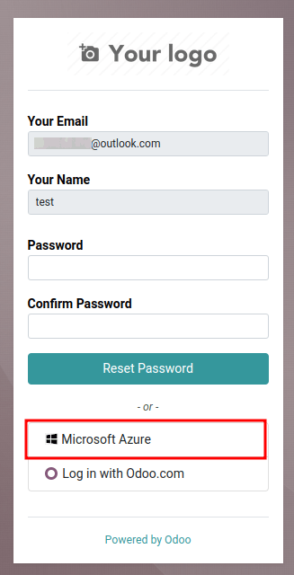
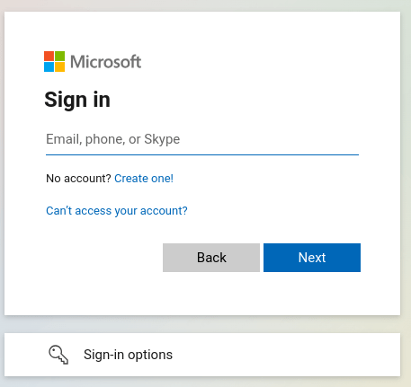

# Microsoft Azure sign-in authentication

The Microsoft Azure OAuth sign-in authentication is a useful function that allows Odoo users to sign\
in to their database with their Microsoft Azure account.

This is particularly helpful if the organization uses Azure Workspace, and wants employees within\
the organization to connect to Odoo using their Microsoft Accounts.

#### WARNING

Databases hosted on Odoo.com should not use OAuth login for the owner or administrator of the\
database as it would unlink the database from their Odoo.com account. If OAuth is set up for that\
user, the database will no longer be able to be duplicated, renamed, or otherwise managed from\
the Odoo.com portal.

#### SEE ALSO

* [Outlook Calendar synchronization](applications/productivity/calendar/outlook.md)
* [Connect Microsoft Outlook 365 to Odoo using Azure OAuth](applications/general/email_communication/azure_oauth.md)

## Cấu hình

Integrating the Microsoft sign-in function requires configuration on Microsoft and Odoo.

### Tham số hệ thống Odoo

First activate the [developer mode](applications/general/developer_mode.md#developer-mode), and then go to Settings\
‣ Technical ‣ System Parameters.

Click Create and on the new/blank form that appears, add the following system parameter`auth_oauth.authorization_header` to the Key field, and set the Value to`1`. Then click Save to finish.

### Trang chủ Microsoft Azure

#### Tạo một ứng dụng mới

Now that the system parameters in Odoo have been set up, it's time to create a corresponding\
application inside of Microsoft Azure. To get started creating the new application, go to[Microsoft's Azure Portal](https://portal.azure.com/). Log in with the Microsoft\
Outlook Office 365 account if there is one, otherwise, log in with a personal Microsoft\
account.

#### IMPORTANT

A user with administrative access to the _Azure Settings_ must connect and perform the following\
configuration steps below.

Next, navigate to the section labeled Manage Microsoft Entra ID (formally _Azure Active_\
_Directory_). The location of this link is usually in the center of the page.

Bây giờ, nhấp vào biểu tượng Thêm (+) ở menu phía trên, sau đó chọn Đăng ký ứng dụng từ menu thả xuống. Trên màn hình Đăng ký ứng dụng, đổi tên trường Tên thành `OAuth đăng nhập Odoo` hoặc tiêu đề tương tự dễ nhận biết. Trong phần Loại tài khoản được hỗ trợ, chọn tùy chọn Chỉ tài khoản trong thư mục tổ chức này (Chỉ thư mục mặc định - Chỉ một khách thuê).

#### WARNING

The Supported account types can vary by Microsoft account type and end use of the\
OAuth. For example: Is the login meant for internal users within one organization or is it meant\
for customer portal access? The above configuration is used for internal users in an\
organization.

Choose Personal Microsoft accounts only if the target audience is meant for portal\
users. Choose Accounts in this organizational directory only (Default Directory only -\
Single tenant) if the target audience is company users.

Trong phần URL chuyển hướng, chọn Web làm nền tảng, sau đó nhập `https://<odoo base url>/auth_oauth/signin` vào trường URL. cơ sở của Odoo là tên miền chính thức để truy cập phiên bản Odoo của bạn (VD: _mydatabase.odoo.com_ nếu bạn được lưu trữ trên Odoo.com) trong trường URL. Sau đó, nhấp Đăng ký để tạo ứng dụng.

#### Xác thực

Edit the new app's authentication by clicking on the Authentication menu item in the\
left menu after being redirected to the application's settings from the previous step.

Tiếp theo, loại _token_ cần thiết cho xác thực OAuth sẽ được chọn. Đây không phải là token tiền tệ mà là token xác thực được truyền giữa Microsoft và Odoo. Do đó, không mất phí cho các token này; chúng chỉ được sử dụng cho mục đích xác thực giữa hai . Chọn các token sẽ được cấp bởi endpoint ủy quyền bằng cách cuộn xuống màn hình và đánh dấu vào các ô có nhãn: Token truy cập (được sử dụng cho các chu trình ngầm) và Token ID (được sử dụng cho các chu trình ngầm và hybrid).

Click Save to ensure these settings are saved.

#### Gather credentials

Sau khi tạo và xác thực ứng dụng trong bảng điều khiển Microsoft Azure, bước tiếp theo là thu thập thông tin xác thực. Để thực hiện, nhấp vào mục menu Tổng quan ở cột bên trái. Chọn và sao chép ID ứng dụng (máy khách) trong cửa sổ hiển thị. Dán thông tin xác thực này vào bộ nhớ tạm/notepad, vì sẽ sử dụng nó để cấu hình Odoo sau này.

After finishing this step, click on Endpoints on the top menu and click the _copy icon_\
next to OAuth 2.0 authorization endpoint (v2) field. Paste this value in the clipboard /\
notepad.

### Thiết lập Odoo

Finally, the last step in the Microsoft Azure OAuth configuration is to configure some settings in\
Odoo. Navigate to Settings ‣ Integrations ‣ OAuth Authentication and check the\
box to activate the OAuth login feature. Click Save to ensure the progress is saved.\
Then, sign in to the database once the login screen loads.

Once again, navigate to Settings ‣ Integrations ‣ OAuth Authentication and\
click on OAuth Providers. Now, select New in the upper-left corner and name\
the provider `Azure`.

Paste the Application (client) ID from the previous section into the Client\
ID field. After completing this, paste the new OAuth 2.0 authorization endpoint (v2)\
value into the Authorization URL field.

For the UserInfo URL field, paste the following :`https://graph.microsoft.com/oidc/userinfo`

In the Scope field, paste the following value: `openid profile email`. Next, the Windows\
logo can be used as the CSS class on the login screen by entering the following value: `fa fa-fw fa-windows`, in the CSS class field.

Check the box next to the Allowed field to enable the OAuth provider. Finally, add`Microsoft Azure` to the Login button label field. This text will appear next to the\
Windows logo on the login page.

Save the changes to complete the OAuth authentication setup in Odoo.

### User experience flows

For a user to log in to Odoo using Microsoft Azure, the user must be on the Odoo\
password reset page. This is the only way that Odoo is able to link the Microsoft Azure account and\
allow the user to log in.

#### NOTE

Existing users must [reset their password](applications/general/users.md#users-reset-password) to access the\
Odoo password reset page. New Odoo users must click the new user invitation link\
that was sent via email, then click on Microsoft Azure. Users should not set a new\
password.

To sign in to Odoo for the first time using the Microsoft Azure OAuth provider, navigate to the\
Odoo password reset page (using the new user invitation link). A password reset\
page should appear. Then, click on the option labeled Microsoft Azure. The page will\
redirect to the Microsoft login page.

Enter the Microsoft Email Address and click Next. Follow the process to sign\
in to the account. Should be turned on, then an extra step\
may be required.

Finally, after logging in to the account, the page will redirect to a permissions page where the\
user will be prompted to Accept the conditions that the Odoo application will access\
their Microsoft information.

