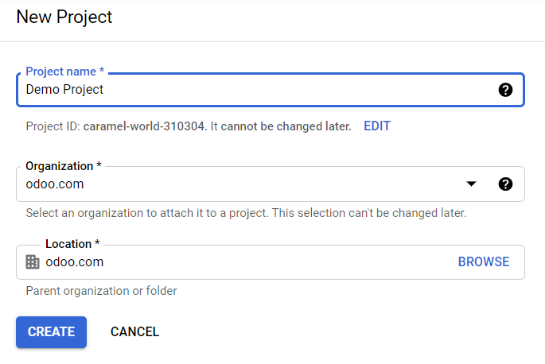
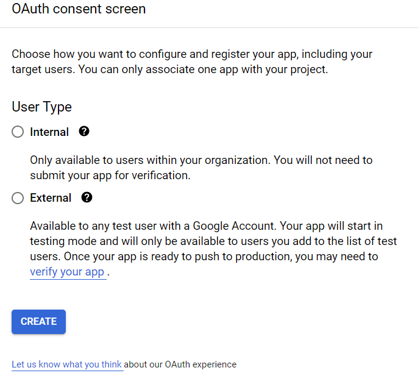

# Google Sign-In Authentication

The *Google Sign-In Authentication* is a useful function that allows Odoo users to sign in to their
database with their Google account.

This is particularly helpful if the organization uses Google Workspace, and wants employees within
the organization to connect to Odoo using their Google Accounts.

#### WARNING
Databases hosted on Odoo.com should not use Oauth login for the owner or administrator of the
database as it would unlink the database from their Odoo.com account. If Oauth is set up for that
user, the database will no longer be able to be duplicated, renamed or otherwise managed from
the Odoo.com portal.

#### SEE ALSO
- [Google Calendar synchronization](../../productivity/calendar/google.md)
- [Connect Gmail to Odoo using Google OAuth](../email_communication/google_oauth.md)

## Cấu hình

The integration of the Google sign-in function requires configuration both on Google *and* Odoo.

### Google API Dashboard

1. Go to the [Google API Dashboard](https://console.developers.google.com/).
2. Make sure the right project is opened. If there isn't a project yet, click on Create
   Project, fill out the project name and other details of the company, and click on
   Create.
   

#### OAuth consent screen

1. On the left side menu, click on OAuth consent screen.
   
2. Choose one of the options (Internal / External), and click on
   Create.
   

   #### WARNING
   *Personal* Gmail Accounts are only allowed to be **External** User Type, which means Google
   may require an approval, or for *Scopes* to be added on. However, using a *Google WorkSpace*
   account allows for **Internal** User Type to be used.

   Note, as well, that while the API connection is in the *External* testing mode, then no
   approval is necessary from Google. User limits in this testing mode is set to 100 users.
3. Fill out the required details and domain info, then click on Save and Continue.
4. On the Scopes page, leave all fields as is, and click on Save and
   Continue.
5. Next, if continuing in testing mode (*External*), add the email addresses being configured under
   the Test users step by clicking on Add Users, and then the
   Save and Continue button. A summary of the app registration appears.
6. Finally, scroll to the bottom, and click on Back to Dashboard.

#### Thông tin đăng nhập

1. On the left side menu, click on Credentials.
   
2. Click on Create Credentials, and select OAuth client ID.
   
3. Select Web Application as the Application Type. Now, configure the
   allowed pages on which Odoo will be redirected.

   In order to achieve this, in the Authorized redirect URIs field, enter the database's
   domain immediately followed by `/auth_oauth/signin`. For example:
   `https://mydomain.odoo.com/auth_oauth/signin`, then click on Create.
4. Now that the *OAuth client* has been created, a screen will appear with the Client ID
   and Client Secret. Copy the Client ID for later, as it will be necessary
   for the configuration in Odoo, which will be covered in the following steps.

### Google Authentication on Odoo

#### Retrieve the Client ID

Once the previous steps are complete, two keys are generated on the Google API Dashboard:
Client ID and Client Secret. Copy the Client ID.

#### Kích hoạt Odoo

1. Go to Odoo General Settings ‣ Integrations and activate OAuth
   Authentication.

   #### NOTE
   Odoo may prompt the user to log-in again after this step.
2. Go back to General Settings ‣ Integrations ‣ OAuth Authentication, activate
   the selection and Save. Next, return to General Settings ‣
   Integrations ‣ Google Authentication and activate the selection. Then fill out the
   Client ID with the key from the Google API Dashboard, and Save.
   

   #### NOTE
   Google OAuth2 configuration can also be accessed by clicking on OAuth Providers
   under the OAuth Authentication heading in Integrations.

## Log in to Odoo with Google

To link the Google account to the Odoo profile, click on Log in with Google when first
logging into Odoo.

> 

Existing users must [reset their password](../users.md#users-reset-password) to access the
Reset Password page, while new users can directly click on Log in with
Google, instead of choosing a new password.

#### SEE ALSO
- [Google Cloud Platform Console Help - Setting up OAuth 2.0](https://support.google.com/cloud/answer/6158849)
