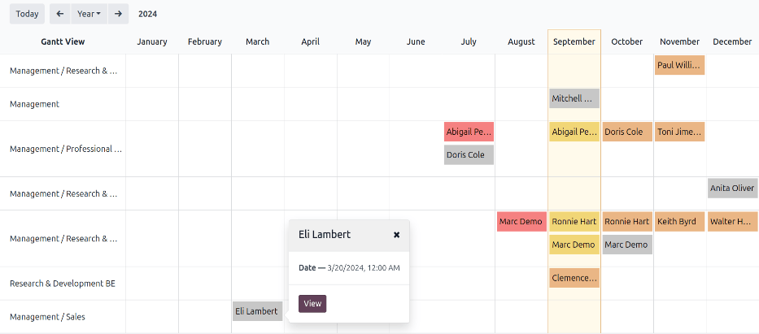
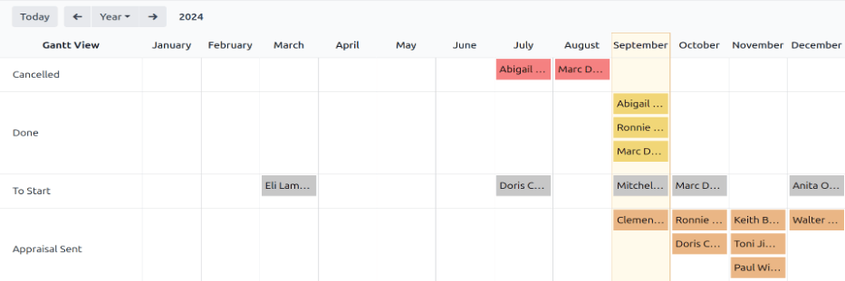
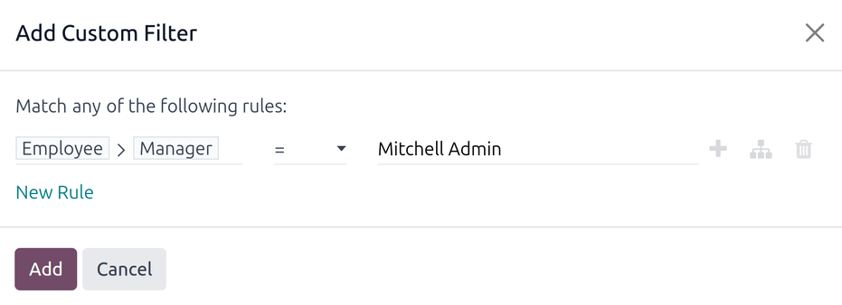
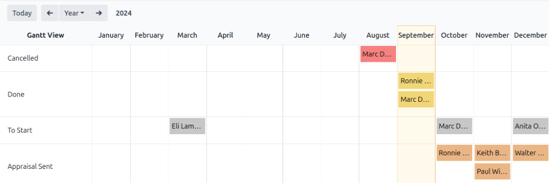

# Appraisal analysis

The **Appraisals** app has the ability to report on all the appraisals in the system, including
past, present, and future appraisals, and their respective statuses. This report helps managers
track scheduled appraisals, and identify any overdue or unconfirmed ones.

To access the *Appraisal Analysis* report, navigate to Appraisals app ‣ Reporting
‣ Appraisal Analysis.

On the Appraisal Analysis page, a report loads, displaying all the appraisals in the
database. Each entry is highlighted in a different color to represent their status:

| Màu sắc   | Trạng thái     | Meaning                                         |
|-----------|----------------|-------------------------------------------------|
| Vàng      | Hoàn tất       | The appraisal was completed.                    |
| Cam       | Appraisal Sent | The appraisal was confirmed, but not completed. |
| Đỏ        | Đã huỷ         | The appraisal was cancelled.                    |
| Xám       | To Start       | The appraisal was scheduled, but not confirmed. |

#### NOTE
Appraisals are scheduled automatically (appear in gray), according to their respective
[Appraisals plans](../appraisals.md#appraisals-appraisal-plan).

The report displays the current year, in a default Gantt view, grouped by department, with the
current month highlighted.

To change the period of time that is presented, adjust the date settings in the top-left corner of
the report by clicking the default Year to reveal a drop-down menu of options. The
options to display are Day, Week, Month, and Year.
Use the adjacent arrows to move forward or backward in time.

At any point, click the Today button to have the Gantt view include today's date in the
view.

To view the details of any appraisal, click on any appraisal. A pop-over window appears, displaying
the due date for the appraisal. To view more details, click the View button, and further
details appear in a pop-up window.

The report can have other [filters](../../essentials/search.md#search-filters) and [groupings](../../essentials/search.md#search-group) set in
the search bar at the top.

## Group by status

When a company has a large number of employees, the default Appraisal Analysis report
may display too much information to view easily. In this scenario, viewing the data by status can be
beneficial.

First, remove the default <i class="oi oi-group"></i> Department grouping from the search bar.
Next, click the <i class="fa fa-caret-down"></i> (down arrow) icon in the far-right of the search
bar. Click Status in the <i class="oi oi-group"></i> Group By column. Click away from
the drop-down menu to close it.

All the appraisals are now organized by status, in the following order: Cancelled,
Done, To Start, and Appraisal Sent.

This view makes it easy to see which appraisals need to be completed, and when, as well as which
appraisals still need to be confirmed.

## Use case: view only the user's appraisals

When viewing the Appraisal Analysis report, it can save time to only view the appraisals
the signed-in user is responsible for, and hide the rest.

To only view this data, click the <i class="fa fa-caret-down"></i> (down arrow) icon in the
far-right of the search bar, revealing a drop-down menu.

#### NOTE
It is not necessary to remove the default <i class="oi oi-group"></i> Department grouping. If it
remains active, the results are grouped by department. If it is removed, the results appear in a
list, alphabetically.

Click Add Custom Filter at the bottom of the <i class="fa fa-filter"></i> Filters
column, and a Add Custom Filter pop-up window appears.

Nhấp vào trường đầu tiên, một cửa sổ bật lên sẽ xuất hiện với nhiều tùy chọn. Nhấp vào biểu tượng <i class="fa fa-chevron-right"></i> (mũi tên phải) sau từ Nhân viên, sau đó cuộn xuống và chọn Quản lý. Tiếp theo, đặt trường giữa thành = (bằng). Cuối cùng, nhấp vào trường thứ ba và chọn người dùng mong muốn từ danh sách. Khi tất cả các trường đã được thiết lập, nhấp vào Thêm.

Now, the only appraisals that appear are the appraisals that the selected user is responsible for,
instead of viewing *all* the appraisals.

This report can also be [grouped by status](#appraisals-group-status).

#### SEE ALSO
- [Odoo essentials reporting](../../essentials/reporting.md)
- [Tìm kiếm, lọc, và nhóm bản ghi](../../essentials/search.md)
