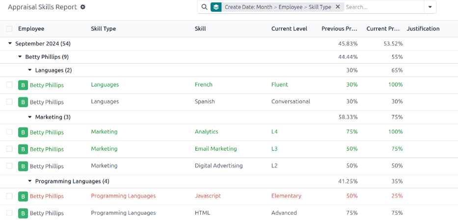
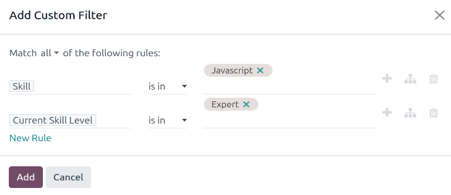
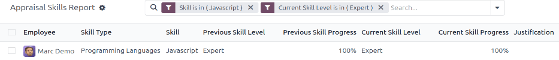

# Tiến triển kỹ năng

In Odoo's **Appraisals** app, it is possible to view employee's skills as they progress over time in
the [Skills Evolution](#appraisals-identify-skills-evolution) report, also known as the
*Appraisal Skills Report*.

Managers can use this to see who is achieving their various skill goals set on their appraisals, who
is meeting their skill deadlines, who has the highest performance in terms of skill development, and
more.

The *Skills Evolution* report also provides the ability to [search for employees with specific
skills](#appraisals-identify-skills) at certain levels, which can be helpful for scenarios where
specific skills are required.

## Skills evolution report

To access this *Skills Evolution* report, navigate to Appraisals app ‣ Reporting
‣ Skills Evolution.

Doing so reveals the Appraisal Skills Report page, which displays a report of all
skills, grouped by employee, in alphabetical order, by default.

#### NOTE
Skill levels are **only** updated after an appraisal is marked as done. Any skill level changes
from ongoing appraisals that have **not** been finalized are **not** included in this report.

All the Employee lines are expanded, with all the various skill types nested below. Each
individual skill type is collapsed, by default. To view the individual skills contained within a
skill type, click anywhere on the skill type line to expand the data.

Each skill has the following information listed:

- Employee: the name of the employee.
- Skill Type: the category the skill falls under.
- Skill: the specific, individual skill.
- Previous Skill Level: the level the employee had previously achieved for the skill.
- Previous Skill Progress: the previous percentage of competency achieved for the skill
  (based on the Skill Level).
- Current Skill Level: the current level the employee has achieved for the skill.
- Current Skill Progress: the current percentage of competency achieved for the skill.
- Justification: any notes entered on the skill, explaining the progress.

The color of the skill text indicates any changes from the previous appraisal. Skill levels that
have increased since the last appraisal appear in green, as an *Improvement*. Skill levels that have
**not** changed appear in black, as *No Change*. Skills that have regressed appear in red, as
*Regression*.

This report can be modified to find specific information by adjusting the [filters](../../essentials/search.md#search-filters) and [groupings](../../essentials/search.md#search-group) set in the search bar at the top.

## Use case: Identify employees with specific skills

Since the Appraisal Skills Report organizes all skills by employee, it can be difficult
to find employees with a specific skill at a specific level. To find these employees, a custom
filter must be used.

In this example, the report is modified to show employees with an expert level of Javascript
knowledge. To view only those employees, first remove all active filters in the search bar.

Next, click the <i class="fa fa-caret-down"></i> (down arrow) icon in the search bar, then click
Add Custom Filter beneath the <i class="fa fa-filters"></i> Filters column to load an
Add Custom Filter pop-up window.

Using the drop-down menu in the first field, select Skill. Then, keep the second field
as-is, and select Javascript from the third drop-down menu in the third field.

Next, click New Rule, and another line appears. In this second line, select
Current Skill Level for the first drop-down field, leave the second field as-is, then
select Expert for the third drop-down field.

After the New Rule button is clicked, the word "any" in the sentence
Match any of the following rules:, changes from plain text into a drop-down menu. Click
the <i class="fa fa-caret-down"></i> (down arrow) icon after the word any, and select
all.

Finally, click the Add button.

Now, only employees that have an Expert level for the skill Javascript
appear. In this example, only Marc Demo meets these criteria.

#### SEE ALSO
- [Odoo essentials reporting](../../essentials/reporting.md)
- [Tìm kiếm, lọc, và nhóm bản ghi](../../essentials/search.md)
