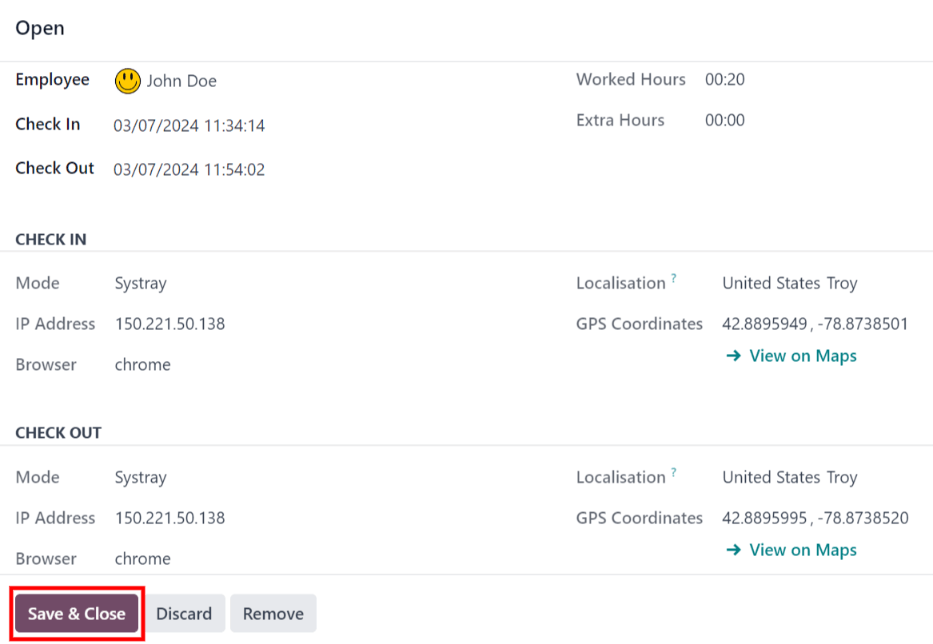
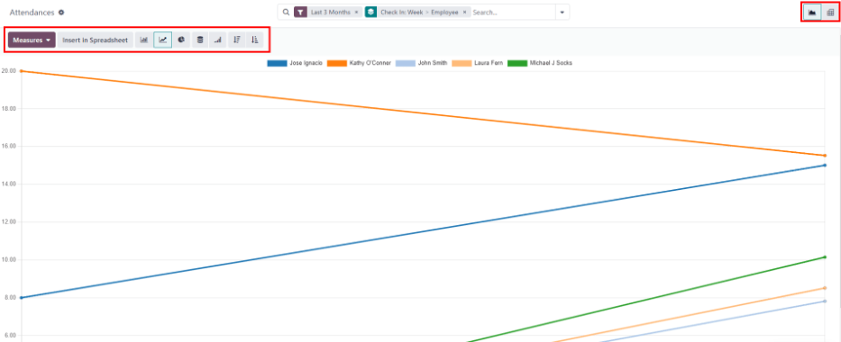

# Chấm công

Ứng dụng *Chấm công* của Odoo hoạt động như một đồng hồ chấm công. Nhân viên có thể check-in/out nơi làm việc bằng thiết bị chuyên dụng ở chế độ ki-ốt, trong khi người dùng Odoo cũng có thể check-in/out nơi làm việc ngay từ cơ sở dữ liệu. Quản lý có thể nhanh chóng xem ai có mặt tại bất kỳ thời điểm nào, tạo báo cáo để xem giờ làm việc của mọi nhân viên và có được thông tin chi tiết về nhân viên nào đang làm thêm giờ hoặc check-out sớm hơn dự kiến.

## Quyền truy cập

It is important to understand how the different access rights affect what options and features users
can access in the *Attendances* application.

Every user in the database is able to check in and out directly from the database, without needing
access to the *Attendances* application. Additionally, all users can access their own attendance
records from their employee form in the *Employees* app.

Access to both the *Attendances* application, and the various features within the application is
determined by access rights.

Để xem quyền truy cập của người dùng, hãy đi đến Ứng dụng Cài đặt ‣ Người dùng & công ty: Người dùng và nhấp vào một người dùng cụ thể. Tab Quyền truy cập sẽ hiển thị theo mặc định. Cuộn xuống phần Nhân sự để xem cài đặt. Đối với trường Chấm công, các tùy chọn là để trống trường này hoặc chọn Quản trị viên.

If the Administrator option is selected, the user has full access to the entire
*Attendances* application, with no restrictions. They can view all employee attendance records,
enter *Kiosk mMode* from the application, access all reporting metrics, and make modifications to
the settings. If left blank, the user does **not** have access to the *Attendances* application.

### Người phê duyệt

Kịch bản **khác** duy nhất mà thông tin khác nhau có thể truy cập được trong ứng dụng *Chấm công* là dành cho người phê duyệt. Nếu người dùng *không* có quyền quản trị trên ứng dụng *Chấm công*, nhưng họ được đặt làm người phê duyệt của nhân viên trên ứng dụng *Chấm công*, thì người dùng này có thể xem hồ sơ chấm công của nhân viên đó, cũng như thực hiện các sửa đổi đối với hồ sơ chấm công của nhân viên đó, nếu cần. Điều này áp dụng cho tất cả nhân viên mà người dùng được liệt kê là người phê duyệt ứng dụng *Chấm công*. Người phê duyệt thường là quản lý, mặc dù điều này không bắt buộc.

Để xem ai là người phê duyệt chấm công của một nhân viên, hãy đi đến ứng dụng Nhân viên và nhấp vào nhân viên cụ thể. Nhấp vào tab Thông tin công việc, cuộn xuống phần Người phê duyệt, và kiểm tra trường Chấm công. Người được chọn có thể xem hồ sơ chấm công của nhân viên đó trên bảng trang chủ của ứng dụng *Chấm công* cũng như trong các báo cáo chấm công, và có thể chỉnh sửa hồ sơ của họ.

## Cấu hình

Few configurations are needed in the *Attendances* application. Determining how employees check in
and out, defining how the kiosks function, and determining how extra hours are computed are all set
in the Configuration menu. Navigate to the Attendances application ‣
Configuration to access the configuration menu.

### Chế độ

- Attendances from Backend: activate this selection to allow users to check in and out
  directly from the Odoo database. If this is not activated, users must use a kiosk to check in and
  out of work.

### Giờ làm thêm

This section specifies how extra time is calculated, including when extra time is counted and what
time is not logged.

- Count of Extra Hours: enable this box to allow employees to log extra hours beyond
  their set working hours (sometimes referred to as *overtime*). Activating this selection displays
  the following settings as well. If this is not activated, no other configurations appear.
  - Start From: the current date is automatically entered in this field. If desired,
    click on this field and use the calendar selector to modify the start date on which extra hours
    are logged.
  - Tolerance Time In Favor Of Company: enter the amount of time, in minutes, that is
    **not** counted towards an employee's overtime. When an employee checks out, and the extra time
    logged is below the specified minutes, the extra time is **not** counted as overtime for the
    employee.
  - Tolerance Time In Favor Of Employee: enter the amount of time, in minutes, that an
    employee is given, that does **not** adversely affect their attendance if they log less time
    than their working hours. When an employee checks out, and the total time logged for the day is
    less than their specified working hours and less than this specified grace period, they are
    **not** penalized for their reduced hours.
  - Display Extra Hours: activate this box to display the extra hours logged by an
    employee when they check out with a kiosk, or when a user checks out in the database.

#### NOTE
Employees are still able to log overtime hours even if the Count of Extra Hours
option is not activated. The difference is that when Count of Extra Hours is
activated, the extra hours can be [deducted from an approved time off request](applications/hr/time_off.md#time-off-deduct-extra-hours).

## Tổng quan

When entering the *Attendances* application, the Overview dashboard is presented,
containing all the check in and check out information for the signed in user. If the user has
specific [access rights](#attendances-access-rights) and/or are [approvers](#attendances-approvers) for specific employees, then those additional employee's check in and check
out information is also visible on the Overview dashboard.

### Lượt xem

To change the view from the default Gantt chart to a list view, click the List icon in
the top right of the dashboard, beneath the user's photo. To switch back to the Gantt chart, click
the Gantt button, located next to the List button.

Chế độ xem mặc định hiển thị thông tin của ngày hiện tại. Để hiển thị thông tin cho Tuần, Tháng hoặc Năm, hãy nhấp vào nút Ngày để hiển thị danh sách thả xuống, hiển thị các tùy chọn khác đó. Chọn chế độ xem mong muốn và trang chủ sẽ cập nhật, hiển thị thông tin đã chọn. Để thay đổi Ngày, Tuần, Tháng hoặc Năm được hiển thị, hãy nhấp vào các nút ← (mũi tên trái) hoặc → (mũi tên phải) ở cả hai bên của menu thả xuống. Để quay lại chế độ xem có chứa ngày hiện tại, hãy nhấp vào nút Hôm nay. Thao tác này sẽ làm mới trang chủ, hiển thị thông tin có chứa thông tin của ngày hiện tại.

In the Day view, the column for the current hour is highlighted in yellow. If the
Week or Month view is selected, the column for the current day is
highlighted. If the Year view is selected, the current month is highlighted.

Any entries that have errors appear in red, indicating they need to be resolved by a user with the
proper [access rights](#attendances-access-rights) and/or are [approvers](#attendances-approvers) for the employee(s) with the errors.

### Filters and groups

Để lọc kết quả trên trang chủ hoặc hiển thị các nhóm thông tin khác nhau, nhấp nút 🔻 (tam giác thả xuống) bên phải thanh Tìm kiếm phía trên trang chủ, sau đó chọn một trong các tùy chọn Bộ lọc hoặc Nhóm theo có sẵn. Có nhiều bộ lọc và nhóm cấu hình sẵn để lựa chọn, cùng với tùy chọn tạo bộ lọc/nhóm tùy chỉnh.

#### Bộ lọc

The default filters that can be selected are:

- My Attendances: this filter only presents the user's attendance data.
- My Team: this filter presents the attendance data for the user's team.
- At Work: this filter displays the attendance data for everyone currently checked in.
- Errors: this filter displays any entries with [errors](#attendances-errors) that
  need to be resolved.
- Check In: this filter has a drop-down to further select a specific time period. Select
  the desired time period from the options presented, a specific month, quarter, or year.
- Last 7 days: this filter presents the attendance data for the last seven days.
- Add Custom Filter: create a custom filter using the pop-up that appears when this is
  selected.

#### Nhóm

The default groups that can be selected are:

- Check In: this grouping presents a drop-down menu containing the following time period
  options: Year, Quarter, Month, Week, and
  Day. Selected the time period to display all the check-in information, grouped by the
  selected time period.
- Employee: this group presents the attendance data organized by employee.
- Check Out: this grouping presents a drop-down menu containing the following time
  period options: Year, Quarter, Month, Week, and
  Day. Selected the time period to display all the check-out information, grouped by the
  selected time period.
- Add Custom Group: this option displays a drop-down menu with a variety of options to
  group the attendance data by, including City, Country, Mode,
  and IP Address.

### Attendance log details

Odoo captures various time and location details when a user checks in and out. The specific details
provided are determined by the method the user checked in and out.

To view the specific check in and/or check out details for an employee, click on an individual entry
in the overview dashboard.

A detailed attendance log for the user appears in a pop-up window. To close the detailed attendance
log, click the Save & Close button in the bottom-left corner of the form.

The detailed attendance log contains the following information:

#### Main details

- Employee: the name of the employee.
- Check In: the date and time the employee checked in.
- Check Out: the date and time the employee checked out. This only appears if the
  employee has checked out.
- Worked Hours: the total amount of time the employee logged for the day, in an hour and
  minute format (HH:MM). This value calculates all the checks in and check outs for the day, if the
  employee checked in and out multiple times.
- Extra Hours: any extra hours the employee logged that is beyond their expected working
  hours.

#### Check in/check out details

The following information appears for both the Check In and Check Out
sections.

- Mode: the method with which the attendance information was gathered.
  Systray is displayed if the employee logged in and out [directly from the
  database](applications/hr/attendances/check_in_check_out.md#attendances-check-in), Manual is displayed if the employee logged in and
  out [using an attendance kiosk](applications/hr/attendances/kiosks.md#attendances-kiosk-mode-entry).
- IP Address: the IP address for the computer the employee used to log in or out.
- Browser: the web browser the employee used to log in or out.
- Localization: the city and country associated with the computer's IP address.
- GPS Coordinates: the specific coordinates when the user logged in or out. To view the
  specific coordinates on a map, click the → View on Maps button beneath the
  GPS Coordinates. This opens a map in a new browser tab, with the specific location
  pointed out.

### Lỗi

Entries that contain an error appear on the overview dashboard in red. In the Gantt
view, the entry appears with a red background. If in the List view, the entry text
appears in red.

An error typically occurs when an employee has checked in but has not checked out within the last
24 hours, or when an employee has a check in and check out period spanning over 16 hours.

Để sửa lỗi, mục nhập chấm công phải được sửa đổi hoặc xóa. Nhấp vào mục nhập để hiển thị cửa sổ bật lên chứa thông tin chi tiết cho mục nhập cụ thể đó. Để sửa đổi thông tin Check In và/hoặc Check Out, hãy nhấp vào trường Check In hoặc Check Out và một công cụ chọn ngày sẽ xuất hiện. Nhấp vào ngày mong muốn, sau đó sử dụng công cụ chọn thời gian bên dưới lịch để chọn thời gian cụ thể cho mục nhập. Khi thông tin chính xác, hãy nhấp vào Áp dụng

When all the information on the pop-up is correct, click Save & Close. When the entry no
longer has an error, the entry appears in gray instead of red.

To delete an entry, click Remove on the pop-up instead of making modifications to the
entry.

## Báo cáo

To view attendance reports, click Reporting in the top menu. The default report displays
each employee's attendance information for the past 3 months, in a Line Chart.

The default view is a Graph. To view the data in a pivot table, click the
Pivot Table button on the top right of the report. To switch back to the graph view,
click the Graph button, located next to the Pivot Table button.

To present different information, adjust the [filters and groups](#attendances-filters-groups)
in the same way as in the Overview dashboard.

The data can be presented in either a Bar Chart, Line Chart, Pie
Chart, Stacked chart, or in Descending or Ascending order. To
change the view to any of these charts, click the corresponding button above the displayed chart.

To change the Measures, click the Measures button and select the desired
measure from the drop-down menu.

The report can also be inserted into a spreadsheet. Click the Insert in Spreadsheet
button and a pop-up appears. Select the desired spreadsheet, and click Confirm.

#### SEE ALSO
- [Check in and out](applications/hr/attendances/check_in_check_out.md)
- [Ki-ốt](applications/hr/attendances/kiosks.md)
- [Phần cứng](applications/hr/attendances/hardware.md)

* [Check in and out](applications/hr/attendances/check_in_check_out.md)
* [Ki-ốt](applications/hr/attendances/kiosks.md)
* [Phần cứng](applications/hr/attendances/hardware.md)
