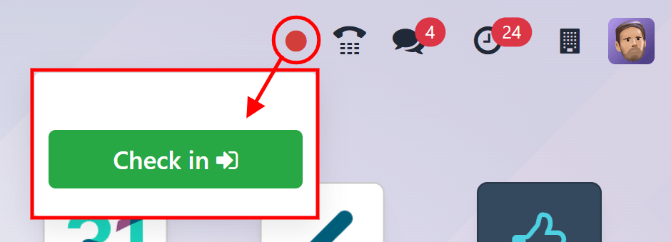
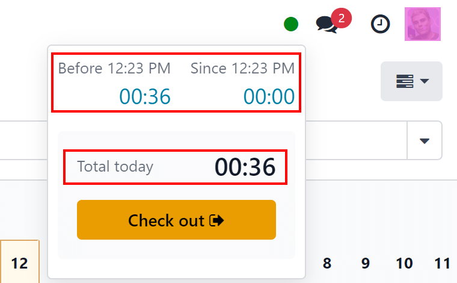

# Check in and out

Odoo's *Attendances* application allows users, who are logged into the database, to check in and
out, without needing to go into the *Attendances* application, or use a kiosk. For smaller
companies, where every employee is also a user, this feature may be useful.

Người dùng có thể chấm check in/out trên bảng điều khiển chính của cơ sở dữ liệu Odoo hoặc khi đang ở trong bất kỳ ứng dụng nào. Để thực hiện, ở góc trên cùng bên phải của menu tiêu đề chính (luôn hiển thị bất kể người dùng đang ở ứng dụng nào), sẽ hiển thị biểu tượng 🔴 (vòng tròn đỏ) hoặc 🟢 (vòng tròn xanh). Nhấp vào vòng tròn màu để hiển thị ích chấm công, cho phép người dùng check in/out.

## Check-in

If the attendance widget circle is red, this indicates the user is not currently checked in. Click
the 🔴 (red circle), and the attendance widget appears, displaying a green
Check in <i class="fa fa-sign-in"></i> button.

When the user checks in from the database, the *Attendances* app logs the location details for the
user, including the IP Address and GPS coordinates.

#### IMPORTANT
For the *Attendances* app to log the location details, the user must allow their computer to
access their location information.

Nếu người dùng chưa check in/out trong ngày làm việc hiện tại, nút này là mục duy nhất hiển thị trong tiện ích. Nếu người dùng đã chấm công trước đó, trường Tổng hôm nay sẽ xuất hiện phía trên nút, hiển thị tổng thời gian đã ghi nhận trong ngày dưới định dạng HH:MM (giờ:phút).

Click the Check in <i class="fa fa-sign-in"></i> button to check in. The 🔴 (red
circle) in the top menu changes to green, and the widget changes appearance, as well. The widget
updates to reflect that the user has checked in, by changing the green Check in
<i class="fa fa-sign-in"></i> button to a yellow Check out <i class="fa fa-sign-out"></i> button.

Click anywhere on the screen to close the attendance widget.

## Check-out

Nếu người dùng thực hiện check out lần đầu, Từ HH:MM (SA/CH) sẽ xuất hiện ở đầu tiện ích, với thời gian người dùng check in được hiển thị trong trường thời gian. Bên dưới dòng đó, số giờ và phút đã trôi qua kể từ khi check in được hiển thị dưới dạng HH:MM. Khi thời gian trôi qua, giá trị này sẽ được cập nhật để phản ánh số giờ và phút đã trôi qua kể từ khi người dùng check in.

Nếu người dùng đã từng check in và check out trước đó, các trường bổ sung sẽ được hiển thị. Một trường Trước HH:MM (SA/CH) sẽ xuất hiện cùng với trường Từ HH:MM (SA/CH). Thời gian hiển thị trong cả hai trường này khớp với nhau và được điền bằng thời gian check in gần nhất. Bên dưới trường Trước HH:MM (SA/CH), thời gian đã ghi nhận trước đó sẽ được hiển thị dưới định dạng HH:MM (giờ:phút).

In addition, beneath both of these fields, a Total today field appears. This field is
the sum of both the Before HH:MM (AM/PM) and Since HH:MM (AM/PM) fields, and
is the total time that is logged for the user, if they were to log out at that moment.

As time passes, both the Since HH:MM (AM/PM) and Total today fields are
updated live. To check out, click the yellow Check out <i class="fa fa-sign-out"></i> button. The
attendance widget updates again, displaying the Total today field with the logged time,
while the yellow Check out <i class="fa fa-sign-out"></i> button changes to a green
Check in <i class="fa fa-sign-in"></i> button.

When the user checks out from the database, the *Attendances* app logs the location details for the
user. This information is **only** logged if the user allows their computer to access this
information.

