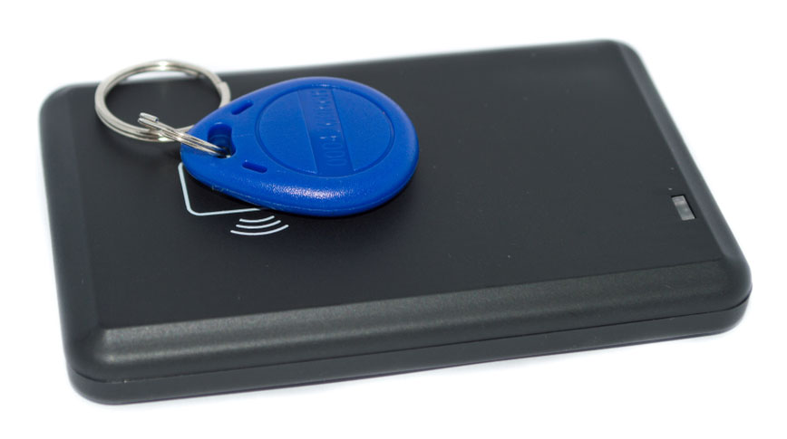

# Phần cứng

Employees who are **not** database users, and therefore, do **not** have access to the *Attendances*
app, must sign in and out of work using a kiosk. The following are the physical requirements for
setting up a kiosk.

## Kiosk devices

A kiosk is a self-service station, where employees can [check in and out of work](kiosks.md#attendances-kiosk-mode-entry) with either a [badge](#attendances-hardware-badges) or an
[RFID key fob](#attendances-hardware-rfid). Typically, these devices are dedicated as kiosks
only, but any device with an internet browser is able to be set up as a kiosk.

A kiosk is used by navigating to the webpage specified in the [configuration](kiosks.md#attendances-kiosk-settings) section of the *Attendances* app.

Kiosks are set up using one of the following types of devices:

- Laptop or Desktop computer
- Máy tính bảng
- Mobile phone (Android or iOS)

## Huy chương

Badges are a way for employees to quickly sign in and out from a kiosk, as badges are scanned by the
kiosk's camera to quickly identify the employee.

To generate a badge, first navigate to the Employees app. Next, click on the
desired employee card to open the employee's form, then click the HR Settings tab.

Trong phần CHẤM CÔNG/ĐIỂM BÁN HÀNG/SẢN XUẤT, có một trường ID thẻ. Nếu trường này trống, hãy nhấp Tạo ở cuối dòng ID thẻ và trường sẽ tự động được điền bằng một số ID thẻ mới. Sau đó, nhấp In thẻ ở cuối số ID thẻ để tạo tệp PDF của thẻ.

If a badge ID number is already present on the employee form, there is no Generate
button, only a Print Badge button.

The employee's badge contains the employee's photo, name, job position, company logo, and a barcode
that can be scanned at a kiosk to check in and out.

Badges can be printed for employees using any thermal or inkjet printer.

#### NOTE
Badges are **not** required, as employees can manually identify themselves on the kiosk.

### Máy quét mã vạch

When using badges to check in and out, the barcode **must** be scanned to identify the employee.
This can be done with the kiosk's camera, if one is available on the device.

If a camera is **not** available on the kiosk device, an external barcode scanner must be used to
scan badges.

Kiosks work with most USB barcode scanners. Bluetooth barcode scanners are also supported for
devices without USB ports, or if a wireless connection is desired.

Follow the manufacturer's instructions on the barcode scanner to properly connect the barcode
scanner to the kiosk device.

#### NOTE
An IoT box is **not** required to use a barcode scanner.

## Đầu đọc thẻ chìa khóa RFID

Instead of using a [badge](#attendances-hardware-badges), employees can scan a personal RFID
key fob with an RFID reader to check in and out of work.

It is **required** to purchase *both* RFID key fobs and an RFID reader to use this method to check
in and out. Follow the manufacturer's directions to install the RFID reader, and set up the RFID key
fob.

#### NOTE
An IoT box is **not** required to use RFID key fobs.
