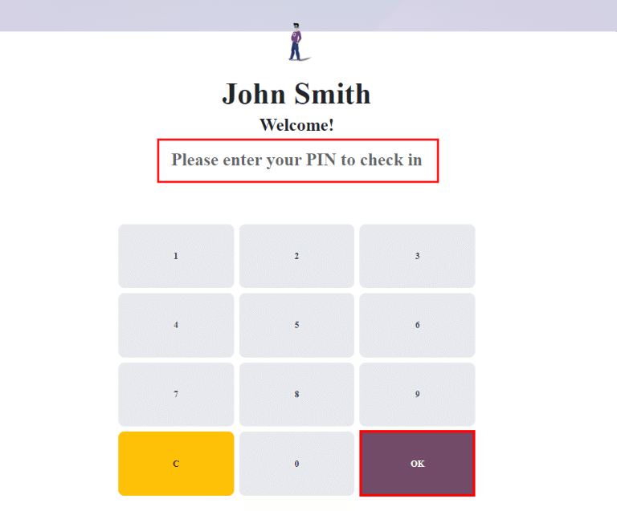
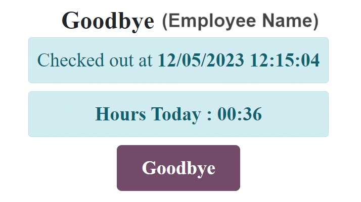

# Ki-ốt

Odoo's _Attendances_ app allows employees to check in and out of work directly from the database, or\
from a kiosk.

A kiosk is a [dedicated device](hardware.md) (a PC, tablet, or mobile phone) for employees to use
when they check in and out.

Kiosks are needed for employees who do **not** have access to the database.

Only employees with access to the database can check in and out from the _Attendances_ app, and they\
are referred to as _users_.

#### IMPORTANT
If employees [check in and out](#attendances-kiosk-mode-entry) using a badge or an RFID,
then an [accessible device](hardware.md) in [Kiosk Mode](#attendances-kiosk-mode)
**must** be available in order to use these two methods.

## Cấu hình

There are only a few configurations needed to use kiosks in the _Attendances_ application. Navigate\
to Attendances app ‣ Configuration to access the Settings page to\
configure the [Kiosk Mode section](kiosks.md#attendances-kiosk-mode) and the [Kiosk Settings section](kiosks.md#attendances-kiosk-settings).

Once all desired settings have been configured, click the Save button on the\
Settings page, to activate and enable them.

### Kiosk Mode section

Using the drop-down menu, select how an employee checks in when using a kiosk. Options are\
Barcode/RFID, Barcode/RFID and Manual Selection, or Manual\
Selection.

#### NOTE

The _Barcode_ application **does not** need to be installed to use one of the Barcode/RFID\
settings.

### Kiosk Settings section

The various settings in the Kiosk Settings section determine how employees check in and\
out with kiosks.

*   Barcode Source: this setting **only** appears if one of the two _Barcode/RFID_\
    selections were configured for the [Kiosk Mode](kiosks.md#attendances-kiosk-mode) setting.

  If available, select how barcodes are scanned at the kiosk, via one of the drop-down menu options.
  Barcodes can be scanned with a dedicated Scanner, or with a device's camera
  (Front Camera or Back Camera).
- Employee PIN Identification: tick this checkbox if employees should use a unique PIN
  to check in. PINs are configured on each individual employee record. Refer to the [new
  employee documentation](../employees/new_employee.md#employees-hr-settings) documentation for more information on setting up
  PINs.
* Display Time: determine how many seconds a check-in/check-out confirmation message\
  remains on the kiosk screen before returning to the main check in screen.
*   Attendance Kiosk Url: Odoo generates a unique web address (URL) to use a device as a\
    kiosk, without having to sign in to the Odoo database. When setting up a kiosk device, navigate to\
    this unique web address in a web browser to present the _Attendances_ app kiosk.

    **IMPORTANT**

    Các URL ki-ốt này **không** được bảo mật bằng bất kỳ loại mã truy cập nào. Bất kỳ ai có URL đều có thể truy cập ứng dụng _Chấm công_ ở chế độ ki-ốt. Nếu URL bị xâm phạm vì bất kỳ lý do gì, chẳng hạn như trong trường hợp vi phạm bảo mật, hãy nhấp vào Tạo URL chế độ ki-ốt mới, nằm bên dưới liên kết, để tạo URL mới và cập nhật ki-ốt tương ứng.

## Kiosk mode

Entering *Kiosk Mode* is **only** available for users with specific [access rights](../attendances.md#attendances-access-rights).

_Kiosk Mode_ can be activated in two different ways:

1. Navigate to the Attendances app, and click Kiosk Mode in the top\
   menu. The device then signs out of Odoo and enters _Kiosk Mode_.
2. Navigate to the Attendances app ‣ Configuration. In the Kiosk\
   Settings section, use the link in the Attendance Kiosk Url field to open _Kiosk_\
   _Mode_ on any device.

As a security measure, once a device is in _Kiosk Mode_, it is not possible to go back into the\
database without signing back in.

#### NOTE

At any time, a new kiosk URL can be generated, if needed. Click the Generate a new Kiosk Mode URL

To exit _Kiosk Mode_, just close the tab in the web browser or return to the main log-in screen of\
Odoo.

## Check in and out with a kiosk

### Huy hiệu

To check in or out using a badge, tap the Tap to scan image in the\
center of the kiosk.

Then, scan the barcode on the badge using the method configured in the [Kiosk Settings](kiosks.md#attendances-kiosk-settings) section of the configuration menu.

Once the barcode is scanned, the employee is checked in or out, and a [confirmation message](kiosks.md#attendances-confirmation) appears with all the information.

### RFID

To check in or out using an RFID key fob, simply scan the fob with an RFID reader.

Once scanned, the employee is either checked in or checked out, and a [confirmation message](kiosks.md#attendances-confirmation) appears with all the information.

### Thủ công

Users who do not have a scannable badge, or an RFID fob, can manually check in and out at a kiosk.

Tap the Identify Manually button on the kiosk, and a screen appears with all the\
employees that can be checked in or out. The _Employees_ application dashboard has the same display.

Tap on a person to check them in or out, and a [confirmation message](kiosks.md#attendances-confirmation) appears.

There are two ways to quickly find a specific person:

* Search...: tap on the Search... field, and enter the desired person's\
  name. As the name is typed in, the matching results are displayed on the screen.
* Department: tap on any desired selection in the Department section,\
  located on the left-side of the screen, to **only** view employees from that specific department.\
  The number at the end of each listed Department represents how many employees that\
  department has.

#### MÃ SỐ

If the Employee PIN Identification checkbox was ticked in the [Kiosk Settings](kiosks.md#attendances-kiosk-settings) section of the configuration menu, the employee is prompted to enter a\
PIN when manually checking in or out.

After the employee is selected, a number pad appears with a message. When checking in,\
(Employee) Welcome! Please enter your PIN to check in appears above the numbers. When\
checking out, (Employee) Want to check out? Please enter your PIN to check out appears\
above the numbers.

Tap in the PIN using the number pad, then tap OK when done. The employee is then checked\
in or out, and a [confirmation message](kiosks.md#attendances-confirmation) appears.

### Confirmation message

When an employee checks in or out, a confirmation message appears, with all the check in or check\
out information. When checking in, a welcome message appears, as well as the date and time of check\
in.

An Hours Previously Today: HH:MM field also appears, displaying any time that has\
already been logged for that employee for the day. If no time has been logged, the value displayed\
is: `00:00`. Beneath the message is an OK button.

To exit the screen before the preset time in the kiosk, tap the OK button.

When checking out, the screen displays a goodbye message, with the date and time of check out, and\
the total hours logged for the day. Beneath the message is a Goodbye button. To exit the\
screen before the preset time, tap the Goodbye button.

