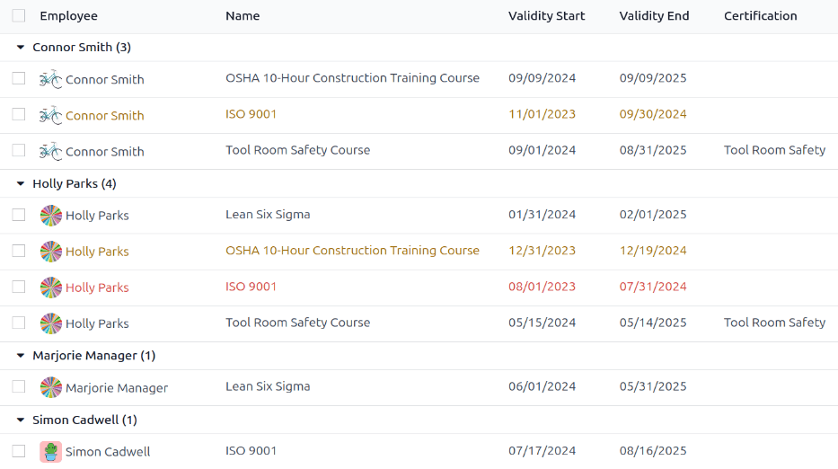
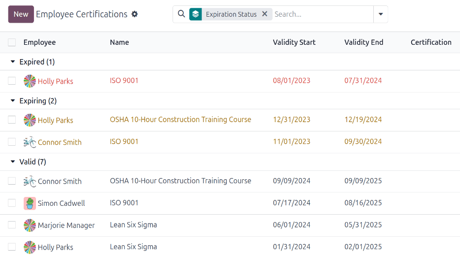
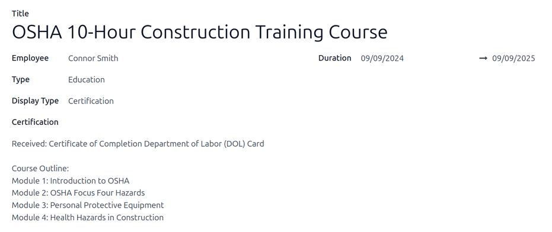

# Chứng nhận

When jobs require specific knowledge, it is necessary to track employee certifications to ensure the
necessary knowledge and certifications are in place.

Certifications include classes, tests, professional seminars, and more. There are no restrictions in
terms of what type of certification records can be added in Odoo.

#### IMPORTANT
To access the *Employee Certifications* report, the **Surveys** app **must** be installed.

## View certifications

To view a full list of all employee certifications, navigate to Employees app ‣
Reporting ‣ Certifications.

All certifications appear in a list view, grouped by employee. Each certification entry displays the
following:

- Employee: the employee's name, along with their avatar image.
- Name: the title of the certification.
- Validity Start: when the employee received the certification.
- Validity End: when the certification expires.
- Certification: the corresponding course in the **Surveys** app that was completed by
  the employee, if applicable.

The entries are also color-coded. Current certifications that are still valid appear in black,
expired certifications appear in red, and certifications that are going to expire within the next
90 days appear in orange.

#### IMPORTANT
**Only** certification records with the *Display Type* set to *Certification* on their
[certification form](#employees-certifications-form) appear on the Employee
Certifications report. All other certifications appear in the resume section of the
[employee form](new_employee.md).

### View certifications by expiration status

When managing a large number of employees with a variety of certifications, it can be difficult to
determine which employees need to keep necessary certifications current in the default list view. In
this scenario, it is beneficial to view the certifications by expiration status.

To do so, navigate to Employees app ‣ Reporting ‣ Certifications. Next, click
the <i class="fa fa-caret-down"></i> (down arrow) in the search bar, then click Add
Custom Group, revealing a drop-down menu. Click Expiration Status, then click away from
the drop-down menu to close it.

After doing so, all the certifications are organized by status, starting with Expired
certifications, then certifications that are Expiring soon (within the next 90 days),
and lastly, certifications that are still Valid.

This view provides an easy way to see which employees have certifications that are going to expire
soon, to determine which employees need to take action to keep their certifications current.

## Log a certification

To log a certification for an employee, navigate to Employees app ‣ Reporting ‣
Certifications. Click New, and a blank certification form loads. Enter the following
information on the form:

- Title: Enter a short description for the certification in this field.
- Employee: Using the drop-down menu, select the employee who received the
  certification.
- Type: Using the drop-down menu, select the type of certification received. This field
  determines where on the employee's resume the certification appears. To create a new
  Type, enter the type in the field, then click Create "type".

  The default options are:
  - Experience: Select this option to have the certification appear in the *Experience*
    section of the *Resume* tab on the [employee form](new_employee.md).
  - Education: Select this option to have the certification appear in the *Education*
    section of the *Resume* tab on the [employee form](new_employee.md).
  - Internal Certification: Select this option to have the certification appear in the
    *Internal Certification* section of the *Resume* tab on the [employee form](new_employee.md).
  - Completed Internal Training: Select this option to have the certification appear in
    *Completed Internal Training* section of the *Resume* tab on the [employee form](new_employee.md).
- Display Type: Select the visibility of the certification in this field. The default
  options are:
  - Classic: Select this option to have the certification appear in the *Resume* section
    of the employee form, and **not** appear on the *Employee Certifications* report.
  - Khóa học: Chọn tùy chọn này để chứng nhận xuất hiện trong phần *Sơ yếu lý lịch* của biểu mẫu nhân viên và **không** xuất hiện trên báo cáo *Chứng nhận của nhân viên*. Khi chọn tùy chọn này, trường Khóa học sẽ xuất hiện bên dưới trường Loại hiển thị. Sử dụng menu thả xuống để chọn khóa học mà nhân viên đã tham gia. Khóa học được tạo trong ứng dụng **Khảo sát**.
  - Certification: Select this option to have the certification appear in the *Resume*
    section of the employee form, **and** appear on the *Employee Certifications* report. Once this
    is selected, a Certification field appears beneath the Display
    Type field. Using the drop-down menu, select the certification the employee took.
- Description: Enter a description for the certification in this field.
- Duration: Click into the first field, and a calendar pop-over window appears. Click on
  the start and end dates for the certification validity period. When the correct dates are
  selected, click <i class="fa fa-check"></i> Apply, and both fields are populated.

