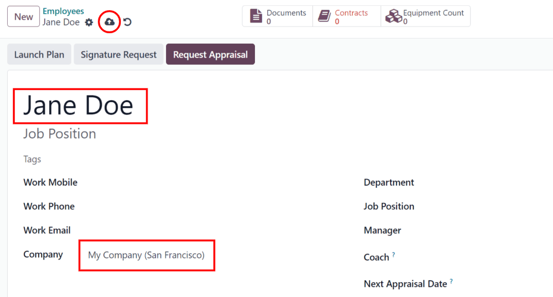
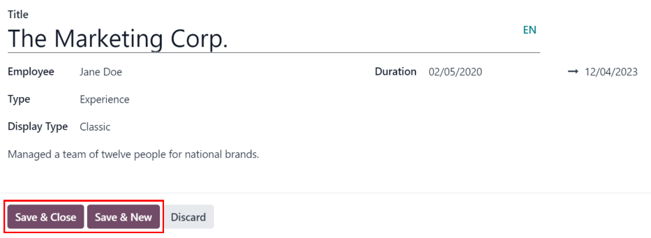
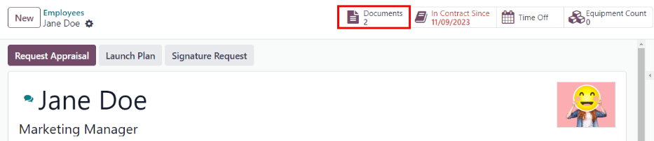

# Nhân viên mới

When a new employee is hired, the first step is to create a new employee record. This record is a
centralized place where all important information about the employee is stored, including
[general information](#employees-general-info), [job history and skills](#employees-resume), [various work information](#employees-work-info-tab), [personal
details](#employees-private-info), [documents](#employees-docs), and more.

To begin, open the Employees app, then click the New button in the
upper-left corner. Doing so reveals a blank employee form.

Proceed to fill out the required information, along with any additional details.

#### NOTE
The current company phone number and name are populated in the Work Phone and
Company fields. If the *Appraisals* application is installed, the Next
Appraisal Date field is populated with a date six months from the current date.

## General information

The employee form automatically saves as data is entered. However, the form can be saved manually at
any time by clicking the Save manually option, represented by a (cloud with
an upwards arrow) icon.

### Required fields

- Employee's Name: enter the employee's name.
- Company: from the drop-down menu in this field, select the company the new employee
  was hired by, or create a new company by typing the name in the field, and clicking
  Create or Create and edit... from the mini drop-down menu that appears.

### Các trường thông tin không bắt buộc

- Photo: in the top-right image box of the employee form, click on the ✏️
  (pencil) edit icon to select a photo to upload.
- Vị trí công việc: nhập chức danh của nhân viên bên dưới tên của họ, hoặc chọn từ menu thả xuống ở trường Vị trí công việc bên dưới để tự động điền vào trường phía trên. Trường Vị trí công việc bên dưới tên nhân viên có thể được chỉnh sửa và *không* cần phải khớp với lựa chọn trong menu thả xuống Vị trí công việc ở trường bên dưới.
- Tags: select a tag from the drop-down menu to add relevant tags to the employee. Any
  tag can be created in this field by typing it in. Once created, the new tag is available for all
  employee records. There is no limit to the amount of tags that can be added.
- Work Contact Information: enter the employee's Work Mobile,
  Work Phone, Work Email, and/or Company name, if not already
  auto-populated.
- Department: select the employee's department from the drop-down menu.
- Job Position: select the employee's job position from the drop-down menu. Once a
  selection is made, the Job Position field beneath the Employee's Name
  field automatically updates to reflect the currently selected job position. These positions are
  from the [Recruitment](../recruitment/new_job.md) application, and reflect the
  currently configured job positions.
- Manager: select the employee's manager from the drop-down menu.
- Coach: select the employee's coach from the drop-down menu.
- Next Appraisal Date: this field is **only** visible if the *Appraisals* application is
  installed. The date automatically populates with a date that is computed according to the settings
  configured in the *Appraisals* application. This date can be modified using the calendar selector.

#### NOTE
After a Manager is selected, if the Coach field is blank, the selected
manager automatically populates the Coach field.

## Additional information tabs

### Tab Resumé

#### Resumé

Tiếp theo, nhập lịch sử làm việc của nhân viên trong tab Sơ yếu lý lịch. Mỗi dòng trong sơ yếu lý lịch phải được nhập riêng. Khi tạo mục nhập lần đầu tiên, nhấp vào Tạo mục nhập mới và biểu mẫu Tạo dòng sơ yếu lý lịch sẽ xuất hiện. Sau khi thêm mục nhập, nút Tạo mục nhập mới sẽ được thay thế bằng nút Thêm. Nhập các thông tin sau cho từng mục nhập.

- Title: type in the title of the previous work experience.
- Employee: select the employee from the drop-down menu.
- Type: from the drop-down menu, select either Experience,
  Education, Side Projects, Internal Certification,
  Completed Internal Training, or type in a new entry, then click Create
  "(Type)".
- Display Type: from the drop-down menu, choose Classic for typical work
  experience, Certification for experience gained through a certification, or
  Course for non-certified classes.
- Thời gian: nhập ngày bắt đầu và ngày kết thúc cho kinh nghiệm làm việc. Để chọn ngày, nhấp vào trường trống đầu tiên để hiển thị cửa sổ pop-up lịch. Sử dụng các biểu tượng < (mũi tên trái) và > (mũi tên phải) để chuyển đến tháng mong muốn, sau đó nhấp vào ngày để chọn. Lặp lại quy trình này để tìm và chọn ngày kết thúc. Sau khi đã chọn xong các ngày mong muốn, nhấp vào ✔️ Áp dụng.
- Description: enter any relevant details in this field.

Once all the information is entered, click the Save & Close button if there is only one
entry to add, or click the Save & New button to save the current entry and create
another resumé line.

#### NOTE
After the new employee form is saved, the current position and company is automatically added to
the Resumé tab, with the end date listed as `current`.

#### Kỹ năng

An employee's skills can be entered in the Resumé tab in the same manner that a resumé
line is created.

In order to add a skill to an employee record, the skill types must be configured first. If no skill
types are configured, a Create new Skills button appears in the Skills
section of the Resumé tab. [Configure the skill types](#employees-skill-types)
before adding any skills to the employee record.

If the skill types are configured, a Pick a skill from the list button appears instead.
Click the Pick a skill from the list button, and select the following information for
each skill.

- Skill Type: select a [skill type](#employees-skill-types) by clicking the radio
  button next to the skill type.
- Skill: after selecting a Skill Type, the corresponding skills associated
  with that selected Skill Type appear in a drop-down menu. For example, selecting
  Language as the Skill Type presents a variety of languages to select from
  under the Skills field. Select the appropriate pre-configured skill, or type in a new
  skill, then click Create "(new skill)".
- Cấp độ kỹ năng: các cấp độ kỹ năng xác định trước liên quan đến Loại kỹ năng đã chọn sẽ xuất hiện trong menu thả xuống. Đầu tiên, chọn một Cấp độ kỹ năng, sau đó thanh tiến trình sẽ tự động hiển thị tiến trình xác định trước cho cấp độ kỹ năng cụ thể đó. Các cấp độ kỹ năng và tiến trình có thể được điều chỉnh trong biểu mẫu bật lên Cấp độ kỹ năng, được truy cập thông qua mũi tên Liên kết nội bộ bên cạnh trường Cấp độ kỹ năng.

Click the Save & Close button if there is only one skill to add, or click the
Save & New button to save the current entry and immediately add another skill.

To delete any line from the Resumé tab, click the 🗑️ (trash can) icon to
delete the entry. Add a new line by clicking the Add button next to the corresponding
section.

#### IMPORTANT
Only users with Officer: Manage all employees or Administrator rights for
the *Employees* app can add or edit skills.

##### Skill types

In order to add a skill to an employee's form, the Skill Types must be configured. Go to
Employees app ‣ Configuration ‣ Employee: Skill Types to view the currently
configured skill types and create new skill types.

#### NOTE
The default skill of Languages is pre-configured as a skill *type*, but there are no
specific language *skills* listed within that skill type. The Languages skill type
must be fully configured before it can be used.

Click New and a new Skill Type form appears. Fill out all the details for
the new skill type. Repeat this for all the needed skill types.

- Skill Type: enter the name of the skill type. This acts as the parent category for
  more specific skills and should be generic.
- Skills: click Add a line, and enter the Name for the new
  skill, then repeat for all other needed skills.
- Levels: click Add a line, and enter the Name of the level.
  Next, click into the Progress field, and enter a percentage (0-100) for that level.
  Repeat for all additional levels, as needed.
- Default Level: click the toggle on the level line to set that level as the default.
  Typically, the lowest level is set as the default, but any level can be chosen. The toggle turns
  green, indicating it is the default level for the skill. Only one level can be set as the default.

The Skill Type form automatically saves as data is entered.

### Work information tab

The Work Information tab is where the employee's specific job related information is
found. Their working schedule, various roles, who approves their specific requests (time off,
timesheets, and expenses), their remote work schedule, and specific work location details are listed
here.

Click on the Work Information tab to access this section, and enter the following
information for the new employee:

- Location: select the Work Address from the drop-down menu. To modify the
  address, hover over the first line (if there are multiple lines) of the address to reveal an
  Internal Link arrow. Click the Internal Link arrow to open up the company
  form, and make any edits.

  Use the breadcrumb links to navigate back to the new employee form when done.

  If a new work address is needed, add the address by typing it in the field, then click
  Create (new address) to add the address, or Create and edit... to add the
  new address and edit the address form.
- Approvers: to see this section, the user must have either Administrator or
  Officer: Manage all employees rights set for the *Employees* application. Using the
  drop-down menus, select the users responsible for approving an Expense, a
  Time Off request, Timesheet entries, and Attendance records
  for the employee.

  Hover over any of the selections to reveal the Internal Link arrow.

  Click the Internal Link arrow to open a form with the approver's Name,
  Email Address, Company, Phone, Mobile, and
  Default Warehouse fields. These can be modified, if needed.

  Use the breadcrumb links to navigate back to the new employee form when done.

  #### IMPORTANT
  The users that appear in the drop-down menu for the Approvers section **must** have
  *Administrator* rights set for the corresponding human resources role.

  To check who has these rights, go to Settings app ‣ Users ‣ → Manage
  Users. Then, click on an employee, and check the Human Resources section of the
  Access Rights tab.
  - In order for the user to appear as an approver for Expenses, they **must** have
    either Team Approver, All Approver, or Administrator set
    for the Expenses role.
  - In order for the user to appear as an approver for Time Off, they **must** have
    either Officer:Manage all Requests or Administrator set for the
    Time Off role.
  - In order for the user to appear as an approver for Timesheets, they **must** have
    either Manager, Officer:Manage all contracts, or
    Administrator set for the Payroll role.
- Remote Work: use the drop-down menu to select the default location the employee works
  from each day of the week. The default options are Home, Office, or
  Other.

  A new location can be typed into the field, then click either Create (new location) to
  add the location, or Create and edit... to add the new location and edit the form.

  After edits are done, click Save & Close, and the new location is added, and populates
  the field.

  Leave the field blank (Unspecified) for non-working days like Saturday and Sunday.

  #### NOTE
  It is also possible to add or modify work locations by navigating to Employees
  app ‣ Configuration ‣ Employee: Work Locations. To modify a location, click on an existing
  location, then make any changes on the form.

  Click New to create a new location, then enter the following information on the
  form. All fields are **required**.
  - Work Location: enter the name for the location. This can be as general or as
    specific, as needed, such as `Home` or `Building 1, Second Floor`, respectfully.
  - Work Address: using the drop-down menu, select the address for the location.
  - Cover Image: click on the icon to select it for the Cover Image.
    Options are a house icon, an office building icon, and a
    GPS location marker icon.
  - Company: using the drop-down menu, select the company the location applies to.
    The current company populates this field, by default.

  
- Schedule: select the Working Hours and Timezone for the
  employee. The Internal Link arrow opens a detailed view of the specific daily working
  hours. Working hours can be modified or deleted here.

  #### NOTE
  Working Hours are related to a company's working schedules, and an Employee
  **cannot** have working hours that are outside of a company's working schedule.

  Each individual working schedule is company-specific. So, for multi-company databases, each
  company needs to have its own working schedules set.

  If an employee's working hours are not configured as a working schedule for the company, new
  working schedules can be added, or existing working schedules can be modified.

  Working hours can be modified in the *Payroll* application, where they are referred to as
  Working Schedules.

  For more information on how to create or modify Working Schedules in the *Payroll*
  application, refer to the [Bảng lương](../payroll/) documentation.
- Planning: select a role from the drop-down menu for both the Roles and
  the Default Role fields. If the Default Role is selected as a role, it is
  automatically added to the list of Roles.

#### IMPORTANT
The users that appear in the drop-down menu for the Approvers section **must** have
*Administrator* rights set for the corresponding human resources role.

To check who has these rights, go to Settings app ‣ Users ‣ → Manage Users.
Click on an employee, and check the Human Resources section of the Access
Rights tab.

- In order for the user to appear as an approver for Expenses, they **must** have
  either Team Approver, All Approver, or Administrator set
  for the Expenses role.
- In order for the user to appear as an approver for Time Off, they **must** have
  either Officer or Administrator set for the Time Off role.
- In order for the user to appear as an approver for Timesheets, they **must** have
  either Manager, Officer, or Administrator set for the
  Payroll role.

#### NOTE
Working Hours are related to a company's working times, and an employee **cannot**
have working hours that are outside of a company's working times.

Each individual working time is company-specific. So, for multi-company databases, each company
**must** have its own working hours set.

If an employee's working hours are not configured as a working time for the company, new working
times can be added, or existing working times can be modified.

To add or modify a working time, go to the Payroll app ‣ Configuration ‣
Working Schedules. Then, either add a new working time by clicking New, or edit an
existing one by selecting a Working Time from the list to modify it.

Refer to the [Working schedules](../payroll/#payroll-working-times) section of the payroll
documentation for specific details on creating and editing working schedules.

After the new working time is created, or an existing one is modified, the Working
Hours can be set on the employee form. In the Schedule section of the
Work Information tab, select the employee's working hours using the drop-down menu.

### Private information tab

No information in the Private Information tab is required to create an employee,
however, some information in this section may be critical for the company's payroll department. In
order to properly process payslips and ensure all deductions are accounted for, the employee's
personal information should be entered.

Here, the employee's Private Contact, Family Status, Emergency
contact, Education, Work Permit, and Citizenship information is
entered. Fields are entered either using a drop-down menu, ticking a checkbox, or typing in the
information.

- Private Contact: enter the Private Address, Email, and
  Phone for the employee. Then, enter the employee's Bank Account Number
  using the drop-down menu.

  If the bank is not already configured (the typical situation when creating a new employee), enter
  the bank account number, and click Create and edit... A Create Bank Account
  Number form loads. Fill in the necessary information, then click Save & Close.

  Next, select the employee's preferred Language from the drop-down menu. Then enter the
  Home-Work Distance in the field. This field is only necessary if the employee is
  receiving any type of commuter benefits.

  Lastly, enter the employee's license plate information in the Private Car Plate field.
- Family Status: select the current Marital Status using the drop-down menu,
  either Single, Married, Legal Cohabitant, Widower,
  or Divorced. If the employee has any dependent children, enter the Number
  of Dependent Children in the field.
- Emergency: type in the Contact Name and Contact Phone number
  of the employee's emergency contact in the respective fields.
- Education: select the highest level of education completed by the employee from the
  Certificate Level drop-down menu. Default options include Graduate,
  Bachelor, Master, Doctor, or Other.

  Type in the Field of Study, and the name of the School in the respective
  fields.
- Work Permit: if the employee has a work permit, enter the information in this section.
  Type in the Visa No (visa number), and/or Work Permit No (work permit
  number) in the corresponding fields.

  Using the calendar selector, select the Visa Expiration Date, and/or the
  Work Permit Expiration Date, to enter the expiration date(s).

  If available, upload a digital copy of the Work Permit document. Click
  Upload your file, navigate to the work permit file in the file explorer, and click
  Open.
- Citizenship: this section contains all the information relevant to the citizenship of
  the employee. Some fields use a drop-down menu, as the Nationality (Country),
  Gender, and Country of Birth fields do.

  Ngày sinh sử dụng bộ chọn lịch để chọn ngày. Đầu tiên, nhấp vào tên tháng, sau đó là năm để truy cập các khoảng năm. Sử dụng biểu tượng mũi tên < (trái) và > (phải) để điều hướng đến khoảng năm chính xác và nhấp vào năm. Tiếp theo, nhấp vào tháng. Cuối cùng, nhấp vào ngày để chọn.

  Type in the information for the Identification No (identification number),
  Passport No (passport number), and Place of Birth fields.

  Lastly, if the employee is **not** a resident of the country they are working in, activate the
  checkbox next to the Non-resident field.

  #### NOTE
  Depending on the localization setting, other fields may be present. For example, for the United
  States, a SSN No (Social Security Number) field is present.

### Tab Cài đặt HR

This tab provides various fields for different information, depending on the country the company is
located. Different fields are configured for different locations, however some sections appear
regardless.

- Status: select an Employee Type and, if applicable, a Related
  User, with the drop-down menus. The Employee Type options include
  Employee, Student, Trainee, Contractor, or
  Freelancer.

  #### IMPORTANT
  Employees do **not** also need to be users. *Employees* do **not** count towards the Odoo
  subscription billing, while *Users* **do** count towards billing. If the new employee should
  also be a user, the user **must** be created.

  After the employee is created, click the ⚙️ (gear) icon, then click
  Create User. A Create User form appears.

  Type in the Name and Email Address. Next, select the
  Company from the drop-down menu.

  Then, enter the Phone and Mobile numbers in the respective fields.

  If a photo is available, click the Edit icon (which appears as a ✏️
  (pencil) icon) in the lower-left corner of the image box, which is located in the top-right
  corner of the form.

  A file explorer pops up. Navigate to the file, then click Open to select it.
  Finally, click Save after all the information is entered, and the employee record
  is automatically updated with the newly-created user populating the Related User
  field.

  Users can also be created manually. For more information on how to manually add a user, refer
  to the [Người dùng](../../general/users/) document.
- Attendance/Point of Sale/Manufacturing: the employee's PIN Code and
  Badge ID can be entered here, if the employee needs/has one. Click
  Generate next to the Badge ID to create a badge ID.

  The PIN Code is used to sign in and out of the *Attendance* app kiosk, and a
   system.
- Payroll: if applicable, enter the Registration Number of the Employee in
  this section.

  Tùy theo thiết lập bản địa hoá, các mục khác xuất hiện trong trường này sẽ thay đổi theo từng quốc gia hoặc khu vực. Ngoài ra, các phần khác cũng có thể xuất hiện trong thẻ này tuỳ vào vị trí địa lý. Do đó, bạn nên kiểm tra với phòng kế toán và/hoặc lương để đảm bảo phần này, cũng như bất kỳ phần nào khác liên quan đến bảng lương, được điền chính xác.
- Application Settings: enter the employee's Billing Time Target for the
  billing rate leader board in the *Timesheets* application. Next, enter the Hourly Cost
  in a XX.XX format. This is factored in when the employee is working at a [work center](../../inventory_and_mrp/manufacturing/advanced_configuration/using_work_centers.md).

  If applicable, enter the Fleet Mobility Card number.

#### NOTE
Manufacturing costs are added to the costs for producing a product, if the value of the
manufactured product is **not** a fixed amount. This cost does **not** affect the *Payroll*
application.

## Tài liệu

All employee-related documents are stored in the *Documents* app. The number of associated documents
is displayed in the Documents smart button above the employee record. Click on the smart
button to access all documents.

Refer to [documentation](../../productivity/documents.md) on the *Documents* app for more
information.

