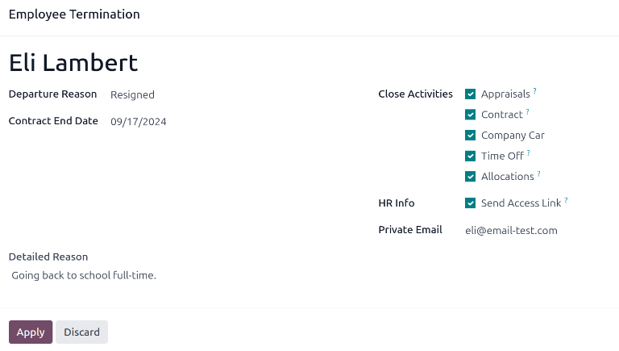

# Offboarding

When an employee leaves the company, it is important to ensure their employee record is updated to
reflect their departure, log the reason why, close any open activities associated with the
employee, and provide them with any important documents.

## Lưu trữ một nhân viên

In Odoo, when an employee leaves the company they must be *archived*. To archive an employee, first
navigate to the Employees app. From here, locate the employee who is leaving the
company, and click on their employee card.

The employee form loads, displaying all their information. Click the <i class="fa fa-gear"></i>
(gear) icon in the top-left corner, and a drop-down menu appears. Click
<i class="oi oi-archive"></i> Archive, and an Employee Termination pop-up window
appears.

Fill out the following fields on the form:

- Departure Reason: Select a reason the employee is leaving from the drop-down menu. The
  default options are:
  - Fired: Select this option when an employee is being let go, and the company has
    given notice.
  - Resigned: Select this option when the employee no longer wishes to be employed, and
    the employee has given notice.
  - Retired: Select this option when the employee is retiring.
  - Became Freelance: Select this option when the employee is no longer working for the
    company, but is becoming a freelance worker instead.
- Contract End Date: Using the calendar selector, select the last day the employee is
  working for the company.
- Detailed Reason: Enter a short description for the employee's departure in this field.
- Close Activities: Tick the checkbox next to each type of activity to close or delete
  any open activities associated with it. It is recommended to tick **all** checkboxes that are
  applicable. The available options are:
  - Appraisals: cancels all appraisals scheduled after the contract end date.
  - Contract: applies an end date for the current contract.
  - Company Car: removes the employee as the driver for their current company car, and
    [assigns the next driver](applications/hr/fleet/new_vehicle.md#fleet-new-vehicle-new-driver), if applicable.
  - Time Off: cancels any time off requests after the contract end date.
  - Allocations: removes the employee from any accrual plans they are on.
- HR Info: Tick the checkbox next to Send Access Link to send a download
  link to the employee's personal email address, containing all their personal HR files.
- Private Email: This field appears if the HR Info checkbox is ticked. Enter
  the private email address for the employee.

Khi hoàn thành biểu mẫu, nhấp Áp dụng. Hồ sơ nhân viên sẽ được lưu trữ, một email chứa liên kết tải tài liệu cá nhân sẽ được gửi đến địa chỉ email riêng của nhân viên (nếu được chọn), và biểu ngữ màu đỏ Đã lưu trữ sẽ xuất hiện ở góc trên bên phải biểu mẫu nhân viên. Cửa sổ trò chuyện sẽ ghi lại Ngày nghỉ việc và Lý do nghỉ việc, cùng với việc liên kết truy cập đã được gửi email hay chưa.

#### NOTE
While attempting to send the HR documents access link, an Invalid Operation pop-up
window may appear, displaying the following error message:

Employee's related user and private email must be set to use "Send Access Link"
function: (Employee Name)

If this error appears, click Close to close the pop-up window, then tick the
Send Access Link checkbox to deselect it on the Employee Termination
pop-up window.

Click Apply to archive the employee and close the selected activities on the
Employee Termination pop-up window, returning to the employee form.

Once the employee form, ensure the following fields are populated:

- Private Information tab: Ensure an email address is entered in the
  Email field.
- HR Settings tab: Ensure a Related User is selected in the corresponding
  field.

After the necessary information is entered, [resend the HR documents access link](#employees-send-link)

### Send HR documents access link

If the access link was not sent when first archiving the employee on the *Employee Termination*
form, it can be sent after the employee is archived at any point.

Sau khi một nhân viên được lưu trữ, thì nhân viên đó sẽ không còn hiển thị trên trang chủ chính của ứng dụng **Nhân viên**. Để xem các nhân viên đã lưu trữ, đi đến trang chủ ứng dụng Nhân viên và nhấp vào biểu tượng <i class="fa fa-caret-down"></i> (mũi tên xuống) trên thanh tìm kiếm để hiển thị menu thả xuống. Chọn Đã lưu trữ ở cuối cột <i class="fa fa-filter"></i> Bộ lọc, sau đó nhấp ra ngoài cửa sổ thả xuống để đóng nó.

Now, only archived employees appear on the dashboard. Click on the desired employee to open their
employee form. On this form, click the <i class="fa fa-gear"></i> (gear) icon in the top-left
corner, then click Send HR Documents Access Link from the resulting drop-down menu. The
chatter logs that the link was sent.
