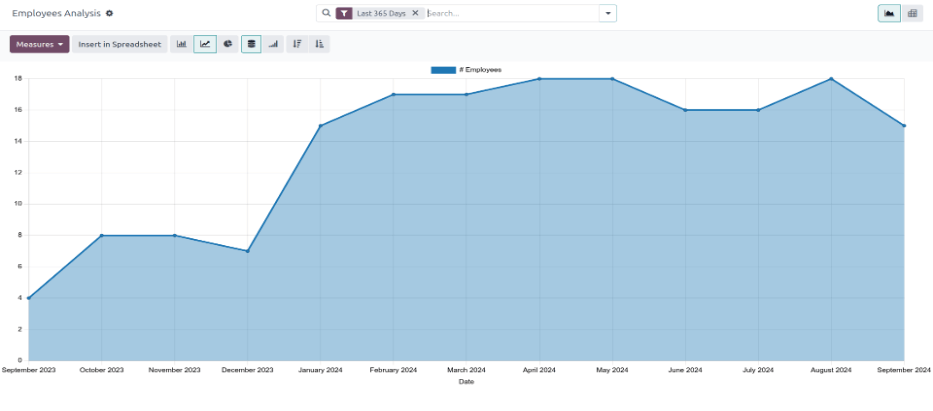
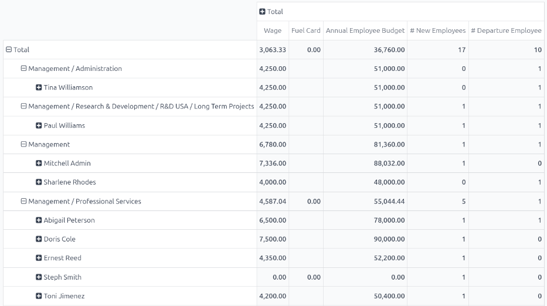

# Employee retention report

It is possible to determine the retention rate for a company by modifying an existing report.

First, navigate to Employees app ‣ Reporting ‣ Contracts to open the
Employee Analysis report. This report shows the number of all employees for the
Last 365 Days, in a default <i class="fa fa-line-chart"></i> Line Chart.

Next, click the Measures <i class="fa fa-caret-down"></i> button in the upper-left corner,
revealing a drop-down menu. Click # Departure Employee in the list, then click away from
the drop-down menu to close it. Now, the report shows all the employees who were archived for the
Last 365 Days.

To view this information in an easier format, click the <i class="oi oi-view-pivot"></i> (Pivot)
icon in the upper-right corner, and the data is presented in a pivot table.

The various employees, organized by department, populate the rows. The columns display the following
totals: the monthly Wage, the Fuel Card budget, total Annual
Employee Budget (also referred to as the *annual salary*), the number of New Employees,
as well as the number of Departure Employees (employees who left).

## Employee retention rate comparison report

It is possible to compare data only for employees who left, compared to the total current employees,
between two separate time periods. This is commonly referred to as the *employee retention rate*.

To view these metrics, first open the Employee Analysis report by navigating to
Employees app ‣ Reporting ‣ Contracts. Click the <i class="oi oi-view-pivot"></i>
(Pivot) icon in the upper-right corner to view the information in a pivot table.

Next, click the Measures <i class="fa fa-caret-down"></i> button in the upper-left corner,
revealing a drop-down menu. Click # New Employees, Annual Employee Budget,
Fuel Card, and Wage in the list, to deselect these metrics and hide them in
the table. Then, click Count at the bottom of the list to enable that metric.

Click away from the drop-down menu to close it. Now, the report shows all the employees who left the
company (# Departure Employee), as well as the total number of employees
(Count), for the Last 365 Days.

Để so sánh dữ liệu năm hiện tại với năm trước, nhấp vào biểu tượng <i class="fa fa-caret-down"></i> (mũi tên xuống) trong thanh tìm kiếm để hiển thị các tùy chọn lọc và nhóm. Nhấp 365 ngày trước trong cột <i class="fa fa-filter"></i> Bộ lọc để tắt bộ lọc này. Sau đó, nhấp Ngày và chọn năm hiện tại (trong ví dụ này là 2024) từ menu thả xuống hiện ra.

Once a selection is made beneath Date in the <i class="fa fa-filter"></i> Filters
column, a <i class="fa fa-adjust"></i> Comparison column appears. Click Date: Previous
Year in the new column, then click off of the drop-down menu to close it.

#### NOTE
In Odoo, in order to access the <i class="fa fa-adjust"></i> Comparison column, a specific time
*other than* Last 365 Days **must** be selected. If not, the <i class="fa fa-adjust"></i>
Comparison column is **not** visible.

Now, the pivot table displays the total number of employees who left the company (#
Departure Employee), as well as the total number of employees (Count) in the columns.
These are further divided by the two different years, and also displays the Variation
between the two.

The rows display the departments, and lists each individual employee for each department, in the
rows.

For a more concise view of this report, click <i class="fa fa-minus-square-o"></i> Total above the
top row of the departments and employees, to collapse the rows. Now, the table presents the total
number of employees who left the company for both years, compared to the total number of employees
for both years, including the difference, in a percentage.

Để xem tỷ lệ chi tiết hơn theo từng phòng ban, nhấp <i class="fa fa-plus-square"></i> Tổng ở hàng đơn để hiển thị menu thả xuống và chọn Phòng ban. Nhấp ra ngoài menu thả xuống để đóng lại, bây giờ bảng pivot sẽ hiển thị tổng số nhân viên đã nghỉ việc (# Nhân viên nghỉ), tổng số nhân viên (Số lượng) và Biến động (theo phần trăm) cho cả năm 2023 và 2024, được sắp xếp theo phòng ban.
